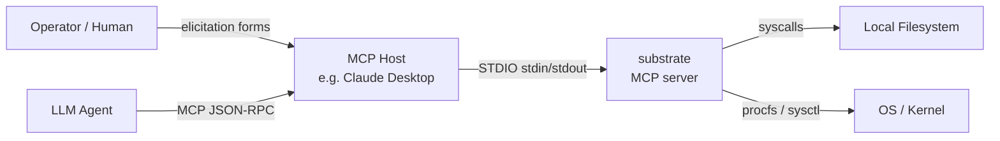
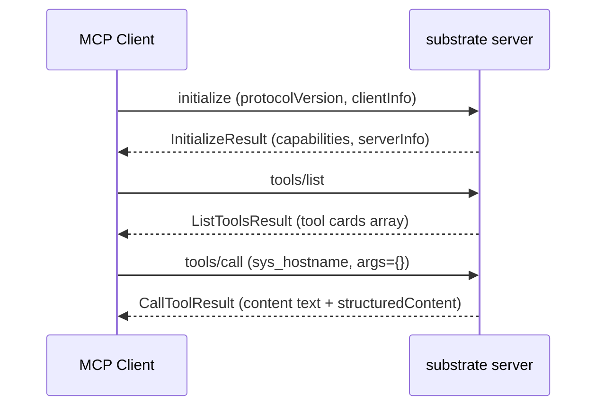

# substrate

Model Context Protocol (MCP) server in Rust 1.95 exposing POSIX baseutils-equivalent
OS management to LLM agents over STDIO. Ten bounded contexts: filesystem-query,
filesystem-mutation, process, system-info, text-processing, archive, job,
subprocess, network-info, launch (declarative process orchestration, feature-gated).
61 tools with the `launch` feature enabled (51 without). Built and verified on both
macOS and Linux.

## Quick Start

### Prerequisites

- Rust 1.95+ (`rustup install 1.95 && rustup default 1.95`).
- macOS 11+ or Linux kernel 5.6+ for tier-1 PathJail (otherwise userspace tier
  with WARN).
- `mise` (optional, manages Rust + cargo tools automatically, including
  `cargo-nextest` and `cargo-machete`).

### Build

```bash
mise trust && mise install   # if mise is available
cargo build --workspace --release

# With the launch orchestration BC (launch.init/list/trust/up/status/logs/restart/reload/down):
cargo build --release -p substrate-mcp-server --features launch
```

The release binary lands at `target/release/substrate`.

### Run

Create `substrate.toml` at the project root or `~/.config/substrate/config.toml`:

```toml
[policy]
roots = ["/path/to/sandbox"]

[logging]
level = "info"
target = "stderr"

[security]
refuse_degraded_jail = true

[timeouts]
global_default_seconds = 30
shutdown_drain_secs = 5
```

Run the server (it speaks JSON-RPC 2.0 over STDIO):

```bash
./target/release/substrate
```

### Example interaction

```bash
printf '%s\n%s\n' \
  '{"jsonrpc":"2.0","method":"initialize","id":1,"params":{"protocolVersion":"2025-11-25","capabilities":{},"clientInfo":{"name":"test","version":"0.0.1"}}}' \
  '{"jsonrpc":"2.0","method":"tools/call","id":2,"params":{"name":"sys_hostname","arguments":{}}}' \
| ./target/release/substrate
```

## System Overview

The following flowchart shows the principal actors and their relationships at the system boundary.



The following sequence diagram shows the smoke-test interaction from connection through a tool call.

Note: tool names use `_` as separator (e.g. `sys_hostname`), not `.`.



## Architecture

This repository uses spec-as-source-of-truth. All architectural decisions live
under `docs/arch/` as MADR 4.0 ADRs, CUE schemas, Gherkin features, Rego policies,
Structurizr DSL, OpenSLO definitions, AsyncAPI spec, and a TLA+ formal model.

Read in order:

1. [Architecture Overview](docs/arch/README.md) — entry point for the spec
2. [Glossary](docs/arch/glossary.md) — ubiquitous-language vocabulary
3. [ADR-0002](docs/arch/adr/0002-bounded-contexts.md) — strategic DDD and the ten bounded contexts (filesystem-query, filesystem-mutation, process, system-info, text-processing, archive, job, subprocess, network-info, launch)
4. [ADR-0040](docs/arch/adr/0040-async-job-control-plane.md) — async job control-plane (Push/Pull dual channel)
5. [ADR-0063](docs/arch/adr/0063-launch-orchestration-bounded-context.md) — launch BC overview; read alongside ADR-0064..0069 for the trust model, dependency graph, event stream, concurrency topology, and the detached-supervisor design

## Validation

```bash
spec validate --lane full      # conftest/vale/SLO/AsyncAPI/TLC validators, on top of the fast+default lanes
cargo clippy --locked --workspace --all-targets --all-features -- -D warnings
cargo nextest run --locked --workspace --all-features --no-fail-fast
```

Verify on both platforms when touching any `#[cfg(target_os = "linux")]` /
`#[cfg(target_os = "macos")]` code path — a clippy pass on only one platform can
hide a genuine field-width divergence in `nix`/`libc` types (e.g. `mode_t` is
`u32` on Linux but `u16` on macOS/BSD), and Linux-only code paths (the
`openat2`-based path jail, statx-tier filesystem walkers, procfs-based
process/system-info readers) have historically gone unexercised for long
stretches between real-Linux verification passes.

## TLA+ formal verification

A `JobRegistry.tla` model lives at `docs/arch/formal/JobRegistry.tla`. To enable
the `run_tlc` validator:

```bash
# Download tla2tools.jar once (see tools/README.md)
curl -L -o tools/tla2tools.jar \
  https://github.com/tlaplus/tlaplus/releases/latest/download/tla2tools.jar

# Then run the spec full lane -- TLC will be invoked automatically
spec validate --lane full
```

The `TLA2TOOLS_JAR` environment variable is auto-set by `mise` when
`tools/tla2tools.jar` is present. See `tools/README.md` for details.

## License

Dual-licensed under MIT OR Apache-2.0. See `LICENSE-MIT` and `LICENSE-APACHE`.
