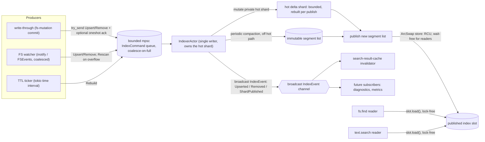
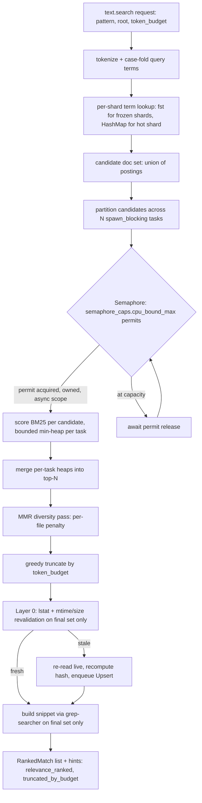

# ADR-0072 — Search Relevance Ranking, Incremental Content Index, and Index Event Pub-Sub

## Context and Problem Statement

`text.search` and `fs.find` are both unranked: `text.search` performs a synchronous
line-by-line `regex`-crate scan (`crates/substrate-text/src/search.rs`) and returns
the first N matches in file order, not the best N matches; `fs.find` walks the
allowlist tree with the `ignore` crate (Zone B) on every call. Neither tool carries
a relevance signal or a token-budget-aware output shape, so an LLM agent either
receives too few matches to be useful or too many to fit its context window, and
must re-rank in-context at token cost substrate exists to avoid.

[ADR-0041](0041-filesystem-index-native-tiers.md) already ratified an opt-in
in-process filesystem index intended to solve the repeated-query half of this
problem for `fs.find`, but the index as built today only partially delivers on
that ADR's own invariants:

- **The read side is dead code.** `IndexSnapshot::lookup_by_name` and
  `lookup_by_root` (`crates/substrate-fs-index/src/snapshot.rs`) are fully
  implemented and unit-tested, but `crates/substrate-fs-query/src/find.rs` never
  calls `FsIndexPort::lookup` or references `FsIndexPort` at all. The index costs
  memory and rebuild CPU without accelerating a single `fs.find` call.
- **The write path is O(n) per mutation.** `WriteThroughHandle::apply`
  (`crates/substrate-fs-index/src/write_through.rs`) does
  `let mut new_snap = (**current).clone(); f(&mut new_snap); self.slot.store(...)`
  — a full deep clone of every indexed entry for every single-path mutation. This
  does not scale past a few thousand entries.
- **Write-through is unordered, unacknowledged, fire-and-forget.**
  `crates/substrate-fs-mutation/src/write_through.rs::on_upsert` invalidates via a
  bare `tokio::task::spawn(async move { index.invalidate(&path).await ... })` with
  no ordering guarantee relative to the mutation's own tool response and no way
  for a caller that cares about read-your-writes to know the update landed.
- **The watcher is coded but never wired.** `FsIndexWatcher`
  (`crates/substrate-fs-index/src/watcher.rs`) fully implements event translation
  and overflow-triggered rebuilds, but its own module doc says "Wire
  `FsIndexWatcher` into `substrate-mcp-server` composition root" as an open
  wiring step, and
  `crates/substrate-mcp-server/src/composition.rs` has zero references to it.
  Layer 2 of ADR-0041's freshness stack does not run in any deployed build.
- **Layer 0 (mandatory lazy lstat) has no real callsite** in the lookup pipeline
  described by ADR-0041 — there is nothing to lstat because nothing calls
  `lookup` (see the first bullet above).
- **Native-tier rebuild cancellation is frozen, not live.** Both
  `crates/substrate-fs-index/src/linux/mod.rs` and `.../macos/mod.rs` compute
  `let is_cancelled = cancel.is_cancelled();` once, before entering
  `spawn_blocking`, and close over that single frozen boolean
  (`let cancel_fn = move || is_cancelled;`) for the entire walk. `polling.rs`
  already fixed the equivalent bug for the `PollingWatcher` tier — it shares an
  `Arc<AtomicBool>` between the async caller and the blocking closure and
  re-reads it at each 256-entry boundary via a `tokio::select! biased` loop — but
  that fix was never backported to the two native tiers. A rebuild on Linux or
  macOS today cannot actually be cancelled mid-walk, despite
  `fs-find-index-cancellation-mid-rebuild.feature` asserting that it can.

Separately, two workspace dependencies declared in the root `Cargo.toml` for
exactly this purpose — `grep-searcher` and `grep-regex` — are unused in production
code; the only reference in the tree is a cucumber step stub
(`crates/substrate-mcp-server/tests/steps/text_processing.rs`), a latent `cargo
shear`/`cargo machete` finding. And `substrate-config`'s `SemaphoreCaps`
(`cpu_bound_max`, `zone_b_max`) is fully wired through figment/TOML parsing but
never consumed by any adapter: `crates/substrate-fs-query/src/hash.rs` hardcodes
`num_cpus::get()` in a `OnceLock`, silently ignoring whatever cap an operator
configures.

This ADR is the single coherent design that closes all of the above: it adds
BM25-ranked, token-budget-aware content search for `text.search`; makes `fs.find`
actually query the metadata index; replaces the O(n) write path with a
segmented-immutable, single-writer structure; fixes the frozen native-tier
cancellation bug; wires the watcher into the composition root; and gives both
consumers a shared, lock-free-read, in-memory pub-sub backbone.

## Decision Drivers

- LLM agents pay per token; an unranked or uncapped result list burns context
  budget on low-relevance hits that the server is better positioned to filter
  than the model is.
- ADR-0041's freshness invariants — Layer 0 mandatory revalidation, no stale
  entry ever surfaces to a client — must extend unchanged to the new content
  index. The new subsystem inherits the old one's correctness bar; it does not
  relax it.
- [ADR-0003](0003-crate-stack-and-async-zones.md) and
  [ADR-0037](0037-async-cancellation-patterns.md)'s async-zone and cancellation
  discipline are non-negotiable: no `Mutex`/`RwLock` on the read hot path, no
  Semaphore permit moved into a `spawn_blocking` closure, biased `select!` with
  the work arm first, cancellation checked against a *live* flag, never one
  frozen at task-spawn time.
- [ADR-0040](0040-async-job-control-plane.md)'s Bucket classification and job
  control-plane remain the only sanctioned path for CPU-bound work exceeding an
  inline threshold; this ADR must not invent a second dispatch mechanism, and
  must reconcile Zone C's "no synchronous request-path execution" rule with
  Bucket B's existing inline-below-threshold contract for `text.search`.
  Reconciliation: `spawn_blocking` execution *is* the sanctioned zone-C
  mechanism regardless of whether the caller ultimately sees an inline response
  or a job receipt — the tokio worker thread is never blocked either way; only
  the presence or absence of a `job_id` differs.
- Minimal new dependency surface: `cargo deny`/`cargo audit`/`cargo shear` must
  stay clean. Prefer activating already-declared-but-dormant crates
  (`grep-searcher`, `grep-regex`) and already-adopted crates (`arc-swap`,
  `blake3`) over adding new ones; the one new crate this ADR does introduce
  (`fst`) is scoped to a single adapter crate.
- The index must remain fully in-memory, in-process, and lock-free for readers,
  matching the project's "local MCP server, minimal footprint" posture. No
  embedded search-engine dependency with its own mmap policy, thread pool, or
  locking model — ADR-0003 already rejected a second (rayon) thread pool
  alongside tokio for exactly this class of reason, and ADR-0032 already
  disabled blake3's `mmap` feature over `SIGBUS`-on-concurrent-truncation risk.

## Considered Options

1. Layer BM25 ranking and a content inverted index directly onto the existing
   metadata index, replacing its O(n) write path with a segmented-immutable
   structure and adding a single-writer actor plus mpsc/broadcast pub-sub
   (selected).
2. Adopt `tantivy` as an embedded full-text search engine — rejected (see
   §Rejected: Embedding Tantivy).
3. Rank client-side: keep returning unranked matches and let the LLM agent
   re-rank in its own context — rejected; this is precisely the problem
   substrate should absorb server-side, and it provides no incremental-indexing
   latency benefit for repeated queries against the same tree.
4. Score-on-read: recompute term frequencies and document statistics from a
   fresh walk on every `text.search` call, with no persistent postings —
   rejected; this discards the entire benefit of an incremental index (the same
   repeated-query win ADR-0041 already targeted for `fs.find`), and concurrent
   calls would compute inconsistent IDF statistics against different partial
   walk windows.

## Decision Outcome

Chosen option: "Layer BM25 ranking and a content inverted index onto the existing
metadata index, single-writer actor plus `ArcSwap` RCU plus mpsc/broadcast
pub-sub", because it is the only option that delivers incremental (not
re-scan-per-call) indexing, lock-free reads, and zero embedded-engine dependency
risk, while directly retiring the concrete defects enumerated in §Context.

### Concurrency model: single-writer, lock-free readers

Exactly one task — the `IndexerActor` — ever mutates index state. Every other
task, including every `fs.find` and `text.search` reader, only ever calls
`ArcSwap::load()` against the published index slot: wait-free, no lock, no
`Mutex`/`RwLock` anywhere on the read hot path (satisfying the decision driver
above and ADR-0037's `await_holding_lock` invariant trivially, since there is no
lock to hold).

Three producer classes feed the `IndexerActor` through one bounded
`mpsc<IndexCommand>` work queue: the fs-mutation write-through path (Layer 1), the
FS watcher (Layer 2, finally wired — see below), and the TTL rebuild ticker
(Layer 3). The `IndexerActor` fans state changes back out to subscribers through
one `broadcast<IndexEvent>` channel — today's sole subscriber is a
search-result-cache invalidator; the channel is designed for future subscribers
(diagnostics, metrics) without any producer-side change.



**Backpressure and coalescing.** The `mpsc<IndexCommand>` channel is bounded
(`index.command_queue_capacity`, default 4096) and producers use `try_send`, never
a blocking `send`. When the queue is full, a producer does not block its own tool
handler on indexer backpressure; it downgrades the specific command to marking the
affected root dirty for the next TTL/watch-triggered `Rescan`, increments an
`index_commands_coalesced` counter, and returns. This is the same
overflow-degrades-to-coarser-invalidation idiom ADR-0041 already established for
`IN_Q_OVERFLOW` → full-root rebuild; this ADR generalizes it to the write-through
and TTL producers as well. Correctness under coalescing is never at risk because
the mandatory Layer 0 revalidation (below) is the invariant backstop regardless of
how — or whether — a given mutation's `IndexCommand` was ever enqueued.

### Segmented immutable structure: retiring the O(n) clone

`WriteThroughHandle::apply`'s `(**current).clone()` is replaced by a small
LSM-lite structure. The published state becomes an immutable list of shards
(`Vec<Arc<IndexShard>>`, itself wrapped as `Arc<[Arc<IndexShard>]>` and published
via `ArcSwap`) instead of one flat `IndexSnapshot`:

- **Hot shard.** Exactly one small, mutable-until-next-publish shard holds
  recently changed entries. It is *rebuilt from scratch*, not mutated in place,
  on every `IndexerActor` publish — but because its size is bounded by
  `index.hot_shard_max_entries` (default 1000) via periodic background
  compaction, that rebuild cost is O(hot-shard-size), which is independent of
  total corpus size. This is the mechanism that turns an O(n) clone into an
  amortized O(1) per-mutation publish.
- **Immutable segments.** All other shards are frozen, `Arc`-shared, and never
  cloned; publishing a new snapshot after a hot-shard rebuild is a cheap
  pointer-list rebuild (`O(shard_count)`, not `O(total entries)`), because the
  untouched segments are carried forward by `Arc::clone` (a refcount bump, not a
  data copy).
- **Compaction.** A low-priority, cancellable Zone B background task merges
  small or old immutable shards once the shard count exceeds a bound (target
  ~16–64 live shards), keeping per-query fan-out cost from growing unboundedly.
  Compaction runs off the hot path and never blocks a publish.

This is the segmented-immutable design named as the recommended option in the
implementation brief for this ADR, chosen specifically to avoid a new dependency:
`arc-swap` is already a workspace dependency (ADR-0041), and the segment structure
reuses the same `BTreeMap`-based `by_name`/`by_root` shape `IndexSnapshot` already
has, just partitioned per-shard instead of globally.

**Rejected alternative for this sub-decision: a persistent map (the `im` crate).**
Wrapping the whole index in `im::HashMap`/`im::OrdMap` behind `ArcSwap` would give
O(log n) structural-sharing updates with materially less bespoke code than
hand-rolled segments and compaction. It is rejected here for two reasons specific
to this codebase: (1) it adds a new dependency where the segmented design adds
none (`arc-swap` is already present); (2) `im`'s structural sharing does not map
cleanly onto the `max_entries`/`max_bytes` LRU-eviction contract ADR-0041 already
committed to — evicting the least-recently-accessed subset of a persistent map
means walking and rebuilding large shared spines, which is not obviously cheaper
than the segment approach once eviction is accounted for. If a future
implementation wave finds the segment/compaction code materially harder to get
right than expected, `im` remains the documented fallback and this ADR's choice
is not a irrevocable one-way door — see §Consequences.

### Content inverted index

A new content-side structure is layered onto the same shard abstraction, active
only when the new `fs-index-content` Cargo feature (see §Cargo Feature Gates) is
compiled in and `index.content_index_enabled = true` at runtime:

- **Postings.** `term → PostingList { doc_freq, entries: [PostingEntry { doc_id,
  term_freq, positions }] }`, scoped per shard. `positions` are token offsets,
  captured once at index time, used later to build a context-window snippet
  without re-scanning the file at query time for the common case (see §Anti-Stale
  Guarantees for the case where a re-scan *is* required).
- **Per-document metadata addition.** Each indexed document gains
  `content_hash` (blake3, mmap disabled per ADR-0032, computed through the same
  `SimdTier`-selected backend ADR-0042's `HashFactory` already provides — no new
  hashing code path) and `token_count`, used for BM25 length normalization.
- **Term dictionary: two tiers, not a single either/or choice.** The hot shard
  (small, frequently rebuilt) uses a plain in-memory `HashMap<String,
  PostingList>` — building an `fst::Map` on every hot-shard rebuild would waste
  the construction cost `fst` is expensive to amortize for. Every *frozen*
  immutable shard, built once at compaction time and never touched again, builds
  an `fst::Map<u64>` (term → postings-blob offset) at freeze time: `fst`
  requires sorted input to construct, which a write-once frozen shard naturally
  provides, and its result gives compact storage plus native prefix and
  Levenshtein-automaton fuzzy lookup for later `fs.find` filename-relevance
  scoring (see §Fallback Semantics). This two-tier resolution — HashMap on the
  mutable hot shard, `fst` on frozen segments — is what "term dictionary via
  `fst` ... or in-shard HashMap" resolves to in this design: both are used, at
  different points in each shard's lifecycle, not a global either/or.

### BM25 relevance ranking

Standard Okapi BM25 with configurable `k1` (default 1.2) and `b` (default 0.75),
`#Bm25Params` in the new CUE schema:

```text
score(D, Q) = sum over query terms t of:
    IDF(t) * (f(t,D) * (k1 + 1)) / (f(t,D) + k1 * (1 - b + b * |D| / avgdl))

IDF(t) = ln(1 + (N - n(t) + 0.5) / (n(t) + 0.5))   // Lucene-style, never negative
```

`N` (total document count) and `avgdl` (average token count) are cheap aggregate
values maintained incrementally: each shard tracks its own `doc_count` and
`sum(token_count)`; a query-time aggregation over `shard_count` (bounded to
~16–64 by compaction) is O(shard_count), not O(corpus size).

**Dispatch, per the ADR-0003/ADR-0040 reconciliation above:** query-term
lookup produces a candidate document set (union of postings across matched
terms); the candidate set is partitioned across up to `semaphore_caps
.cpu_bound_max` parallel `spawn_blocking` scoring tasks, each holding one owned
`OwnedSemaphorePermit` acquired in async scope *before* entering
`spawn_blocking` and dropped only after the blocking closure's `JoinHandle`
resolves — the exact permit-lifetime pattern ADR-0037 mandates, never a permit
moved into the closure. This is the first production consumer of
`SemaphoreCaps.cpu_bound_max`, which today is parsed from TOML and then ignored;
`crates/substrate-fs-query/src/hash.rs`'s pre-existing hardcoded
`num_cpus::get()` is a visible, separately-fixable inconsistency this ADR flags
but does not itself correct (out of scope; see §Consequences). Below
`text.search`'s existing `inline_max_matches` threshold ([ADR-0040](0040-async-job-control-plane.md)
Bucket B), the scoring `spawn_blocking` calls are simply `.await`ed inline within
the same request; above threshold, the identical scoring mechanism runs inside a
Bucket B-promoted async job — the dispatch bucket is unchanged by this ADR, only
what happens inside it.

Each scoring task maintains a bounded min-heap (capacity = the caller's requested
page size, capped) rather than sorting its full candidate slice, giving
`O(candidates · log K)` per task; a small final merge across per-task heaps
produces the overall top-N.



Note the deliberate ordering in the pipeline: lazy-lstat revalidation and snippet
construction both run **only on the final, truncated result set**, after MMR and
budget truncation have already discarded lower-ranked candidates. Building
snippets or paying a revalidation syscall for a document that MMR or the token
budget is about to discard would be wasted work; deferring both to the end is a
straightforward, implementable performance win worth calling out explicitly.

### Token-budget output and MMR diversity

`#RankedMatch` (new CUE shape) carries `score`, a context-window `snippet` built
via the grep-searcher/grep-regex crates (already declared in the workspace,
previously dead code — this is their first production callsite), `match_offsets`
(byte offsets within the file), and `term_freq`. Results are truncated greedily
by descending score until the cumulative estimated token count (the same
`~4 bytes/token` heuristic already implied by ADR-0007's 180-token/25-token card
budgets) exceeds `index.token_budget_default` (default 2000) or the caller's
explicit override, *or* `page_size` is reached, whichever comes first — the two
caps are complementary, not alternatives, mirroring the same two-layer
reconciliation [ADR-0060](0060-page-size-value-object-at-domain-port-boundary.md)'s
2026-06-10 amendment already established for the domain-vs-handler `page_size`
caps. `hints.truncated_by_budget` distinguishes "fewer results were returned
because the token budget was the limiting factor" from ordinary count-based
pagination (which still uses the existing `PageCursor`/`PageSize` machinery,
unchanged).

A simplified, per-file MMR (Maximal Marginal Relevance) pass runs after the
top-N merge and before budget truncation, to stop one file from monopolizing
the result list: candidates are walked in descending-score order; a running
`selected_per_file` count is maintained; a candidate's insertion score is
adjusted to `bm25_score - index.mmr_lambda * bm25_score *
selected_per_file[file]` (the penalty scales with the candidate's own score
rather than a fixed constant, so it behaves consistently across queries with
very different score magnitudes), and `index.max_hits_per_file` (default 5) is
a hard backstop regardless of `mmr_lambda` tuning. This is an intentionally
simplified proxy for true semantic-similarity MMR (Carbonell & Goldstein 1998)
— same-file membership stands in for a similarity function, since substrate has
no embedding space — sufficient to guarantee "no single file dominates the
result list," not to guarantee optimal information coverage. See
§Consequences for the resulting limitation.

### Anti-stale guarantees

A process-global, monotonic `AtomicU64` **generation** counter is bumped by the
`IndexerActor` on every `ArcSwap::store` publish; `IndexEvent::ShardPublished`
carries the new value. Four mechanisms compose to guarantee no stale result ever
reaches a client, exactly mirroring — and, for the content index, extending —
ADR-0041's four-layer freshness stack:

- **Layer 0, extended.** For a metadata-only hit (`fs.find`), Layer 0 is
  unchanged from ADR-0041: `lstat` before emission, silent eviction on `ENOENT`.
  For a content hit (`text.search`), Layer 0 is extended: the same `lstat` call
  already yields live `(mtime, size)` at zero extra syscall cost; comparing that
  against the entry's cached `(mtime, size)` is the fast path (the same
  cheap-invalidation heuristic `git`/`ccache` use). If unchanged, the cached
  `content_hash`/postings are trusted. If `mtime` or `size` differ, the entry is
  stale: the file is re-read live (Zone B), a fresh snippet is built directly
  from that live read (bypassing postings for *this* query — correctness over
  staleness), and an `IndexCommand::Upsert` is enqueued so the next query
  benefits from refreshed postings. This is the "stale → re-read live + enqueue
  Upsert" requirement in full.
- **Layer 1, made ordered and acknowledgeable.** `WriteThroughHandle`'s
  `on_upsert`/`on_remove`/`on_rename` no longer fire a bare `tokio::task::spawn`;
  they `send` (not `try_send`) an `IndexCommand` carrying an optional
  `oneshot::Sender<Generation>` onto the *same* ordered `mpsc<IndexCommand>`
  queue every other producer uses. Because the `IndexerActor` drains that queue
  FIFO and is the *only* writer, a command sent before a later command is
  guaranteed applied first — this is what "ordered channel" delivers that the
  old fire-and-forget spawn could not: two concurrent mutations to related paths
  can no longer race to apply out of order relative to their commit order.
- **Layer 2, finally wired.** `FsIndexWatcher` is constructed in
  `composition.rs` whenever `fs-index-watch` is compiled in and `index
  .watch_enabled` is set; its already-implemented `spawn_invalidate` now enqueues
  onto the same `mpsc<IndexCommand>` queue (`Upsert`/`Remove` for individual
  events, `Rescan{reason: watch_overflow}` on `IN_Q_OVERFLOW`/FSEvents coalesce)
  instead of whatever ad hoc direct call path existed before this ADR.
- **Layer 3, unchanged in spirit, now cancellation-correct.** The TTL ticker
  enqueues `IndexCommand::Rebuild{reason: ttl_expired}`. The native-tier rebuild
  bug described in §Context is fixed by backporting `polling.rs`'s proven
  pattern: the async caller shares an `Arc<AtomicBool>` with the `spawn_blocking`
  closure and keeps it live — either via a small watcher task that flips the flag
  the instant the `CancellationToken` fires, or via the same periodic-recheck
  loop `polling.rs` already uses — so `rebuild::walk_root`'s existing
  `cancel_flag: &dyn Fn() -> bool` (checked at each 256-entry directory boundary,
  unchanged) reads a *live* value instead of one frozen at `spawn_blocking`
  entry time.

### Write-then-read consistency

```mermaid
sequenceDiagram
    participant Client
    participant Mutation as fs.write handler
    participant WTH as WriteThroughHandle
    participant MPSC as IndexCommand queue
    participant IA as IndexerActor
    participant Slot as published index slot
    participant Find as next fs.find / text.search call

    Client->>Mutation: fs.write(path, data)
    Mutation->>Mutation: atomic rename commit
    Mutation->>WTH: on_upsert(path, metadata)
    WTH->>MPSC: send Upsert{path, ack}
    MPSC->>IA: drain (FIFO)
    IA->>IA: apply to hot shard
    IA->>Slot: publish (ArcSwap store)
    IA-->>WTH: ack(generation) via oneshot
    WTH-->>Mutation: ack received (bounded wait, ADR-0059 style)
    Mutation-->>Client: tool response
    Client->>Find: fs.find / text.search
    Find->>Slot: load() observes generation >= ack'd value
    Slot-->>Find: fresh result, no stale hit
    Note over WTH,Slot: If the ack times out, the mutation still returns<br/>(the FS write already committed); the Layer-0<br/>lazy-lstat / content-hash revalidation on the NEXT<br/>read closes the window instead.
```

This is deliberately a two-pronged closure of the read-your-writes window, not a
single mechanism:

1. **Primary: the oneshot ack.** `WriteThroughHandle` awaits the ack with a
   short bound, `index.ack_wait_ms` (default 50), consistent with the
   no-unbounded-wait principle [ADR-0059](0059-universal-wait-timeout-enforcement.md)
   already established for `job.result`/`subprocess.result`. When the ack
   arrives within the bound, the mutation's tool response is only returned to
   the client *after* the index snapshot the client will next query against
   already reflects the mutation — the ordered channel plus the ack together
   are what make "write-then-read consistency" a guarantee rather than a
   best-effort.
2. **Backstop: Layer 0.** If the ack times out (indexer under heavy load, or a
   caller explicitly opts out of waiting for low-priority call sites), the
   mutation still succeeds — the underlying filesystem write already committed
   independently of the index — and any staleness in the index is closed by the
   mandatory Layer 0 revalidation on the *next* read, exactly as ADR-0041
   already specifies for external (out-of-process) mutations. A caller never
   observes a `SUBSTRATE_NOT_FOUND` or stale hit either way; at worst, a query
   immediately following a timed-out ack pays one extra `lstat` (or, for
   content, one extra live read) that a successful ack would have avoided.

### Port and crate layout

Following the exact dependency-injection pattern already used for `FsIndexPort`
(verified in `composition.rs`: only `substrate-mcp-server` depends on
`substrate-fs-index` directly; `substrate-fs-query` and `substrate-fs-mutation`
only import the `FsIndexPort` *trait* from `substrate-domain` and receive the
concrete `Arc<dyn FsIndexPort>` via constructor injection at composition time —
never a crate-level Cargo dependency between adapter crates, per
[ADR-0022](0022-project-layout.md)'s hexagonal layering rule), this ADR adds:

```text
substrate-domain
    ports/fs_index.rs      FsIndexPort::invalidate return type upgraded from
                            SubstrateResult<()> to SubstrateResult<IndexGeneration>,
                            carrying the ack'd generation for callers that want it;
                            existing callers may still discard the Ok value.
    ports/content_search.rs  NEW. ContentSearchPort trait: one method, `search`.
                              Kept as a separate port from FsIndexPort (not a new
                              method bolted onto it) so filesystem-query and
                              text-processing each depend only on the port
                              shaped for their own concern, per ADR-0042's
                              one-port-per-concern precedent (DirWalker,
                              FsWatcher, PathJail, Hash, and Stat are five
                              separate ports even though several share adapter
                              plumbing).
    value_objects/index.rs  NEW plain data types: IndexCommand, IndexEvent,
                             IndexGeneration, RankedMatch, Bm25Params. No tokio
                             types inside any of them — mirrors the CancelSignal
                             thin-trait precedent (ADR-0041) and the JobEntry /
                             ProgressEvent precedent (ADR-0040: "substrate-domain
                             ... imports nothing beyond std, serde, thiserror,
                             async-trait, futures, uuid, tracing").

substrate-fs-index (adapter; only substrate-mcp-server depends on it directly)
    indexer.rs        NEW. IndexerActor: owns the hot shard, the mpsc<IndexCommand>
                       receiver, the broadcast<IndexEvent> sender, and the
                       generation counter. Sole writer.
    shard.rs           NEW. IndexShard, PostingList, hot-shard builder,
                       compaction. Only this crate imports `fst`.
    content_search.rs  NEW. ContentSearchPort implementation: BM25 scoring,
                       MMR, snippet construction (grep-searcher/grep-regex).
    write_through.rs   CHANGED. apply() no longer clones the whole snapshot;
                       enqueues an IndexCommand onto the actor's mpsc sender.

substrate-fs-mutation
    write_through.rs   CHANGED. on_upsert/on_remove/on_rename send (not spawn)
                       an ordered IndexCommand with an optional oneshot ack,
                       awaited with index.ack_wait_ms bound.

substrate-text
    response.rs        CHANGED. TextDeps gains content_search: Arc<dyn
                       ContentSearchPort> — always present (Null Object
                       NoopContentSearch when fs-index-content is not compiled
                       in or not enabled, mirroring FsIndexPort's NoopFsIndex
                       precedent from ADR-0041/0042), never Option-wrapped.
    search.rs          CHANGED. Falls back to the existing regex/BufRead scan
                       when content_search reports "not indexed"; otherwise
                       calls ContentSearchPort::search and maps RankedMatch
                       onto the existing MatchRecord response shape plus the
                       new hint keys.

substrate-fs-query
    find.rs            CHANGED. Actually calls FsIndexPort::lookup before
                       falling back to the ignore-crate walk — closing the
                       "index built, never queried" gap described in §Context.

substrate-mcp-server
    composition.rs     CHANGED. FsIndexFactory (already PortFactory<dyn
                       FsIndexPort> per ADR-0042) now also builds Arc<dyn
                       ContentSearchPort> from the same underlying IndexerActor
                       instance, and constructs + owns FsIndexWatcher when
                       fs-index-watch is compiled in — the missing wiring step
                       flagged in §Context.
```

### Cargo feature gates

```toml
[features]
fs-index-content = ["fs-index", "dep:fst"]
```

A new sub-feature of the `fs-index` root gate ADR-0041 established, following the
exact same convention as `fs-index-watch`, `linux-io-uring`, and
`macos-getattrlistbulk`: OFF by default, requires `fs-index` to be active. The
one new workspace dependency this ADR introduces — `fst` — is scoped to
`substrate-fs-index` only (never `substrate-domain`), gated behind
`fs-index-content`, and adds no dependency for any build that does not opt in.

### Fallback semantics

When `fs-index-content` is not compiled in, or `index.content_index_enabled` is
false, or the specific root has not completed its first content-index rebuild
yet, `text.search` transparently falls back to today's unranked line-scan path —
identical in spirit to ADR-0041's existing fallback to the `ignore`-crate walk
when `fs-index` itself is off. `hints.relevance_ranked` tells the caller which
mode served the response, so an agent that depends on ranking can detect the
degraded case rather than silently receiving unranked results shaped like ranked
ones.

`fs.find` gains an optional secondary use of the same `fst`-backed term
dictionary described in §Content Inverted Index: a fuzzy/prefix filename-relevance
mode (distinct from, and much simpler than, BM25 — no term-frequency or
document-length normalization, since filenames are not free text) for queries
that supply a partial or fuzzy pattern rather than a literal glob. This reuses
infrastructure already built for content search rather than introducing a second
indexing mechanism.

### Hints map extension

Following the exact precedent of ADR-0040's and ADR-0042's amendments to
[ADR-0007](0007-tool-card-narrative-arc.md) — new keys documented here in prose,
appended to `structuredContent` outside the `hints` map's closed CUE enum, not
added to `hint_grammar.cue`'s `#HintKey` (which `job_id`, `walker_tier_used`, and
every other hint key introduced since ADR-0040 also never touched) — this ADR
adds two optional keys:

- `relevance_ranked` (bool) — `true` when the response was served by the
  BM25-ranked content index; `false` when it fell back to the unranked line-scan
  path. Present only on `text.search` responses.
- `truncated_by_budget` (bool) — `true` when a `token_budget` limit, not
  `page_size`/match count, was the reason fewer results were returned than
  matched. Present only when `relevance_ranked` is `true`.

### Rejected: embedding tantivy

`tantivy` was considered and rejected as the content-search engine. Three
specific conflicts with this project's already-ratified constraints, not a
generic "too heavy" judgment:

1. **mmap.** `tantivy`'s default `Directory` implementation is mmap-backed.
   ADR-0032 already disabled blake3's `mmap` feature in this exact codebase over
   `SIGBUS`-on-concurrent-truncation risk; adopting `tantivy` would reintroduce
   the same hazard class through a much larger surface (an entire segment
   store), for the same category of local, agent-driven, concurrently-mutated
   files this project's own signal-safety ADR was written to protect.
2. **A second concurrency model.** `tantivy::IndexWriter` owns its own internal
   locking and a dedicated merge thread pool, entirely outside tokio's
   scheduler. ADR-0003 already rejected "a dedicated rayon thread pool for CPU
   work alongside tokio ... two thread pools for file I/O cause cache thrashing
   and complicate cancellation" for the *same reason* this ADR would reject
   `tantivy`'s writer/merge threads: this codebase has one sanctioned
   concurrency model (tokio + `spawn_blocking` + `Semaphore`, per ADR-0003/0037),
   and `tantivy` does not fit inside it — its `commit()` is a blocking call with
   no `CancellationToken`-native API, and abandoning a writer mid-commit does not
   cleanly discard state the way this ADR's `spawn_blocking`-scoped operations
   do.
3. **Dependency and complexity budget disproportionate to the actual need.**
   `tantivy` transitively pulls a tokenizer stack, its own mmap crate, and
   several supporting crates for a general-purpose search engine with features
   (faceting, fielded schemas, custom collectors, on-disk persistence) this
   project does not need — the index is explicitly in-memory only, single-node,
   single-process. The segmented-immutable structure this ADR builds regardless
   (to fix the O(n)-clone bug, which exists independent of whether content
   search is ever added) already provides the shard abstraction BM25 postings
   need; layering postings and a scoring function on top is a few hundred lines
   the project already had to write for the metadata-index fix, not a
   from-scratch search engine.

### Consequences

#### Positive

- `fs.find`'s index read side finally does something: O(1)/O(log n) lookups
  against a warm snapshot instead of a silent no-op wrapper around the
  unindexed `ignore`-crate walk.
- Per-mutation write-through publish cost drops from O(total indexed entries)
  to O(hot-shard-size), independent of corpus size.
- `text.search` gains ranked, token-budget-aware output; agents stop burning
  context re-ranking unranked matches in-context.
- Zero embedded-search-engine dependency; the one new crate (`fst`) is a
  narrowly scoped, `unsafe`-free finite-state-transducer library with no thread
  pool and no mmap requirement.
- `grep-searcher`/`grep-regex` get a real production callsite, closing a latent
  `cargo shear`/`cargo machete` finding.
- `SemaphoreCaps.cpu_bound_max` gets its first real consumer; an operator's
  configured cap is honored for this workload.
- The native-tier rebuild cancellation bug is fixed as a direct consequence of
  reworking the rebuild trigger plumbing this ADR already requires.
- The FS watcher, fully coded since ADR-0041 but never constructed, is finally
  wired into the composition root.

#### Negative

- A new long-lived background task (`IndexerActor`) runs for the process
  lifetime whenever `fs-index` write-through is active — one more moving part
  to drain/abort cleanly at shutdown per ADR-0032/ADR-0037.
- The segmented-immutable structure with periodic compaction is materially more
  complex than the flat `BTreeMap` it replaces; the O(n)-clone bug being fixed
  was at least trivial to reason about, even though it did not scale.
- BM25 ranking quality depends on tokenization choices (identifier splitting,
  case folding, `camelCase`/`snake_case` boundary handling) that are easy to get
  subtly wrong for source code specifically. This ADR specifies a placeholder
  word-boundary tokenizer, not a code-aware one; a follow-up ADR may be needed
  once real query logs exist to evaluate tokenization quality.
- The simplified per-file MMR is a same-file-membership proxy for diversity, not
  Carbonell & Goldstein's original cosine-similarity MMR; it guarantees no
  single file dominates the result list, not maximal information coverage.
- `crates/substrate-fs-query/src/hash.rs`'s pre-existing hardcoded
  `num_cpus::get()` is left unfixed by this ADR (out of scope: this ADR's job is
  to wire `SemaphoreCaps` correctly for the *new* BM25 scoring semaphore, not to
  retrofit every existing Zone C call site) — it becomes a more visible
  inconsistency once a sibling call site correctly reads the config, and is
  flagged here for a follow-up commit.

#### Risks

- A pathological query matching an extremely large candidate set could still be
  slow even with parallel scoring. The existing Bucket B inline/job threshold
  (ADR-0040) remains the safety valve, but the preflight size estimate that
  decides inline-vs-job for `text.search` must be extended to account for
  postings-candidate count, not only raw byte count, in the implementation
  wave — flagged here for visibility, not resolved by this ADR.
- A lagged `broadcast<IndexEvent>` subscriber (per tokio's `broadcast` channel
  `RecvError::Lagged` semantics) that assumed it had seen every event could
  serve a stale downstream cache. This ADR mandates that any such subscriber
  treat a lag as equivalent to a full invalidate, never a best-effort
  catch-up — the search-result-cache invalidator described in this ADR follows
  that rule from day one.
- `fst` map construction at shard-freeze time is itself CPU work; a very
  high-churn tree combined with a low `hot_shard_max_entries` could make
  compaction a background CPU-budget concern. Mitigated, not eliminated, by the
  configurable cap.

## Validation

- Unit test: `WriteThroughHandle::on_upsert` awaits the oneshot ack; assert
  `slot.load()` reflects the mutation before the awaited ack resolves
  (read-your-writes).
- Unit test: hot-shard publish cost stays flat as corpus size grows with
  `hot_shard_max_entries` held constant (criterion benchmark; cross-ref
  ADR-0030's 15% regression threshold).
- Unit test: BM25 ordering — a document with higher term frequency and lower
  document length than another for the same query term ranks above it.
- Unit test: token-budget truncation — more high-scoring matches exist than fit
  in a small `token_budget`; assert the response's cumulative estimated token
  count stays under budget and `hints.truncated_by_budget = true`.
- Unit test: MMR diversity — ten matches from one file plus two from a second
  file, similar scores; assert the second file's matches appear within the
  first `max_hits_per_file + 2` results rather than after all ten same-file
  hits.
- Unit test: content-hash lazy revalidation — index a file, delete it
  out-of-band, assert the next `text.search` revalidation evicts the stale
  postings entry silently (mirrors ADR-0041's existing stale-hit policy; no
  `SUBSTRATE_NOT_FOUND`).
- Integration test: native-tier rebuild cancellation — cancel a multi-directory
  rebuild after the first directory boundary on both the Linux (`getdents64` +
  `statx`) and macOS (`getattrlistbulk`) tiers; assert the walk observes a
  *live* cancellation flag (not one frozen at `spawn_blocking` entry) and
  returns `SubstrateError::Cancelled` before completing the second directory —
  extending today's polling-tier-only coverage to both native tiers.
- Integration test: FS watcher wired at startup — start substrate with
  `fs-index-watch` enabled, mutate a file out-of-band, assert an
  `IndexEvent::Upserted` is observed on the broadcast channel with no
  client-initiated `fs.find`/`text.search` call in between.
- Integration test: `fs.find` with `fs-index` enabled and a warm index returns
  results without performing a full directory walk (internal walk-count
  counter assertion), closing the "index built, never queried" gap.
- Integration test: `cargo shear`/`cargo machete` report `grep-searcher` and
  `grep-regex` as used dependencies after this wave lands.
- Benchmark (criterion, per ADR-0030): `text.search` p95 latency on a 100 MB /
  100k-line corpus, indexed vs. cold-scan, for a repeated query against the same
  root; 15% regression threshold applies as for every other criterion baseline
  in this project.

## More Information

- [ADR-0041](0041-filesystem-index-native-tiers.md) — the filesystem index this
  ADR extends; amended alongside this ADR (2026-07-01) to point back here.
- [ADR-0042](0042-capability-adapter-factory.md) — the `PortFactory<P>` pattern
  this ADR's `FsIndexFactory` duality follows; amended alongside this ADR
  (2026-07-01).
- [ADR-0022](0022-project-layout.md) — hexagonal layering rule this ADR's
  crate/port layout follows exactly (verified empirically against
  `composition.rs`, not merely asserted).
- [ADR-0028](0028-platform-feature-gates.md) — Cargo feature-gate conventions
  this ADR's `fs-index-content` sub-feature follows.
- [ADR-0032](0032-signal-safety.md) — the blake3 `mmap`-disabled precedent this
  ADR's §Rejected section cites directly.
- [ADR-0035](0035-path-safety-hardening.md) — path-jail re-validation, which the
  Layer 0 extension in this ADR composes with unchanged.

## Links

- [ADR-0003](0003-crate-stack-and-async-zones.md) — async zone taxonomy;
  `spawn_blocking`/`Semaphore` mechanism this ADR's BM25 dispatch reuses.
- [ADR-0037](0037-async-cancellation-patterns.md) — biased `select!`,
  owned-permit-before-`spawn_blocking`, `JoinSet` discipline; the native-tier
  cancellation fix in this ADR follows the pattern this ADR's own 2026-05-21
  amendment already prescribed but the native tiers never implemented.
- [ADR-0040](0040-async-job-control-plane.md) — Bucket classification; the
  Zone-C/Bucket-B reconciliation this ADR states explicitly; `SemaphoreCaps`
  sizing precedent.
- [ADR-0060](0060-page-size-value-object-at-domain-port-boundary.md) — the
  `PageSize` domain/handler two-layer cap reconciliation this ADR's
  token-budget/page-size interplay mirrors.
- [ADR-0066](0066-launch-event-stream-and-notification-model.md) — a distinct
  bounded context's event-log design; cited here only as the precedent for
  "distilled, typed events over a bounded channel with lag-tolerant
  subscribers," which this ADR's `broadcast<IndexEvent>` design follows in
  spirit without sharing any code or channel with the launch event-log.
- [ADR-0007](0007-tool-card-narrative-arc.md) — hints map; this ADR's
  `relevance_ranked`/`truncated_by_budget` keys extend it in prose only, per
  the precedent of every prior hints-map amendment.
- [ADR-0030](0030-performance-budgets.md) — criterion benchmark and 15%
  regression-threshold conventions this ADR's Validation section follows.
- [ADR-0059](0059-universal-wait-timeout-enforcement.md) — the no-unbounded-wait
  principle this ADR's `ack_wait_ms` bound follows.
