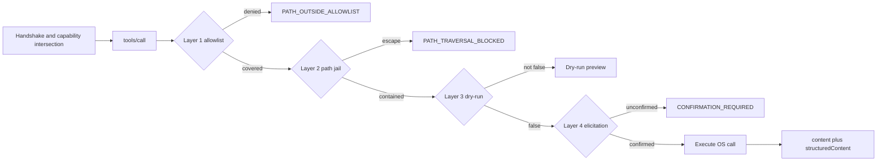
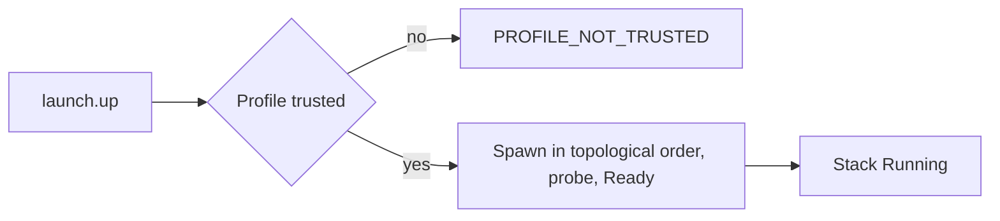

# Functional specification

This document is the behavioral contract for substrate: the path from an MCP
client to an OS effect, the actors on that path, and the corpus that accepts a
behavior as implemented. The ADRs under `../adr/` hold the decisions it traces to.

## Overview

substrate is a Model Context Protocol server written in Rust that exposes
baseutils-equivalent OS management to LLM agents. It serves one transport: the
client spawns the server as a child process and exchanges newline-delimited
JSON-RPC 2.0 over stdin and stdout. No socket server, no HTTP or SSE listener, no
port to allocate; `stdout` carries protocol framing, every diagnostic line leaves
on `stderr` ([ADR-0005](../adr/0005-stdio-transport.md)).

The surface is partitioned into ten bounded contexts, each owning one namespace
and one mutation-risk class ([ADR-0002](../adr/0002-bounded-contexts.md)); 61
tools are registered with the `launch` Cargo feature enabled, 51 without it.

| Namespace | Bounded context | Tools | Mutation risk |
|---|---|---|---|
| `fs` | filesystem-query, filesystem-mutation | 13 | none read-side, high write-side |
| `proc` | process | 5 | high for signals |
| `sys` | system-info | 8 | none |
| `text` | text-processing | 4 | none |
| `archive` | archive | 7 | medium on create and extract |
| `job` | job | 4 | none, control-plane only |
| `subprocess` | subprocess | 6 | highest |
| `net` | network-info | 4 | none |
| `launch` | launch | 10 | high |

Tool ids take the dot form in spec artifacts and the underscore form on the wire
([ADR-0062](../adr/0062-tool-naming-convention.md)).

A call is admitted, gated, and executed server-side. The client is never trusted
to pre-validate: an allowlist, a kernel-backed path jail, a mandatory dry-run
gate, and an elicitation form stand between the model's arguments and the first
syscall ([ADR-0004](../adr/0004-security-model.md),
[ADR-0035](../adr/0035-path-safety-hardening.md)).

It does not listen on a network interface; outbound connectivity is compiled in
only under `outbound-net`, which `launch` implies so its probes are live. It does
not keep a daemon; the opt-in detached supervisor is the same binary in
`--supervise` mode over a control FIFO
([ADR-0068](../adr/0068-launch-detached-supervisor-and-orphan-governance.md)). It
does not treat a project file as an authority grant: the binary allowlist still
gates every spawn a `.substrate.toml` declares
([ADR-0064](../adr/0064-launch-profile-trust-model.md)).

## Actors

| Actor | Goal | Trust level |
|---|---|---|
| LLM agent | accomplish an OS task by chaining tool calls | untrusted input, no scope memory |
| MCP client process | carry JSON-RPC frames, render elicitation forms | untrusted; its validation is advisory |
| Human operator | configure scope, bless Profiles, confirm destructive work | the trust anchor |
| Supervised child process | run the command a Service or spawn declared | untrusted code under confinement |

The agent's arguments are the primary attack surface: relative segments, absolute
paths, null bytes, Unicode variants, and PIDs read from model output rather than a
typed API. The client is untrusted in the same sense. The operator owns the TOML
allowlist and the user-scope trust store, and is the only actor that can widen
scope; every widening is an explicit file edit or a bless. A child process passes
a binary allowlist, an env allowlist with hard-banned loader variables, a `cwd`
jail, and optional resource caps before `exec`
([ADR-0004](../adr/0004-security-model.md) Layer 5).

## Flow

Layers are applied in the order numbered in
[ADR-0004](../adr/0004-security-model.md), for every namespace.

**Handshake and capability intersection.** A client below `2025-06-18` is rejected
with `SUBSTRATE_PROTOCOL_VERSION_UNSUPPORTED`, closing the connection before any
session state exists. Otherwise the negotiated version is the minimum of the
offered version and `2025-11-25`, and the server stores the intersection with the
client's capability set ([ADR-0013](../adr/0013-mcp-protocol-version.md)). A
`2025-06-18` client lacks elicitation there, so destructive tools return
`SUBSTRATE_CONFIRMATION_REQUIRED` instead of executing unconfirmed.

**Tool discovery.** `tools/list` returns the static registry in one page; the tool
set is fixed at startup, so no list-changed notification is emitted. Each card
carries the description, `inputSchema`, `outputSchema`, and the `readOnlyHint`,
`destructiveHint`, `idempotentHint`, and `openWorldHint` annotations declared per
namespace ([ADR-0008](../adr/0008-mcp-features-map.md)).

**Admission: allowlist, path jail, dry-run, elicitation.** Layer 1 prefix-matches
the NFC-normalized argument against canonicalized allowlist roots, default deny.
Layer 2 opens with `openat2(RESOLVE_BENEATH | RESOLVE_NO_SYMLINKS)` on Linux 5.6+
and `O_NOFOLLOW_ANY` on macOS 12+, closing the TOCTOU window by making resolution
and open one kernel operation ([ADR-0035](../adr/0035-path-safety-hardening.md)).
Layer 3 returns a structured preview unless `dry_run` is explicitly `false`; with
`dry_run: false`, Layer 4 emits an elicitation form naming the exact paths or PIDs
and proceeds only on an explicit confirmation token. `subprocess.spawn` elicits on
every invocation.

**Execution and response.** The adapter performs the OS call under the request
`CancellationToken`, work first in a biased `select!` so cancellation wins without
leaking a permit ([ADR-0037](../adr/0037-async-cancellation-patterns.md)); disk
writes go to `<target>.tmp.<uuid7>` and rename atomically. The response bifurcates
into `content` (at most 80 tokens of prose) and `structuredContent` (typed JSON
plus the `hints` map).

**Launch bring-up.** `launch.up` reads a Profile through the TOFU gate: symlink-safe
open, `fstat` of the descriptor, hash of the bytes, identity-tuple comparison
against the user-scope trust store, and only then a parse of the exact hashed
buffer ([ADR-0064](../adr/0064-launch-profile-trust-model.md)). Services start in
topological order, each gated on its dependencies reporting `Ready` from a live
probe; every spawn funnels through one `spawn_service` call that resolves
`command[0]` against `$PATH` or `cwd`
([ADR-0070](../adr/0070-launch-path-binary-resolution.md)) and merges `env_file`
values ([ADR-0071](../adr/0071-launch-env-file-support.md)).

## Acceptance

A behavior is accepted when an executable Gherkin scenario under
`../specs/features/` passes against the real binary. The corpus holds 167
features, one scenario per behavior; `speckit verify` runs it, and
`speckit verify --filter <substr>` scopes a run by scenario name.

The same corpus runs through the cucumber-rs harness at
`crates/substrate-mcp-server/tests/cucumber.rs` via
`cargo nextest run --test cucumber`, which spawns the built server over STDIO and
asserts on JSON-RPC responses, with no mocking of the transport or the adapters
([ADR-0012](../adr/0012-testing-strategy.md)). Each feature file names the ADR it
traces to in a header comment, so a behavior change lands as three coordinated
edits: the ADR, the feature file, and the adapter.

| Accepted behavior | Feature | Traces to |
|---|---|---|
| A client below the minimum version is rejected at handshake | [`protocol-version-rejection.feature`](../specs/features/cross-cutting/protocol-version-rejection.feature) | [ADR-0013](../adr/0013-mcp-protocol-version.md) |
| A destructive call on an elicitation-less client fails closed | [`capability-elicitation-missing.feature`](../specs/features/cross-cutting/capability-elicitation-missing.feature) | [ADR-0004](../adr/0004-security-model.md) |
| Every error carries `code`, `recovery_hint`, `correlation_id` | [`error-response-shape.feature`](../specs/features/cross-cutting/error-response-shape.feature) | [ADR-0010](../adr/0010-error-taxonomy.md) |
| Traversal is blocked before any filesystem read | [`fs-find-path-traversal-blocked.feature`](../specs/features/filesystem-query/fs-find-path-traversal-blocked.feature) | [ADR-0035](../adr/0035-path-safety-hardening.md) |
| `fs.remove` deletes only after confirmation | [`fs-remove-requires-elicitation.feature`](../specs/features/filesystem-mutation/fs-remove-requires-elicitation.feature) | [ADR-0004](../adr/0004-security-model.md) |
| A Stack starts in dependency order gated on readiness | [`launch-up-readiness-gated-start.feature`](../specs/features/launch/launch-up-readiness-gated-start.feature) | [ADR-0065](../adr/0065-launch-dependency-graph-and-reconciler-reload.md) |
| An unblessed Profile is rejected before any spawn | [`launch-profile-untrusted-rejected.feature`](../specs/features/launch/launch-profile-untrusted-rejected.feature) | [ADR-0064](../adr/0064-launch-profile-trust-model.md) |
| A client disconnect leaves zero surviving processes | [`launch-disconnect-shutdown-kills-stack.feature`](../specs/features/launch/launch-disconnect-shutdown-kills-stack.feature) | [ADR-0063](../adr/0063-launch-orchestration-bounded-context.md) |

The spec artifacts are gated separately: `speckit validate` checks section shape,
Mermaid parseability, and link targets, and CI runs the `--deep` lane before
merge.

## Observability

Each tool call opens one span carrying a `correlation_id` that is also returned in
every error, so a failed call can be stitched back to its log line
([ADR-0009](../adr/0009-observability.md)). Mutating tools emit an `attempted`
audit event before the first mutating syscall and a terminal event on the same
`substrate.audit` target after it, so a crash between the two still leaves the
attempt on record ([ADR-0038](../adr/0038-audit-event-semantics.md)). A launch
Stack adds typed lifecycle events over a durable per-Stack event log
([ADR-0066](../adr/0066-launch-event-stream-and-notification-model.md)), and
counters and latency percentiles are derived from that audit stream per
[ADR-0039](../adr/0039-sli-definitions.md), with no metrics agent required.