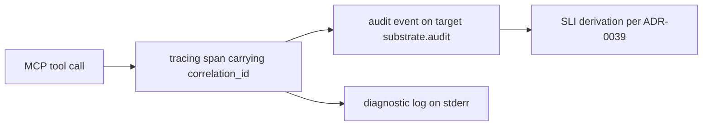

# Observability strategy

substrate runs as a short-lived MCP server spawned by an LLM agent over STDIO.
There is no metrics agent, no sidecar, and no OTLP collector: every signal leaves
the process on stderr, and every durable signal is derived from the audit log.
This document is the strategy. The binding contracts live in
[ADR-0009](../adr/0009-observability.md) (tracing and spans),
[ADR-0038](../adr/0038-audit-event-semantics.md) (audit event semantics),
[ADR-0039](../adr/0039-sli-definitions.md) (SLI definitions), and
[ADR-0018](../adr/0018-logging-redaction.md) (redaction).

## Signals

| Signal | Emitted by | Sink | Contract |
|---|---|---|---|
| Diagnostic log | `tracing` events on the call path | stderr, JSON Lines | ADR-0009 |
| Audit event | `tracing` event with `target = "substrate.audit"` | stderr | ADR-0038 |
| Span open/close | `#[instrument]` on tool entry points | stderr | ADR-0009 |
| Panic record | panic hook, emitted before `abort` | stderr | ADR-0014 |
| SLI value | derivation over the audit stream | CI job, operator query | ADR-0039 |
| Benchmark sample | `criterion` benches under `benches/` | CI cache | ADR-0030 |

stdout is the MCP wire channel and never carries a signal ([ADR-0005](../adr/0005-stdio-transport.md)).

## Metrics

No metrics registry exists in the MVP; option 1 of ADR-0039 (Prometheus
histograms, requires a collection agent) is deferred. Derived metrics replace it:

- **Counters** — tool invocations partitioned by `tool_name`, `outcome`, and
  `error_code`, read from the audit stream.
- **Latency** — percentiles over the `duration_ms` audit field, per tool.
- **Memory** — idle RSS and 10-concurrent-call RSS, measured by the CI harness
  because they are not observable from the audit log (ADR-0039).
- **Regression** — `criterion` baselines against the committed CI cache; a
  regression above 15% fails the build (ADR-0030).

Targets are declared as OpensLO v2alpha SLO files under `doc/arch/slo/`, one file
per objective, each carrying its own numerator, denominator, and window.
Cancelled and timeout outcomes are excluded from latency denominators so a
client-initiated cancellation does not penalise the server (ADR-0039).

## Logs

- Every line goes to stderr through `tracing-subscriber` as structured JSON
  Lines. `println!` and `print!` are forbidden in `src/` and CI enforces it via
  `clippy::print_stdout`.
- Severity follows TRACE / DEBUG / INFO / WARN / ERROR. TRACE is compiled out of
  release builds through the `max_level_trace` gate.
- Audit events are INFO-level events distinguished by `target = "substrate.audit"`
  and an `audit=true` field, so a processor filters them without a second sink.
- Redaction runs at the instrumentation site, before the event reaches any
  subscriber: file contents, resolved paths under the jail, and command arguments
  are masked per ADR-0018. `EnvFilter` MUST NOT be widened to TRACE without
  checking that redacted fields stay redacted (ADR-0009).
- String fields are stripped of CR and LF before emission, so a crafted filename
  cannot forge an audit line.

## Tracing

- Spans mirror the call hierarchy one-to-one: MCP-request, tool-call,
  filesystem-operation.
- `correlation_id` is a UUIDv7 injected when the MCP-request span opens and
  propagates through `tracing::Span::current()`. `tokio::spawn` and
  `spawn_blocking` do not carry span context on their own, so every crossing uses
  an explicit `.instrument()` call (ADR-0038).
- Span close status uses the `otel.status_code` field and the OpenTelemetry
  vocabulary, mapped one-to-one onto the terminal audit `outcome`, so a future
  OTLP bridge needs no change to business logic.
- Mutating tools open a span, emit an `attempted` audit event before the first
  mutating syscall, then emit the terminal event and close the span. A crash
  between the two leaves the attempt on record.
- Ordering across clock steps comes from a monotonic `seq` counter, not from the
  wall clock, and each event carries an `active_requests_at_start` snapshot for
  contention reconstruction.
- A panic hook writes one record before the process aborts (`panic = "abort"`
  per ADR-0014 leaves no unwinding hook).

## Cardinality

- **Bounded** label sets, safe to aggregate on: `tool_name` (61 values with the
  `launch` feature on, 51 without), `outcome` (attempted, success, error,
  cancelled, timeout), `error_code` (58 stable codes), capability tier.
- **Unbounded** values, safe to group but not to index: `correlation_id` (one per
  request), `path` (arbitrary depth and length), `seq`.
- A derived metric MUST NOT be keyed on `path` or `correlation_id`; the bounded
  sets above are the aggregation keys, and the unbounded values stay in the event
  payload for forensics.
- Measurement windows are declared per SLO file. Availability and latency windows
  are 30 minutes rolling; archive objectives use wider windows because their call
  rate is lower and a narrow window starves the sample (ADR-0039).

The declared label set, and the value domain each label is allowed to take:

| Label | Bounded Value Set | Signal |
|---|---|---|
| `tool_name` | 61 tool ids with `launch`, 51 without | counter, latency |
| `outcome` | attempted, success, error, cancelled, timeout | counter |
| `error_code` | 58 `SUBSTRATE_*` codes | counter |
| `capability_tier` | tiers negotiated at handshake | counter |
| `correlation_id` | one UUIDv7 per request | forensic only |
| `path` | bucket by first segment beneath the allowlist root | forensic only |

## Observability

This document is the strategy; it is instrumented by its own subject matter. The
audit stream that feeds the SLIs is the same stream an operator reads when
diagnosing a failed tool call, and the `correlation_id` that stitches a forensic
timeline together is the field named above under
[Tracing](#tracing).