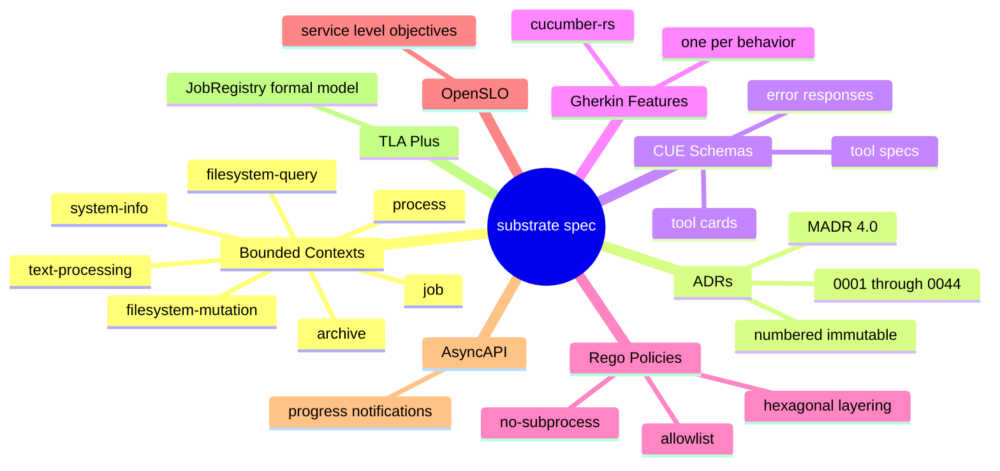

# substrate — Architecture Specification

## Purpose

This directory is the specification root for substrate, an MCP server written
in Rust 1.95 that exposes baseutils-equivalent OS management capabilities to LLM
agents. Substrate provides tools for filesystem inspection and mutation, process
control, system metadata, text search, and archive management — all delivered
over the Model Context Protocol via STDIO transport with a layered security
model that treats LLM-generated inputs as untrusted by default. The documents
here define the bounded contexts, data contracts, security policies, and
technology decisions that govern the implementation; no production code lives in
this directory.

## Quick Start

Validate the specification against all CUE schemas and Gherkin feature files:

```shell
spec validate --lane fast
```

Run the full validation suite including Rego policies and ADR lint:

```shell
spec validate --lane full
```

## Layout

```text
docs/arch/
  adr/               MADR 4.0 architecture decision records (numbered, immutable)
  architecture/      Structurizr DSL workspace model (C4 levels 1-3)
  cue.mod/           CUE module definition
  domain/            Bounded-context README files (one per context)
  formal/            TLA+ and Alloy formal models (reserved)
  integrations/      Integration guides for MCP hosts and agent runtimes
  operations/        Runbooks and deployment guides
  policies/          Rego policies (Open Policy Agent)
  schemas/           CUE schemas for tool specs, error responses, and tool cards
  slo/               OpenSLO service level objectives
  specs/             Gherkin feature files (one per bounded context)
  threat-model/      STRIDE-Lite threat model documents
  glossary.md        Ubiquitous-language vocabulary (this spec's dictionary)
  README.md          This file
```

## Diagram

The mindmap below shows the seven bounded contexts and the cross-cutting
artifact types that govern the specification.



## Where to Start Reading

If you are new to this specification, read the following documents in order:

- [ADR-0001](adr/0001-record-architecture-decisions.md) — explains why MADR
  files are used and how decisions are recorded and amended
- [ADR-0002](adr/0002-bounded-contexts.md) — the seven bounded contexts that
  partition substrate's tool surface (filesystem-query, filesystem-mutation,
  process, system-info, text-processing, archive, job), their mutation risk
  classifications, and the context map showing how they share the kernel
- [Glossary](glossary.md) — definitions for every term used across ADRs,
  schemas, and bounded-context READMEs; consult this when a term is ambiguous
- [ADR-0007](adr/0007-tool-card-narrative-arc.md) — the canonical format for
  tool descriptions (narrative-arc template), the bifurcation between prose and
  structured-content layers, and the hint grammar that governs every tool card
- [ADR-0004](adr/0004-security-model.md) — the four-layer security model
  (allowlist, path jail, dry-run gate, elicitation) and the threat assumptions
  that justify each layer

After those five documents you will have enough context to read any bounded-
context README under `domain/`, any CUE schema under `schemas/`, and any ADR in
`adr/`.

## Architecture Model

The Structurizr DSL workspace model at
[Structurizr workspace](architecture/workspace.dsl) defines the C4 system
context, container, and component diagrams. Render it with the Structurizr CLI
or the Structurizr Lite server:

```shell
structurizr-cli export -workspace docs/arch/architecture/workspace.dsl -format plantuml
```

## Bounded Contexts

Substrate defines eight bounded contexts (added in ADR-0002 amended by
ADR-0040 and ADR-0052): filesystem-query, filesystem-mutation, process,
system-info, text-processing, archive, job, and subprocess. Each context
has a README under `domain/`:

- [filesystem-query](domain/filesystem-query/README.md) — read-side
  filesystem tools (ls, find, stat, du, file, hash).
- [filesystem-mutation](domain/filesystem-mutation/README.md) — write-side
  filesystem tools (mkdir, write, copy, rename, remove, chmod, symlink,
  touch).
- [process](domain/process/README.md) — process inspection and control
  (proc.list, proc.tree, proc.signal, proc.stats, proc.top).
- [system-info](domain/system-info/README.md) — host metadata (sys.info,
  sys.uptime, sys.df, sys.uname, sys.hostname, sys.load_average, sys.mem,
  sys.cpu).
- [text-processing](domain/text-processing/README.md) — text search and
  slicing (text.search, text.count_lines, text.head, text.tail).
- [archive](domain/archive/README.md) — tar/zip/gzip create and extract,
  archive.hash.
- [job](domain/job/README.md) — async job control-plane (added by
  ADR-0040).
- [subprocess](domain/subprocess/README.md) — supervised child-process
  spawn with stdout/stderr stream capture and cascade cleanup (added by
  ADR-0052, gated behind Cargo feature `subprocess`).

## Recent Architecture Decisions (ADR-0040 through ADR-0044)

Five decisions were recorded after the initial specification wave:

- [ADR-0040](adr/0040-async-job-control-plane.md) — introduces a job bounded
  context with `JobRegistry`, `JobEntry`, `JobBucket` (A/B/C/D), and a
  `ProgressToken`-based notification stream for long-running tool calls.
- [ADR-0041](adr/0041-filesystem-index-native-tiers.md) — defines native-tier
  filesystem index adapters (`FsIndexPort`) with write-through update semantics
  and a `PollingWatcher` null-object fallback.
- [ADR-0042](adr/0042-capability-adapter-factory.md) — establishes the
  `PortFactory<P>` abstract factory, `OnceLock<Capabilities>` probe, per-port
  tier cascades, `InstrumentedAdapter` decorator, and the
  `SUBSTRATE_CAPABILITY_TIERS_SELECTED` startup audit event.
- [ADR-0043](adr/0043-simd-runtime-dispatch.md) — specifies single-probe
  `SimdTier` detection, per-crate SIMD backend selection, and AVX-512 opt-in
  policy to avoid CPU frequency throttling.
- [ADR-0044](adr/0044-no-subprocess-policy.md) — bans `std::process::Command`
  and subprocess-invocation crates from shipped code; enforced by the
  `no_subprocess.rego` Rego policy.

## License

Substrate source code and this specification are dual-licensed under the MIT
License and the Apache License 2.0. You may choose either license. See the
`LICENSE-MIT` and `LICENSE-APACHE` files at the repository root.

## Repository Conventions

Commit message format, branch naming, and ADR amendment rules are documented in
ADR-0024 (repository conventions). Key rules:

- ADR files are immutable after acceptance; amendments create a new ADR that
  supersedes the original.
- CUE schemas and Rego policies are validated in CI via `spec validate --lane
  full` before merge.
- The `docs/arch/` directory is the source of truth for all design decisions;
  implementation code must not contradict a standing ADR without first amending
  or superseding it.
