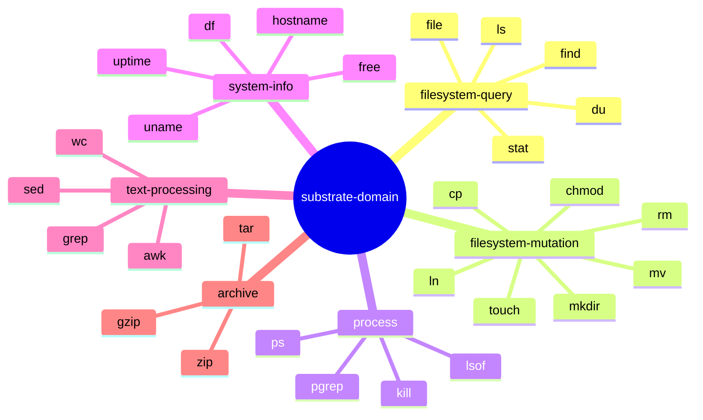
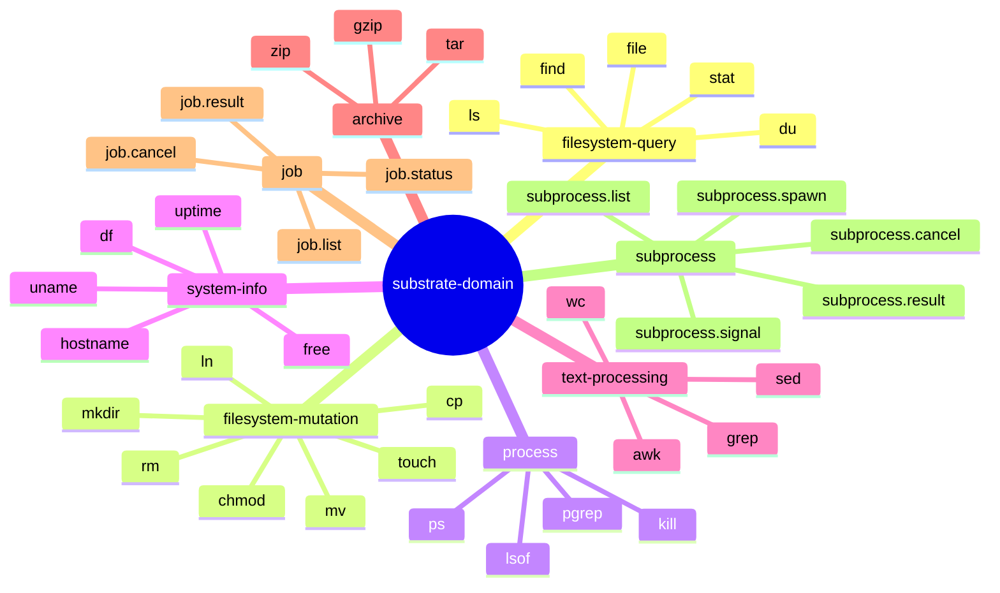
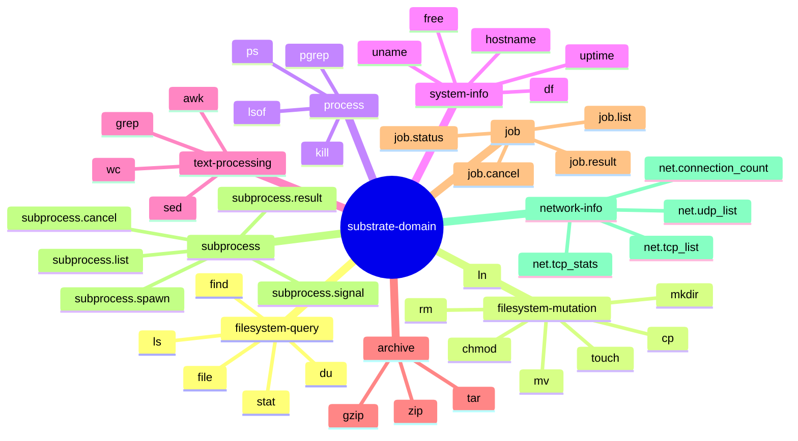
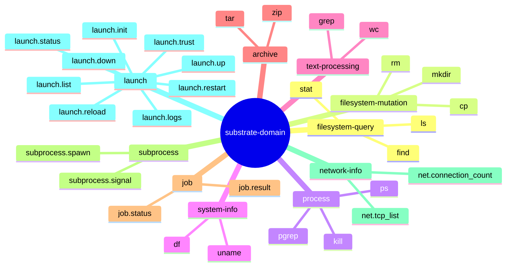

# ADR-0002 — Bounded Contexts and Context Map

## Context and Problem Statement

Substrate exposes a wide surface of OS management capabilities to LLM agents.
Without explicit semantic boundaries, tools from different concern families
(querying filesystem metadata versus mutating it, or inspecting processes
versus reading system hardware info) would accumulate in a single service blob,
making policy enforcement, testing, and future versioning impractical.

The problem is: how should the MCP tool surface be partitioned so that each
region has a coherent ubiquitous language, clear ownership, and independently
evolvable policy?

## Decision Drivers

- Each tool family carries distinct mutation risk: reads are idempotent,
  mutations are destructive, process signals are irreversible.
- Security policy (allowlists, dry-run, elicitation) differs per family.
- Independent deployability and testability of each concern family.
- Ubiquitous language must be unambiguous within each boundary.

## Considered Options

- Option A: Single bounded context, all tools in one crate.
- Option B: Two contexts (read-only vs. mutating).
- Option C: Six contexts partitioned by semantic family.

## Decision Outcome

Chosen option: "Option C — six contexts partitioned by semantic family",
because each family has a distinct risk profile, a distinct ubiquitous
language, and a distinct set of port abstractions that would be muddied by
coarser partitioning.

### Bounded Contexts

**filesystem-query**

Purpose: Read-only inspection of filesystem metadata and content.
Ubiquitous language: Entry, Stat, DiskUsage, FileKind, Glob, PageCursor.
Aggregates: DirectoryListing, StatResult, DiskUsageTree.
Tools exposed: ls, find, stat, du, file.
Mutation risk: none.

**filesystem-mutation**

Purpose: Structural changes to the filesystem.
Ubiquitous language: JailedPath, MutationPlan, DryRunReport, Overwrite,
Permission, Ownership.
Aggregates: MutationRequest, MutationResult.
Tools exposed: mkdir, cp, mv, rm, ln, touch, chmod, chown.
Mutation risk: high; dry-run mandatory; elicitation required for destructive
operations.

**process**

Purpose: Inspection and control of running OS processes.
Ubiquitous language: Pid, ProcessSnapshot, Signal, ProcessFilter, ResourceUsage.
Aggregates: ProcessList, ProcessHandle.
Tools exposed: ps, top, kill, pgrep, lsof.
Mutation risk: high for signals; elicitation required for SIGKILL, SIGTERM,
SIGSTOP.

**system-info**

Purpose: Read-only hardware and OS-level metadata.
Ubiquitous language: KernelVersion, Uptime, MountPoint, MemoryStats,
HostName.
Aggregates: SystemSnapshot.
Tools exposed: uname, uptime, df, free, hostname.
Mutation risk: none.

**text-processing**

Purpose: Stream-oriented text search and transformation over file content
or stdin.
Ubiquitous language: Pattern, Match, Delimiter, FieldSelector, SortKey,
Frequency.
Aggregates: MatchResult, TransformResult.
Tools exposed: grep, sed, awk, cut, sort, uniq, wc.
Mutation risk: none (reads only; writes are out of scope for MVP).

**archive**

Purpose: Creation, inspection, and extraction of archive files.
Ubiquitous language: ArchiveEntry, CompressionAlgorithm, ArchivePath,
ExtractTarget.
Aggregates: ArchiveManifest, ArchiveWriteRequest.
Tools exposed: tar, gzip, zip.
Mutation risk: medium for writes; elicitation required for archive creation
targeting jailed paths.

### Context Map

All six contexts share a single **shared kernel** (`substrate-domain` crate)
containing value objects that cross boundaries: JailedPath, ToolResult,
PageCursor, ProgressToken, AuditEvent. No aggregate is shared. Each context
maps to its own adapter crate; the shared kernel is the only permitted
inter-context dependency at the domain layer. See ADR-0025.

## Validation

- Each bounded context crate (`substrate-fs-query`, `substrate-fs-mutation`,
  `substrate-process`, `substrate-system-info`, `substrate-text`,
  `substrate-archive`) must compile independently with `cargo check -p <crate>`.
- `cargo deny` must confirm no direct crate-to-crate imports crossing context
  boundaries except through `substrate-domain`.
- Integration tests for each context live under `crates/<context>/tests/`.

## Amendments

### 2026-05-24 — Eighth bounded context: subprocess (ADR-0052)

[ADR-0052](0052-subprocess-execution-architecture.md) introduces an eighth bounded context: `subprocess`. The original decision selected six contexts; the `job` control-plane introduced by [ADR-0040](0040-async-job-control-plane.md) constitutes the seventh. The `subprocess` BC is the eighth.

**subprocess**

Purpose: spawn and supervise child processes with stream capture and cascade cleanup.

Ubiquitous language: `SubprocessRequest`, `SubprocessHandle`, `ProcessGroup`, `StreamEvent`, `BinaryAllowlist`, `EnvAllowlist`, `WatchdogPipe`, `CascadeKill`, `OrphanReaper`.

Aggregates: `SubprocessHandle` (aggregate root; owns the full lifecycle of a single spawned child process from pre-exec validation through terminal state cleanup).

Tools exposed: `subprocess.spawn`, `subprocess.list`, `subprocess.cancel`, `subprocess.result`, `subprocess.signal`.

Mutation risk: HIGHEST — subprocess execution causes irreversible side effects on the host OS. Elicitation is mandatory for every `subprocess.spawn` invocation regardless of the `dry_run` flag (Layer 4 of ADR-0004 applied unconditionally). The subprocess BC is behind Cargo feature `subprocess` (default-OFF) and is excluded from the default binary.

The context map mindmap is updated to include the subprocess branch:

Cross-reference: [ADR-0052](0052-subprocess-execution-architecture.md).

### 2026-05-25 — Ninth bounded context: network-info (ADR-0058)

[ADR-0058](0058-network-socket-introspection.md) introduces a ninth bounded
context: `network-info`.

**network-info**

Purpose: read-only introspection of kernel TCP/UDP socket state and global
TCP protocol counters.

Ubiquitous language: `SocketEntry`, `TcpState`, `PcbList`, `TcpStats`,
`ConnectionCounts`, `NetworkInfoPort`, `PidResolver`.

Aggregates: `SocketEntry` (query read-model).

Tools exposed: `net.tcp_list`, `net.udp_list`, `net.tcp_stats`,
`net.connection_count`.

Mutation risk: none. All tools are read-only; no elicitation required.

The context map is updated to include the `network-info` branch:

Cross-reference: [ADR-0058](0058-network-socket-introspection.md).

### 2026-06-30 — Tenth bounded context: launch (ADR-0063, proposed)

[ADR-0063](0063-launch-orchestration-bounded-context.md) introduces a tenth
bounded context: `launch` (status: proposed). It orchestrates *over* the
subprocess BC rather than spawning processes itself.

**launch**

Purpose: declarative process orchestration — a project-local `.substrate.toml` of
named Services brought up, supervised, and torn down as a Stack, with a
zero-orphan guarantee.

Ubiquitous language: `Profile`, `Service`, `Stack`, `StackState`, `Supervisor`,
`DisconnectPolicy`, `TrustRecord` (TOFU), `LaunchOperatorConfig`, `OrphanTTL`,
`Reconciler`.

Aggregates: `Stack` (aggregate root; owns the dependency graph, per-Service
handles, pinned config, and lifecycle state). `Profile` is a value object parsed
from the trusted `.substrate.toml`.

Tools exposed: `launch.init`, `launch.list`, `launch.trust`, `launch.up`,
`launch.status`, `launch.logs`, `launch.restart`, `launch.reload`, `launch.down`.

Mutation risk: HIGH — `launch.up`/`restart`/`down` spawn and kill processes. A
Profile is never an authority grant: every Service spawn still passes the
subprocess BC Layer 5 controls, and a Profile is untrusted until blessed (TOFU,
[ADR-0064](0064-launch-profile-trust-model.md)). The BC is behind Cargo feature
`launch` (default-OFF).

The context map gains a `launch` branch layered above the `subprocess` branch:

Cross-reference: [ADR-0063](0063-launch-orchestration-bounded-context.md) through
[ADR-0069](0069-launch-tool-cards-toolsearch-and-guidance.md).

## Links

- Related: [ADR-0025](0025-bounded-context-interactions.md)
- Related: [ADR-0022](0022-project-layout.md)
- Related: [ADR-0063](0063-launch-orchestration-bounded-context.md) — tenth BC (launch)
