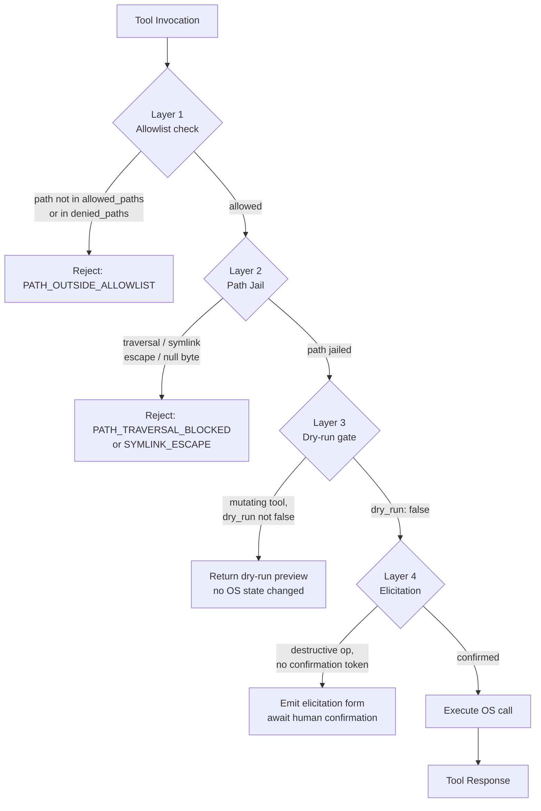
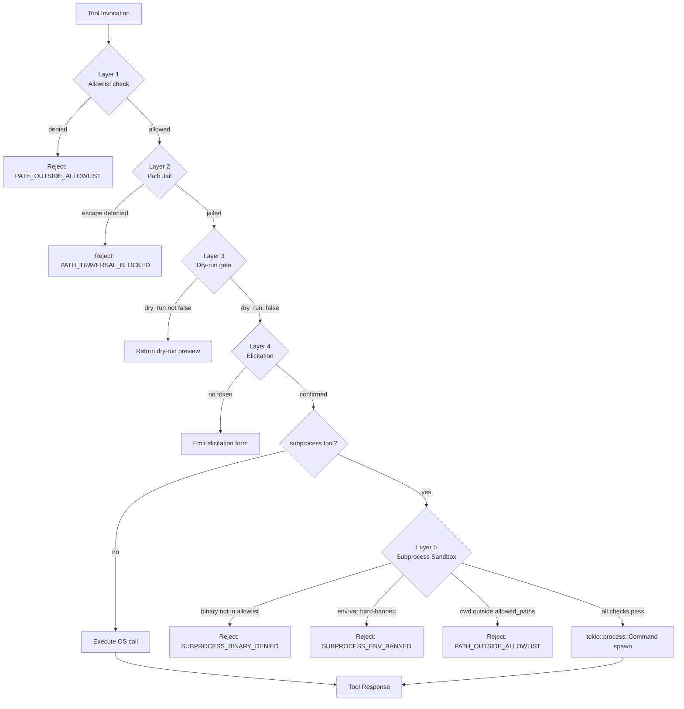

# ADR-0004 — Security Model

## Context and Problem Statement

Substrate exposes OS-level capabilities (filesystem mutations, process signals, archive creation and extraction) to LLM agents via the MCP protocol. LLM-generated inputs are inherently untrusted: they may contain path traversal sequences, absolute path injections, null bytes, Zip Slip payloads, or signals targeting critical processes. A single layered security model must govern all tool invocations before any OS call is made.

## Decision Drivers

- LLM clients cannot be trusted to self-enforce scope or validate inputs.
- OS mutations (remove, rename, set_permissions, archive write/extract, process signal) are irreversible or high-impact.
- Path traversal and symlink escape must be blocked at the library level, not application logic.
- Agents operating on behalf of users must have an explicit confirmation step for destructive actions.
- Outbound network must be off by default to prevent data exfiltration.

## Considered Options

1. Allowlist-based path jail + dry-run gate + elicitation for destructive ops (selected)
2. Blocklist-based path filtering (deny known bad patterns)
3. Sandbox via OS-level mechanisms only (macOS sandbox profiles, Linux namespaces)
4. Trust the MCP client to enforce scope

## Decision Outcome

Chosen option: "Allowlist-based path jail + dry-run gate + elicitation for destructive ops", because it provides defense-in-depth without relying on OS sandbox availability or LLM client correctness.

The security model consists of four enforced layers, applied in order for every tool invocation:



### Layer 1 — Allowlist (default-deny)

All accessible paths are declared in TOML configuration. An empty `allowed_paths` list means no filesystem access is permitted. Paths not covered by the allowlist are rejected before any OS call.

TOML schema sketch:

```toml
[security]
# Empty list = default deny. At least one entry required for fs tools.
allowed_paths = [
  "/home/user/projects",
  "/tmp/substrate-workspace",
]

# Explicit deny overrides allowed_paths (evaluated first).
denied_paths = [
  "/home/user/.ssh",
  "/home/user/.aws",
]

# Feature flags
outbound_network = false   # Cargo feature outbound-net; false by default
```

### Layer 2 — Path Jail (strict-path crate)

Every path argument is canonicalized and validated via `strict-path` before reaching OS APIs. The jail blocks:

- `../` traversal sequences (relative and encoded)
- Absolute path injections supplied as tool arguments
- Symlink escapes (resolved target must remain within allowlist)
- Null byte injection (`\0`)
- Zip Slip (archive entry paths resolved against extraction root)

`soft-canonicalize` is used where the path does not yet exist (e.g., new file creation), preserving the strict-path check without requiring the target to exist first.

### Layer 3 — Dry-run Mandatory Gate

The following tools require `dry_run: true` to be explicitly set to `false` before executing:

- `fs.remove`, `fs.rename`, `fs.set_permissions`
- `proc.signal` (all signals)
- `archive.create`, `archive.extract`

When invoked without an explicit `dry_run: false`, the tool executes a simulation pass and returns a structured preview of the intended mutations. No OS state is modified.

### Layer 4 — Elicitation (form-mode confirmation)

For a subset of high-impact operations, the server emits an MCP elicitation request before executing even with `dry_run: false`:

- All `fs.*` destructive mutations
- `proc.signal` with SIGKILL, SIGTERM, or SIGSTOP
- `archive.create` and `archive.extract`

The elicitation form presents the exact operation, affected paths or PIDs, and requires an explicit human confirmation token before the server proceeds.

### Path Safety Hardening

The four-layer model described above is necessary but not sufficient against TOCTOU symlink swaps, macOS Unicode normalization mismatches, APFS firmlink aliasing, `/proc` indirection, and archive symlink-member attacks. See [ADR-0035](0035-path-safety-hardening.md) for the complete specification of `openat2`/`O_NOFOLLOW_ANY` per-platform open hardening, NFC Unicode normalization at the allowlist boundary, firmlink resolution via `F_GETPATH`, `/proc` path blanket rejection (Linux), hard-link detection policy, `PATH_MAX` validation, and archive symlink-member ban.

### Transactional Mutations

All write-to-disk operations (including `fs.write`, `fs.copy`, `archive.tar.create`, and `archive.zip.extract`) MUST follow the write-to-temp + atomic-rename + cleanup-on-cancel pattern described in [ADR-0033](0033-transactional-write-pattern.md). This ensures that partial writes are never visible under the target path, cancellation leaves no debris, and ENOSPC is reported before any bytes are written when output size is known.

### Server-side enforcement

All four layers are enforced server-side, in the substrate process, before any syscall. The MCP client (LLM agent or host) is not trusted to pre-validate inputs. Client-side validation is treated as advisory only.

### Consequences

#### Positive

- Path traversal, symlink escape, and Zip Slip are structurally blocked regardless of LLM input.
- Default-deny allowlist prevents scope creep without configuration.
- Dry-run gate eliminates silent irreversible mutations.
- Elicitation creates an auditable human-in-the-loop checkpoint for destructive operations.

#### Negative

- Operators must explicitly configure `allowed_paths`; out-of-box filesystem access is zero.
- Dry-run adds a round-trip for every mutation workflow.
- Elicitation introduces latency and requires a compliant MCP host to render the form.

## Validation

- Unit tests assert that paths outside `allowed_paths` are rejected with `PATH_DENIED`.
- Property-based tests (proptest) generate adversarial path strings targeting the strict-path jail.
- Integration tests confirm dry-run preview output matches actual mutation diff.
- Elicitation form rendering is verified against MCP elicitation spec conformance tests.

## Cross-References

- ADR-0008 — Tool surface design (which tools are exposed and their argument schemas)
- ADR-0018 — Logging redaction policy (audit trail for security events)
- ADR-0029 — Threat model (STRIDE-Lite mapping of attacks to these mitigations)
- [ADR-0033](0033-transactional-write-pattern.md) — Transactional write pattern (temp + atomic rename + cleanup-on-cancel)
- [ADR-0035](0035-path-safety-hardening.md) — Path safety hardening (openat2, O_NOFOLLOW_ANY, Unicode normalization, firmlink, /proc, archive symlink-member ban)

## Amendments

### 2026-05-24 — Layer 5 (Subprocess Sandbox) introduced via ADR-0052

[ADR-0052](0052-subprocess-execution-architecture.md) adds a fifth security layer that applies exclusively to the subprocess bounded context tools (`subprocess.spawn`, `subprocess.signal`). The four existing layers are unchanged for all other tool namespaces.

Layer 5 controls are enforced by `crates/substrate-subprocess/` before any `tokio::process::Command` is constructed:

- **Binary path PathJail.** The target binary must appear in `security.subprocess_binary_allowlist` (TOML list, default empty — effectively deny-all when no entries are configured). The binary path is canonicalized and compared against the allowlist in the same manner as filesystem paths in Layer 1.
- **Env-var allowlist.** Environment variables passed in the `subprocess.spawn` env map must be present in `security.subprocess_env_allowlist` (TOML list). Regardless of the allowlist, the following variables are hard-banned and rejected at Layer 5 even when they appear in the allowlist: `LD_PRELOAD`, `DYLD_INSERT_LIBRARIES`, `LD_LIBRARY_PATH`, `DYLD_LIBRARY_PATH`. This hard-ban list is evaluated independently and cannot be overridden by configuration.
- **cwd PathJail.** The working directory supplied to `subprocess.spawn` must be under an existing entry in `security.allowed_paths`. The same `strict-path` canonicalization applied in Layer 2 is used.
- **Resource caps (optional).** When the `sandbox` Cargo feature is enabled, substrate sets per-child resource limits before exec via `prlimit(2)` on Linux (`RLIMIT_NPROC`, `RLIMIT_CPU`, `RLIMIT_AS`) and `setrlimit(2)` on macOS (limited to `RLIMIT_CPU` and `RLIMIT_NOFILE` due to macOS constraints). Resource cap values are configurable under `[security.subprocess_resource_limits]` in TOML.
- **Elicitation mandatory.** Unlike other destructive tools that only require elicitation after `dry_run: false`, every `subprocess.spawn` invocation triggers Layer 4 elicitation regardless of the `dry_run` flag. This is the highest elicitation level in the system.

The updated five-layer model, with Layer 5 applying only to subprocess tools, is shown below.



Cross-references: [ADR-0052](0052-subprocess-execution-architecture.md) — subprocess execution architecture; [ADR-0053](0053-process-lifecycle-cascade-contract.md) — process group lifecycle and cascade kill.
