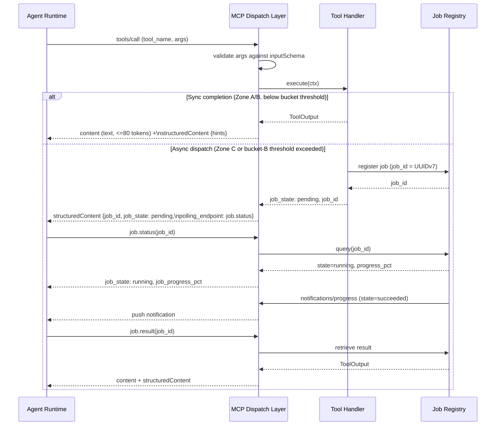

# ADR-0007 — Tool Card Narrative Arc Design

## Context and Problem Statement

Substrate exposes ~30 tools across namespaces (fs, proc, sys, text, archive). Agent runtimes at the 10B-parameter scale have limited context windows and perform best when each tool description encodes not only what the tool does but also when to use it, what comes next, and what to avoid. Generic OpenAPI-style descriptions are insufficient for autonomous multi-step workflows.

The question: what is the canonical format for tool descriptions in substrate, and how are hints structured for both the model-text and the programmatic structuredContent layers?

## Decision Drivers

- 10B models hallucinate less when tool descriptions include workflow context (USE, NEXT, AVOID).
- Token budget: MCP tool-list responses are sent in full on every session; descriptions must be concise.
- Bifurcation: MCP 2025-06-18+ supports both `content` (human/model text) and `structuredContent` (programmatic JSON); both layers must carry complementary information.
- Consistency: uniform grammar across all tools reduces model confusion.
- Namespace clarity: tool name prefix (`fs.`, `proc.`, `sys.`, `text.`, `archive.`) must be parseable without reading the description.

## Considered Options

1. **Narrative Arc template** — USE / DOES / ARGS / RETURNS / NEXT / AVOID, ≤180 tokens per card.
2. **OpenAPI-style description** — plain prose summary + parameter table; no workflow hints.
3. **Minimal description** — one sentence only; rely on parameter names for semantics.

## Decision Outcome

Chosen option: "Narrative Arc template", because it encodes workflow state into every tool description at a fixed token budget, enabling 10B models to chain tools correctly without external orchestration context.

### Template

```
USE: <when the user/agent would invoke this tool>
DOES: <atomic action performed>
ARGS: <name (type, default) — purpose>; <name (type, default) — purpose>; ...
RETURNS: <shape summary ≤20 tokens>
NEXT: <tool_a>, <tool_b>
AVOID: <anti-pattern> → use <correct_tool> instead
```

**Hard constraints:**
- Total card length: ≤180 tokens (GPT-4o tokenizer reference).
- Each NEXT entry: a valid tool name from the same or adjacent namespace.
- AVOID entry: exactly one anti-pattern and exactly one correction.
- ARGS entries: semicolon-separated; each entry fits on one line.

### Example — fs.find

```
USE: locate files by name glob, extension, or mtime within a directory tree
DOES: recursive walk emitting matching paths with stat metadata
ARGS: root (string) — search root; pattern (string, "*") — glob; max_depth (u32, 16) — recursion limit; modified_since (RFC3339, null) — mtime filter; page_cursor (string, null) — pagination token
RETURNS: {matches:[{path,size,mtime}], next_cursor?}
NEXT: fs.read, fs.stat
AVOID: calling fs.read_dir recursively in a loop → use fs.find with max_depth
```

### 10B Model Rationale

At the 10B scale, models benefit from:
1. **Explicit USE context** — reduces false positives (invoking the tool for the wrong task).
2. **NEXT suggestions** — reduces dead-end states where the model loops on the same tool.
3. **AVOID anti-patterns** — prevents the most common misuse pattern per tool, which at 10B scale tends to be high-frequency without this guard.

The 180-token cap is derived from the observation that 10B models achieve near-saturating accuracy on tool selection at that budget; tokens beyond 180 per card contribute marginally to selection quality but linearly to context cost.



### Bifurcation Rules

Model-text layer (`content`, ≤80 tokens subset of the full card):

```
USE: <one sentence>
DOES: <one sentence>
NEXT: <tool_a>, <tool_b>
AVOID: <anti-pattern> → <correct_tool>
```

Programmatic JSON layer (`structuredContent`):

```json
{
  "tool": "fs.find",
  "args_schema": "<ref to outputSchema>",
  "hints": {
    "next_action_suggested": "fs.read",
    "alternative_tool": "fs.stat",
    "confirm_destructive": false,
    "quota_status": null,
    "error_recovery": "retry with narrower pattern"
  }
}
```

### Hint Grammar Keys

Each key in `hints` carries ≤25 tokens of content:

| Key | Type | Purpose |
|-----|------|---------|
| `next_action_suggested` | string (tool name) | Primary recommended follow-up tool |
| `alternative_tool` | string (tool name) | Secondary option when primary is inapplicable |
| `confirm_destructive` | bool | True when tool mutates or deletes; triggers elicitation |
| `quota_status` | string \| null | Current resource usage note (e.g., "inode 82%") |
| `error_recovery` | string | ≤25-token recovery hint for the most common error path |

### Namespace Convention

Tool names follow `<namespace>.<verb>` with no deeper nesting. Permitted namespaces:

- `fs` — filesystem operations
- `proc` — process management
- `sys` — system information
- `text` — text processing
- `archive` — archive and hash operations

Sub-namespacing (e.g., `archive.tar.create`) is permitted for archive sub-formats where disambiguation is necessary. No other namespace nests deeper than two levels.

### Consequences

#### Positive

- Uniform tool cards enable template-driven documentation generation.
- 10B models chain tools correctly in integration tests without explicit orchestration prompts.
- Bifurcation separates concerns: model reads prose, programmatic client reads JSON hints.

#### Negative

- 180-token cap requires discipline; verbose ARGS lists must be truncated or grouped.
- NEXT and AVOID must be maintained when new tools are added (cross-tool dependency).
- Template enforcement is manual until a lint rule is implemented.

## Validation

- All tool description strings pass a token-count check (≤180) in CI via a custom `xtask check-cards` command.
- Integration tests with a local 10B model (Qwen2.5-10B-Instruct) assert ≥90% correct tool selection on a benchmark of 50 multi-step scenarios.
- `structuredContent.hints` keys are validated against the hint grammar schema in `xtask check-cards`.

## Cross-References

- ADR-0008: MCP Feature Usage Map — outputSchema and structuredContent wire format.
- ADR-0010: (reserved) Error Taxonomy and Recovery Hints.

## Amendments

### 2026-05-21 — Extended by ADR-0040 async-job-control-plane

ADR-0040 introduces a push/pull job orchestration model for long-running tool invocations. This amendment extends the `hints` map in `structuredContent` with six new optional keys that communicate job lifecycle state to clients. The 80-token narrative-arc text body (`content`) is unchanged; the new keys appear exclusively in `structuredContent`.

**Additions:**

- `job_id` (string, UUIDv7 base32-encoded) — serves simultaneously as the async job identifier, the MCP `progressToken`, and the `correlation_id` for log correlation. Present only when the tool invocation is dispatched as an async job.
- `job_state` (string, enum) — current lifecycle state of the job. One of: `pending`, `running`, `succeeded`, `failed`, `cancelled`, `timed_out`. Present only when `job_id` is present.
- `job_progress_pct` (integer, 0-100) — best-effort completion percentage. Present only when `job_id` is present and the underlying operation can report progress.
- `polling_endpoint` (string, enum) — identifies the MCP method the client should call to poll job status or retrieve the result. One of: `job.status`, `job.result`. Present only when `job_id` is present.
- `estimated_completion_ms` (integer, non-negative) — best-effort estimate of remaining latency in milliseconds. Present only when `job_id` is present; omitted when the estimate is unavailable.
- `sequence_number` (integer, monotonic) — monotonically increasing counter within a job; used by clients to detect and discard out-of-order progress events. Present only when `job_id` is present.
- Bucket-A and bucket-D tools that complete within the synchronous request window do not emit any of the six new keys. Presence of `job_id` is the sole signal that a response represents an async job dispatch.

### 2026-05-21 — Extended by ADR-0042 capability-adapter-factory

ADR-0042 introduces a capability adapter factory that selects native adapter tiers at startup. This amendment permits two optional diagnostic annotations in `structuredContent` for responses that traverse a tier-selected adapter path.

**Additions:**

- `simd_tier_used` (string, optional) — records the SIMD tier that was active during the operation (e.g., `avx512`, `avx2`, `sse42`, `sse2`, `neon`, `portable`). Emitted only when the operation executed through a SIMD-accelerated adapter path. Diagnostic; clients MUST NOT branch on this value.
- `walker_tier_used` (string, optional) — records the filesystem walker tier selected by ADR-0042 for the operation (e.g., `native-fts`, `ignore-crate`, `portable`). Emitted only when the operation executed through a walker adapter path. Diagnostic; clients MUST NOT branch on this value.
- Neither annotation counts toward the 80-token text budget of the narrative arc and neither is part of the hint grammar validated by `xtask check-cards`. Both annotations are appended to `structuredContent` outside the `hints` map as top-level sibling keys.

### 2026-05-24 — Subprocess tool category introduced via ADR-0052

[ADR-0052](0052-subprocess-execution-architecture.md) adds the `subprocess` namespace with five tools: `subprocess.spawn`, `subprocess.list`, `subprocess.cancel`, `subprocess.result`, and `subprocess.signal`. All subprocess tools follow the same USE/DOES/ARGS/RETURNS/NEXT/AVOID narrative arc template prescribed by this ADR, subject to the token-budget revision of the 2026-05-22 amendment (description string ≤100 chars; SKILL.md carries the full lookup reference).

All `subprocess.*` tool cards MUST set the following keys in the `structuredContent.hints` map:

- `confirm_destructive: true` — subprocess execution is classified as a destructive operation; this key must be present and `true` on every subprocess tool response, including read-side tools (`subprocess.list`, `subprocess.result`, `subprocess.status`) where it serves as a provenance marker indicating the associated job involved subprocess execution.
- `cascade_kill_pgid: true` — signals to the client that cancelling this job will send `SIGKILL` to the entire process group if the child does not exit within the drain window; clients should surface this in confirmation UIs.

The `subprocess.spawn` tool card MUST include the literal phrase "elicitation required" in its AVOID section, making the mandatory human-confirmation step discoverable at the tool-card level before the client constructs the invocation. No other `subprocess.*` tool card is required to carry this phrase; the spawn tool is the sole entry point for child process creation.

Cross-reference: [ADR-0052](0052-subprocess-execution-architecture.md).

### 2026-05-22 -- MCP + skill synergy (token efficiency)

The original USE/DOES/ARGS/RETURNS/NEXT/AVOID narrative-arc template
prescribed by this ADR proved redundant once the companion SKILL.md
contract (per ADR-0046) and `schemars`-derived `inputSchema` (per the
Wave K wiring) were in place. The description string in
`tools/list` is now thin; the JSON Schema carries args; the companion
skill carries the full lookup reference.

Description budget revised:

- Hard cap reduced from 180 tokens to <= 100 chars (approximately 25
  tokens) per tool description.
- Required content: one-line verb + object describing what the tool
  does; non-trivial behavior tag (destructive + elicitation, async
  job promotion, bucket B threshold) when applicable; literal closing
  phrase `See substrate skill.`.
- Forbidden: USE/DOES/ARGS/RETURNS/NEXT/AVOID labels; ARGS field
  enumeration; RETURNS shape; ADR cross-references; implementation
  framing (Zone A/B/C, syscalls, SIMD, crate names).

The `structuredContent` envelope + hints map (per the original ADR
contract, extended by the 2026-05-21 amendment) is unchanged. The
revision affects only the textual `description` string.

Cross-reference: ADR-0046 Amendment 2026-05-22 -- MCP + skill synergy
contract. The two amendments are coordinated: every byte saved here is
supplemented by the skill body which loads inline only on matching turns
(driven by `triggers:` covering the `mcp__substrate__` namespace plus
dotted tool names).

### 2026-05-25 — net.* tools added (ADR-0058)

[ADR-0058](0058-network-socket-introspection.md) adds the `net` namespace with
four read-only network introspection tools. All four follow the ≤100-char
description budget of the 2026-05-22 amendment. None require `confirm_destructive`
or `cascade_kill_pgid` (read-only, no destructive action).

Narrative-arc one-liners for the four new tools:

- `net.tcp_list` — list TCP sockets filtered by state; optional PID resolution.
  `See substrate skill.`
- `net.udp_list` — list UDP sockets. `See substrate skill.`
- `net.tcp_stats` — read global TCP counters (retransmits, segments, connections).
  `See substrate skill.`
- `net.connection_count` — TCP connection-state histogram (LISTEN/ESTABLISHED/
  TIME_WAIT/etc.). `See substrate skill.`

Cross-reference: [ADR-0058](0058-network-socket-introspection.md).

### 2026-05-24 — subprocess.search added as sixth subprocess tool (ADR-0057)

[ADR-0057](0057-subprocess-output-pagination-and-search.md) adds
`subprocess.search` as the sixth tool in the `subprocess` namespace. The tool
provides regex full-text search over the stdout/stderr ring buffer retained by
[ADR-0054](0054-subprocess-stream-multiplex.md).

`subprocess.search` MUST carry the same `structuredContent.hints` entries
required of all `subprocess.*` tools by the 2026-05-24 amendment above:
`confirm_destructive: true` and `cascade_kill_pgid: true`. The description string
follows the ≤100-char budget of the 2026-05-22 amendment.

`subprocess.result` gains an optional `pagination` argument (per ADR-0057); its
description string is updated to note optional line pagination while staying
within the ≤100-char cap.

Cross-reference: [ADR-0057](0057-subprocess-output-pagination-and-search.md).
