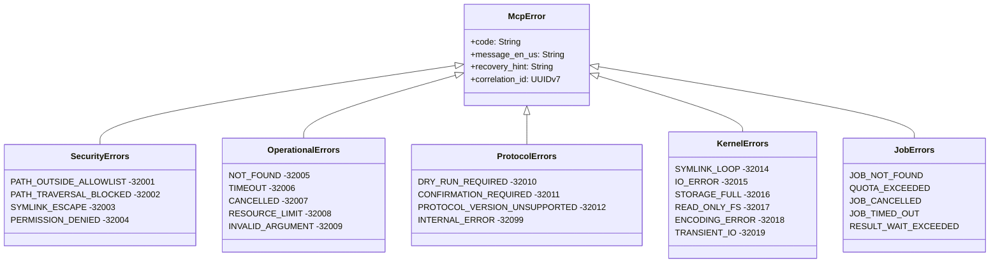

# ADR-0010 — Error Taxonomy

## Context and Problem Statement

Substrate exposes dozens of MCP tools across bounded contexts (fs, proc, sys, text, archive, net). Each context has its own failure modes — path traversal attempts, resource exhaustion, cancelled operations, protocol mismatches. Without a unified error taxonomy, consumers receive inconsistent codes and messages that cannot be reliably parsed or acted upon by LLM agents or human operators.

The MCP protocol specifies a JSON-RPC error model with a custom code range. Substrate must map its rich internal errors to that model without losing diagnostic fidelity.

## Decision Drivers

- LLM agents must machine-read error codes and apply recovery hints without ambiguity.
- Security-sensitive errors (path traversal, symlink escape, permission denial) must never leak filesystem internals in the `message` field.
- Correlation IDs must link MCP error responses to server-side structured logs.
- Each Rust crate must own its error variants without coupling to adjacent crates.
- The JSON-RPC `-32000` custom range must be mapped predictably.

## Considered Options

1. Single global `SubstrateError` enum in `substrate-core` — all crates depend on it.
2. `thiserror` enum per crate, reduced to a canonical `McpError` at the adapter boundary.
3. `anyhow` throughout, stringly-typed at the boundary.

## Decision Outcome

Chosen option: "thiserror enum per crate, reduced to McpError at the adapter boundary", because it preserves type-safety and rich context inside each crate while presenting a stable, versioned surface to JSON-RPC consumers.



### Stable Error Codes

Each code is a `SCREAMING_SNAKE_CASE` string constant exported from `substrate-core::error`:

| Code | JSON-RPC code | Meaning |
|---|---|---|
| `SUBSTRATE_PATH_OUTSIDE_ALLOWLIST` | -32001 | Requested path not within any configured allowlist root |
| `SUBSTRATE_PATH_TRAVERSAL_BLOCKED` | -32002 | `..` or encoded traversal sequence detected |
| `SUBSTRATE_SYMLINK_ESCAPE` | -32003 | Symlink resolution exits the allowlist boundary |
| `SUBSTRATE_PERMISSION_DENIED` | -32004 | OS-level EPERM / EACCES |
| `SUBSTRATE_NOT_FOUND` | -32005 | Resource (file, process, interface) does not exist |
| `SUBSTRATE_TIMEOUT` | -32006 | Operation exceeded configured deadline |
| `SUBSTRATE_CANCELLED` | -32007 | Caller cancelled the request |
| `SUBSTRATE_RESOURCE_LIMIT` | -32008 | Memory, fd, or process-count ceiling reached |
| `SUBSTRATE_INVALID_ARGUMENT` | -32009 | Argument fails schema or semantic validation |
| `SUBSTRATE_DRY_RUN_REQUIRED` | -32010 | Mutating tool called without `dry_run: true` on first invocation |
| `SUBSTRATE_CONFIRMATION_REQUIRED` | -32011 | Destructive action awaits explicit `confirmed: true` |
| `SUBSTRATE_PROTOCOL_VERSION_UNSUPPORTED` | -32012 | Client protocol version outside supported range |
| `SUBSTRATE_INTERNAL_ERROR` | -32099 | Unexpected server fault; see correlation ID in logs |

### Error Response Shape

Every MCP error response carries the following `data` object alongside the JSON-RPC `code` and `message`:

```json
{
  "code": "SUBSTRATE_PATH_TRAVERSAL_BLOCKED",
  "message_en_us": "Path traversal attempt blocked.",
  "recovery_hint": "Use an absolute path within the configured allowlist roots.",
  "correlation_id": "01HZ7Q3RNJX2AKFP0000000001"
}
```

- `code`: stable string constant, safe for programmatic branching.
- `message_en_us`: human-readable, never includes raw filesystem paths for security codes.
- `recovery_hint`: actionable guidance for the caller.
- `correlation_id`: UUIDv7, correlated to the server-side `tracing` span.

### Adapter boundary contract

The `substrate-mcp-adapter` crate provides `impl From<SubstrateCrateError> for McpError` for every domain crate. No domain crate may return `McpError` directly — translation always happens at the adapter layer.

### Kernel-Induced Codes

Six additional codes extend the taxonomy to cover OS-level kernel conditions. See [ADR-0034](0034-kernel-induced-error-codes.md) for the full errno mapping table, retry policy, and CUE schema constraints.

| Code | JSON-RPC code | Triggering condition |
|---|---|---|
| `SUBSTRATE_SYMLINK_LOOP` | -32014 | `ELOOP` — symlink chain exceeds OS resolution limit |
| `SUBSTRATE_IO_ERROR` | -32015 | `EIO` — hardware I/O failure or bad sector |
| `SUBSTRATE_STORAGE_FULL` | -32016 | `ENOSPC` / `EDQUOT` — disk full or quota exceeded |
| `SUBSTRATE_READ_ONLY_FS` | -32017 | `EROFS` — filesystem is mounted read-only |
| `SUBSTRATE_ENCODING_ERROR` | -32018 | Non-UTF-8 bytes in path or string |
| `SUBSTRATE_TRANSIENT_IO` | -32019 | `EBUSY` / `ESTALE` / `EAGAIN` — transient resource unavailability |

### Pre-Session Startup Errors

When substrate fails before the MCP `initialize` handshake, it cannot use the JSON-RPC error model. Instead it emits a single structured JSON line to stderr using the startup error envelope defined in [ADR-0036](0036-startup-error-contract.md). The envelope carries a distinct `$schema` discriminant (`"substrate-startup-error/v1"`), a startup-specific `code` enum, a `recovery_hint`, a `correlation_id`, and `details`. Exit codes follow `sysexits.h` conventions.

### Recovery Hint Length Cap

Every `recovery_hint` field in both runtime error responses and startup envelopes MUST be ≤ 150 characters. The CUE schema in `docs/arch/schemas/error_catalog.cue` enforces this constraint via `len(recovery_hint) <= 150`. Lint (`spec validate --lane full`) MUST verify the cap across all 57 codes in the catalog (the original 13 + 6 kernel-induced documented here, plus the job, capability, startup, subprocess, and launch codes added by later amendments).

### JSON-RPC Standard Code Pass-Through

Substrate NEVER overrides or reuses the standard JSON-RPC reserved codes:

| Code | Meaning |
|---|---|
| -32700 | Parse error |
| -32600 | Invalid request |
| -32601 | Method not found |
| -32602 | Invalid params |
| -32603 | Internal error |

All substrate-specific codes occupy the server-error range `-32001` to `-32099`, which JSON-RPC reserves for application use. Third-party MCP middleware MUST NOT collide with this range when used alongside substrate.

### Field-Level Specificity

`SUBSTRATE_INVALID_ARGUMENT` responses MUST include an `offending_field` key in the error `data` object naming which input argument failed validation:

```json
{
  "code": "SUBSTRATE_INVALID_ARGUMENT",
  "message_en_us": "Argument 'path' failed validation.",
  "recovery_hint": "Provide an absolute path within an allowlist root.",
  "offending_field": "path",
  "correlation_id": "01HZ7Q3RNJX2AKFP0000000002"
}
```

This refinement improves actionability for small LLMs that cannot infer the offending field from the message alone.

### Context-Sensitive Hints

For `SUBSTRATE_NOT_FOUND` and `SUBSTRATE_PERMISSION_DENIED` surfaced by the proc namespace (kill, signal, wait), the generic `recovery_hint` is insufficient. In these cases the `structuredContent.hints.error_recovery` field MUST override with a proc-specific hint:

- `SUBSTRATE_NOT_FOUND` (ESRCH): `"process no longer exists; verify PID is still alive before retrying"`.
- `SUBSTRATE_PERMISSION_DENIED` (EPERM on kill): `"process exists but the server lacks permission to signal it; verify process ownership and capabilities"`.

The top-level `recovery_hint` in the JSON-RPC `data` object retains its generic value for backward compatibility; the override lives in `structuredContent.hints.error_recovery`.

### Consequences

#### Positive

- Each crate evolves its error variants independently.
- Stable codes allow agents to branch on failure without parsing free-text.
- Security codes never leak internal paths.
- Correlation IDs enable log correlation for on-call investigation.
- Kernel-induced codes surface actionable OS conditions rather than masking them as internal errors.
- The 150-character hint cap keeps recovery_hint readable in constrained UIs and agent context windows.

#### Negative

- Adapter must be updated whenever a new domain crate error needs a distinct code.
- Code range `-32001..=-32099` must be reserved; third-party MCP middleware must not collide.

## Validation

- Unit tests assert that every `thiserror` variant maps to a known stable code.
- Integration tests assert the `data` shape conforms to the CUE schema in `docs/arch/schemas/error_catalog.cue`.
- `cargo-deny` ensures no dependency introduces a conflicting JSON-RPC error range.
- `spec validate --lane full` validates CUE schema coverage for all 57 codes in the catalog (13 original + 6 kernel-induced documented here, plus the job, capability, startup, subprocess, and launch codes added by later amendments).
- CUE schema asserts `len(recovery_hint) <= 150` for every code.
- Integration tests for `SUBSTRATE_INVALID_ARGUMENT` assert `offending_field` is present in `data`.
- Integration tests for proc-namespace errors assert `structuredContent.hints.error_recovery` carries the proc-specific hint.

## Cross-References

- [ADR-0004](0004-security-model.md): Security model (allowlist, traversal policy)
- ADR-0012: Observability (correlation ID generation, structured logging)
- ADR-0018: Tool schema validation (argument error path)
- [ADR-0033](0033-transactional-write-pattern.md): Storage-full preflight (proactive ENOSPC avoidance)
- [ADR-0034](0034-kernel-induced-error-codes.md): Kernel-induced error codes (errno mapping, retry policy, 6 new codes)
- [ADR-0035](0035-path-safety-hardening.md): Path safety (SYMLINK_ESCAPE policy)
- [ADR-0036](0036-startup-error-contract.md): Startup error contract (pre-MCP-session structured stderr envelope)

## Amendments

### 2026-05-21 — Extended by ADR-0040 async-job-control-plane

The async job control plane introduces five new runtime error codes covering job lifecycle failures. These codes occupy the existing `-32001` to `-32099` range (the first available values after the codes defined above) and follow the same `recovery_hint` length cap of 150 characters enforced by the CUE schema.

**Additions:**

- `SUBSTRATE_JOB_NOT_FOUND` — returned by `job.status`, `job.result`, and `job.cancel` when the requested `job_id` does not exist, either because it expired beyond the configured TTL or was never created. recovery_hint: `"verify job_id; expired jobs cannot be recovered"`.
- `SUBSTRATE_QUOTA_EXCEEDED` — returned on job submission when a per-client, per-tool, or global concurrent-job quota is exceeded. recovery_hint: `"wait for active jobs to complete or cancel an existing job"`.
- `SUBSTRATE_JOB_CANCELLED` — terminal state code; surfaced via `job.result` when the job reached the cancelled terminal state, whether by client `notifications/cancelled` or by graceful drain during shutdown. recovery_hint: `"retry the operation if cancellation was unintended"`.
- `SUBSTRATE_JOB_TIMED_OUT` — terminal state code; surfaced via `job.result` when the job exceeded the `jobs.timeout.<tool>_secs` configuration value for the originating tool. recovery_hint: `"increase timeout or split the work into smaller units"`.
- `SUBSTRATE_RESULT_WAIT_EXCEEDED` — returned by `job.result` when the optional `wait_ms` parameter in the request exceeds the server-side `jobs.result_max_wait_ms` configuration limit. recovery_hint: `"retry with a smaller wait_ms"`.

### 2026-05-21 — Extended by ADR-0042 capability-adapter-factory

One new startup error code is introduced for invalid capability tier overrides in runtime configuration.

**Additions:**

- `SUBSTRATE_TIER_OVERRIDE_INVALID` — startup error code emitted when a runtime config `capabilities.override.<port>` entry specifies a tier name that does not exist for that capability port. The composition root aborts startup non-zero with this code before accepting any MCP requests. recovery_hint: `"check capabilities.override in config; valid tiers are listed in docs/arch/adr/0042"`.

### 2026-05-21 — Extended by ADR-0035 amendment (path-jail degraded tier)

One new startup error code is introduced to cover the case where PathJail cannot reach the kernel-enforced tier and the operator has configured the server to refuse degraded operation.

**Additions:**

- `SUBSTRATE_JAIL_DEGRADED_REFUSED` — startup error code emitted when PathJail tier 1 (kernel-enforced) is unavailable for the detected platform and `security.refuse_degraded_jail = true` (default). The composition root exits with this code in the startup banner before accepting any MCP requests. recovery_hint: `"upgrade kernel to Linux >= 5.6 or macOS >= 12, or set security.refuse_degraded_jail = false"`.

### 2026-05-24 — Subprocess error codes (ADR-0052)

Nine new runtime error codes are introduced for the subprocess BC. See [ADR-0052](0052-subprocess-execution-architecture.md), [ADR-0053](0053-process-lifecycle-cascade-contract.md), [ADR-0054](0054-subprocess-stream-multiplex.md), and [ADR-0055](0055-orphan-reaper-on-startup.md) for the corresponding design decisions. Codes occupy `-32034` through `-32042` in the substrate-reserved JSON-RPC range.

**Additions:**

- `SUBSTRATE_SUBPROCESS_BINARY_NOT_ALLOWED` (-32034) — binary path rejected because it is absent from `security.subprocess_binary_allowlist`. Category: security_violation. Cross-ref: ADR-0052 Layer 1 (binary allowlist).
- `SUBSTRATE_SUBPROCESS_ENV_BANNED` (-32035) — hard-banned environment variable (`LD_PRELOAD`, `DYLD_INSERT_LIBRARIES`, `LD_LIBRARY_PATH`, `DYLD_LIBRARY_PATH`) present in `env_override` or `env_allowlist`. Category: security_violation. Cross-ref: ADR-0052 Layer 2 (env sanitisation).
- `SUBSTRATE_SUBPROCESS_CWD_OUTSIDE_ALLOWLIST` (-32036) — subprocess `cwd` is not under any entry in `security.allowed_paths`. Category: security_violation. Cross-ref: ADR-0052 Layer 3 (path jail).
- `SUBSTRATE_SUBPROCESS_QUOTA_EXCEEDED` (-32037) — per-client active subprocess quota exhausted; caller must wait for a child to reach a terminal state or invoke `subprocess.cancel`. Category: resource_limit. Cross-ref: ADR-0052 quota model.
- `SUBSTRATE_SUBPROCESS_SPAWN_FAILED` (-32038) — `tokio::process::Command::spawn` returned an error after all allowlist checks passed; typically an OS-level errno (ENOENT, EACCES, ENOMEM). Category: io_error. Cross-ref: ADR-0052 spawn path, ADR-0053 cascade contract.
- `SUBSTRATE_SUBPROCESS_TIMEOUT` (-32039) — subprocess ran past `timeout_secs`; child was SIGTERM-then-SIGKILLed per the cascade contract. Category: timeout. Cross-ref: ADR-0053 lifecycle, ADR-0054 stream teardown.
- `SUBSTRATE_SUBPROCESS_KILLED` (-32040) — subprocess received SIGKILL after the drain window expired (either from explicit `subprocess.cancel force=true`, from a timeout cascade, or from substrate shutdown drain). Category: cancellation. Cross-ref: ADR-0053 cascade, ADR-0055 orphan reaper.
- `SUBSTRATE_ELICITATION_REQUIRED` (-32041) — tool requires operator confirmation via the MCP elicitation flow before execution proceeds; re-invoke with `elicitation_confirmed: true`. Category: user_consent. Cross-ref: ADR-0052 elicitation mandate, ADR-0004 Layer 4.
- `SUBSTRATE_STREAM_CHUNK_DROPPED` (-32042) — a stream chunk for a subprocess job was dropped due to mpsc backpressure; the client was not draining the notifications/progress channel fast enough. Category: backpressure. Cross-ref: ADR-0054 bounded mpsc channel model.

### 2026-06-30 — Launch BC error codes (ADR-0064 / ADR-0065 / ADR-0068)

Ten new runtime error codes are introduced for the launch BC, occupying `-32044` through `-32053` in the substrate-reserved JSON-RPC range. See [ADR-0064](0064-launch-profile-trust-model.md) (trust model), [ADR-0065](0065-launch-dependency-graph-and-reconciler-reload.md) (dependency graph), and [ADR-0068](0068-launch-detached-supervisor-and-orphan-governance.md) (detached supervisor) for the corresponding decisions. All carry a `recovery_hint` ≤ 150 characters and are registered in `error_catalog.cue`.

**Additions:**

- `SUBSTRATE_LAUNCH_PROFILE_NOT_TRUSTED` (-32044) — Category: security. Cross-ref: ADR-0064 trust gate.
- `SUBSTRATE_LAUNCH_CONFIG_SYMLINK_REJECTED` (-32045) — Category: security. Cross-ref: ADR-0064 step 1 (O_NOFOLLOW).
- `SUBSTRATE_LAUNCH_CONFIG_UNTRUSTED_DIR` (-32046) — Category: security. Cross-ref: ADR-0064 step 2 (world-writable parent).
- `SUBSTRATE_LAUNCH_TRUST_STORE_INSECURE` (-32047) — Category: security. Cross-ref: ADR-0064 trust store permissions.
- `SUBSTRATE_LAUNCH_CYCLE_DETECTED` (-32048) — Category: input. Cross-ref: ADR-0065 DAG validation.
- `SUBSTRATE_LAUNCH_DEPENDENCY_FAILED` (-32049) — Category: lifecycle. Cross-ref: ADR-0065 readiness gate.
- `SUBSTRATE_LAUNCH_ORPHAN_REAPED` (-32050) — Category: lifecycle. Cross-ref: ADR-0068 reaper-on-boot.
- `SUBSTRATE_LAUNCH_ORPHAN_ADOPTED` (-32051) — Category: lifecycle. Cross-ref: ADR-0068 adopt path.
- `SUBSTRATE_LAUNCH_STACK_TTL_EXPIRED` (-32052) — Category: lifecycle. Cross-ref: ADR-0068 orphan TTL.
- `SUBSTRATE_LAUNCH_SUPERVISOR_UNREACHABLE` (-32053) — Category: lifecycle. Cross-ref: ADR-0068 detached supervisor liveness.

### 2026-06-30 — Launch supervisor hardening codes (ADR-0068)

Three additional runtime error codes harden the detached-supervisor IPC and reaper ([ADR-0068](0068-launch-detached-supervisor-and-orphan-governance.md)), occupying `-32054` through `-32056`. All carry a `recovery_hint` ≤ 150 characters and are registered in `error_catalog.cue`.

**Additions:**

- `SUBSTRATE_LAUNCH_REGISTRY_INSECURE` (-32054) — Category: security. Cross-ref: ADR-0068 registry/IPC permission boundary.
- `SUBSTRATE_LAUNCH_FRAME_TOO_LARGE` (-32055) — Category: input. Cross-ref: ADR-0068 cooperative PIPE_BUF framing.
- `SUBSTRATE_LAUNCH_CHILD_PID_RECYCLED` (-32056) — Category: lifecycle. Cross-ref: ADR-0068 reaper start-time pin.

### 2026-06-30 — Launch spawn-failure code (ADR-0063 MVP)

The `substrate-launch` MVP composes each Service through the injected `SubprocessPort`. A spawn failure raised by that port during `launch.up` surfaces as one launch-scoped code, bringing the catalog to **57 codes**.

**Addition:**

- `SUBSTRATE_LAUNCH_SPAWN_FAILED` (-32057) — Category: io_error. Cross-ref: ADR-0063 launch orchestration; mirrors `SUBSTRATE_SUBPROCESS_SPAWN_FAILED` at the launch layer.
