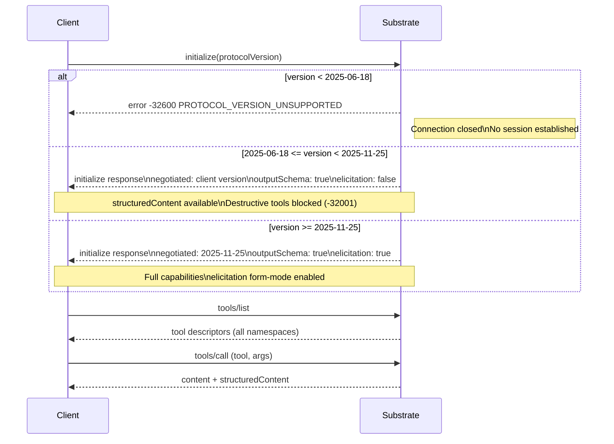

# ADR-0013 — MCP Protocol Version Pinning

## Context and Problem Statement

The MCP specification is versioned by date string (e.g., `2025-03-26`, `2025-06-18`, `2025-11-25`). Each version introduces new capabilities (outputSchema, elicitation, structured content) that substrate depends on. Substrate must declare a minimum acceptable version and a preferred version, and must behave correctly across the negotiation range.

The question: what are the minimum and preferred MCP protocol versions for substrate, how does version negotiation work, and what happens when a client presents an unsupported version?

## Decision Drivers

- Correctness: outputSchema and structuredContent (required by ADR-0007, ADR-0008) were introduced in 2025-06-18. Clients older than this cannot receive typed results.
- Safety: elicitation form-mode (required by ADR-0008 for destructive ops) was introduced in 2025-11-25. Clients that lack it cannot confirm destructive operations.
- Compatibility: future clients on newer spec versions must continue to work with substrate.
- Auditability: version policy must be explicit, not implicit.

## Considered Options

1. **Hard minimum + preferred version with capability negotiation** — reject clients below minimum; degrade gracefully for clients between minimum and preferred.
2. **Single pinned version** — reject all clients not on the exact version.
3. **No minimum** — accept any version, skip features silently when client lacks them.

## Decision Outcome

Chosen option: "Hard minimum + preferred version with capability negotiation", because it maximizes compatibility across the supported range while enforcing the baseline required for substrate's core features.

### Version Policy

| Parameter | Value |
|-----------|-------|
| Minimum version | `2025-06-18` |
| Preferred version | `2025-11-25` |
| Rejection behavior | `InitializeError` with code `-32600` |

### Capability Negotiation Flow



The negotiated version is the **minimum** of the client-requested version and `2025-11-25` (preferred). Substrate never claims a version higher than its preferred, even if the client offers a newer version.

### InitializeError on Rejection

When the client presents a version older than `2025-06-18`, substrate closes the connection with:

```json
{
  "jsonrpc": "2.0",
  "id": 1,
  "error": {
    "code": -32600,
    "message": "protocol version below minimum",
    "data": {
      "client_version": "2025-03-26",
      "minimum_version": "2025-06-18",
      "preferred_version": "2025-11-25"
    }
  }
}
```

No tool calls are accepted after this error. The connection is closed.

### Capability Degradation

When the negotiated version is `2025-06-18` (elicitation absent):

- Destructive tools (`fs.remove`, `proc.signal`, etc.) return error `-32001` (elicitation required but unsupported) instead of executing.
- `structuredContent` is still emitted (supported since 2025-06-18).
- `outputSchema` is still advertised.
- Progress notifications and cancellation remain fully functional (both predated 2025-06-18).

### ServerInfo Declaration

Substrate declares its identity in the `initialize` response:

```json
{
  "serverInfo": {
    "name": "substrate",
    "version": "0.1.0"
  },
  "protocolVersion": "<negotiated>",
  "capabilities": {
    "tools": {
      "listChanged": false
    },
    "resources": {
      "subscribe": false,
      "listChanged": false
    },
    "prompts": {
      "listChanged": false
    },
    "logging": {}
  }
}
```

`listChanged: false` for all capability categories because substrate's tool, resource, and prompt sets are static at startup.

### Consequences

#### Positive

- Clients on 2025-06-18 get outputSchema and structuredContent; the majority of current agent runtimes qualify.
- Clients on 2025-11-25 get full elicitation support; destructive tools are fully available.
- Future clients on newer versions work without substrate changes (substrate caps negotiation at its preferred version).

#### Negative

- Clients on versions older than 2025-06-18 (e.g., 2025-03-26) are rejected outright. Those runtimes must be upgraded.
- Elicitation unavailability on 2025-06-18 clients means destructive operations are blocked, reducing utility.

## Validation

- Integration test: client presenting `2025-03-26` receives `InitializeError` with code `-32600`.
- Integration test: client presenting `2025-06-18` successfully lists tools but receives `-32001` on `fs.remove`.
- Integration test: client presenting `2025-11-25` successfully executes `fs.remove` after elicitation confirmation.
- Integration test: client presenting a hypothetical future version `2026-03-01` negotiates down to `2025-11-25`.

### Capability Intersection

Substrate advertises its full capability set in the `initialize` response (tools, resources, prompts, logging, elicitation). The client advertises its own capabilities in the `initialize` request. At `initialize` time, substrate computes the **intersection** of both sets and stores it in the session state.

Subsequent notifications and messages are emitted **only** for capabilities present in the intersection. Per-capability gating rules are documented in [ADR-0008](0008-mcp-features-map.md) (progress gating, logging gating, elicitation fallback).

#### Mid-session re-initialize

If the client sends a second `initialize` request after one has already been accepted and acknowledged, substrate responds with:

```json
{
  "code": -32600,
  "message": "session already initialized"
}
```

No re-negotiation occurs. The existing session state is preserved.

### Negotiated Version Assertion

The `initialize` response MUST include a `protocolVersion` field set to `min(client_offered_version, "2025-11-25")`.

| Client-offered version | Negotiated response version | Behavior |
|---|---|---|
| Older than `2025-06-18` | — | Rejected with `SUBSTRATE_PROTOCOL_VERSION_UNSUPPORTED`; `recovery_hint` lists minimum supported version `2025-06-18` |
| `2025-06-18` to `2025-11-24` | Client-offered version | Accepted; elicitation absent (see Capability Degradation) |
| `2025-11-25` | `2025-11-25` | Accepted; full capabilities |
| Newer than `2025-11-25` | `2025-11-25` | Accepted; substrate downgrades to its preferred version |

Clients offering a version newer than `2025-11-25` are accepted. Substrate caps the negotiated version at its preferred version and does not claim features from unknown future spec revisions.

Clients offering a version older than `2025-06-18` are rejected before any session state is established. The error code is `SUBSTRATE_PROTOCOL_VERSION_UNSUPPORTED` (mapped to JSON-RPC `-32600`), and the `data` field includes `minimum_version: "2025-06-18"`.

## Cross-References

- ADR-0005: STDIO Transport — the transport channel over which the initialize handshake occurs.
- ADR-0008: MCP Feature Usage Map — which features require which version; per-capability gating at runtime.
- ADR-0027: MCP Protocol Migration Path — policy for bumping the minimum version in future substrate releases.

## Amendments

### 2026-05-21 — Extended by ADR-0040 async-job-control-plane and ADR-0043 simd-runtime-dispatch

ADR-0040 and ADR-0043 introduce new server-side capabilities (job control-plane and SIMD/walker tier dispatch) that clients may optionally discover at handshake time. This amendment extends the `initialize` response with experimental capability flags that advertise these surfaces. The flags are diagnostic or opt-in; they do not participate in protocol version negotiation and do not alter the capability intersection logic established by this ADR.

**Additions:**

- `capabilities.experimental.substrate.jobs` (boolean) — set to `true` when the async job control-plane defined in ADR-0040 is wired into the server. When `true`, clients MAY issue `job.status`, `job.result`, `job.cancel`, and `job.list` requests. When `false` or absent, those methods are unavailable and return `-32601` (method not found).
- `capabilities.experimental.substrate.simd_tier` (string) — snapshot of the `SimdTier` value selected at startup by ADR-0042 CPUID probing. One of: `avx512`, `avx2`, `sse42`, `sse2`, `neon`, `portable`. Diagnostic only; clients SHOULD NOT make behavioral decisions based on this value but MAY log it for observability.
- `capabilities.experimental.substrate.platform_tiers` (object) — map of `port_name -> tier_string` summarizing the adapter tier selected for each native port at startup per ADR-0042. Diagnostic only; clients MUST NOT branch on individual entries.
- Client backward compatibility: clients negotiating MCP version `2025-06-18` (which predates MCP `progressToken` support added in `2025-11-25`) still receive `job_id` in the `hints` map of `structuredContent`. Those clients MUST use the Pull-only polling path (`job.status` / `job.result`) to retrieve job results; Push notifications via `progressToken` are not sent to them. Clients negotiating `2025-11-25` or later receive both Push notifications and the Pull path.
- The experimental flags are included in the `initialize` response regardless of negotiated protocol version (minimum `2025-06-18`). They are wrapped under `capabilities.experimental.substrate` to avoid collision with future official MCP capability fields.
