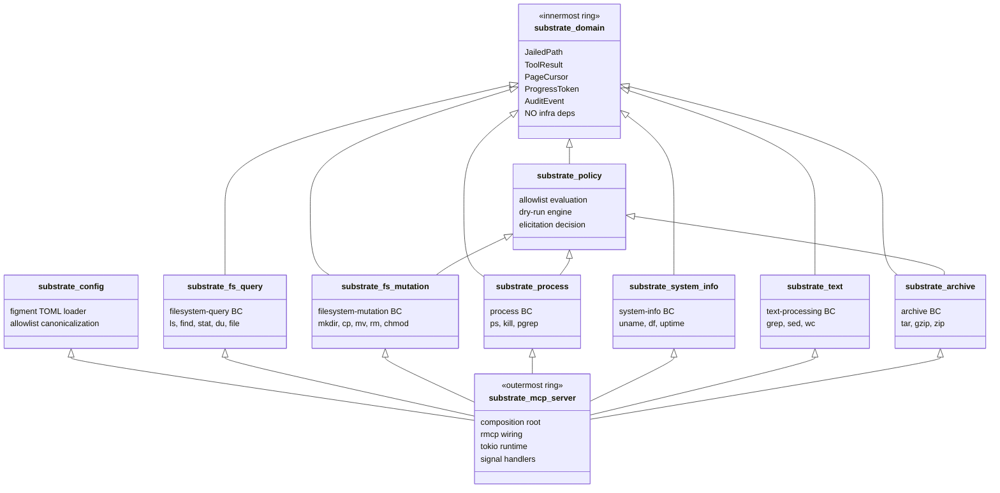

# ADR-0022 — Project Layout (Cargo Workspace)

## Context and Problem Statement

Substrate is implemented as a Rust workspace. Without a canonical workspace
layout, contributors make inconsistent decisions about where to place domain
types, policy enforcement, configuration parsing, and MCP adapter wiring.
The layout must encode hexagonal architecture constraints so that the compiler
enforces the dependency rule rather than relying on convention alone.

## Decision Drivers

- Hexagonal architecture: domain crates must not import infrastructure crates.
- Six bounded contexts (ADR-0002) each need an independent crate with its own
  port and adapter.
- A single composition root assembles all adapters and starts the MCP server.
- Tests must be co-located with the crate they exercise.
- The layout must be legible to a new contributor without additional tooling.

## Considered Options

- Option A: Single crate with modules for each bounded context.
- Option B: Cargo workspace with one crate per bounded context plus shared
  support crates.
- Option C: Separate Git repositories per bounded context.

## Decision Outcome

Chosen option: "Option B — Cargo workspace with one crate per bounded context
plus shared support crates", because it gives the compiler visibility into
inter-crate dependency rules, enables independent `cargo check` and `cargo test`
per context, and keeps all code in one repository for atomic commits.

### Workspace Layout

```
mcp-os/
  Cargo.toml                  # workspace manifest
  crates/
    substrate-domain/         # shared kernel: JailedPath, ToolResult,
                              #   PageCursor, ProgressToken, AuditEvent
                              # ZERO infrastructure dependencies
    substrate-policy/         # allowlist evaluation, dry-run engine,
                              #   elicitation decision logic
    substrate-config/         # TOML config parsing and validation
    substrate-fs-query/       # filesystem-query bounded context
    substrate-fs-mutation/    # filesystem-mutation bounded context
    substrate-fs-index/       # optional filesystem index adapter (opt-in feature)
    substrate-fs-index-macos-sys/ # macOS platform shim for FSEvents / kqueue index backend
    substrate-process/        # process bounded context
    substrate-system-info/    # system-info bounded context
    substrate-text/           # text-processing bounded context
    substrate-archive/        # archive bounded context
    substrate-jobs/           # async job control-plane adapter (ADR-0040)
    substrate-signal-sys/     # platform shim: SIGPIPE disposition + signal safety (ADR-0032)
    substrate-mcp-server/     # binary: composition root, MCP transport
  docs/
    arch/                     # spec root (ADRs, schemas, decisions)
```



### Hexagonal Layering Rule

`substrate-domain` is the innermost ring. It declares ports as Rust traits and
value objects. It has zero `[dependencies]` entries that reference any other
crate in this workspace or any crate that performs I/O, system calls, or
serialization beyond `serde` derive macros.

Each bounded context crate (`substrate-fs-query`, etc.) depends on
`substrate-domain` and `substrate-policy`. It implements the domain ports as
adapters using the `nix` crate or Rust standard library. It does not depend on
`substrate-mcp-server` or on other bounded context crates.

`substrate-mcp-server` is the outermost ring. It depends on all bounded context
crates and on `rmcp`. It is the only crate that wires adapters to ports and
starts the tokio runtime.

The rule is enforced by Cargo: because `substrate-domain` does not list any
bounded context crate as a dependency, a domain crate that accidentally imports
an adapter will fail to compile.

### Test Layout

Unit tests: `src/` inline `#[cfg(test)]` modules in each crate.
Integration tests: `crates/<crate>/tests/` directory, one file per scenario.
End-to-end tests: `crates/substrate-mcp-server/tests/` exercising the full
MCP JSON-RPC surface against a spawned server process.

### Consequences

#### Positive

- Compiler enforces the dependency rule with zero additional tooling.
- Each context can be checked, tested, and published independently.
- Composition root is the single place where all wiring decisions are visible.

#### Negative

- More `Cargo.toml` files to maintain.
- Cross-crate refactors touch multiple manifests.

## Validation

- `cargo check --workspace` must pass with zero warnings on the clean tree.
- `cargo deny check` must confirm `substrate-domain` has no workspace-internal
  dependencies beyond itself.
- CI must run `cargo test -p substrate-domain` in isolation to verify the zero
  infra rule holds.

## Amendment — 2026-05-22 — Additional domain dependencies (accepted)

In practice the domain crate carries two additional dependencies beyond the
original allow-list:

- `time` (0.3) — value-object timestamp arithmetic for `IdempotencyKey` TTL
  bounds and audit-event `seq` ordering. `time` is a pure-data crate (no I/O)
  and does not pull in any runtime; consistent with hexagonal layering.
- `serde_json` — error-envelope serialization for the `recovery_hint` JSON
  path expressions and `structuredContent` value-object marshalling.
  `serde_json` is used only inside value-object impls, never inside port
  traits.

Both are accepted on hexagonal grounds (no I/O, no runtime, no syscalls) and
the Rego policy `hexagonal_layering.rego` is updated alongside this amendment.

## Links

- Related: [ADR-0002](0002-bounded-contexts.md)
- Related: [ADR-0028](0028-platform-feature-gates.md)
- Related: [ADR-0040](0040-async-job-control-plane.md) — introduced `substrate-jobs`
- Related: [ADR-0041](0041-filesystem-index-native-tiers.md) — introduced `substrate-fs-index`
- Related: [ADR-0032](0032-signal-safety.md) — introduced `substrate-signal-sys`
