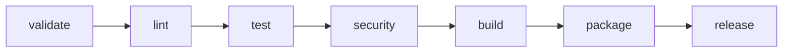

# ADR-0023 — CI/CD Pipeline (GitLab Primary)

> **DEFERRED 2026-05-22.** No CI/CD pipeline is provisioned at this stage of the
> project. The decisions captured below remain the canonical reference for when
> a pipeline is introduced. All `.gitlab-ci.yml` and `ci/` artifacts previously
> generated under this ADR have been removed from the repository.
>
> See the Amendments section at the end of this file for the deferral note.

## Context and Problem Statement

Substrate requires a CI/CD pipeline that enforces all quality gates (format, lint, test, coverage, security, spec validation) before any artifact reaches consumers. The pipeline must support cross-platform builds (macOS and Linux), produce signed release artifacts with SBOM, and synchronize releases to a GitHub mirror for Homebrew formula distribution.

The pipeline must be fast enough to give contributors sub-10-minute feedback on merge requests.

## Decision Drivers

- GitLab CI is the primary VCS and CI platform (`com.archanjo` group).
- DAG pipelines (`needs:`) allow parallel job execution to minimize wall-clock time.
- spec-framework integration requires `spec validate` at defined lanes (fast/default/full).
- Security supply-chain requirements demand SBOM generation and Sigstore signing per release.
- `cargo-deny` and `cargo-audit` must block on any RUSTSEC advisory or license violation.
- GitHub mirror must receive tagged releases for Homebrew compatibility.

## Considered Options

1. GitLab CI only, linear `stages:` — simple but slow (no parallelism).
2. GitLab CI with DAG (`needs:`) — parallel jobs, sub-10-minute MR feedback.
3. GitHub Actions primary, GitLab mirror — inverts VCS primacy; contradicts ADR-0024.
4. Shared GitLab + GitHub Actions — dual maintenance burden without benefit.

## Decision Outcome

Chosen option: "GitLab CI with DAG", because it keeps CI co-located with the primary VCS, enables the necessary parallelism, and natively integrates with the spec-framework CI include.

### Pipeline Stages and Jobs

#### validate

Runs on every MR push and every push to `main`.

| Job | Trigger | Command |
|---|---|---|
| `spec:fast` | MR | `spec validate --lane fast` |
| `spec:full` | `main` only | `spec validate --lane full` |

#### lint

Depends on: `validate`.

| Job | Command |
|---|---|
| `fmt` | `cargo fmt --check` |
| `clippy` | `cargo clippy -- -D warnings` |
| `no-println` | `grep -rn 'println!' src/ && exit 1 || exit 0` |

#### test

Depends on: `lint`.

| Job | Command |
|---|---|
| `unit` | `cargo test --workspace` |
| `cucumber` | `cargo test --test cucumber` |
| `coverage` | `cargo tarpaulin --out Xml --fail-under 80` |

Coverage artifact uploaded; gate is 80% line coverage. MR decoration via GitLab coverage regex.

#### security

Depends on: `lint` (parallel with `test`).

| Job | Command |
|---|---|
| `deny` | `cargo deny check` |
| `audit` | `cargo audit` |
| `rego` | `conftest test --policy docs/arch/rego/ --data docs/arch/` |

#### build

Depends on: `test`, `security`.

Matrix: `[macos-latest, ubuntu-latest]`.

| Job | Command |
|---|---|
| `build:$PLATFORM` | `cargo build --release --locked` |

Artifacts: `target/release/substrate` per platform, retained 7 days.

#### package

Depends on: `build` (all matrix legs).

| Job | Command |
|---|---|
| `tar:$PLATFORM` | `tar -czf substrate-$VERSION-$PLATFORM.tar.gz -C target/release substrate` |
| `sbom` | `cargo cyclonedx --format json --output substrate-$VERSION.sbom.json` |
| `sign` | `cosign sign-blob --yes *.tar.gz *.sbom.json` (Sigstore keyless) |

Artifacts: `*.tar.gz`, `*.sbom.json`, Sigstore transparency log entry URL.

#### release

Depends on: `package`. Triggered on `git tag v*` only.

| Job | Description |
|---|---|
| `gitlab:release` | Creates GitLab release with artifact links via `release-cli` |
| `github:mirror` | `gh release create $TAG *.tar.gz --repo farchanjo/substrate` (via `GITHUB_TOKEN` CI variable) |
| `homebrew:bump` | Opens PR against `farchanjo/homebrew-tap` with updated formula SHA256 via `brew bump-formula-pr` |

### CI Variables (project-level, masked)

| Variable | Purpose |
|---|---|
| `GITHUB_TOKEN` | Push to GitHub mirror, create releases |
| `HOMEBREW_TAP_TOKEN` | Open PRs on homebrew-tap |
| `CARGO_AUDIT_TOKEN` | RustSec advisory API (optional, rate limit bypass) |

### Consequences

#### Positive

- DAG execution cuts MR wall-clock time versus linear stages.
- Security jobs run in parallel with tests; no serialization penalty.
- SBOM and Sigstore signing satisfy supply-chain compliance requirements.
- Homebrew formula is updated automatically on every tagged release.

#### Negative

- macOS runners are slower and more expensive than Linux runners; build matrix doubles runner cost.
- Sigstore keyless signing requires egress to `fulcio.sigstore.dev` and `rekor.sigstore.dev`; airgapped runners need a private Sigstore stack.
- Homebrew formula PR requires the tap maintainer to merge; not fully automated.

## Validation

- Every MR must pass all stages through `security` before merge is permitted (protected branch rule).
- `spec validate --lane full` runs on `main` and must exit 0 before the next MR merge window.
- Release artifacts must include a valid Sigstore bundle verifiable by `cosign verify-blob`.

## Cross-References

- ADR-0012: Observability (OTEL trace export in test jobs)
- ADR-0014: MCP protocol version (CI validates protocol schema)
- ADR-0015: Tool schema registry (CI validates tool manifest)
- ADR-0024: Repository conventions (branch protection, MR requirements, DCO)

## Amendments

### 2026-05-22 — Deferred until needed

The CI/CD pipeline described in this ADR is **deferred** at the project owner's
direction. No `.gitlab-ci.yml`, no `ci/` scripts, no `bench:regression` baseline,
and no GitHub Actions mirror are committed to the repository at this stage.

**Removals (2026-05-22):**

- `.gitlab-ci.yml` removed from repository root.
- `ci/check_bench_regression.py` removed.
- `ci/criterion-baseline.json` removed.
- `ci/` directory removed.
- `deny.toml` removed (cargo-deny config was CI-gate prescribed).
- `mise.toml` entries removed: `cargo-deny`, `cargo-audit`, `cargo-tarpaulin`, `cargo-geiger` (CI-gate prescribed by this ADR).

**Retentions (dev-quality, independent of CI):**

- `clippy.toml` retained (local lint config used by `cargo clippy` regardless of CI).
- `rustfmt.toml` retained (local format config).
- `.editorconfig` retained (editor-agnostic).
- `mise.toml` entries retained: `rust = "1.95.0"`, `cargo-nextest`, `cargo-machete`, `cargo-watch`, `just` (general dev tooling).

**When the pipeline is introduced later**, restore the artifacts from this ADR's
decision section verbatim, then run `spec validate --lane full` to confirm
`lint_yaml` parses the restored `.gitlab-ci.yml`.

The decisions in this ADR remain the canonical reference for the future
implementation; do not author a superseding ADR for the same scope unless the
substance of the decision changes.
