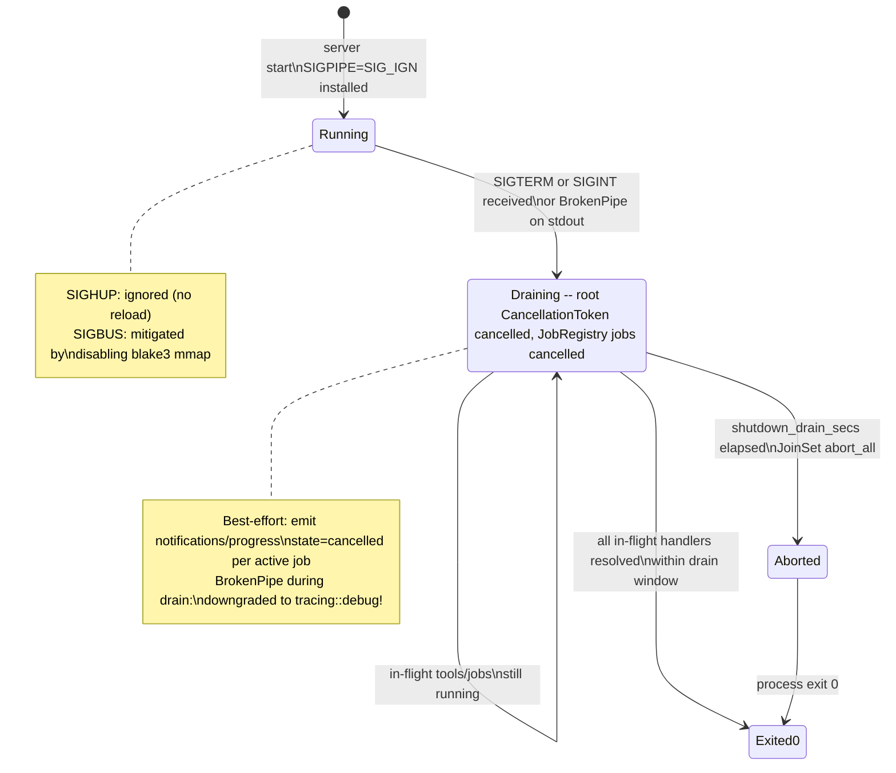
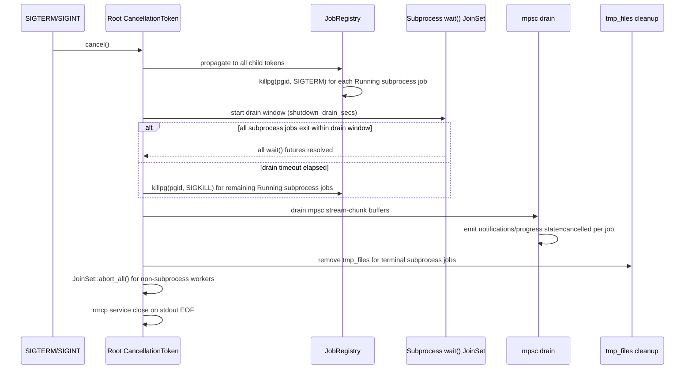

# ADR-0032 — Signal Safety (SIGPIPE, SIGBUS, SIGTERM, SIGINT, SIGHUP)

## Context and Problem Statement

`substrate` is a long-running stdio-attached MCP server. POSIX signals arrive asynchronously and can corrupt program state if not handled before the tokio runtime initializes its own signal machinery. Four signals are relevant: `SIGPIPE` (broken stdout pipe), `SIGBUS` (bus error from memory-mapped I/O), `SIGTERM` and `SIGINT` (graceful shutdown requests), and `SIGHUP` (traditionally: reload config). Each requires a distinct strategy. Signal handling must integrate with the `CancellationToken`-based cancellation model (see [ADR-0006](0006-tokio-runtime-timeout-cancellation.md)) and the concurrency limit model (see [ADR-0017](0017-concurrency-limits.md)).

## Decision Drivers

- Unhandled `SIGPIPE` on a broken stdout pipe produces `SIGPIPE` delivery → default action → process abort, losing any in-progress tool results.
- `SIGBUS` from a truncated mmap'd file is unrecoverable in safe Rust; the only mitigation is to never mmap in production.
- `SIGTERM` and `SIGINT` must drain in-flight tool calls before exit to satisfy the MCP protocol's clean-shutdown expectation.
- `SIGHUP` has no meaningful action in a config-at-startup design; it must not kill the process.
- Signal handler setup must happen before `tokio::runtime::Runtime::block_on` to avoid TOCTOU races with tokio's internal signal handler registration.
- Drain timeout must be operator-configurable without recompilation.

## Considered Options

1. `signal(SIGPIPE, SIG_IGN)` at startup + `tokio::signal::unix` async handlers for SIGTERM/SIGINT + streaming-read-only blake3 + SIGHUP ignored — accepted.
2. Use `ctrlc` crate for SIGINT/SIGTERM — rejected; does not integrate with `CancellationToken`; the `ctrlc` callback runs in a non-tokio thread and requires manual channel bridging.
3. Handle `SIGPIPE` by catching `BrokenPipe` at every write site — rejected; the signal arrives before the write returns an error on some platforms; ignoring the signal is simpler and more reliable.
4. Keep `update_mmap` / `update_mmap_rayon` paths in blake3 — rejected; they introduce `SIGBUS` risk that cannot be caught in safe Rust; the performance benefit does not justify the risk.
5. `SIGHUP` triggers config reload — rejected; config is loaded once at startup via `figment`; reloading requires re-validating all config invariants and re-initializing dependent subsystems; this complexity is not warranted for the current feature set.

## Decision Outcome

Chosen option: "`SIG_IGN` for SIGPIPE before runtime + async tokio signal handlers for SIGTERM/SIGINT + streaming blake3 + ignored SIGHUP", because it eliminates the most dangerous failure modes (broken pipe abort, SIGBUS) with minimal complexity and integrates cleanly with the existing `CancellationToken` infrastructure.

### SIGPIPE: Ignore Before Runtime Start

```rust
// main.rs — before tokio::runtime::Builder::new_multi_thread()
// SAFETY: called in single-threaded context before any other threads are spawned;
// SIG_IGN is async-signal-safe per POSIX.1-2017.
unsafe {
    libc::signal(libc::SIGPIPE, libc::SIG_IGN);
}
```

After this call, writing to a broken stdout pipe returns `io::ErrorKind::BrokenPipe` from the `write(2)` syscall rather than delivering `SIGPIPE`. The MCP dispatch layer treats `BrokenPipe` as implicit cancellation: it broadcasts the root `CancellationToken`, waits for in-flight tools to drain (see Shutdown Drain below), then exits 0.

The `unsafe` block requires a SAFETY comment as shown above. This is the only `unsafe` block in `main.rs`; no other signal manipulation is permitted.

### SIGBUS: Never Use mmap in Production

The `blake3` crate exposes `Hasher::update_mmap` and `Hasher::update_mmap_rayon`. Both paths memory-map the target file. If the file is truncated between the `mmap(2)` call and the memory access, the kernel delivers `SIGBUS`. In safe Rust, `SIGBUS` cannot be caught or recovered from; the process aborts.

Mitigation: disable the `mmap` Cargo feature of `blake3`:

```toml
# Cargo.toml
[dependencies]
blake3 = { version = "1", default-features = false, features = [] }
```

All `blake3::Hasher` usage must call `update(chunk)` in a loop over `read(2)` chunks obtained from `tokio::fs::File` (Zone B, via `spawn_blocking`). The `update_mmap` and `update_mmap_rayon` methods must never appear in the codebase; `cargo-deny` bans the `mmap` feature in `deny.toml`.

Residual risk: third-party crates in the dependency graph may still use `mmap` internally. `cargo geiger` (see [ADR-0014](0014-build-system-and-toolchain.md)) is used to audit unsafe blocks in transitive dependencies. Known mmap-using transitive dependencies must be listed in the `cargo-deny` allowlist with a justification comment.



### SIGTERM and SIGINT: Graceful Shutdown

An async signal handler is installed inside the tokio runtime using `tokio::signal::unix`:

```rust
use tokio::signal::unix::{signal, SignalKind};

async fn shutdown_signal(root_token: CancellationToken) {
    let mut sigterm = signal(SignalKind::terminate()).expect("SIGTERM handler");
    let mut sigint  = signal(SignalKind::interrupt()).expect("SIGINT handler");
    tokio::select! {
        _ = sigterm.recv() => {},
        _ = sigint.recv()  => {},
    }
    root_token.cancel();
}
```

On signal receipt:

1. The root `CancellationToken` is cancelled, propagating to all in-flight tool calls via child tokens.
2. The dispatch layer waits up to `shutdown_drain_secs` (default: 5 seconds) for all in-flight `JoinHandle`s / `JoinSet` entries to resolve.
3. Any tool calls still running after the drain window are aborted via `JoinSet::abort_all()`.
4. The process exits 0.

`shutdown_drain_secs` is configurable in the TOML config:

```toml
[runtime]
shutdown_drain_secs = 5
```

### SIGHUP: Ignore

`SIGHUP` is explicitly ignored:

```rust
// Installed once inside tokio runtime, before accepting tool calls.
let mut _sighup = signal(SignalKind::hangup()).expect("SIGHUP handler");
// Never poll _sighup; holding it prevents the default action (terminate).
```

Config reload is not supported. Operators who need to apply a new config must restart the server. This decision may be revisited if live config reload becomes a requirement.

### Consequences

#### Positive

- Broken stdout pipe surfaces as `BrokenPipe` error instead of silent abort; allows clean shutdown.
- Eliminating `mmap` from blake3 removes the entire class of `SIGBUS` risk from first-party code.
- SIGTERM/SIGINT trigger orderly drain; in-flight tool results are attempted before exit.
- SIGHUP no longer terminates the process accidentally (e.g., when a shell session closes).

#### Negative

- Streaming blake3 is slower than mmap-based blake3 for large files. The performance delta is acceptable because Zone C hashing is already Semaphore-gated (see [ADR-0017](0017-concurrency-limits.md)) and the throughput bottleneck is typically the MCP response serialization, not the hash computation.
- Residual `SIGBUS` risk from third-party transitive mmap usage cannot be fully eliminated without auditing all transitive unsafe blocks continuously.
- `shutdown_drain_secs` is a best-effort bound; a blocked `spawn_blocking` thread cannot be preempted within the drain window; only the next chunk-level cancellation check will fire.

## Validation

- Unit test: write to a pipe whose read end is closed; assert `write` returns `Err(BrokenPipe)` (not a signal-induced abort).
- Integration test: send `SIGTERM` to a running server with an active 10-second tool call; assert the server exits within `shutdown_drain_secs + 2s` and the tool call returns `ToolError::Cancelled`.
- CI: `cargo-deny` must reject any build that re-enables the `mmap` feature of `blake3`.
- Code audit: `grep -r "update_mmap" src/` must return zero matches in CI.
- `cargo geiger --all-features` runs as informational step; transitive mmap users are listed in the geiger allowlist.

## Cross-References

- [ADR-0003](0003-crate-stack-and-async-zones.md): crate stack; `blake3` feature selection and `libc` usage.
- [ADR-0006](0006-tokio-runtime-timeout-cancellation.md): cancellation; `CancellationToken` propagation model.
- [ADR-0011](0011-configuration-management.md): configuration; `[runtime] shutdown_drain_secs` config key.
- [ADR-0017](0017-concurrency-limits.md): concurrency limits; `JoinSet::abort_all()` on shutdown.

## Amendments

### 2026-05-21 — Extended by ADR-0040 async-job-control-plane

ADR-0040 introduces a JobRegistry that tracks long-running tool calls as named jobs. The graceful drain procedure described in this ADR is extended to cover in-flight jobs and their transactional state.

**Additions:**

- On SIGTERM or SIGINT, after the root CancellationToken is cancelled (existing step 1), the JobRegistry MUST propagate cancellation to every active job by calling cancel on each job's dedicated CancellationToken. This happens before the drain window begins.
- Each worker task is responsible for cleaning up any transactional temporary files it holds (`.tmp.<uuid7>` scratch files per ADR-0033) before its task future resolves. Cleanup MUST occur inside the cancellation select! arm, not in a Drop impl (cross-ref ADR-0037).
- Before the STDIO transport closes, the dispatch layer MUST emit one final `notifications/progress` MCP event per active job that was cancelled, with `state=cancelled` and `message="server shutting down"`. This notification is best-effort: if the pipe is already broken, the BrokenPipe error is silently ignored (not logged at warn or error level).
- The SIGPIPE-ignored invariant established by this ADR remains in force during the drain phase. Any broken-pipe errors that occur while emitting cancellation notifications MUST be downgraded to `tracing::debug!` to avoid noise in operator logs during controlled shutdown.

### 2026-05-24 — Subprocess termination integrated into graceful drain (ADR-0052/ADR-0053)

[ADR-0052](0052-subprocess-execution-architecture.md) and [ADR-0053](0053-subprocess-process-group-lifecycle.md) extend the SIGTERM/SIGINT graceful drain sequence described in this ADR to cover active subprocess jobs. The existing shutdown sequence (steps 1–4 above) is extended to the following eight-step sequence when the `subprocess` Cargo feature is enabled. Steps 1 and the existing drain window behavior are unchanged for non-subprocess jobs.

Extended shutdown sequence:

1. The root `CancellationToken` is cancelled, propagating to all in-flight tool calls and job worker child tokens. (Existing — unchanged.)
2. For each subprocess `JobEntry` currently in state `Pending` or `Running` in the `JobRegistry`: call `killpg(pgid, SIGTERM)` to deliver a cooperative termination signal to the entire process group. This step runs concurrently for all active subprocess jobs before the drain window begins. (New — subprocess extension.)
3. Enter the drain window (`shutdown_drain_secs`). The drain now races two completion sets: the existing `JoinSet` of non-subprocess worker futures AND a new `JoinSet` of subprocess `wait()` futures (one per active child). The root `tokio::select!` waits for both sets to resolve or for the drain timeout to elapse. (New — subprocess extension.)
4. On drain timeout expiry, for any subprocess `JobEntry` still in state `Running`: call `killpg(pgid, SIGKILL)` to force-terminate the remaining process group. The `subprocess_exit_code` hint is set to null and the terminal state is written as `Cancelled` with `kill_required: true` in the audit annotation. (New — subprocess extension.)
5. Drain all mpsc stream-chunk buffers for subprocess jobs; emit `notifications/progress` with `job_state=cancelled` per active subprocess job. The SIGPIPE-ignored invariant and BrokenPipe downgrade-to-debug rule from this ADR remain in force. (Extended scope — subprocess chunks added.)
6. For each terminal subprocess `JobEntry`: remove all registered `tmp_files` paths (stream-capture temporary files per ADR-0033 and ADR-0054) via `tokio::fs::remove_file`. Cleanup failure is logged at WARN and does not block exit. (New — subprocess extension.)
7. Call `JoinSet::abort_all()` on the non-subprocess worker `JoinSet` for any remaining non-subprocess workers. (Existing — unchanged.)
8. Close the rmcp service and allow stdout EOF to propagate. (Existing — unchanged.)

The updated shutdown sequence including the subprocess termination phase is shown below.



Cross-references: [ADR-0052](0052-subprocess-execution-architecture.md) — subprocess execution architecture; [ADR-0053](0053-subprocess-process-group-lifecycle.md) — process group lifecycle and cascade kill.

### 2026-05-21 — Extended by ADR-0042 capability-adapter-factory

ADR-0042 introduces a capability probe that runs at server startup to select adapter tiers. The probe's failure mode interacts with the signal-handler installation sequence described in this ADR.

**Additions:**

- The capability probe MUST complete before the SIGPIPE `SIG_IGN` call and before the tokio runtime installs the SIGTERM/SIGINT async handlers. If the probe determines that PathJail has fallen back to the userspace tier and the operator has set `refuse_degraded_jail = true` in the TOML config, startup MUST abort before any signal handler is installed. The abort path emits a `SUBSTRATE_JAIL_DEGRADED` structured audit event to stderr and exits with a non-zero code. This guarantees that a degraded-jail binary never reaches the point of accepting tool calls.
