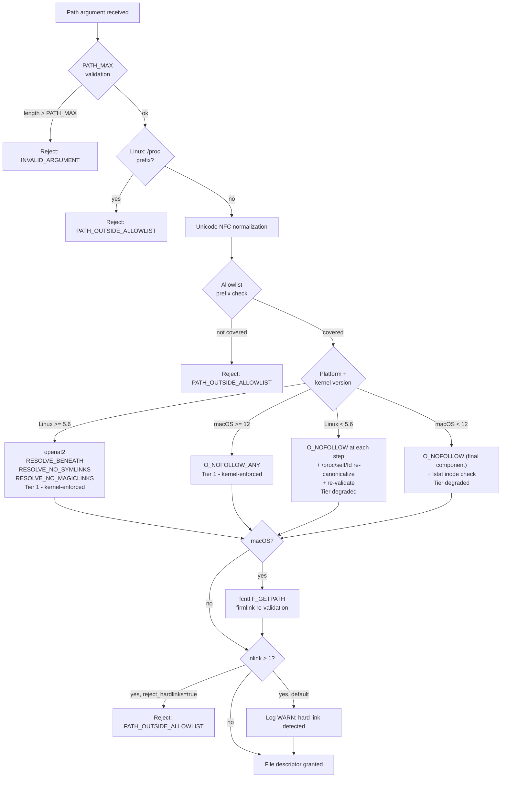

# ADR-0035 — Path Safety Hardening (openat2, O_NOFOLLOW, Unicode, Firmlink, /proc)

## Context and Problem Statement

ADR-0004 establishes a path jail using `strict-path` canonicalization followed by allowlist prefix-matching. This model is necessary but not sufficient. Several attack vectors remain open after canonicalization succeeds and the prefix check passes:

- **TOCTOU window**: `std::fs::canonicalize` and the subsequent `open(2)` call are not atomic. An attacker-controlled symlink can be swapped between the two, redirecting the open to a path outside the allowlist even though the canonical check passed.
- **macOS Unicode normalization mismatch**: APFS and HFS+ normalize filenames to NFD at the filesystem layer. An allowlist root stored as NFC and an incoming path argument stored as NFD produce different byte strings, causing the prefix check to fail silently or to produce false positives depending on comparison direction.
- **APFS firmlinks**: macOS exposes `/System/Volumes/Data` as a firmlink aliasing `/`. A path canonicalized through one mount point may resolve to a different byte string than the allowlist root, defeating the prefix check without triggering a symlink alarm.
- **Allowlist root configured as symlink**: if the operator configures an `allowed_paths` entry that is itself a symlink, the prefix check operates on the unresolved symlink path. A later canonical path that resolves through the symlink target may not match, silently denying access or silently allowing access to the wrong tree.
- **`/proc` indirection (Linux)**: paths such as `/proc/self/cwd` and `/proc/<pid>/root` allow an attacker to construct a path that canonicalizes into the allowlist but at open time resolves to an unrelated location.
- **Case-insensitive filesystems**: default HFS+ and APFS on macOS are case-insensitive. An allowlist root stored as `/Users/Alice/Projects` and an incoming argument `/users/alice/projects` are equivalent on disk but differ as byte strings, causing the prefix check to pass or fail inconsistently.
- **PATH_MAX overflow**: `std::fs::canonicalize` on some platforms silently truncates paths exceeding `PATH_MAX`, producing a valid-looking path that does not correspond to the intended file.
- **Archive symlink members**: symlink entries in ZIP or TAR archives can be written first, then subsequent member writes follow the symlink to an arbitrary destination outside the extraction root.
- **Hard links to external files**: a hard link inside the allowlist may point to an inode that is also accessible via a path outside the allowlist, bypassing the prefix check at the content level.

## Decision Drivers

- TOCTOU is a structural gap that cannot be closed by canonicalize-and-check alone; kernel-level atomic open is required.
- Platform differences (Linux kernel version, macOS version, filesystem type) require per-platform decision logic.
- Allowlist root instability at startup is a configuration-time failure that must be detected eagerly, not at first access.
- Unicode normalization mismatches are silent; they must be closed at the boundary where paths enter the system.
- Archive symlink members are a well-known attack class (Zip Slip variant) that the existing archive layer does not fully address.

## Considered Options

1. Per-platform kernel-level open hardening + Unicode normalization + startup canonicalization (selected)
2. Re-canonicalize after every open (no kernel flags)
3. chroot or Linux namespace isolation
4. Rely solely on `strict-path` canonicalize-and-check as implemented in ADR-0004

## Decision Outcome

Chosen option: "Per-platform kernel-level open hardening + Unicode normalization + startup canonicalization", because it closes the TOCTOU window atomically at the kernel level where available, falls back gracefully on older kernels, and addresses Unicode and firmlink gaps at well-defined boundaries.

### Decision 1 — Linux >= 5.6: openat2 with RESOLVE flags

On Linux kernel 5.6 and later, every `open(2)` at the leaf of a path uses `openat2(2)` with the following resolve flags:

- `RESOLVE_BENEATH`: the kernel rejects any path component that would escape the directory file descriptor, closing the TOCTOU window without a user-space re-check.
- `RESOLVE_NO_SYMLINKS`: the kernel rejects any symlink component encountered during path resolution, including symlinks in intermediate directories.
- `RESOLVE_NO_MAGICLINKS`: the kernel rejects magic-link resolution (including `/proc/self/fd/*` and `/proc/<pid>/root`) in the path.

This combination closes the TOCTOU window atomically: the resolution and the open are a single kernel operation.

Kernel version detection uses `uname(2)` at startup. The result is cached; no per-call syscall overhead.

### Decision 2 — Linux < 5.6 fallback: O_NOFOLLOW + /proc re-validation

On Linux kernels before 5.6, `openat2` is not available. The fallback is:

1. Open each path component with `O_NOFOLLOW`, preventing symlink follow at each step.
2. After the file descriptor is obtained, re-canonicalize the open path via `/proc/self/fd/<fd>` (readlink).
3. Re-validate the re-canonicalized path against the allowlist.

This approach does not atomically close the TOCTOU window but substantially narrows it. It is the best available option on older kernels.

### Decision 3 — macOS >= 12: O_NOFOLLOW_ANY

On macOS 12 (Monterey) and later, every `open(2)` uses the `O_NOFOLLOW_ANY` flag. Unlike `O_NOFOLLOW`, which only rejects a symlink at the final path component, `O_NOFOLLOW_ANY` rejects a symlink at any component in the path, including intermediate directories. This closes the symlink-swap TOCTOU window for macOS.

OS version detection uses `sysctl kern.osrelease` at startup. The result is cached.

### Decision 4 — macOS < 12 fallback: O_NOFOLLOW + lstat re-validation

On macOS before 12, `O_NOFOLLOW_ANY` is not available. The fallback is:

1. Open with `O_NOFOLLOW` (rejects symlink at the final component only).
2. After opening, call `lstat` on the path and verify that the inode matches the open file descriptor (via `fstat`).
3. If the inodes differ, the path was swapped between `lstat` and `open`; the file descriptor is closed and `SUBSTRATE_PATH_OUTSIDE_ALLOWLIST` is returned.

This does not fully close the TOCTOU window for intermediate symlinks but prevents final-component symlink swaps.

### Decision 5 — Allowlist root canonicalization at startup

All entries in `[security] roots` (the TOML allowlist) are canonicalized at config-load time using `std::fs::canonicalize`. This resolves symlinks in the configured roots themselves and stores the resolved byte strings. The stored canonical roots are used for all subsequent prefix checks.

An entry that fails canonicalization (path does not exist, permission denied, symlink loop) causes substrate to abort startup with `SUBSTRATE_CONFIG_INVALID` ([ADR-0036](0036-startup-error-contract.md)). Operators must configure roots that exist and are reachable at startup.

### Decision 6 — Unicode normalization to NFC

All allowlist root paths (after startup canonicalization) and all incoming path arguments from tool calls are normalized to NFC using the `unicode-normalization` crate before any comparison. This closes the NFC/NFD mismatch on macOS APFS/HFS+ case-insensitive filesystems.

Normalization is applied at the allowlist boundary: once when roots are loaded, and once when each tool argument is received. Subsequent internal path operations use the NFC-normalized form throughout.

### Decision 7 — macOS firmlink resolution via F_GETPATH

Under `cfg(target_os = "macos")`, after `std::fs::canonicalize` and after opening the file, substrate calls `fcntl(fd, F_GETPATH, buf)` to retrieve the OS-final path as the kernel sees it. This path is re-validated against the stored canonical allowlist roots. If the `F_GETPATH` result does not share a canonical root prefix, the operation is rejected with `SUBSTRATE_PATH_OUTSIDE_ALLOWLIST`.

`F_GETPATH` resolves APFS firmlinks as the kernel resolves them, ensuring the allowlist check reflects the actual inode location rather than the user-space canonicalized view.

### Decision 8 — Blanket rejection of /proc paths (Linux)

On Linux, any input path argument that begins with `/proc/` is rejected immediately with `SUBSTRATE_PATH_OUTSIDE_ALLOWLIST` before canonicalization is attempted. This eliminates the `/proc/self/cwd`, `/proc/<pid>/root`, and `/proc/self/fd/<n>` indirection classes entirely.

This decision applies only under `cfg(target_os = "linux")`. macOS has no `/proc` filesystem.

### Decision 9 — Hard link detection policy

`fs.stat` and `fs.read` responses include an `nlink` field reflecting the kernel `st_nlink` value. The default policy is:

- Log a WARN-level event when `nlink > 1` for a regular file.
- Do not deny the operation unless the operator sets `[security] reject_hardlinks = true` in TOML configuration.

With `reject_hardlinks = true`, any `fs.stat`, `fs.read`, `fs.write`, `fs.copy`, or `fs.remove` on a file with `nlink > 1` returns `SUBSTRATE_PATH_OUTSIDE_ALLOWLIST` (the same error as an allowlist rejection, to avoid disclosing link topology to the caller).

This is a partial mitigation: it does not prevent hard links that were created before the operation and whose external path is not inside the allowlist. The residual risk is documented below.

### Decision 10 — PATH_MAX validation

Any input path argument whose byte length exceeds `libc::PATH_MAX` (4095 bytes on Linux, 1023 bytes on macOS) is rejected with `SUBSTRATE_INVALID_ARGUMENT` before canonicalization is attempted. This prevents silent truncation by `canonicalize` and the resulting path mismatch.

### Decision 11 — Archive symlink-member ban

`archive.zip.extract` and `archive.tar.extract` MUST reject any archive member of type symlink or hardlink. The rejection returns `SUBSTRATE_PATH_TRAVERSAL_BLOCKED` and aborts the extraction without writing any members.

An opt-in mode is available via `[archive] extract.allow_symlinks = true`. When enabled, extraction proceeds only if every symlink target canonicalizes to a path inside the extraction root after all prior members have been written. If any symlink target resolves outside the root, extraction is aborted and `SUBSTRATE_PATH_TRAVERSAL_BLOCKED` is returned.

The default behavior (deny all symlink and hardlink members) closes the archive symlink-member chaining attack class without configuration.

### Residual risks

The following risks are documented as not fully closed by the decisions above:

- **Hard links to pre-existing external files**: a hard link inside the allowlist may share an inode with a file accessible via a path outside the allowlist. The `nlink > 1` warning partially mitigates this by surfacing the condition; full mitigation would require scanning all paths to the inode, which is prohibitively expensive.
- **Custom secret prefix in path arguments not matched by redaction**: if an operator uses a non-standard secret pattern as a path component, the redaction pipeline ([ADR-0018](0018-logging-redaction.md)) may not redact it. Mitigation is available via `[logging] extra_patterns` in TOML configuration.

### Consequences

#### Positive

- TOCTOU is closed atomically on Linux 5.6+ and macOS 12+ using kernel-level flags.
- Unicode normalization eliminates silent NFC/NFD mismatches on macOS.
- Firmlink resolution via `F_GETPATH` closes the APFS aliasing gap.
- Allowlist roots configured as symlinks are detected and rejected at startup, preventing silent misconfiguration.
- `/proc` indirection is eliminated on Linux by blanket prefix rejection.
- Archive symlink-member attacks are blocked by default without configuration.

#### Negative

- Linux fallback (< 5.6) narrows but does not atomically close the TOCTOU window for intermediate symlinks.
- macOS fallback (< 12) narrows but does not atomically close the TOCTOU window for intermediate symlinks.
- `F_GETPATH` adds one `fcntl` syscall per file open on macOS.
- Startup canonicalization of allowlist roots means substrate requires all configured roots to exist at startup; dynamic root provisioning is not supported.
- Blanket `/proc` rejection blocks legitimate uses of `/proc` inside the allowlist (considered acceptable given the attack surface).

## Validation

- Unit tests for each platform branch (openat2, O_NOFOLLOW_ANY, fallbacks) assert symlink-swap is rejected.
- Unicode normalization unit tests cover NFC, NFD, and mixed-normalization inputs against allowlist roots.
- macOS firmlink integration tests verify `F_GETPATH` re-validation catches firmlink aliasing.
- Archive symlink-member unit tests assert all symlink and hardlink member types are rejected in default mode.
- Property tests generate adversarial Unicode strings and verify NFC normalization is idempotent and does not produce allowlist bypasses.
- Startup canonicalization tests assert that symlink roots and missing roots abort with `SUBSTRATE_CONFIG_INVALID`.

## Cross-references

- [ADR-0004](0004-security-model.md) — Security model (base path jail and allowlist)
- [ADR-0018](0018-logging-redaction.md) — Logging redaction policy (extra_patterns for custom secrets)
- [ADR-0029](0029-threat-model.md) — Threat model (TOCTOU, firmlink, and Unicode threats)
- [ADR-0036](0036-startup-error-contract.md) — Startup error contract (`SUBSTRATE_CONFIG_INVALID` on root canonicalization failure)

## Amendments

### 2026-05-21 — Extended by ADR-0042 capability-adapter-factory

Path-jail enforcement is now expressed as a tiered capability selected at startup by the capability adapter factory. The factory probes the runtime kernel and OS version, selects the highest available tier, and exposes the active PathJail implementation through a port interface consumed by all adapter crates. This formalises the platform branches already described in this ADR and adds explicit degraded-mode governance.

**Additions:**

- Tier 1 (preferred, kernel-enforced): `openat2(RESOLVE_BENEATH | RESOLVE_NO_SYMLINKS)` on Linux kernel >= 5.6; `openat O_NOFOLLOW_ANY` on macOS >= 12. These branches already exist in this ADR; the factory makes tier selection observable at startup.
- Tier degraded (userspace, last resort): `strict-path` crate canonicalize plus post-check, covering Linux < 5.6 and macOS < 12 fallback branches. This tier has a non-zero TOCTOU surface and is NEVER silently activated.
- When tier 1 is unavailable for the detected platform, the composition root MUST emit `tracing::warn!` at startup with a message naming the kernel or macOS version required to reach tier 1.
- The composition root MUST emit the `SUBSTRATE_JAIL_DEGRADED` audit event (see ADR-0038 amendment in this same wave) whenever the degraded tier is selected.
- If runtime config `security.refuse_degraded_jail = true` (default), the composition root MUST abort startup with the `SUBSTRATE_JAIL_DEGRADED_REFUSED` startup error code (see ADR-0010 amendment in this same wave) before accepting any MCP requests.
- If `security.refuse_degraded_jail = false`, the composition root proceeds with explicit operator acceptance of the risk; the `tracing::warn!` and the `SUBSTRATE_JAIL_DEGRADED` audit event are still emitted unconditionally.

### 2026-05-21 — Extended by ADR-0041 filesystem-index-native-tiers

The filesystem index introduced in ADR-0041 is a best-effort acceleration layer, not a security boundary. Its cached entries may become stale after allowlist mutations or filesystem changes.

**Additions:**

- Every entry returned from a filesystem-index lookup MUST be re-validated by the active PathJail tier (whether tier 1 or tier degraded) before emission to the caller.
- This re-validation is performed on the resolved path, not the cached path, ensuring that an allowlist root change between index population and query time does not allow stale entries to bypass the jail.
- The jail is authoritative; the index is advisory. If jail re-validation rejects a cached entry, the entry is silently dropped from the response and counted in a `stale_entries_dropped` field on the tool response hints map.
