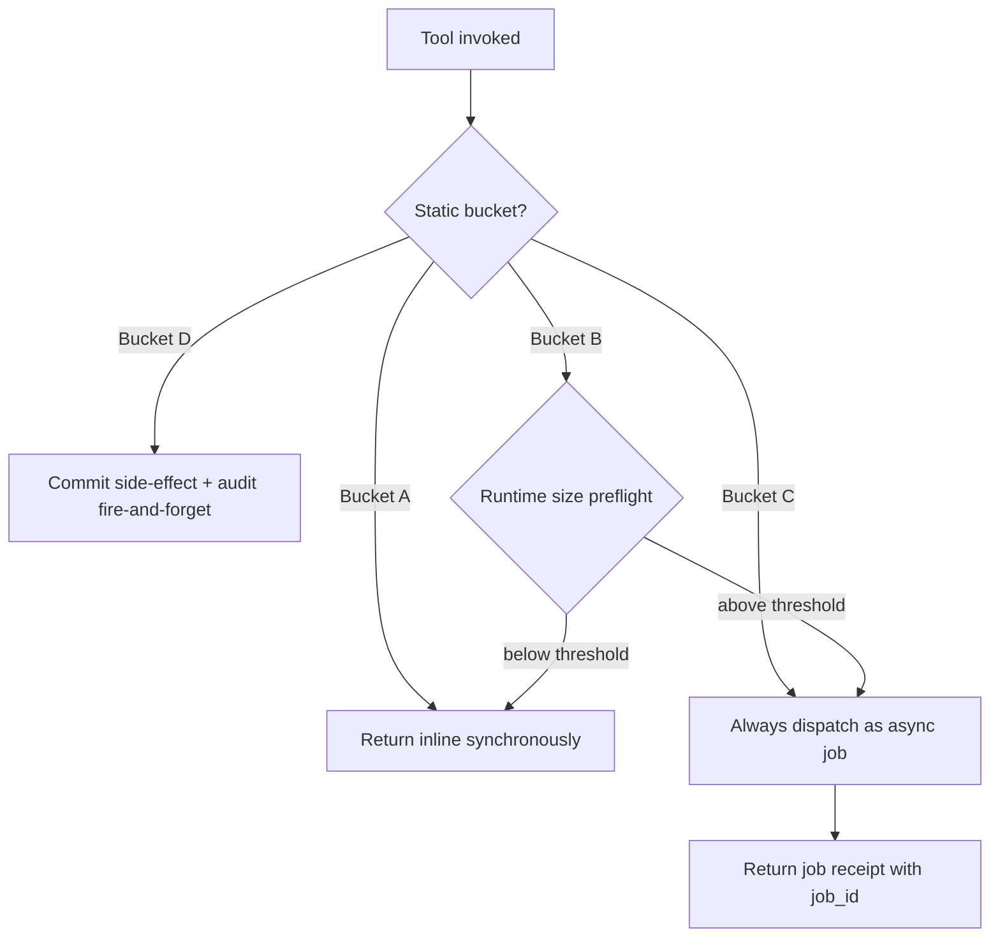
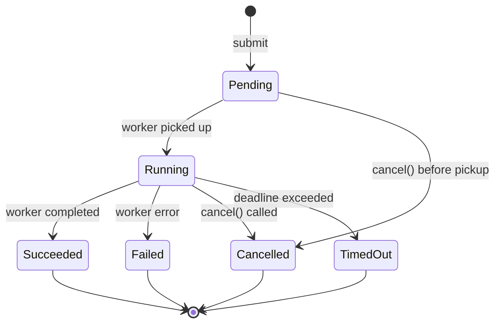
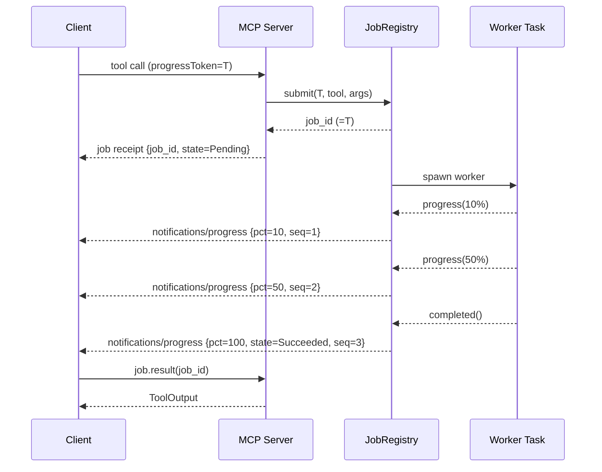

# ADR-0040 — Async Job Control-Plane with Push/Pull Dual Channel

## Context and Problem Statement

Several substrate tools are not instant. Archive creation over a multi-gigabyte tree, recursive hashing, and large file copies can run for seconds to minutes. The MCP request-response model has no native notion of in-flight work beyond the single pending RPC call. Clients timeout, retry, or abandon such calls, producing duplicate work and orphaned resources.

Additionally, Bucket B tools (auto-mode: inline if small, job if large) need a single decision point that chooses between synchronous return and asynchronous dispatch based on runtime-observable parameters such as byte count or match count, which are unknown at dispatch time.

This ADR decides: how substrate classifies every tool into a dispatch bucket, how an asynchronous job is submitted, tracked, and cancelled, how progress events are pushed to the client, and how the result is retrieved — all without introducing persistence, networking, or additional transport beyond the existing STDIO channel.

## Decision Drivers

- MCP 2025-11-25 notifications/progress is the only push mechanism available over STDIO.
- All jobs must be cancel-safe with `CancellationToken` per [ADR-0037](0037-async-cancellation-patterns.md).
- Audit trail for every state transition per [ADR-0038](0038-audit-event-semantics.md).
- Tool response hints map must be extended to surface job metadata to the agent per [ADR-0007](0007-tool-card-narrative-arc.md).
- STDIO restart wipes all state; no persistence layer is acceptable at this phase.
- Progress events must not block the tokio executor when the client is slow.

## Considered Options

1. Always-synchronous: block the MCP call until the tool finishes — rejected. Clients timeout on long-running tools; no partial progress visibility; cannot cancel mid-flight.
2. Full async with mandatory job dispatch for all tools — rejected. Adds unnecessary round-trip latency for instant reads (sys.uname, sys.info); agents must poll for every response.
3. Bucket classification with auto-mode for medium tools + always-async for long-running tools — accepted. Preserves low-latency for instant tools, eliminates timeouts for large tools, and gives auto-mode tools a clean inline vs. job path decided at runtime.
4. External sidecar process with a job queue — rejected. Requires IPC beyond STDIO, introduces a new failure domain, and violates the single-binary distribution contract of [ADR-0015](0015-distribution.md).

## Decision Outcome

Chosen option: "Bucket classification with auto-mode and async job control-plane", because it eliminates timeout failure modes for long-running tools while preserving sub-millisecond responses for instant reads, and it integrates entirely within the STDIO transport using MCP 2025-11-25 notifications/progress.

### Tool Dispatch Buckets

Every MCP tool is assigned to exactly one bucket. Bucket assignment is static (compile-time constant per tool) except for Bucket B, whose actual dispatch path is decided at runtime.

```text
Bucket A — Sync inline (snapshot-instant)
  sys.uname, sys.hostname, sys.uptime, sys.load_average, sys.info, sys.df
  fs.stat, fs.read_dir (page-capped)
  text.head, text.tail (line-capped)
  proc.list (snapshot, capped), proc.tree (depth- and node-capped)

Bucket B — Auto-mode (inline if small, job if large)
  fs.find       inline_max_entries = 1 000
  fs.read       inline_max_bytes   = 1 MiB
  fs.hash       inline_max_bytes   = 4 MiB
  fs.copy       inline_max_bytes   = 4 MiB
  text.search   inline_max_matches = 500
  text.count_lines  inline_max_bytes = 8 MiB
  archive.gzip.compress / decompress  inline_max_bytes = 4 MiB
  archive.hash  inline_max_bytes   = 4 MiB

Bucket C — Always async (job mandatory)
  archive.tar.create, archive.tar.extract
  archive.zip.create, archive.zip.extract
  fs.remove (recursive, future)
  fs.find with index rebuild (future)

Bucket D — Sync side-effect (commit fast, audit fire-and-forget)
  fs.mkdir, fs.write (capped), fs.rename, fs.touch
  fs.set_permissions, fs.symlink
  proc.signal
```

Per-tool thresholds for Bucket B are declared in the TOML config section `[jobs.thresholds.<tool>]`. A tool exceeding its inline threshold is promoted to a job transparently; the client receives a job receipt instead of an inline result.

The following diagram shows the bucket dispatch decision tree applied at tool invocation time.



### Job State Machine

The `JobState` machine has two non-terminal states (`Pending`, `Running`) and four
terminal states (`Succeeded`, `Failed`, `Cancelled`, `TimedOut`) that never regress.
A `cancel()` request received before the worker has picked up the job transitions
the job directly from `Pending` to `Cancelled` (see [ADR-0037](0037-async-cancellation-patterns.md)).



Terminal states (Succeeded, Failed, Cancelled, TimedOut) never regress. A state transition
that would move a terminal job to any other state is silently ignored. The state machine is
encoded as a Rust enum `JobState` with valid-transitions-only methods; invalid callers receive
a no-op result, not a panic.

### Control-Plane Tools (new bounded context: job)

Four tools are introduced under the `job` namespace. They are served inline (Bucket A semantics)
from the JobRegistry without touching any worker task.

```text
job.status
  Returns a snapshot: state, progress_pct, elapsed_ms, sequence_number.
  Idempotent. Sub-millisecond latency from in-memory watch read.

job.result
  Returns the final ToolOutput for a Succeeded job.
  Optional wait_ms parameter enables long-poll (default 0; cap jobs.result_max_wait_ms = 30 000).
  If the job is still running and wait_ms is zero, returns state=running immediately.

job.cancel
  Cancels the job by triggering its child CancellationToken.
  Idempotent: a second call on a terminal job returns state=already_done.
  Returns synchronously after token cancellation is triggered; does not wait for the worker.

job.list
  Paginated list of active and recently completed jobs visible to the requesting client_id.
  Cross-client visibility is forbidden: each client sees only its own jobs.
  Pagination uses base64-opaque cursor per [ADR-0008](0008-mcp-features-map.md).
```

### Push/Pull Dual-Channel Flow

```text
  Client                MCP Server                JobRegistry          Worker Task
    |                       |                           |                    |
    |-- tool call + ------->|                           |                    |
    |   progressToken=T     |                           |                    |
    |                       |-- submit(T, tool, args) ->|                    |
    |                       |<-- job_id (=T) -----------|                    |
    |<-- job receipt --------|                           |-- spawn worker --->|
    |   {job_id, state=P}   |                           |                    |
    |                       |                           |<-- progress(10%) --|
    |<-- notif/progress -----|                           |                    |
    |   {job_id, pct=10,    |                           |<-- progress(50%) --|
    |    seq=1}             |                           |                    |
    |<-- notif/progress -----|                           |                    |
    |   {job_id, pct=50,    |                           |<-- completed() ----|
    |    seq=2}             |                           |                    |
    |<-- notif/progress -----|                           |                    |
    |   {job_id, pct=100,   |                           |                    |
    |    state=succeeded,   |                           |                    |
    |    seq=3}             |                           |                    |
    |                       |                           |                    |
    |-- job.result(job_id) ->|                           |                    |
    |<-- ToolOutput ---------|                           |                    |
```

The sequence diagram below illustrates the push + pull dual-channel flow between client and worker.



The progressToken submitted by the client equals the job_id, which equals the correlation_id.
This triple equality eliminates any mapping table between MCP protocol tokens and internal identifiers.

### Push Channel: Progress Notifications

Progress events are emitted via MCP 2025-11-25 `notifications/progress`. Each event carries:

```text
{
  "progressToken": "<job_id>",
  "progress": <0–100 integer>,
  "total": 100,
  "job_id": "<uuid7>",
  "job_state": "<Pending|Running|Succeeded|Failed|Cancelled|TimedOut>",
  "sequence_number": <u64 monotonic>
}
```

Throttling: events are suppressed unless at least 250 ms have elapsed since the last emission
OR the progress delta is at least 1 percentage point since the last emission. Either condition
suffices.

Backpressure: each job holds a `tokio::sync::mpsc::Sender<ProgressEvent>` with a bounded
channel of capacity 64. Progress events are submitted via `try_send`. If the channel is full
(slow client), the event is dropped and the process-global atomic counter
`progress_events_dropped` is incremented. An `AuditEvent` is emitted for each drop. Progress
events are only emitted while the job is in state Running; events arriving after a terminal
transition are silently discarded.

Each event carries a monotonic `sequence_number` sourced from a per-job `AtomicU64`. Clients
MUST use `sequence_number` to detect dropped events and reorder out-of-order deliveries.

### Pull Channel: Result Retrieval

`job.result` uses a `tokio::sync::watch::Receiver<Option<ToolOutput>>` to read the last-written
result without polling. Long-poll is implemented by `watch.changed().await` with a
`tokio::time::timeout` of `wait_ms`. The watch channel is set exactly once by the worker task
upon terminal state entry; subsequent reads are non-blocking.

### Race Resolution

State transitions are serialized through a `parking_lot::Mutex<JobState>` inside each
`JobEntry`. The transition function validates the state machine and returns the previous state;
callers that receive a terminal previous state know the transition was a no-op.

The result watch channel is set inside the same mutex lock as the state transition to
`Succeeded`. This ensures that a concurrent `job.result` call that observes `state=Succeeded`
via the watch will always find the result present.

### Idempotency

Clients may attach an `idempotency_key` (UUIDv7, client-generated) to any job-creating tool
call. The deduplication key is:

```text
(client_id, tool_name, idempotency_key, blake3_hash_of_args_json)
```

If a matching key is found in the registry, the existing job_id is returned immediately without
spawning a new worker. The dedup map is bounded to the same TTL as the job result TTL and is
evicted by the same garbage collector.

### Quotas

```text
jobs.max_per_client     default: 16   per-client active job limit
jobs.max_concurrent     default: 32   global active job limit
jobs.result_ttl_secs    default: 300  result retention after terminal state
jobs.result_max_wait_ms default: 30000  cap for job.result wait_ms parameter
```

A per-tool Semaphore (sized from the tool's configured concurrency limit in [ADR-0017](0017-concurrency-limits.md))
additionally gates worker start. Submit beyond any quota returns `SUBSTRATE_QUOTA_EXCEEDED`
synchronously; no job is created.

### Persistence and Graceful Drain

There is no persistence. An STDIO process restart wipes all jobs. On SIGTERM or SIGINT
(per [ADR-0032](0032-signal-safety.md)), the shutdown sequence is extended:

1. The root `CancellationToken` is cancelled, propagating to all worker child tokens.
2. All jobs in state Running or Pending transition to Cancelled.
3. A `notifications/progress` event with `job_state=cancelled` is attempted for each affected
   job before the STDIO channel closes.
4. Workers drain within `shutdown_drain_secs` then are aborted via `JoinSet::abort_all()`.

### Result TTL and Garbage Collection

A background tokio task wakes every 60 seconds and evicts `JobEntry` records whose terminal
state was set more than `jobs.result_ttl_secs` seconds ago. After eviction, `job.result` or
`job.status` for that job returns `SUBSTRATE_JOB_NOT_FOUND`.

### CancellationToken Propagation

Each job owns a `CancellationToken` that is a child of the root token (per [ADR-0037](0037-async-cancellation-patterns.md)).
`job.cancel` calls `child_token.cancel()`. The MCP protocol cancellation notification
`notifications/cancelled` arriving for a `progressToken` MUST be mapped to
`job.cancel(progressToken)` by the MCP dispatch layer. This ensures that client-side cancellation
(from any MCP-compliant caller) propagates through the job system without a separate code path.

### Audit Integration

Every job state transition emits an `AuditEvent` carrying:

```text
{
  "correlation_id": "<job_id>",
  "client_id": "<client_id>",
  "tool_name": "<tool>",
  "job_state": "<new_state>",
  "idempotency_key": "<uuid7 | null>",
  "sequence_number": <u64>
}
```

The terminal state transition event is written before the result watch is set, ensuring that a
client reading the result always finds a corresponding audit trail. This follows the
pre/post-event contract of [ADR-0038](0038-audit-event-semantics.md) applied to job lifecycle.

### Hints Map Extension

The `structuredContent.hints` map defined in [ADR-0007](0007-tool-card-narrative-arc.md) is
extended with the following keys for job-dispatching tools:

```text
job_id                 string   UUIDv7 of the created or reused job
job_state              string   current JobState value
job_progress_pct       integer  0–100; null for terminal or not-yet-started
polling_endpoint       string   "job.status" or "job.result"
estimated_completion_ms integer  best-effort estimate; null if unknown
sequence_number        integer  last known sequence_number for this job
```

These keys are additive. A separate ADR in a subsequent wave will update ADR-0007 formally.

### Crate Layout

A new crate `substrate-jobs` is introduced under `crates/` per [ADR-0022](0022-project-layout.md).

```text
crates/
  substrate-domain        JobRegistryPort trait (port); JobState enum; JobEntry value object
  substrate-jobs          InMemoryJobRegistry (adapter); progress throttler; GC task
  substrate-mcp-server    wires JobRegistry into rmcp tool handlers
```

`substrate-domain` declares only the port trait `JobRegistryPort` and the value objects
(`JobEntry`, `JobState`, `ProgressEvent`). It imports nothing beyond std, serde, thiserror,
async-trait, futures, uuid, and tracing. `substrate-jobs` is the only crate that imports
`tokio::sync::{mpsc, watch}` for the dual-channel implementation.

### GoF Patterns Applied

```text
Command     — each job submission captures the tool call as an owned async closure
Mediator    — JobRegistry mediates between tool handlers and worker tasks
Observer    — progress notification subscribers (mpsc channel per job)
State       — JobState enum with valid-transitions-only methods; invalid callers get no-op
Strategy    — bucket selector decides inline vs. job dispatch at runtime
Decorator   — ProgressThrottler wraps the mpsc::Sender; applies 250 ms / 1% delta filter
Null Object — NoopProgressNotifier used when client provides no progressToken
```

## Consequences

### Positive

- Long-running tools no longer timeout at the MCP client; agents receive a job receipt and can
  poll or receive push notifications.
- Bucket A tools retain sub-millisecond response latency; no overhead for instant reads.
- Backpressure via bounded mpsc channel prevents slow clients from stalling worker tasks.
- CancellationToken propagation ensures the job system and MCP protocol cancellation are a
  single code path with no duplication.
- Idempotency keys make retry-safe submission possible for Bucket B/C tools.

### Negative

- Bucket B auto-mode requires a size preflight for some tools (for example, `fs.find` must
  count entries before deciding). If the preflight itself is slow, it delays the inline/job
  decision. Preflight must be capped and treated as approximate.
- Two code paths (inline and async) must be maintained for every Bucket B tool.
- Result TTL means agents must retrieve results within 300 seconds; very slow workflows may
  lose their result. TTL is configurable but not unlimited.
- No persistence means a server restart abandons all in-flight work; clients must detect this
  via `SUBSTRATE_JOB_NOT_FOUND` and resubmit.

## Validation

- Unit test: submit a Bucket C tool; assert the response contains `job_id` and `job_state=Pending`.
- Unit test: force a state regression (Running -> Pending); assert transition is silently rejected.
- Unit test: fill mpsc channel to capacity; assert `try_send` returns `Err`; assert
  `progress_events_dropped` counter increments.
- Unit test: submit with the same `idempotency_key` twice concurrently; assert only one job is
  created and both callers receive the same `job_id`.
- Unit test: `job.cancel` on a Succeeded job returns `state=already_done` without error.
- Integration test: Bucket B tool with input below threshold returns inline result with no
  `job_id` in hints; same tool with input above threshold returns a job receipt.
- Integration test: SIGTERM during a Running job; assert `notifications/progress` with
  `job_state=cancelled` is emitted on STDIO before the process exits.

## More Information

Related ADRs (existing):

- [ADR-0003](0003-crate-stack-and-async-zones.md) — async zones A/B/C; spawn_blocking contract
- [ADR-0007](0007-tool-card-narrative-arc.md) — hints map; dependent update in a later wave
- [ADR-0013](0013-mcp-protocol-version.md) — MCP 2025-11-25 capability negotiation
- [ADR-0022](0022-project-layout.md) — Cargo workspace; new substrate-jobs crate placement
- [ADR-0032](0032-signal-safety.md) — SIGTERM/SIGINT graceful drain extended by this ADR
- [ADR-0037](0037-async-cancellation-patterns.md) — CancellationToken; biased select; JoinSet
- [ADR-0038](0038-audit-event-semantics.md) — audit event shape; ordering; sequence counter

Dependent new ADRs (future waves):

- ADR-0041 — CUE schemas for JobEntry, JobState, ProgressEvent, and job.* tool output shapes
- ADR-0042 — Gherkin feature specs for bucket classification and job lifecycle scenarios
- ADR-0043 — ADR-0007 amendment: formally extend hints map with job_* keys
- ADR-0044 — domain/job/README.md bounded-context narrative

## Amendments

### 2026-05-24 — Bucket E (long-running subprocess) introduced via ADR-0052

[ADR-0052](0052-subprocess-execution-architecture.md) introduces a fifth dispatch bucket for subprocess tools. Bucket E is always-async with no inline path; every `subprocess.spawn` call dispatches as an async job and returns a job receipt immediately.

Bucket E reuses the existing `JobEntry`, `JobState`, and `JobRegistry` infrastructure defined in this ADR without modification to the core state machine. The `JobEntry` type gains a new `SubprocessHandle` variant in its payload union:

```text
SubprocessHandle {
    pid: i32,
    pgid: i32,
    child_cancel_token: CancellationToken,
    tmp_files: Vec<PathBuf>,
    stream_aggregator: StreamAggregator,
}
```

`pid` and `pgid` are set when the child transitions from `Pending` to `Running`. `tmp_files` holds paths to any stream-capture temporary files created per [ADR-0033](0033-transactional-write-pattern.md) and [ADR-0054](0054-subprocess-stream-capture.md). `stream_aggregator` is the mpsc receiver for stdout and stderr chunk events, used by `subprocess.result` to assemble the aggregate output.

The existing `JobState` machine (Pending, Running, Succeeded, Failed, Cancelled, TimedOut) is unchanged and applies identically to Bucket E jobs. For audit event purposes only, a Cancelled terminal state may carry a `kill_required: bool` annotation distinguishing cooperative cancellation (SIGTERM was sufficient) from forced termination (SIGKILL was required after the drain window). This is an audit distinction, not a new state; the state enum value remains `Cancelled` in both cases.

The hints map defined in this ADR is extended with the following keys for Bucket E job receipts and status responses:

- `subprocess_pid` (i32) — set on the Running job entry; omitted in Pending and terminal states.
- `subprocess_pgid` (i32) — set on the Running job entry alongside `subprocess_pid`.
- `subprocess_exit_code` (i32, nullable) — set only when the job reaches a terminal Succeeded or Failed state; carries the child process exit code. Null for Cancelled and TimedOut.
- `subprocess_stream_chunks_dropped` (u64) — cumulative count of stream chunks that were dropped due to backpressure since job creation; updated on every `job.status` and `job.result` response.

Cross-references: [ADR-0052](0052-subprocess-execution-architecture.md) — subprocess execution architecture; [ADR-0053](0053-subprocess-process-group-lifecycle.md) — process group lifecycle; [ADR-0054](0054-subprocess-stream-capture.md) — stream capture and aggregation.

### 2026-05-22 — Control-plane is always wired (no disabled mode)

The composition root MUST always wire `substrate_jobs::InMemoryJobRegistry`. The job control-plane is a core subsystem of this ADR with safe defaults (`max_concurrent=16`, `result_ttl_secs=300`, …); it has no "disabled" mode.

The TOML `[jobs]` section remains optional purely for operator tuning. When it is omitted, the composition root applies `JobConfig::default()` rather than disabling the control-plane.

**Rationale:** a prior implementation treated an absent `[jobs]` section as "control-plane disabled" and substituted a null-object registry whose every method returned `SUBSTRATE_INTERNAL_ERROR`. Because Bucket B promotion and all Bucket C tools (`archive.tar.*`, `archive.zip.*`, large `fs.read`/`fs.hash`/`fs.copy`, `text.search`/`text.count_lines`) route through `JobRegistryPort::submit`, this silently broke every long-running and large-input tool whenever the default config lacked a `[jobs]` table — which is the common case. Making the registry unconditional removes the failure mode; the former `NullJobRegistry` stub has been deleted.

## Links

- MCP specification 2025-11-25 notifications/progress schema: https://spec.modelcontextprotocol.io
- tokio::sync::watch documentation: https://docs.rs/tokio/latest/tokio/sync/watch/index.html
- tokio::sync::mpsc::channel bounded documentation: https://docs.rs/tokio/latest/tokio/sync/mpsc/fn.channel.html
