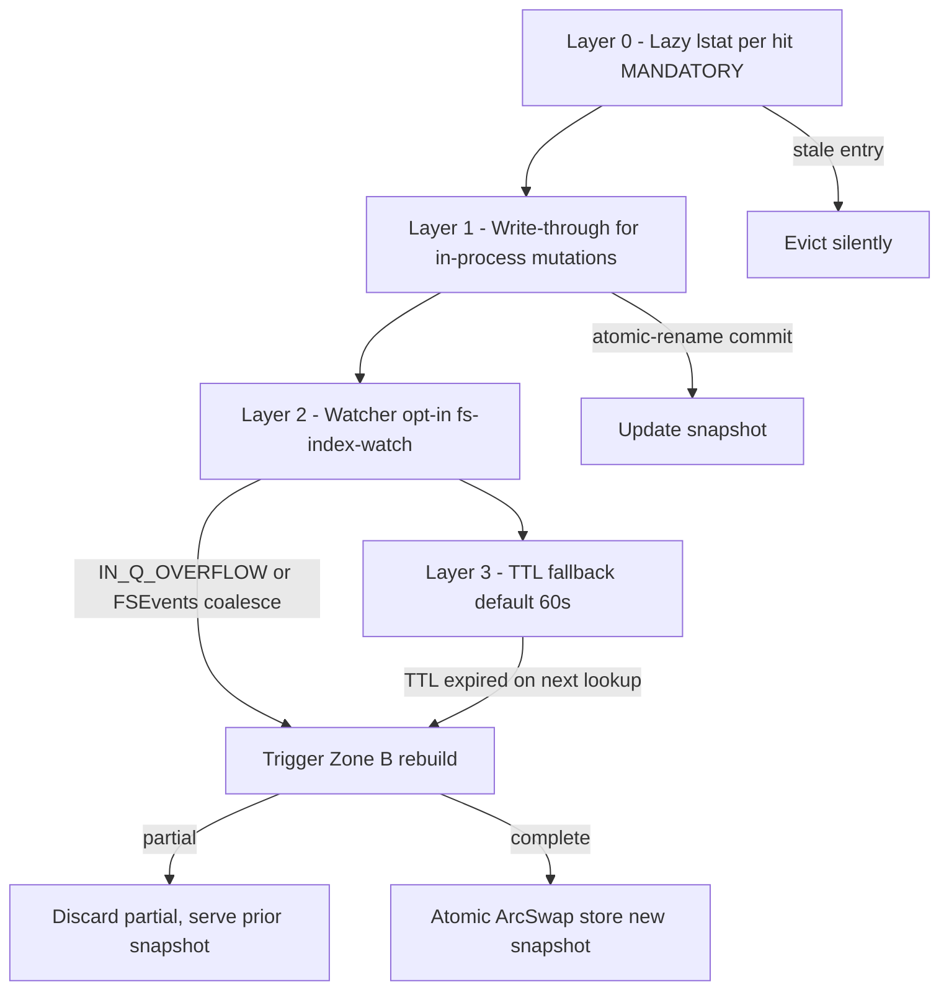
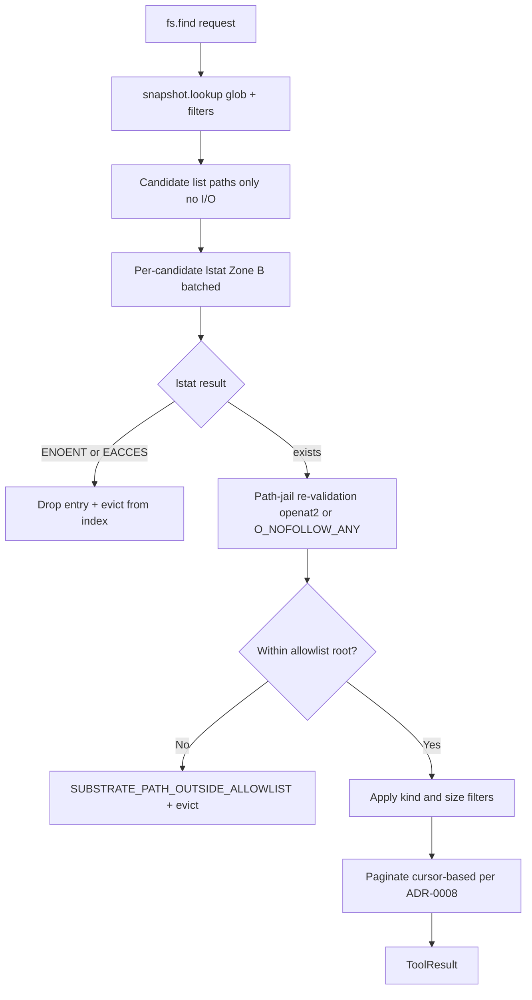

# ADR-0041 — Filesystem Index with Native Tier-Based Adapters

## Context and Problem Statement

`fs.find` is the primary discovery tool in the filesystem-query bounded context.
Its current implementation uses the `ignore` crate (Zone B, `spawn_blocking`) to
perform a full recursive walk on every invocation. For large directory trees, this
approach is functionally correct but prohibitively slow for interactive agent
workflows that issue many repeated find-style queries (e.g., glob after rename,
re-check after mutation, iterative narrowing of a large code tree).

An optional, in-process filesystem index would allow subsequent calls to query a
pre-built snapshot in microseconds rather than milliseconds, without subprocess
delegation and without sacrificing the security invariants established in
[ADR-0004](0004-security-model.md) and [ADR-0035](0035-path-safety-hardening.md).

The challenge is that building such an index correctly requires:

- Platform-native directory-enumeration primitives for maximum throughput.
- A layered freshness model that keeps the snapshot consistent with on-disk state
  without excessive overhead.
- Safe exclusion of transactional temp files (per [ADR-0033](0033-transactional-write-pattern.md)).
- Correctness under cancellation (per [ADR-0037](0037-async-cancellation-patterns.md)).
- Feature-gate isolation so that non-indexing deployments are unaffected.

## Decision Drivers

- Agent workflows repeat `fs.find` across the same tree; O(1) in-snapshot lookup
  is the target for the common case.
- All platform-specific code must remain in adapter crates, never in domain code
  (per [ADR-0028](0028-platform-feature-gates.md)).
- No subprocess invocation: `locate`, `mlocate`, `updatedb`, `find`, and `fd`
  are forbidden. See upcoming ADR-0044 (No Subprocess Policy).
- Stale entries must never reach the client; the lazy lstat pass is the
  inviolable last-resort invariant.
- Memory and index size must be operator-configurable and bounded by LRU eviction.
- The index is opt-in; the non-index code path from [ADR-0003](0003-crate-stack-and-async-zones.md)
  (`ignore` crate, Zone B) must remain the default.

## Considered Options

1. Optional in-process filesystem index with native tier-based adapters (selected).
2. Shell out to `locate` / `mlocate` for pre-indexed lookup — rejected; violates
   the no-subprocess policy (ADR-0044) and introduces a dependency on a system
   daemon that may be absent, stale, or unscoped to the allowlist.
3. Keep `ignore`-based full walk; optimize walk with io_uring unconditionally —
   rejected; io_uring is Linux-only and does not benefit macOS. Feature-gating
   io_uring without an index still does not solve repeated-query latency.
4. Full-process inotify/FSEvents watch with no lazy lstat — rejected; watches
   are lossy under `IN_Q_OVERFLOW`; skipping lstat would allow stale entries
   to reach the client during overflow recovery.

## Decision Outcome

Chosen option: "Optional in-process filesystem index with native tier-based
adapters", because it delivers O(1) repeated-query performance within the
security envelope already established by the path-jail and allowlist, keeps the
default binary unaffected, and is the only design that closes the stale-entry
gap without subprocess delegation.

### Cargo Feature Gates

```toml
[features]
default = []
fs-index         = []
fs-index-watch   = ["fs-index", "dep:notify", "dep:inotify"]
linux-iouring    = ["fs-index", "dep:tokio-uring"]
macos-getattrlistbulk = ["fs-index"]
```

All four features are OFF in default builds. `fs-index` is the root gate; watch
and native-primitive sub-features require `fs-index` to be active.

### Freshness Layer Stack

The index maintains correctness through four independent, complementary layers
applied in order. No single layer is sufficient alone; all four are always active
when `fs-index` is enabled (with `fs-index-watch` being additionally opt-in).

```text
+----------------------------------------------------------+
| Layer 0 — Lazy lstat per hit (MANDATORY)                 |
|  Every candidate returned by the snapshot passes through |
|  an lstat syscall before being emitted to the client.    |
|  Missing entry: silently evicted, never surfaced as      |
|  NOT_FOUND unless the client requested that exact path.  |
|  This layer is the inviolable invariant; it runs even    |
|  when layers 1-3 have not yet fired.                     |
+----------------------------------------------------------+
| Layer 1 — Write-through for in-process mutations         |
|  Every mutation tool (fs.mkdir, fs.write, fs.copy,       |
|  fs.rename, fs.remove, fs.set_permissions, fs.symlink,   |
|  fs.touch) updates the index at atomic-rename commit.    |
|  Cost: zero extra I/O (runs on the already-open path).   |
+----------------------------------------------------------+
| Layer 2 — Watcher (opt-in: fs-index-watch)               |
|  Linux: inotify recursive emulation.                     |
|    IN_Q_OVERFLOW triggers a root rebuild via Zone B.     |
|  macOS: FSEvents recursive (kFSEventStreamCreateFlag-    |
|    FileEvents). Both platforms use pure-Rust crate        |
|  bindings only; no shell invocation.                     |
+----------------------------------------------------------+
| Layer 3 — TTL fallback                                   |
|  index.ttl_secs (default 60). On expiry, an incremental  |
|  Zone B rebuild is triggered on the next lookup. The     |
|  stale snapshot continues to serve reads (filtered by    |
|  Layer 0 lstat) while the rebuild is in progress.        |
+----------------------------------------------------------+
```

### Native Primitives per Platform

All crate bindings call syscalls directly. No subprocess invocation at any tier.

Directory walk — Linux:

- Tier 0 (opt-in, `linux-iouring`): io_uring SQE batch via `tokio-uring`.
  Requires Linux 5.1+; checked at runtime, falls back to tier 1 if unavailable.
- Tier 1 (default on Linux, `fs-index`): `getdents64` + `statx` via `nix`.
  `openat2` with `RESOLVE_BENEATH | RESOLVE_NO_SYMLINKS` for each opened
  directory file descriptor (per [ADR-0035](0035-path-safety-hardening.md)).
- Crates: `nix`, `tokio-uring` (tier 0 only).

Directory walk — macOS:

- Tier 1 (opt-in, `macos-getattrlistbulk`): `getattrlistbulk(2)` batch stat
  via `libc` direct call. Returns name + metadata in one syscall per batch.
- Tier 2 (default on macOS, `fs-index`): `readdir` + `lstat` via `nix`.
- Crates: `nix`, `libc`.

Watcher — Linux (`fs-index-watch`):

- Tier 1: inotify recursive emulation via `inotify` crate; `IN_Q_OVERFLOW`
  triggers full root rebuild.
- Tier 2: fanotify root-only (requires `CAP_SYS_ADMIN`; runtime-capability
  checked; falls back to tier 1 if not available). Crates: `notify`, `inotify`.

Watcher — macOS (`fs-index-watch`):

- Tier 1: FSEvents recursive via `fsevent-stream` crate; native kernel stream.
- Tier 2: kqueue per-fd watch via `kqueue` crate (fallback for older kernels).
  Crates: `fsevent-stream`, `kqueue`.

Path resolution — Linux:

- `openat2` with `RESOLVE_BENEATH | RESOLVE_NO_SYMLINKS` (Linux 5.6+).
  Runtime fallback to `O_NOFOLLOW` chain on older kernels.
- Crates: `strict-path`, `nix`.

Path resolution — macOS:

- `openat(O_NOFOLLOW_ANY)` (macOS 11+). Runtime fallback to `O_NOFOLLOW` +
  `lstat`/`fstat` inode comparison on older releases.
- Crates: `strict-path`, `nix`.

Stat — Linux:

- `statx(2)` (kernel 4.11+) for btime + mount ID. Fallback to `fstatat` on
  older kernels.

Stat — macOS:

- `getattrlist(2)` / `fstatat(2)` via `libc`.

### Lookup Pipeline

The following diagram shows the freshness layer stack; all four layers are always active when `fs-index` is enabled.



The following pipeline applies to every `fs.find` invocation when `fs-index`
is enabled.

```text
fs.find(req)
     |
     v
+-------------------+
| snapshot.lookup   |  O(1) glob trie or prefix scan against
| (glob, filters)   |  the current Arc<IndexSnapshot>
+-------------------+
     |
     | candidate list (paths only; no I/O yet)
     v
+-------------------+
| per-candidate     |  lstat syscall for each candidate
| lstat             |  (Zone B; batched via spawn_blocking)
+-------------------+
     |
     | lstat result
     v
+-------------------+
| drop missing /    |  Entries where lstat returns ENOENT or
| stale eviction    |  EACCES are silently dropped and evicted
+-------------------+
     |
     v
+-------------------+
| path-jail         |  JailedPath re-validation per ADR-0035:
| re-validation     |  openat2 / O_NOFOLLOW_ANY confirms the
|                   |  entry is still within allowlist roots.
|                   |  Reject -> SUBSTRATE_PATH_OUTSIDE_ALLOWLIST
|                   |  + evict from index.
+-------------------+
     |
     v
+-------------------+
| kind / filter     |  Apply is_file, is_dir, is_symlink,
| application       |  mtime, size_min, size_max filters.
+-------------------+
     |
     v
+-------------------+
| paginate          |  Cursor-based pagination per ADR-0008:
| (ADR-0008)        |  page_size default 50, max 500.
+-------------------+
     |
     v
  ToolResult
```

The diagram below shows the lookup pipeline for every `fs.find` call when the index is active.



### Snapshot Atomic-Swap

The active snapshot is stored as `Arc<IndexSnapshot>` behind an `arc-swap`
`ArcSwap<IndexSnapshot>` (or `tokio::sync::watch`). Readers call
`snapshot.load()` and receive a cloned `Arc` with no lock contention.
The rebuild task calls `snapshot.store(Arc::new(new_snapshot))` atomically.
Readers never block on rebuild.

### Crate Layout (cross-ref ADR-0022)

A new crate `substrate-fs-index` is added to the workspace under `crates/`:

- Domain port: `FsIndexPort` trait defined in `substrate-domain`. The trait
  exposes `lookup`, `insert`, `evict`, and `rebuild` methods. It carries no
  platform imports; all platform gates remain in `substrate-fs-index`.
- Adapter: `substrate-fs-index` implements `FsIndexPort`. Platform-specific
  walk and watch code is isolated in `cfg(target_os = "linux")` and
  `cfg(target_os = "macos")` modules within this crate only.
- Consumer: `substrate-fs-query` depends on `substrate-fs-index` when the
  `fs-index` feature is active. Without the feature, `substrate-fs-query` uses
  the existing `ignore`-crate walk path unchanged.
- The dependency rule from [ADR-0028](0028-platform-feature-gates.md) is
  preserved: no `cfg(target_os)` block may appear in `substrate-domain` or
  `substrate-policy`.

### Edge Cases

Transactional temp file exclusion:
  All entries whose filename matches the suffix `.tmp.<uuid7>` (per
  [ADR-0033](0033-transactional-write-pattern.md)) are excluded from index
  insertion at walk time. Only the post-rename atomic commit promotes an entry
  into the index via write-through (Layer 1 above). Stale `.tmp.*` entries from
  a prior crash are excluded by the lazy lstat pass: they are evicted on the
  next lookup that would have returned them.

Broken symlinks:
  `lstat` returns success for a broken symlink (the symlink entry exists); `stat`
  returns `ENOENT`. The pipeline retains broken symlinks in the candidate list
  and applies the caller-supplied `is_symlink` filter. If the caller requests
  `is_file = true`, the broken symlink is filtered out. If no kind filter is
  provided, the broken symlink is emitted with `FileKind::Symlink` and a note in
  the structured hints map.

Allowlist mutation at runtime:
  When the operator reloads the TOML configuration (SIGHUP-triggered reload),
  any allowlist root that is removed or narrowed invalidates all snapshots that
  contain entries under that root. The index scheduler calls `evict_root(path)`
  for each removed root, producing a new empty snapshot for that subtree.
  Subsequent queries fall back to the full walk until a rebuild completes.

Atomic rename outside allowlist:
  An external process may rename a file that was indexed into the allowlist root
  to a location outside the root. The lazy lstat step does not detect this
  directly; the path-jail re-validation step (openat2 / `O_NOFOLLOW_ANY`) will
  fail to open the path inside the jail and returns
  `SUBSTRATE_PATH_OUTSIDE_ALLOWLIST`. The entry is evicted from the index.

Cancellation mid-rebuild:
  The rebuild task receives a `CancellationToken` child token
  (per [ADR-0037](0037-async-cancellation-patterns.md)). If cancellation fires,
  the partial snapshot is discarded; `snapshot.store()` is never called.
  The prior snapshot continues to serve reads. `JoinSet::abort_all()` is called
  on the rebuild task set before returning `ToolError::Cancelled`.

Index memory cap:
  Two operator-configurable limits apply:
  `index.max_entries` (default 500,000) and
  `index.max_bytes` (default 256 MiB).
  When either limit is exceeded, LRU eviction removes the least-recently-accessed
  entries until the index is under both limits. The LRU order is maintained
  per-access in the snapshot builder; no lock is held during reads.

### Platform Code Path Acknowledgment

The filesystem-query bounded context domain README currently states: "There are
no Linux-only or macOS-only code paths in this context for MVP." This ADR
consciously supersedes that invariant for the `fs-index` feature gate. The
invariant continues to hold for the non-indexed code path (the `ignore`-crate
walk) and for all other filesystem-query tools (`fs.read`, `fs.read_dir`,
`fs.stat`, `fs.hash`). A future wave will update the domain README and
cross-reference [ADR-0028](0028-platform-feature-gates.md) to reflect this
scoped exception.

### Stale-Hit Policy

A stale entry detected by the lazy lstat pass is evicted silently and skipped.
It is NOT surfaced as `SUBSTRATE_NOT_FOUND` unless the client provided an
exact-path lookup (e.g., `fs.stat`) rather than a glob walk. Best-effort
snapshot semantics apply: the index offers a probabilistically complete view of
the allowlist tree as of the last rebuild or write-through update. Callers that
require a guaranteed-fresh result should issue a `fs.stat` call for each path
of interest after `fs.find` returns.

## Consequences

### Positive

- Repeated glob queries against large trees resolve in microseconds from the
  snapshot rather than milliseconds from a full walk.
- Write-through updates keep the index consistent with in-process mutations at
  zero extra I/O cost.
- Lazy lstat ensures stale entries never reach the client; the security envelope
  of [ADR-0035](0035-path-safety-hardening.md) is preserved unconditionally.
- The `fs-index` feature is OFF by default; non-indexing deployments have zero
  additional binary size or startup overhead.
- Native tier-based walk (getdents64/statx, getattrlistbulk) reduces syscall
  count per directory batch versus the `ignore`-crate readdir loop.

### Negative

- `substrate-fs-index` adds a new crate with platform-gated code that must be
  compiled and tested on both Linux and macOS CI targets.
- The watch layer (`fs-index-watch`) introduces a background thread (inotify /
  FSEvents event loop) that runs for the lifetime of the server.
- Memory consumption scales with tree size; operators must tune `max_entries`
  and `max_bytes` for their workload.
- Best-effort snapshot semantics require callers to understand that `fs.find`
  may not reflect mutations made by external processes between rebuilds and
  watcher events.

### Risks

- inotify queue overflow (`IN_Q_OVERFLOW`) on high-churn directories triggers a
  full rebuild, temporarily degrading to full-walk latency until the rebuild
  completes.
- FSEvents coalesces events; rapid back-to-back mutations may appear as a single
  event, causing a single rebuild rather than incremental updates.
- `tokio-uring` (tier 0) is not yet stable on all Linux distributions; the
  runtime capability check must degrade gracefully to tier 1.

## Validation

- Feature-off: `cargo check --workspace` (without `--features fs-index`) must
  produce a binary with zero additional code from this ADR.
- Feature-on Linux: `cargo test --features fs-index,fs-index-watch` on
  `x86_64-unknown-linux-gnu` must pass all `substrate-fs-index` unit tests.
- Feature-on macOS: `cargo test --features fs-index,fs-index-watch,macos-getattrlistbulk`
  on `aarch64-apple-darwin` must pass all `substrate-fs-index` unit tests.
- Stale-hit: unit test injects a path into the snapshot, deletes the file on
  disk, and asserts the lazy lstat layer evicts the entry and does not emit it.
- Cancellation: unit test cancels a rebuild mid-walk and asserts the prior
  snapshot is still served and no partial snapshot is stored.
- Tmp exclusion: unit test walks a directory containing `.tmp.<uuid7>` files and
  asserts none appear in the resulting snapshot.
- Security: path-jail re-validation test renames an indexed entry outside the
  allowlist root and asserts `SUBSTRATE_PATH_OUTSIDE_ALLOWLIST` is returned and
  the entry is evicted.
- Memory cap: unit test fills the index beyond `max_entries` and asserts LRU
  eviction brings the entry count back under the limit.

## More Information

- ADR-0042 (Capability-Based Adapter Factory): the tier-selection machinery
  described in this ADR (runtime capability detection, tier 0 / tier 1 / tier 2
  fallback) is implemented by the factory defined in ADR-0042. This ADR depends
  on that factory for its native-primitive selection logic.
- ADR-0044 (No Subprocess Policy): forthcoming; codifies the blanket ban on
  `locate`, `mlocate`, `updatedb`, `find`, `fd`, and any other subprocess
  invocation from tool implementations.

## Links

- Related: [ADR-0003](0003-crate-stack-and-async-zones.md) — async zones A/B/C
- Related: [ADR-0004](0004-security-model.md) — allowlist and path jail
- Related: [ADR-0008](0008-mcp-features-map.md) — pagination (cursor-based, page_size 50/500)
- Related: [ADR-0022](0022-project-layout.md) — Cargo workspace layout
- Related: [ADR-0028](0028-platform-feature-gates.md) — platform feature gates
- Related: [ADR-0033](0033-transactional-write-pattern.md) — temp file naming (.tmp.<uuid7>)
- Related: [ADR-0035](0035-path-safety-hardening.md) — path-jail openat2/O_NOFOLLOW_ANY
- Related: [ADR-0037](0037-async-cancellation-patterns.md) — CancellationToken patterns
- Depends on: ADR-0042 — Capability-Based Adapter Factory (tier selection machinery)
- Informs: ADR-0044 — No Subprocess Policy (no-subprocess invariant cited above)
