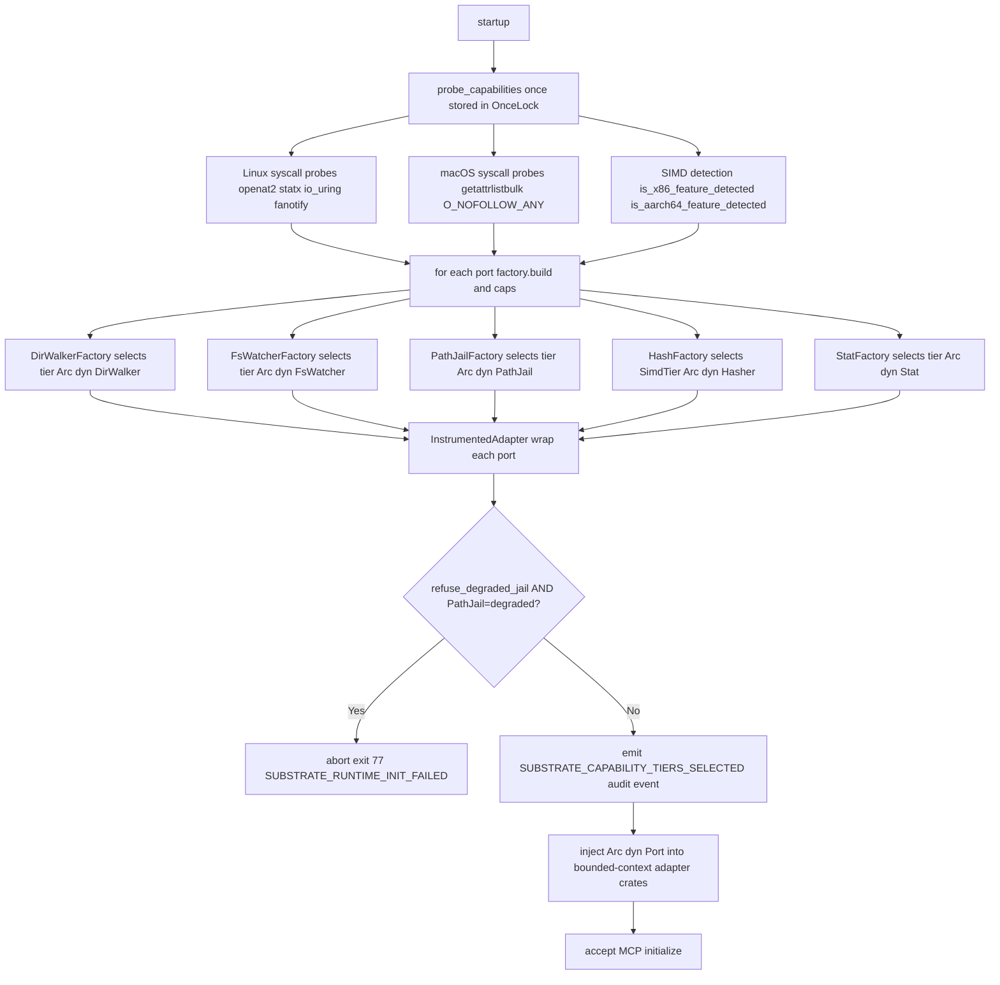
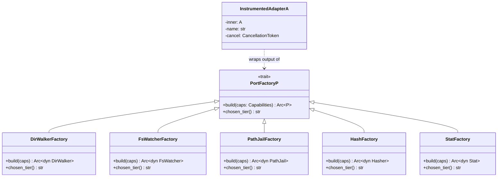

# ADR-0042 — Capability-Based Adapter Factory

## Context and Problem Statement

Substrate targets macOS and Linux on multiple hardware profiles (x86-64 with
AVX-512/AVX2/SSE4.2, aarch64 with NEON). Each platform exposes multiple OS
APIs for the same logical operation: directory traversal can use
`io_uring` + `statx` on a recent Linux kernel, or `getattrlistbulk` on macOS,
or fall back to `std::fs::read_dir` on a container with a locked-down kernel.
Similarly, the path-jail port has a kernel-enforced tier (`openat2` on Linux
5.6+, `O_NOFOLLOW_ANY` on macOS 12+) and a degraded userspace tier with a
distinct security posture.

Without a structured selection mechanism, every adapter crate must independently
detect capabilities at each call site, duplicating probe logic and making it
impossible to reason about the effective tier set at startup. Operators and the
audit pipeline have no visibility into which tier was chosen, which matters for
security and performance SLIs.

## Decision Drivers

- Capability probing must be done once at startup and never repeated (latency
  and correctness: kernel availability does not change at runtime).
- Platform-specific code must stay in adapter crates and never enter
  `substrate-domain` (hexagonal layering, [ADR-0022](0022-project-layout.md)).
- PathJail degraded tier is a security event; silent fallback is unacceptable
  ([ADR-0035](0035-path-safety-hardening.md)).
- Audit pipeline must record the chosen tier set for forensic reconstruction
  ([ADR-0038](0038-audit-event-semantics.md)).
- No subprocess: all detection is pure-Rust syscall probes.
- Operator override for integration testing must be possible without patching
  code.

## Considered Options

1. Detect capabilities at each call site inside every adapter implementation.
2. A single startup probe cached in `OnceLock<Capabilities>` plus per-port
   trait factories that select a tier implementation (selected).
3. Separate Cargo features per tier (e.g., `linux-io-uring`, `macos-getattrlist`)
   compiled in at build time.
4. Runtime `dlopen`/dynamic dispatch against platform SO libraries.

## Decision Outcome

Chosen option: "Single-probe `OnceLock<Capabilities>` with per-port
`PortFactory
` trait factories, per-tier Strategy implementations, Null
Object for undetectable tiers, and Decorator for cross-cutting concerns",
because it separates detection from selection from decoration, keeps domain
code free of platform ifdefs, and makes the selected tier set auditable in a
single startup audit event.

GoF patterns applied:

- Abstract Factory: `PortFactory
` — one factory per port, selects among
  Strategy implementations.
- Strategy: each tier is a distinct implementation of the port trait.
- Null Object: `PollingWatcher` is the fallback for `FsWatcher` when no
  kernel watcher is available.
- Decorator: `InstrumentedAdapter<A>` wraps any adapter with spans and
  `CancellationToken` propagation.
- Singleton: `OnceLock<Capabilities>` ensures the probe runs exactly once.

### Capability Probe

A single function `probe_capabilities()` runs at substrate startup before any
MCP session is accepted. The result is stored in a process-global
`std::sync::OnceLock<Capabilities>`. Subsequent reads use `get()` or
`get_or_init(probe_capabilities)` (idempotent under concurrent calls).

The `Capabilities` struct contains explicit boolean fields plus a `SimdTier`
enum:

    pub struct Capabilities {
        // Linux
        pub has_openat2: bool,          // kernel 5.6+ atomic path resolution
        pub has_statx: bool,            // kernel 4.11+ extended stat
        pub has_io_uring: bool,         // kernel 5.1+, linux-io-uring feature
        pub has_inotify: bool,          // always true on Linux (kernel 2.6.13+)
        pub has_fanotify: bool,         // kernel 2.6.37+, may need CAP_SYS_ADMIN
        // macOS
        pub has_getattrlistbulk: bool,  // macOS 10.10+ batch stat
        pub has_fsevents: bool,         // always true on macOS
        pub has_kqueue: bool,           // always true on macOS
        pub has_o_nofollow_any: bool,   // macOS 12+ (Monterey)
        // SIMD tier (both platforms)
        pub simd_tier: SimdTier,
    }

    pub enum SimdTier {
        Avx512,   // x86-64 with AVX-512F
        Avx2,     // x86-64 with AVX2
        Sse42,    // x86-64 with SSE4.2
        Sse2,     // x86-64 baseline (always available on x86-64)
        Neon,     // aarch64 with NEON (always available on aarch64-apple-darwin)
        Portable, // fallback for other architectures
    }

**Probe method for syscall capabilities**: attempt the syscall with safe
minimal arguments (e.g., `openat2` with an empty path against AT_FDCWD,
expected to return `ENOENT` on success or `ENOSYS` on absence). An `ENOSYS`
or `EOPNOTSUPP` response means the kernel does not support the call. Any other
errno (including `ENOENT`, `EPERM`, `EACCES`) means the kernel accepted the
call; the capability is present.

**Probe method for SIMD**: use `std::is_x86_feature_detected!` on x86-64 or
`std::arch::is_aarch64_feature_detected!` on aarch64. These macros perform
CPUID/HWCAP2 reads at runtime and are safe from pure Rust without unsafe.

**Forbidden**: shelling out to `uname`, `sysctl`, `cpuid`, or parsing
`/proc/cpuinfo` via any subprocess. All detection is pure-Rust inline code.
Cross-reference: ADR-0044 (No Subprocess Policy, forthcoming).

### PortFactory Trait

`PortFactory
` is declared in `substrate-domain` and has zero infrastructure
dependencies:

    pub trait PortFactory<P: ?Sized>: Send + Sync {
        fn build(&self, caps: &Capabilities) -> Arc
;
        fn chosen_tier(&self) -> &'static str;
    }

`build` is called once per port during composition root initialization.
`chosen_tier` returns a short lowercase string (e.g., `"io_uring"`,
`"statx+getdents64"`, `"portable"`, `"degraded"`) recorded in the
`SUBSTRATE_CAPABILITY_TIERS_SELECTED` audit event and emitted via
`tracing::info!`.

Concrete factory types live in adapter crates, not in `substrate-domain`.
Only `substrate-mcp-server` instantiates factories.

### Per-Port Tier Cascade

Each port selects the highest available tier at factory `build` time.

**DirWalker (filesystem-query)**

Linux cascade (preferred to fallback):
- Tier 1: `io_uring` with `statx` (requires `has_io_uring && has_statx`
  and Cargo feature `linux-io-uring`).
- Tier 2: `statx + getdents64` via `nix` (requires `has_statx`).
- Tier 3: `fstatat + readdir` via `nix` (always available on Linux).
- Tier N: `std::fs::read_dir` (portable, cross-platform).

macOS cascade:
- Tier 1: `getattrlistbulk` (requires `has_getattrlistbulk`).
- Tier 2: `readdir + lstat` via `nix`.
- Tier N: `std::fs::read_dir` (portable).

**FsWatcher (filesystem-query)**

Linux cascade:
- Tier 1: `inotify` recursive (requires `has_inotify`; always true on Linux).
- Tier 2: `fanotify` root-only (requires `has_fanotify`).
- Tier N: `PollingWatcher` (Null Object, see below).

macOS cascade:
- Tier 1: `FSEvents` (requires `has_fsevents`; always true on macOS).
- Tier 2: `kqueue` (requires `has_kqueue`; always true on macOS).
- Tier N: `PollingWatcher` (Null Object).

**PathJail (filesystem-mutation, filesystem-query)**

Linux cascade:
- Tier 1: `openat2` with `RESOLVE_BENEATH | RESOLVE_NO_SYMLINKS | RESOLVE_NO_MAGICLINKS`
  (requires `has_openat2`; kernel-enforced, closes TOCTOU atomically).
- Tier degraded: userspace `strict-path` canonicalize-and-check (falls back
  when `has_openat2` is false). Security posture weakened; TOCTOU window not
  atomically closed.

macOS cascade:
- Tier 1: `openat` with `O_NOFOLLOW_ANY` (requires `has_o_nofollow_any`;
  macOS 12+).
- Tier degraded: userspace `strict-path` canonicalize-and-check.

**Hash (archive, filesystem-query)**

All platforms, keyed on `caps.simd_tier`:
- `Avx512`: blake3 AVX-512 backend.
- `Avx2`: blake3 AVX2 backend.
- `Sse42` / `Sse2`: blake3 SSE4.2/SSE2 backend.
- `Neon`: blake3 NEON backend (aarch64).
- `Portable`: blake3 portable fallback.

Note: blake3's `mmap` feature is disabled (ADR-0003 / ADR-0032 signal-safety).

**Stat (filesystem-query, filesystem-mutation)**

Linux:
- Tier 1: `statx` (requires `has_statx`).
- Tier 2: `fstatat` via `nix`.
- Tier N: `std::fs::metadata`.

macOS:
- Tier 1: `getattrlist` (same probe as `has_getattrlistbulk`).
- Tier 2: `lstat` via `nix`.
- Tier N: `std::fs::metadata`.

### Null Object: PollingWatcher

`PollingWatcher` is a `FsWatcher` implementation that uses
`tokio::time::interval` with a configurable poll interval
(`[watcher] poll_interval_secs`, default 5) to periodically diff a snapshot
of watched directory trees against the cached index (cross-reference
ADR-0041, Filesystem Index Native Tiers, forthcoming).

It is the functional fallback for environments where inotify is unavailable
(containers with `--cap-drop ALL`, NFS/SMB mounts, exotic kernels). It
produces the same `FsEvent` stream as the inotify/FSEvents tiers; callers
observe no API difference.

`PollingWatcher` always receives `"polling"` as its `chosen_tier()` string.
A `tracing::warn!` is emitted at construction time noting the degraded change
detection latency.

### PathJail Degraded-Tier Policy

PathJail degraded tier is a security-sensitive event distinct from a
functional-only fallback. The following rules apply:

- `tracing::warn!` is emitted at composition root startup when either
  `has_openat2` (Linux) or `has_o_nofollow_any` (macOS) is false, before any
  tool call is accepted.
- An audit event `SUBSTRATE_JAIL_DEGRADED` is emitted unconditionally.
  The event includes the platform, the missing kernel capability, and the
  `correlation_id` from the startup trace.
- A config key `[security] refuse_degraded_jail` defaults to `true`. When
  true, substrate aborts startup with exit code 77 (`EX_NOPERM`) and emits
  a `SUBSTRATE_RUNTIME_INIT_FAILED` startup error envelope
  ([ADR-0036](0036-startup-error-contract.md)) if PathJail falls back to the
  degraded userspace tier.
- Operators who explicitly accept the TOCTOU risk of the userspace tier must
  set `[security] refuse_degraded_jail = false` in their TOML config. The
  warning and `SUBSTRATE_JAIL_DEGRADED` audit event are still emitted
  regardless.

Cross-reference [ADR-0035](0035-path-safety-hardening.md) for the full
per-platform kernel-level open hardening decisions.

### Decorator: InstrumentedAdapter

`InstrumentedAdapter<A>` is a generic wrapper that composition root applies
to every concrete adapter before returning `Arc<dyn Port>`:

    pub struct InstrumentedAdapter<A> {
        inner: A,
        name: &'static str,
        cancel: CancellationToken,
    }

It adds:
- A `tracing::info_span!` wrapping each delegated method call, including the
  `chosen_tier` value as a span field.
- `CancellationToken` propagation: passes a child token to each delegated
  call in accordance with [ADR-0037](0037-async-cancellation-patterns.md).
- Optional decision cache (LRU-bounded `Arc<Mutex<LruCache>>`) for
  read-only ports where repeated identical queries should not re-probe the FS
  within the same request; disabled by default.

The decorator is transparent: it implements the same port trait as the wrapped
adapter via blanket delegation. No caller is aware of the wrapper.

### Operator Override

`capabilities.override.<port> = "<tier-name>"` in TOML configuration forces a
specific tier for the named port, bypassing the probe result. Example:

    [capabilities.override]
    DirWalker = "portable"
    PathJail  = "degraded"

This is the supported mechanism for integration tests that must exercise
specific tier paths regardless of the host kernel. Override values are validated
at config load time against the known tier names for each port; an invalid name
aborts startup with `SUBSTRATE_CONFIG_INVALID`.

### Composition Root Behavior

The following steps occur in `substrate-mcp-server` during startup, before
accepting any MCP `initialize` request.

The `SUBSTRATE_CAPABILITY_TIERS_SELECTED` audit event includes a map of port
name to chosen tier string, the `SimdTier` value, the `correlation_id` from
the startup trace, and the `seq` counter value (always 0 for this event, as it
is the first emitted by a fresh process).

The diagram below shows the composition-root flow from startup through capability probe to instrumented adapter injection.

The class diagram below shows the `PortFactory
` trait and the five concrete factory types.

### Hexagonal Layering Preserved

- `Capabilities`, `SimdTier`, and `PortFactory
` declared in
  `substrate-domain`. No infra imports.
- Concrete factory structs declared in their respective adapter crates
  (e.g., `DirWalkerFactory` in `substrate-fs-query`).
- `InstrumentedAdapter<A>` declared in `substrate-mcp-server` (composition
  root), as it depends on `tokio-util` `CancellationToken`.
- `substrate-mcp-server` is the only crate that calls `probe_capabilities()`
  and instantiates factories. No adapter crate invokes another adapter crate.

This preserves the layering rule from [ADR-0022](0022-project-layout.md):
`substrate-domain` imports only std + serde + thiserror + async-trait +
futures + uuid + tracing.

## Consequences

### Positive

- Capability detection runs exactly once; zero per-call overhead.
- Tier selection logic is co-located with the probe result; no scattered
  platform ifdefs in tool handlers.
- `SUBSTRATE_CAPABILITY_TIERS_SELECTED` gives operators a single audit line
  to understand the runtime security and performance posture.
- PathJail degraded tier is observable and refusable by default; silent
  TOCTOU regression is not possible.
- `PollingWatcher` makes the server functional in containers and on NFS mounts
  without conditional compilation.
- `InstrumentedAdapter` enforces `CancellationToken` propagation and tracing
  spans uniformly without requiring each adapter to implement them.
- Integration tests can force any tier via TOML override without kernel hacks.

### Negative

- `PortFactory
` adds an abstract layer; contributors must trace factory ->
  tier -> adapter to understand the active code path.
- Startup time increases by the duration of all syscall probes. On a modern
  kernel the probes are sub-millisecond in aggregate; this is acceptable but
  must be measured against the startup SLI in [ADR-0039](0039-sli-definitions.md).
- `refuse_degraded_jail = true` default may surprise operators on Linux < 5.6
  or macOS < 12 who have not read the configuration documentation.
- `InstrumentedAdapter` in `substrate-mcp-server` means the decorator cannot
  be unit-tested in isolation from a tokio runtime.

## Validation

- Unit tests in `substrate-domain`: verify `PortFactory
` trait object
  safety and that `chosen_tier()` returns a non-empty string.
- Unit tests in each adapter crate: construct the factory with mocked
  `Capabilities` values for each tier; assert the returned adapter type name
  matches the expected tier.
- Integration test: start substrate with `[capabilities.override]` forcing
  each tier in turn; verify `SUBSTRATE_CAPABILITY_TIERS_SELECTED` audit event
  records the overridden tier name.
- Integration test: start substrate on Linux < 5.6 (or with `has_openat2 =
  false` override) with `refuse_degraded_jail = true` (default); assert
  startup aborts with exit code 77 and `SUBSTRATE_RUNTIME_INIT_FAILED`
  envelope on stderr.
- Integration test: start substrate with `refuse_degraded_jail = false`;
  assert `SUBSTRATE_JAIL_DEGRADED` audit event is emitted and
  `tracing::warn!` is present in stderr before `initialize` is accepted.
- CI: `cargo test -p substrate-domain` must not pull in any adapter crate
  (hexagonal layering verified by `cargo deny check`).
- Benchmark (criterion): measure `probe_capabilities()` wall time on each CI
  runner; fail if > 10 ms (startup SLI allowance).

## More Information

- ADR-0040 (Async Job Control-Plane, forthcoming): factories for long-running
  job adapters follow the same `PortFactory
` pattern.
- ADR-0041 (Filesystem Index Native Tiers, forthcoming): `PollingWatcher`
  integrates with the index snapshot defined there.
- ADR-0044 (No Subprocess Policy, forthcoming): formalises the prohibition on
  shelling out for capability detection.

## Links

- [ADR-0003](0003-crate-stack-and-async-zones.md) — async zones; `spawn_blocking`
  for CPU-bound blake3
- [ADR-0014](0014-build-system-and-toolchain.md) — `panic = "abort"`;
  `linux-io-uring` Cargo feature
- [ADR-0022](0022-project-layout.md) — Cargo workspace layout; hexagonal
  layering rule
- [ADR-0028](0028-platform-feature-gates.md) — `cfg(target_os)` gate
  conventions; `linux-io-uring` feature
- [ADR-0035](0035-path-safety-hardening.md) — `openat2` and `O_NOFOLLOW_ANY`
  atomic open semantics
- [ADR-0036](0036-startup-error-contract.md) — startup error envelope;
  exit codes
- [ADR-0037](0037-async-cancellation-patterns.md) — `CancellationToken`
  propagation; `InstrumentedAdapter` cancel semantics
- [ADR-0038](0038-audit-event-semantics.md) — audit event shape;
  `SUBSTRATE_CAPABILITY_TIERS_SELECTED` correlation
- [ADR-0039](0039-sli-definitions.md) — startup SLI; probe latency budget
