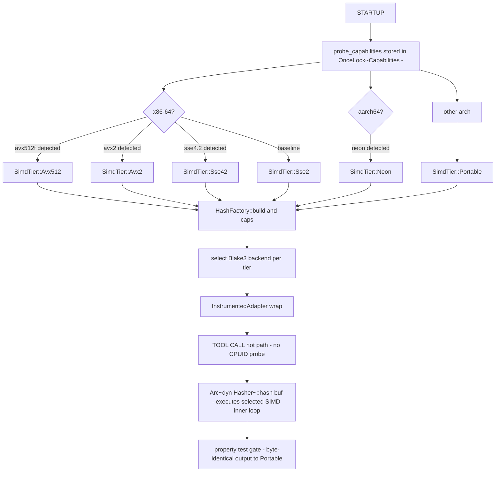
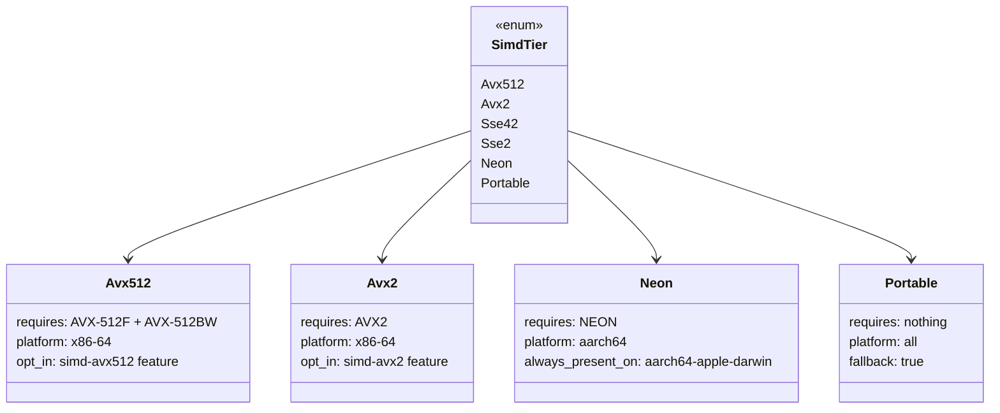

# ADR-0043 -- SIMD Runtime Dispatch and Native Instruction Tiering

## Context and Problem Statement

Substrate exposes CPU-intensive operations -- cryptographic hashing, byte
scanning, UTF-8 validation, line counting, pattern matching, and deflate
compression -- over an MCP stdio channel to LLM agents. These operations appear
in Zone B (sync I/O sub-threshold inline paths) and Zone C (CPU-bound via
`spawn_blocking`) as defined in [ADR-0003](0003-crate-stack-and-async-zones.md).

Three pressures drive the need for explicit SIMD tiering:

First, Zone-A and sub-threshold Zone-B tool calls bypass the async-job
overhead of [ADR-0040](0040-async-job-control-plane.md); their total latency is
dominated by the inner loop: hash computation for `fs.hash`, byte scanning for
`text.search`, UTF-8 validation for every text tool, and CRC32 for archive
records. SIMD compresses that inner-loop envelope by a factor of 2x to 10x on
modern hardware.

Second, substrate is distributed as a single binary consumed by operators
running a variety of x86-64 and aarch64 CPU generations. Separate per-CPU
build artifacts are operationally unacceptable (ADR-0015). Runtime dispatch --
probing CPUID once at startup, caching the result, and selecting the matching
SIMD backend -- provides near-native throughput without per-operator rebuilds.

Third, the pure-Rust contract established by the forthcoming
[ADR-0044](0044-no-subprocess-policy.md) requires that every SIMD path come
from a crate that binds intrinsics directly in Rust. Wrapping a system library
such as OpenSSL or zlib via FFI would re-introduce the subprocess/dynamic-link
coupling that ADR-0044 prohibits.

## Decision Drivers

- Inner-loop latency for Zone B/C tools must not regress relative to a
  naive portable implementation; the >15% regression gate in
  [ADR-0030](0030-performance-budgets.md) applies.
- A single binary ships to operators; no rebuild per CPU generation.
- Pure-Rust crates only; no FFI to system SIMD wrappers
  ([ADR-0044](0044-no-subprocess-policy.md)).
- Unsafe code is permitted only for narrow SIMD intrinsic wrappers with
  explicit audit discipline ([ADR-0014](0014-build-system-and-toolchain.md)).
- SIMD paths must produce byte-identical output to the portable path on the
  same input (determinism contract).
- AVX-512 must be opt-in because of CPU frequency throttling on older Intel
  steppings (Skylake-X, Cascade Lake).
- `SimdTier` enum is already declared in `substrate-domain` via
  [ADR-0042](0042-capability-adapter-factory.md) and must not be redefined here.

## Considered Options

1. Compile with `target-cpu=native` and distribute a build per CPU family.
2. Use runtime dispatch inside each crate individually with no central registry.
3. Probe CPUID once at startup, cache in `OnceLock<SimdTier>`, and have all
   SIMD-aware crates consult the cached tier via the `Capabilities` struct
   (selected -- extends ADR-0042).
4. Use dynamic linking against platform SIMD libraries (e.g., zlib-ng shared
   object).

## Decision Outcome

Chosen option: "Single-probe `OnceLock<SimdTier>` cached in `Capabilities`,
consulted by all per-port factory implementations", because it reuses the
detection and audit infrastructure already specified in ADR-0042, produces a
single auditable startup event, and keeps all SIMD crate selection logic in
adapter crates without touching `substrate-domain` internals.

`target-cpu=native` is forbidden for distributed release builds; it is
permitted only for local development profiles (see Cargo feature design below).

### SimdTier Enum (canonical definition: ADR-0042)

The `SimdTier` enum is declared in `substrate-domain::capabilities`:

    pub enum SimdTier {
        Avx512,   // x86-64 with AVX-512F + AVX-512BW
        Avx2,     // x86-64 with AVX2
        Sse42,    // x86-64 with SSE4.2
        Sse2,     // x86-64 baseline (always present on x86-64)
        Neon,     // aarch64 with NEON (always present on aarch64-apple-darwin)
        Portable, // scalar fallback for other architectures
    }

Detection is performed once at startup inside `probe_capabilities()`:

- x86-64: `std::is_x86_feature_detected!("avx512f")` then `"avx2"` then
  `"sse4.2"` then `"sse2"`. Falls back to `Sse2` on any x86-64 host.
- aarch64: `std::arch::is_aarch64_feature_detected!("neon")` -- always true
  on `aarch64-apple-darwin` and `aarch64-unknown-linux-gnu`.
- Other: `Portable`.

The result is stored in the process-global `OnceLock<Capabilities>`. A startup
audit event `SUBSTRATE_SIMD_TIER_DETECTED` is emitted via `tracing::info!`
before any MCP session is accepted.

### Operation-to-Crate-to-ISA Matrix

The following list maps each hot inner loop to its SIMD-accelerated crate,
the ISA tiers leveraged, and the substrate tools that benefit.

- Hashing (BLAKE3)
  - Crate: `blake3` with features `simd`, `avx2`, `avx512` (opt-in), `neon`.
    Note: `mmap` feature DISABLED per signal-safety contract in ADR-0032.
  - x86-64: AVX-512 (opt-in), AVX2, SSE2 baseline.
  - aarch64: NEON; sha256 hardware intrinsic on Apple Silicon.
  - Tools: `fs.hash`, `archive.hash`.

- UTF-8 validation
  - Crate: `simdutf8`.
  - x86-64: AVX2, SSE4.2.
  - aarch64: NEON.
  - Tools: `fs.read` (encoding guard), `text.search`, `text.head`, `text.tail`,
    `fs.write` (encoding check on text-mode writes).

- JSON parse/serialize for STDIO framing
  - Crate: `simd-json` (primary) or `sonic-rs` (alternative evaluated at
    implementation time). Both crates provide AVX2 and NEON backends with a
    safe fallback.
  - x86-64: AVX2, SSE4.2, PCLMULQDQ.
  - aarch64: NEON.
  - Tools: all MCP tool request/response paths via `substrate-mcp-server`
    JSON framing layer.

- Base64 encode/decode
  - Crate: `base64-simd`.
  - x86-64: AVX2, SSSE3.
  - aarch64: NEON.
  - Tools: `fs.read` and `fs.write` in byte-array transfer mode.

- Byte scan / single-byte search
  - Crate: `memchr`.
  - x86-64: AVX2, SSE2.
  - aarch64: NEON.
  - Tools: `text.search` prefilter, newline detection for pagination cursors.

- Multi-pattern matching (Teddy SIMD)
  - Crate: `aho-corasick` (Teddy backend enabled when AVX2 or NEON detected).
  - x86-64: SSSE3, AVX2.
  - aarch64: NEON.
  - Tools: `text.search` multi-needle mode.

- Regex DFA (Teddy prefilter)
  - Crate: `regex` (uses `memchr` and Teddy internally via `aho-corasick`).
  - x86-64: SSSE3, AVX2.
  - aarch64: NEON.
  - Tools: `text.search` single-pattern regex mode.

- Glob match prefilter
  - Crate: `globset` (uses `memchr` internally).
  - x86-64: SSE2, AVX2.
  - aarch64: NEON.
  - Tools: `fs.find` path-pattern filtering.

- Line counting
  - Crate: `bytecount` (SIMD popcount of newline byte 0x0A).
  - x86-64: AVX2, SSE2.
  - aarch64: NEON.
  - Tools: `text.count_lines`.

- CRC32
  - Crate: `crc32fast` (CLMUL/PMULL hardware-acceleration).
  - x86-64: SSE4.2 + PCLMULQDQ.
  - aarch64: crc32 extension + PMULL (always present on Apple Silicon M1+).
  - Tools: `archive.zip.create` (local file header CRC, data descriptor).

- Deflate (gzip / zip compression)
  - Crate: `zlib-ng-sys` (via `fast-zlib` feature) or `libdeflater`
    (via `fast-deflate` feature). Both provide SIMD chunk-copy and SIMD
    Adler-32/CRC inner loops. Default build uses `async-compression` portable
    backend (declared in ADR-0003).
  - x86-64: SSE4.2, AVX2.
  - aarch64: NEON.
  - Tools: `archive.gzip.compress`, `archive.gzip.decompress`,
    `archive.zip.create`, `archive.zip.extract`.

- Bytewise memory copy
  - Provider: libc `memcpy` ifunc dispatch (REP MOVSB + ERMS on x86-64;
    NEON on aarch64). This is not a Rust crate; it is the platform ABI
    and does not require a Cargo feature.
  - Tools: `fs.copy` (large-file bulk copy), archive payload staging.

### Cargo Feature Design

SIMD features are additive and opt-in. Default builds include only the
baseline acceleration that every supported CPU provides.

    [features]
    # Default: scalar-safe minimum; simdutf8, memchr/std, blake3 portable SIMD.
    simd-baseline = ["dep:simdutf8", "dep:memchr", "dep:blake3/simd"]

    # AVX2 tier: requires simd-baseline.
    simd-avx2 = [
        "simd-baseline",
        "blake3/avx2",
        "dep:base64-simd",
        "dep:simd-json",
    ]

    # AVX-512 tier: requires simd-avx2. Opt-in only; see AVX-512 policy below.
    simd-avx512 = ["simd-avx2", "blake3/avx512"]

    # NEON tier (aarch64): requires simd-baseline.
    simd-neon = [
        "simd-baseline",
        "blake3/neon",
        "dep:base64-simd",
    ]

    # SIMD-accelerated JSON framing.
    fast-json = ["dep:simd-json"]

    # zlib-ng backend for gzip/zip compression.
    fast-zlib = ["dep:zlib-ng-sys"]

    # libdeflater backend (alternative to fast-zlib; exclusive).
    fast-deflate = ["dep:libdeflater"]

    # CI convenience alias: enables avx2 + neon + fast-json.
    simd-full = ["simd-avx2", "simd-neon", "fast-json"]

`default = ["simd-baseline"]`. Every non-baseline feature is opt-in. AVX-512
is opt-in even on capable CPUs; see AVX-512 Special Handling below.

### RUSTFLAGS and Target-CPU Baseline

Release builds for distributed artifacts:

- `x86_64-unknown-linux-gnu`:
  `RUSTFLAGS="-C target-cpu=x86-64-v2 -C codegen-units=1 -C lto=fat"`
  (x86-64-v2 = SSE4.2 baseline; covers Intel Nehalem 2008+, AMD Bulldozer 2011+).
- `aarch64-apple-darwin`:
  `RUSTFLAGS="-C target-cpu=apple-m1 -C codegen-units=1 -C lto=fat"`
- `aarch64-unknown-linux-gnu`:
  `RUSTFLAGS="-C target-cpu=neoverse-n1 -C codegen-units=1 -C lto=fat"`

`target-cpu=native` is FORBIDDEN for release builds distributed to operators.
It may be used in the `dev` Cargo profile for local development only.

The combination of a conservative `target-cpu` baseline plus runtime
`is_x86_feature_detected!` dispatch means the same binary binary runs safely
on any supported CPU while promoting to higher SIMD tiers transparently when
hardware supports them.

### Dispatch Pattern

The diagram below shows the full SIMD dispatch flow from the startup probe through factory construction to the hot-path tool call.

The class diagram below shows the `SimdTier` enum variants and their hardware prerequisites.

### Determinism Contract

Every SIMD path MUST produce byte-identical output to the `Portable` path on
the same input, for all input lengths including empty, single-byte, and
length-not-aligned-to-vector-width cases.

Validation mechanism:

- Property-based tests using `proptest` in each adapter crate that activates
  a SIMD backend. Test files: `crates/substrate-fs-query/tests/simd_equivalence.rs`,
  `crates/substrate-text/tests/simd_equivalence.rs`, etc.
- Each test generates random byte vectors of length 0 to 1 MB and asserts
  that SIMD tier output equals Portable output.
- CI matrix runs property tests under each Cargo feature combination:
  `simd-baseline`, `simd-avx2`, `simd-neon`, `simd-avx512`.

### Unsafe Code Policy

SIMD intrinsic calls are `unsafe fn`. The following discipline applies:

- Unsafe blocks are localized to narrow wrapper functions in a `simd_impl`
  module inside each adapter crate. No unsafe outside these wrappers.
- Each `simd_impl` module is annotated `#[allow(unsafe_code)]` at module level.
  All other modules in the crate use `#![forbid(unsafe_code)]` per ADR-0014.
- Each unsafe wrapper begins with a `debug_assert!` that the `SimdTier`
  precondition matches `Capabilities::get().simd_tier`, preventing unsafe
  invocation on CPUs that lack the required feature.
- A `tracing::trace!` call is emitted at the entry point of each unsafe
  wrapper in debug builds (`cfg(debug_assertions)`), to aid differential
  debugging of SIMD vs portable paths.

This scopes a narrow exception to the general `forbid(unsafe_code)` policy in
ADR-0014, justified by the CPUID-checked guard and audit discipline described
here.

### AVX-512 Special Handling

AVX-512 causes measurable CPU frequency throttling on Intel Skylake-X (2017),
Cascade Lake (2019), and early Ice Lake (2020) steppings due to the wider
execution unit activation increasing thermal density. This throttling can
reduce throughput for workloads that mix AVX-512 and scalar code by 5% to 15%.

Policy:

- The `simd-avx512` Cargo feature is disabled in default builds.
- Operators must explicitly enable it via `--features simd-avx512`.
- Even when the feature is compiled in, the runtime dispatch path performs a
  secondary CPU model check before promoting to `Avx512`. Safe models
  (Ice Lake 2020 B0 stepping+, Tiger Lake, Rocket Lake, Sapphire Rapids,
  AMD Zen 4+) are promoted. Older models revert to `Avx2` regardless of
  CPUID reporting `avx512f`.
- The secondary check is pure-Rust CPUID leaf enumeration (no subprocess).
- If the secondary check cannot determine the stepping (virtualized CPUID),
  the tier remains `Avx2` (safe default).

### Apple Silicon Specifics

On `aarch64-apple-darwin`:

- NEON is the baseline; `is_aarch64_feature_detected!("neon")` always returns
  true. `SimdTier::Neon` is always selected for this target.
- CRC32, PMULL, and sha256 hardware acceleration are always present on M1/M2/M3.
  `HashFactory` reflects this via the `Neon` tier selection, which activates
  blake3's NEON backend (incorporating sha256 HW when available).
- SVE and SVE2 are NOT available on Apple Silicon. Do NOT probe for SVE on
  `aarch64-apple-darwin`.
- On `aarch64-unknown-linux-gnu` (Neoverse-V family), SVE may be available
  but is out of scope for this ADR. A future Cargo feature `linux-sve` is
  reserved in the feature namespace but carries no implementation here.

### Performance Gate

Criterion benchmarks are required in `benches/` at workspace root per
[ADR-0030](0030-performance-budgets.md). New benchmarks for SIMD tiers:

- `bench_hash_<tier>` -- BLAKE3 over a 64 MiB synthetic buffer, one variant
  per tier (`portable`, `sse2`, `avx2`, `avx512`, `neon`).
- `bench_utf8_validate_<tier>` -- `simdutf8` validation of a 16 MiB UTF-8
  byte buffer.
- `bench_line_count_<tier>` -- `bytecount` newline scan over 8 MiB of text.
- `bench_crc32_<tier>` -- `crc32fast` over a 4 MiB buffer.

Minimum tier-promotion improvement thresholds (versus `Portable` baseline):

- BLAKE3 AVX2 vs Portable: >= 2x throughput.
- `simdutf8` AVX2 vs scalar: >= 5x throughput.
- `bytecount` AVX2 vs scalar: >= 3x throughput.

If a tier benchmark fails to meet its minimum threshold on the CI runner, that
tier MUST be downgraded to the next lower tier in the dispatch cascade for that
operation. The threshold verification script runs as part of the `bench` CI
stage and exits non-zero on any unmet threshold.

### Audit Fields

Cross-reference [ADR-0038](0038-audit-event-semantics.md):

- The `SUBSTRATE_SIMD_TIER_DETECTED` startup audit event includes field
  `simd_tier: string` (e.g., `"avx2"`, `"neon"`, `"portable"`).
- Per-tool audit events may optionally carry `simd_tier_used: string` when
  a SIMD operation is on the critical path of that tool call. This field is
  advisory; SIEM pipelines MUST NOT treat its absence as an error.
- The `SUBSTRATE_CAPABILITY_TIERS_SELECTED` event defined in ADR-0042 already
  includes `simd_tier`; no duplicate event is emitted.

## Consequences

### Positive

- Inner-loop latency for hashing, text scanning, and line counting drops by
  2x to 10x on AVX2 and NEON hosts with no operator action required.
- Single binary; no per-CPU distribution artifacts.
- Determinism contract enforced by property-based tests; SIMD bugs that
  produce wrong output are caught at CI, not in production.
- `OnceLock<Capabilities>` ensures CPUID is probed at most once per process;
  zero per-call overhead on the hot path.
- AVX-512 throttling risk is contained by default-off feature and secondary
  CPU model gate.

### Negative

- `simd_impl` modules in adapter crates contain `unsafe` blocks; review
  burden increases. Narrow scope and debug assertions mitigate but do not
  eliminate this.
- SIMD crate version churn (intrinsic API changes) may require adaptation work
  across minor releases.
- `fast-zlib` and `fast-deflate` features are mutually exclusive; Cargo does
  not enforce feature exclusivity, so documentation and CI must enforce the
  invariant.
- Minimum tier thresholds may not be achievable on CI runners without AVX2
  support; the matrix must include an AVX2-capable runner or use QEMU.

### Risks

- A CPUID spoof in a virtualized environment could report AVX-512 falsely,
  triggering a tier that causes an illegal-instruction fault. Mitigation: the
  secondary stepping check for AVX-512 defaults to `Avx2` when stepping is
  indeterminate; SIGILL is caught and logged as `SUBSTRATE_RUNTIME_INIT_FAILED`
  per [ADR-0036](0036-startup-error-contract.md).
- `simd-json` and `sonic-rs` introduce JSON parser behavior differences; one
  must be selected at implementation time and pinned. The choice is
  implementation-level; this ADR does not mandate which crate wins.

## Validation

- Property-based equivalence tests (`proptest`) in each adapter crate compare
  SIMD-tier output against Portable output for random inputs. CI runs these
  under each feature combination.
- Criterion benchmarks `bench_hash_<tier>`, `bench_utf8_validate_<tier>`,
  `bench_line_count_<tier>`, `bench_crc32_<tier>` must exist and pass the
  minimum tier-promotion threshold check.
- `cargo test --features simd-avx2` must pass on an AVX2-capable CI runner
  without any unsafe sanitizer warnings.
- Integration test: start substrate, verify `SUBSTRATE_SIMD_TIER_DETECTED`
  audit event appears in stderr before the first MCP `initialize` response.
- `cargo deny check` must pass with `simd-avx512`, `fast-zlib`, and
  `fast-deflate` features enabled (no denied licenses, no known advisories).
- `cargo check --target aarch64-apple-darwin --features simd-neon` must not
  compile any `std::is_x86_feature_detected!` call paths.

## More Information

- The `SimdTier` enum is the canonical type declared in `substrate-domain`;
  this ADR only specifies dispatch behavior, not re-declares the type.
- `base64-simd` and `simd-json` support runtime feature detection internally;
  they do not require a separate CPUID probe beyond what `probe_capabilities()`
  already performs.
- `linux-sve` feature namespace is reserved but carries no current
  specification. A future ADR will address SVE/SVE2 on Neoverse-V.

## Links

- [ADR-0003](0003-crate-stack-and-async-zones.md) -- async zones; Zone C
  CPU-bound hashing and text scanning are the primary SIMD beneficiaries
- [ADR-0014](0014-build-system-and-toolchain.md) -- `panic = "abort"`;
  general `forbid(unsafe_code)` policy; this ADR scopes a narrow exception
- [ADR-0022](0022-project-layout.md) -- Cargo workspace; adapter crates
  host `simd_impl` modules
- [ADR-0028](0028-platform-feature-gates.md) -- `cfg(target_os)` conventions;
  no SIMD cfg in `substrate-domain`
- [ADR-0030](0030-performance-budgets.md) -- >15% regression gate; criterion
  bench location and baseline management
- [ADR-0032](0032-signal-safety.md) -- blake3 `mmap` feature DISABLED;
  signal-safety requirement
- [ADR-0036](0036-startup-error-contract.md) -- SIGILL fallback handling;
  `SUBSTRATE_RUNTIME_INIT_FAILED` startup error envelope
- [ADR-0038](0038-audit-event-semantics.md) -- audit event shape;
  `simd_tier` field placement
- [ADR-0042](0042-capability-adapter-factory.md) -- `SimdTier` enum
  declaration; `Capabilities` struct; `probe_capabilities()`; `HashFactory`
  tier cascade; `SUBSTRATE_CAPABILITY_TIERS_SELECTED` event
- [ADR-0044](0044-no-subprocess-policy.md) -- prohibits subprocess-based
  CPUID detection; pure-Rust intrinsic probe is the required path
