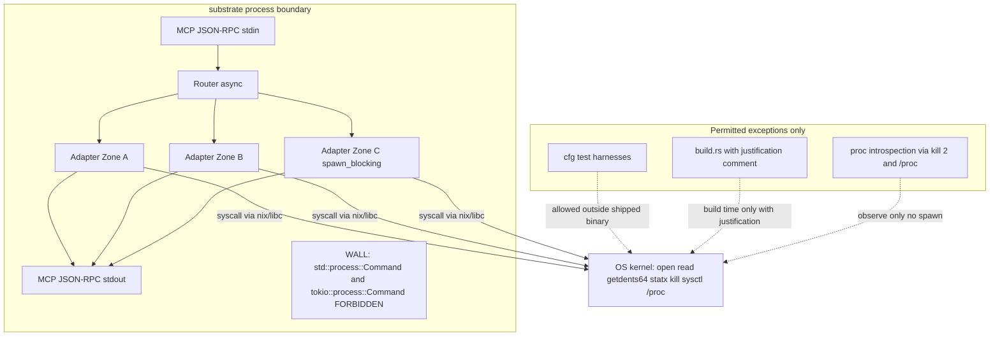

# ADR-0044 — No Subprocess Policy

## Context and Problem Statement

Substrate exposes POSIX OS-management primitives to LLM agents over a STDIO
MCP channel. Every byte on stdout is part of the JSON-RPC protocol frame
(see [ADR-0005](0005-stdio-transport.md)). Any design that invokes an external
binary — even one redirected to stderr — introduces attack surfaces, failure
modes, and portability constraints that contradict substrate's safety-first
promise. The question is whether to allow subprocess invocations at all, and
if not, what the enforcement mechanism is.

## Decision Drivers

- stdout is the MCP wire; stray output from a child process corrupts the
  framing ([ADR-0005](0005-stdio-transport.md)).
- panic = abort is the cargo profile policy; subprocess failure modes (binary
  missing, OOM in fork, exec failure) cannot be caught by the compiler.
- Hexagonal layering ([ADR-0022](0022-project-layout.md)) requires all
  capability implementations to be testable without external tooling.
- The supply-chain policy (cargo-deny, cargo-audit) provides no visibility into
  binaries resolved at runtime; only pure-Rust crates are auditable at
  build time.
- Performance budgets ([ADR-0030](0030-performance-budgets.md)) leave no room
  for fork/exec overhead on hot paths.

## Considered Options

1. **No subprocess, ever** — all capabilities bind to syscalls or pure-Rust
   crates via FFI.
2. **Allow subprocess for optional features behind a Cargo flag** — subprocess
   path is opt-in at compile time.
3. **Allow subprocess inside tokio::process::Command with timeout** — treat
   external binaries as fallback when no crate exists.

## Decision Outcome

> **SUPERSEDED 2026-05-24 by [ADR-0052](0052-subprocess-execution-architecture.md):** subprocess execution is now permitted as an opt-in bounded context (`crates/substrate-subprocess/`) behind Cargo feature `subprocess` (default-OFF); the no-subprocess constraint is preserved for all other crates.

Chosen option: "No subprocess, ever", because it is the only option that
preserves STDIO sanctity, eliminates a class of security vulnerabilities, and
keeps the binary fully auditable through Cargo alone.

### The Rule (normative, stable for audit reference)

Every functional capability of substrate MUST depend exclusively on Rust crates
that bind directly to syscalls, kernel APIs, or platform frameworks via
pure-Rust FFI. It is forbidden to execute an external binary, spawn a shell,
or invoke any non-Rust runtime as a subprocess. The single permitted exception
is process introspection (proc.list / proc.tree / proc.signal), which observes
other processes through /proc and kill(2) only — substrate itself never spawns
them.

### Why the Rule Exists

1. **Security.** Every subprocess is an extra attack surface: PATH
   manipulation, environment variable leakage, shell-injection, and
   signal misrouting are all introduced the moment a `Command` is constructed.
   An LLM agent can influence tool arguments; if those arguments flow into a
   shell, injection is possible regardless of quoting.

2. **Determinism.** Shelling out introduces non-Rust failure modes: the binary
   may be absent on the operator's system, the version may have diverged from
   what was tested, or locale settings may alter output format. These failures
   are invisible at compile time and untestable without the binary present.

3. **STDIO sanctity.** Substrate's stdout is the MCP JSON-RPC channel
   ([ADR-0005](0005-stdio-transport.md)). A subprocess that writes to stdout
   corrupts the protocol. Even a subprocess that goes only to stderr blurs the
   audit boundary for the `SUBSTRATE_AUDIT_*` event stream
   ([ADR-0038](0038-audit-event-semantics.md)).

4. **Portability.** Pure-Rust syscall paths work identically on Linux and macOS
   (see platform gates in [ADR-0028](0028-platform-feature-gates.md)) without
   probing binary availability at build time or runtime. Subprocess paths
   require both build-time and runtime checks on every target.

5. **Performance.** Fork-exec costs include page-table duplication, dynamic
   linker startup, libc `__init`, and signal-mask reset. These are pure
   overhead on the hot paths measured in [ADR-0030](0030-performance-budgets.md).

### Forbidden APIs and Patterns

The following APIs and crates MUST NOT appear in shipped crate source under
`crates/`:

- `std::process::Command` (any constructor or method chain).
- `std::process::Child` and `std::process::Stdio` (transitively unreachable
  when `Command` is absent; checked for defense in depth).
- `unsafe` `libc::system`, `libc::popen`, `libc::execv`, `libc::execvp`,
  `libc::execvpe`, `libc::execve`, `libc::fork`.
- `tokio::process::Command` (in addition to the std variant).
- Any crate whose primary purpose is shelling out: `subprocess`, `duct`,
  `xshell`, `cmd_lib`, `shell-words` (when used to construct a command),
  and any crate with equivalent semantics. These crates MUST NOT appear in any
  `Cargo.toml` under `crates/`.
- Transitive dependency on a shelling-out crate. When `cargo tree` reveals such
  a dependency, the substrate crate that pulls it in MUST be removed or
  replaced with an alternative that does not shell out.

### Permitted Exceptions

**Test code.** Tests compiled under `#[cfg(test)]` MAY use
`std::process::Command` to invoke spec or lint tools during integration tests.
Test binaries are not shipped; they are not part of the MCP server binary and
do not run under the MCP protocol channel.

**Build scripts.** A `build.rs` MAY invoke external tools when strictly
necessary (for example, to query platform header versions at build time). Every
such invocation MUST be preceded by a top-of-file justification comment
matching the regular expression:

    // no-subprocess-justification: .+

The comment MUST describe the binary invoked, why no pure-Rust alternative
exists, and the expected failure behavior if the binary is absent. The
no_subprocess Rego policy enforces this requirement in CI.

**Process observation tools.** The `proc.list`, `proc.tree`, and `proc.signal`
tools observe existing processes through Linux `/proc` (via the `procfs` crate)
and macOS `sysctl` with `kinfo_proc` (via `libc` and `nix`). Signal delivery
uses `nix::sys::signal::kill`. These operations read or signal other processes;
they do NOT spawn them. This is process introspection, not subprocess
invocation, and is consistent with the rule as stated above.

### Native Primitives Substituted for Common Subprocess Use Cases

The following alternatives MUST be used in place of external binaries:

- Process listing: NOT external `ps`. Use Linux `/proc` (the `procfs` crate);
  macOS `sysctl KERN_PROC` via `libc` and `nix`.

- Process signaling: NOT external `kill`. Use `nix::sys::signal::kill`.

- Filesystem walk: NOT external `find` or `fd`. Use the `ignore` crate for
  gitignore-aware traversal, or per-OS native calls (`getdents64` on Linux,
  `getattrlistbulk` on macOS) as defined in [ADR-0041](0041-filesystem-index-native-tiers.md).

- Filesystem search: NOT external `grep` or `ripgrep`. Use `regex`,
  `memchr`, and `aho-corasick` with SIMD dispatch as defined in
  [ADR-0043](0043-simd-runtime-dispatch.md).

- Archive operations: NOT external `tar`, `zip`, `gzip`, or `gunzip`. Use
  the `tokio-tar`, `async_zip`, and `async-compression` crates as specified
  in [ADR-0003](0003-crate-stack-and-async-zones.md).

- Hashing: NOT external `sha256sum` or `blake3sum`. Use the `blake3` or `sha2`
  crates (Zone C, Semaphore-gated).

- System information: NOT external `uname`, `hostname`, `uptime`, or `df`. Use
  `nix::sys::utsname`, `nix::sys::statvfs`, Linux `/proc/uptime`, and macOS
  `sysctl` with `nix`.

- CPU feature detection: NOT external `lscpu`, `sysctl machdep.cpu`, or
  `cat /proc/cpuinfo`. Use `std::is_x86_feature_detected!` and
  `std::arch::is_aarch64_feature_detected!` as specified in
  [ADR-0043](0043-simd-runtime-dispatch.md).

- Filesystem watching: NOT external `inotifywait` or `fswatch`. Use the
  `notify`, `inotify`, `fsevent-stream`, or `kqueue` crates as appropriate
  per platform gate ([ADR-0028](0028-platform-feature-gates.md)).

### Process Boundary Diagram

The diagram below shows that every capability path crosses the OS boundary via
a direct syscall arrow. No arrow exits the process boundary toward an external
binary.

The diagram below shows the substrate process boundary: every capability arrow crosses the OS wall via a direct syscall; no `Command` arrow exits toward an external binary.

### Enforcement Mechanism

A new Rego policy file `docs/arch/policies/no_subprocess.rego` (package
`substrate.no_subprocess`) enforces this rule in CI. The policy is wired into
the full lane: `spec validate --lane full` runs `conftest` against it. The
policy denies merge when any of the following hold:

- Any non-test source file under `crates/` contains `std::process::Command`
  or `tokio::process::Command`.
- Any `Cargo.toml` under `crates/` lists a crate from the forbidden-crate
  deny-list (`subprocess`, `duct`, `xshell`, `cmd_lib`, and equivalents).
- Any `build.rs` uses `Command` without a top-of-file justification comment
  matching the regular expression `// no-subprocess-justification: .+`.

The Rego policy file itself is authored in a subsequent wave; this ADR
declares the requirement and the input contract. See
[ADR-0023](0023-cicd-pipeline.md) for CI lane definitions.

### Audit Event

After the capability probe defined in [ADR-0042](0042-capability-adapter-factory.md)
completes at startup, `substrate-mcp-server` emits a structured audit event
with code `SUBSTRATE_SUBPROCESS_POLICY_VERIFIED`. The event attests that the
build-time policy check confirmed no `Command` symbol is reachable from the
binary entry point. The payload includes: `correlation_id` (UUIDv7),
`timestamp` (ISO 8601), and `binary_hash` (blake3 hex of the executable).

### Migration Guidance for Future Maintainers

When a new tool requires a capability that appears to need an external binary:

1. Search crates.io and lib.rs for a pure-Rust crate that calls the relevant
   syscall or platform API directly.
2. If no crate exists, write a minimal binding using `libc` or `nix`, and open
   a crate proposal to the Rust ecosystem.
3. If a `build.rs` invocation is unavoidable, add the justification comment
   (see Permitted Exceptions above) and mention this ADR in the comment.
4. Never route around this policy by wrapping `Command` in an `unsafe` block;
   unsafe does not change the subprocess attack surface.

### Out-of-Scope Clarifications

- This policy does NOT forbid operators from running substrate as a subprocess
  of an LLM agent runtime. That is the MCP transport pattern (STDIO, see
  [ADR-0005](0005-stdio-transport.md)).
- This policy does NOT cover the spec framework itself (uv-based Python tooling
  under `~/dev/fapp/spec-framework/`). The policy governs only substrate's
  shipped Rust code under `crates/`.

## Consequences

### Positive

- The binary attack surface is bounded: no path injection, no environment
  leakage, no shell-injection vector originating from a subprocess.
- Cargo-level supply-chain auditing (cargo-deny, cargo-audit) covers 100% of
  runtime dependencies; no external binary escapes that scope.
- stdout remains an uncontested MCP wire; no child process can corrupt frames.
- Portability is guaranteed: Linux and macOS paths diverge only in which
  platform API is called, not in whether an external binary is present.

### Negative

- Some capabilities require writing thin FFI wrappers instead of delegating to
  well-tested CLI tools (e.g., `procfs` for Linux process metadata instead of
  parsing `ps` output). This is more code, but the code is auditable.
- Integration tests that verify real-system behavior (e.g., "does proc.signal
  actually deliver SIGTERM") must use `#[cfg(test)]` subprocess harnesses,
  which are an exception to the rule and must be carefully scoped.

## Validation

- `cargo grep -n "std::process::Command" crates/` must return zero results in
  non-test files (enforced by the `no_subprocess.rego` policy and `clippy::disallowed_methods`).
- `cargo grep -n "tokio::process::Command" crates/` must return zero results in
  non-test files.
- `conftest test --policy docs/arch/policies/no_subprocess.rego` must pass in
  the full CI lane.
- A manual audit of `cargo tree --workspace` must confirm none of the
  forbidden crates appear as transitive dependencies.

## More Information

The decision to ban subprocesses was informed by the STDIO transport invariant
([ADR-0005](0005-stdio-transport.md)), the async zone strategy
([ADR-0003](0003-crate-stack-and-async-zones.md)), the threat model
([ADR-0029](0029-threat-model.md)), and the platform feature gate conventions
([ADR-0028](0028-platform-feature-gates.md)). The enforcement Rego policy is a
sibling of the existing `security_invariants.rego`, `hexagonal_layering.rego`,
and `audit_event_invariants.rego` policies.

## Amendments

### 2026-05-24 — Superseded by ADR-0052

[ADR-0052](0052-subprocess-execution-architecture.md) introduces subprocess execution as an eighth bounded context behind the Cargo feature flag `subprocess` (default-OFF). This ADR is superseded in its absolute prohibition; the constraint is narrowed rather than removed.

The no-subprocess rule remains in force for all existing crates under `crates/` except the single new adapter `crates/substrate-subprocess/`. That crate is the only location in the workspace permitted to import `tokio::process::Command`. The `no_subprocess.rego` Rego policy is updated to whitelist the path `crates/substrate-subprocess/` from the `Command`-usage denial rule; all other crates remain subject to the original prohibition.

All five defensive rationales stated in this ADR (STDIO sanctity, security, determinism, portability, and performance) remain valid. ADR-0052 does not contradict them; instead it accepts their implications as constraints on the subprocess BC design and builds a fifth security layer (Layer 5 of ADR-0004) to enforce them within the subprocess execution path. The binary allowlist (default-deny), env-var allowlist, cwd PathJail, and mandatory elicitation for every `subprocess.spawn` call directly honor the security and determinism concerns articulated here.

The performance concern is explicitly acknowledged in ADR-0052: subprocess tools are always assigned to Bucket E (always-async, see ADR-0040), ensuring fork-exec overhead never appears on any synchronous hot path measured by ADR-0030.

The Permitted Exceptions section of this ADR (test code, build scripts, process introspection) is unchanged and unaffected by ADR-0052.

## Links

- [ADR-0003](0003-crate-stack-and-async-zones.md) — crate stack and async zones
- [ADR-0005](0005-stdio-transport.md) — STDIO transport (stdout sanctity)
- [ADR-0023](0023-cicd-pipeline.md) — CI/CD pipeline and lane definitions
- [ADR-0028](0028-platform-feature-gates.md) — platform feature gates
- [ADR-0029](0029-threat-model.md) — threat model
- [ADR-0030](0030-performance-budgets.md) — performance budgets
- [ADR-0038](0038-audit-event-semantics.md) — audit event semantics
- [ADR-0041](0041-filesystem-index-native-tiers.md) — filesystem index native tiers
- [ADR-0042](0042-capability-adapter-factory.md) — capability adapter factory
- [ADR-0043](0043-simd-runtime-dispatch.md) — SIMD runtime dispatch
- [ADR-0052](0052-subprocess-execution-architecture.md) — subprocess execution architecture (supersedes this ADR)
