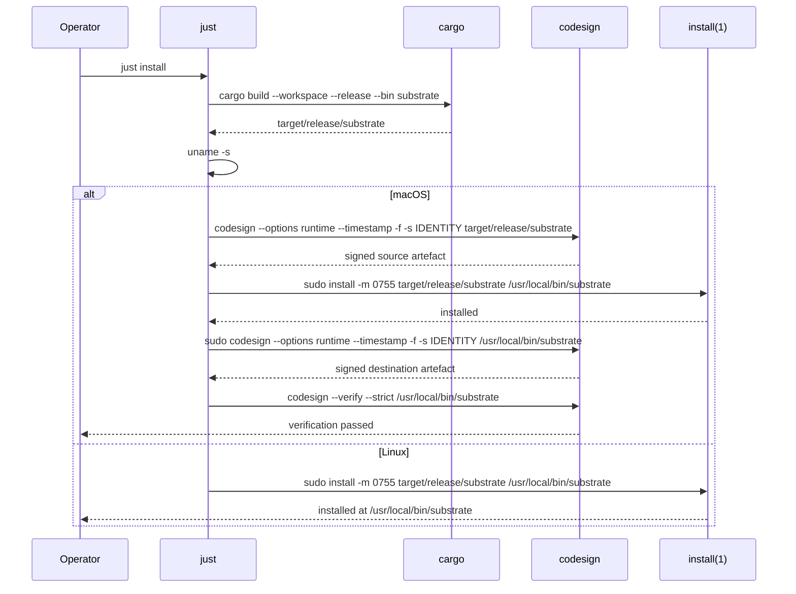

# ADR-0045 -- Local Deploy via codesign to /usr/local/bin

## Context and Problem Statement

The substrate MCP server is consumed locally by LLM agents (Claude Code,
Cursor, custom clients). Operators need a reproducible, low-friction way
to install the optimised release binary into a system-wide path that
honours macOS Gatekeeper and Linux PATH conventions, without provisioning
a full CI/CD pipeline (CI is deferred per ADR-0023).

The binary MUST:

1. Be built with the release profile (LTO, panic=abort, strip per ADR-0014).
2. Land at `/usr/local/bin/<binary>` so it is on the default PATH for
   most shells.
3. Be code-signed at two points on macOS, per operator policy:
   a. The source artefact under `target/release/` after build.
   b. The destination artefact under `/usr/local/bin/` after install.
4. Be named `substrate` (not `substrate-mcp-server`) to match the
   project identity and provide a stable shell invocation surface.

Linux operators get the same flow minus the codesign steps.

## Decision Drivers

- No CI pipeline at this stage (ADR-0023 deferred).
- macOS Gatekeeper rejects unsigned binaries placed under
  `/usr/local/bin/` when launched by GUI launchers or under hardened
  runtime sandboxing.
- A code signature embedded by `codesign` is preserved across `cp` and
  `install(1)` operations, but the signature ties to file identity
  (path-independent) and extended attributes (quarantine, signing
  timestamps) can be lost across copy, so the operator policy is to
  sign at the destination as well.
- The binary name `substrate-mcp-server` is verbose and exposes an
  implementation detail (the MCP server is the only binary product of
  the workspace). The shell-facing name should be `substrate`.

## Considered Options

- Install via `cargo install --path crates/substrate-mcp-server`
- Manual `cp` to `/usr/local/bin/` with no signing
- Custom `justfile` target invoking `cargo build --release`, signing,
  installing, and re-signing
- Full Homebrew formula

## Decision Outcome

Chosen option: **custom `justfile` target invoking `cargo build --release`,
signing source, installing to `/usr/local/bin/substrate`, and signing
destination**.

Rationale:

- `cargo install` does not run `codesign`; would require a wrapper anyway.
- Manual `cp` skips signing; defeats Gatekeeper.
- Homebrew formula is overkill at this stage and requires a tap; revisit
  after first public release.

The sequence diagram below shows the full install flow, branching by platform.



### Binary name change

The `[[bin]]` entry in `crates/substrate-mcp-server/Cargo.toml` is renamed
from `substrate-mcp-server` to `substrate`. The crate name remains
`substrate-mcp-server` so that workspace member references and the
project layout (ADR-0022) do not need to be reorganised. Cargo
distinguishes crate name from binary name; the binary artefact under
`target/release/` becomes `substrate`.

### justfile target shape

A `justfile` at the repository root provides three targets:

```just
# Build the release binary.
build-release:
    cargo build --workspace --release --bin substrate

# Install to /usr/local/bin with codesign on macOS, plain install on Linux.
install: build-release
    @if [ "$(uname -s)" = "Darwin" ]; then just _install-macos; else just _install-linux; fi

# Sign source, install, sign destination.
_install-macos: build-release
    codesign --options runtime --timestamp -f -s "${SUBSTRATE_SIGN_IDENTITY:--}" target/release/substrate
    sudo install -m 0755 target/release/substrate /usr/local/bin/substrate
    sudo codesign --options runtime --timestamp -f -s "${SUBSTRATE_SIGN_IDENTITY:--}" /usr/local/bin/substrate
    codesign --verify --strict /usr/local/bin/substrate
    @echo "installed and signed at /usr/local/bin/substrate"

_install-linux: build-release
    sudo install -m 0755 target/release/substrate /usr/local/bin/substrate
    @echo "installed at /usr/local/bin/substrate"
```

The signing identity is read from the `SUBSTRATE_SIGN_IDENTITY`
environment variable. The default fallback is the ad-hoc identity (`-`),
which is sufficient for local use but is NOT Gatekeeper-trusted. For
distributed builds, operators set `SUBSTRATE_SIGN_IDENTITY` to their
Developer ID Application certificate.

### Signing rationale (sign source AND destination)

On macOS, `codesign` writes the signature into the Mach-O binary's
`LC_CODE_SIGNATURE` load command. The signature is preserved across
`install(1)` and `cp(1)` because the signature is intrinsic to the
binary bytes. However:

- `install(1)` may clear extended attributes (`com.apple.quarantine`,
  `com.apple.metadata:_kCS_*`) depending on flags.
- Some package management workflows reset extended attributes, breaking
  the signing timestamp chain.

By signing both at the source and at the destination, the operator
guarantees:

1. The release artefact under `target/release/substrate` is a valid
   Gatekeeper-acceptable binary in isolation.
2. The installed artefact under `/usr/local/bin/substrate` carries a
   freshly applied signature with a current timestamp, regardless of
   intermediate handling.

### Verification

After `just install`, the operator runs:

```bash
codesign --verify --strict /usr/local/bin/substrate
codesign --display --verbose=4 /usr/local/bin/substrate
spctl --assess --type execute --verbose /usr/local/bin/substrate || true
```

`spctl` will print `rejected: source=Unnotarized Developer ID` for
non-notarised builds; this is expected for local dev. Notarisation is
out of scope for this ADR (see "Out of scope" below).

## Consequences

### Positive

- Reproducible local install with one command (`just install`).
- Binary on the default PATH as `substrate`.
- Gatekeeper-friendly signing chain for macOS operators.
- Ad-hoc signing fallback for contributors without a Developer ID.
- No CI infrastructure required.

### Negative

- Operator must have `just` and `codesign` available (macOS ships
  `codesign`; `just` is a one-line install).
- `sudo` is required to write to `/usr/local/bin`. Operators may relax
  this by adding their user to the `wheel` group or using a non-system
  directory.
- Ad-hoc signing (`-`) does NOT pass `spctl --assess`; for distribution,
  a Developer ID is required.

### Risks

- If the operator uses `SUBSTRATE_SIGN_IDENTITY` with a revoked
  certificate, Gatekeeper will reject the binary. The verification step
  prints a warning but does not abort.
- The destination signing replaces any provenance metadata from the
  source signing. Operators who require auditable provenance MUST
  capture the source signature (`codesign --display`) before the
  destination signing overwrites it.

## Validation

- `just install` exits 0 on macOS and Linux.
- `which substrate` returns `/usr/local/bin/substrate`.
- `substrate --version` (if implemented) returns the expected version
  string. For now, the binary speaks JSON-RPC over STDIO and has no CLI
  flags; `printf '' | substrate` exits cleanly after the initialize
  handshake fails on EOF.
- On macOS: `codesign --verify --strict /usr/local/bin/substrate` exits 0.
- The Cargo build artefact path is `target/release/substrate` (not
  `substrate-mcp-server`).

## Out of scope

- Notarisation via `notarytool` (covered by ADR-0023 when CI is
  reintroduced).
- Homebrew formula authoring (future ADR if public distribution becomes
  a goal).
- Windows installer (substrate is currently macOS + Linux only).
- Sigstore keyless signing (future ADR if CI-based release signing is
  enabled).
- Notarised distribution via Apple Developer ID Application
  certificates with notarytool (operator pre-staging only at this
  point).

## More Information

- ADR-0014 -- Cargo profile and flags (release profile producing the
  artefact this ADR installs).
- ADR-0022 -- Project layout (crate `substrate-mcp-server` with binary
  `substrate`).
- ADR-0023 -- CI/CD pipeline (deferred; this ADR provides the local
  alternative).
- ADR-0024 -- Repository conventions (commit, branch, sign-off).

## Links

- macOS codesign reference:
  <https://developer.apple.com/library/archive/technotes/tn2206/_index.html>
- just task runner: <https://github.com/casey/just>
