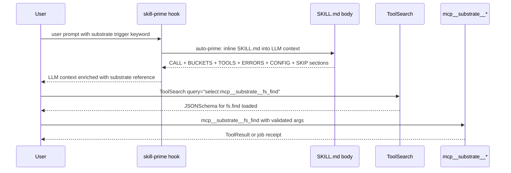
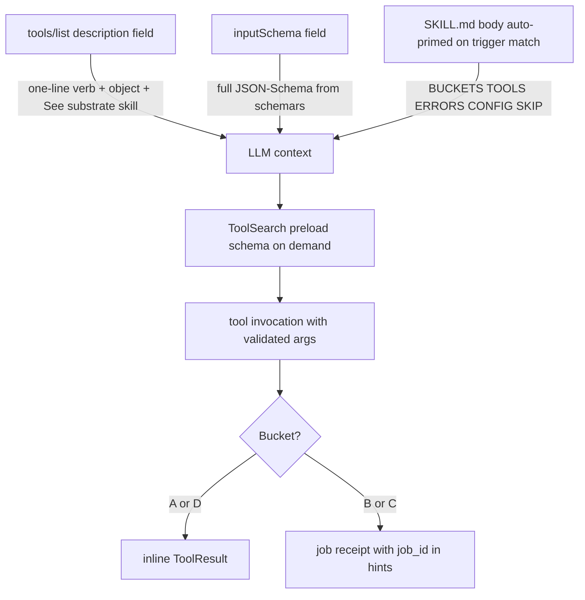

# ADR-0046 -- Companion SKILL.md for substrate MCP

## Context and Problem Statement

The substrate MCP server exposes 37 tools across seven bounded contexts plus
a job control-plane. A consuming LLM client (Claude Code or any compatible
MCP host) needs:

1. A condensed reference of WHAT each tool does, WHEN to call it, and
   WHAT to AVOID, without re-reading the full ADR set on every turn.
2. Trigger heuristics so the client auto-loads substrate context when
   the prompt or working directory matches substrate-relevant signals.
3. A mandatory pre-call protocol for the deferred tools surface so the
   client loads the correct JSONSchema via `ToolSearch` before invoking
   a tool.

The MCP server itself is stateless and offers no out-of-band hint
channel. The convention adopted by other MCP servers consumed by the
same client (e.g. arithma, ssh) is a companion `SKILL.md` document
installed alongside the client, not inside the MCP server's repository.
That document carries the call protocol, trigger keywords, and a
narrative summary of the tool taxonomy.

## Decision Drivers

- LLM clients that read companion skills inline cut their per-turn token
  cost compared to re-discovering tool metadata via `tools/list` every
  call.
- The skill body acts as a stable contract between the server and the
  client — versioned with the server, but distributed at the client
  side.
- Substrate's tool descriptions per ADR-0007 (narrative arc, capped at
  180 tokens) are intentionally terse and cannot carry trigger heuristics
  or call-pattern guidance.
- The job control-plane (per ADR-0040) introduces a four-stage Push +
  Pull dual-channel contract that benefits from explicit client-side
  documentation.

## Considered Options

- Embed the skill content inside the rmcp server response (rejected:
  inflates every `tools/list` reply with prose).
- Distribute the skill as a separate package via Homebrew / cargo
  (rejected: heavyweight for what is a single Markdown file).
- Provide a `SKILL.md` file alongside this ADR and document the
  installation location and frontmatter schema (chosen).

## Decision Outcome

Chosen option: **provide a companion `SKILL.md` at a known client-side
install location, with a strict frontmatter schema and a stable body
structure**.

### Install location

The SKILL.md MUST be installed at:

```
${HOME}/.claude/skills/substrate/SKILL.md
```

This is the directory convention scanned by Claude Code clients. The
directory name `substrate` MUST match the `name:` field in the
frontmatter. Operators install it manually after running
`just install` per ADR-0045 -- the `just install-skill` target is added
to the justfile to copy the canonical SKILL.md from the substrate
repository into the client's skills directory.

### Frontmatter schema (REQUIRED keys)

```yaml
---
name: substrate
description: |
  One-paragraph summary, third person, no XML tags. <= 700 chars
  preferred, <= 1024 chars hard cap. Mentions tool count, transport,
  trigger conditions, and one CALL or AVOID rule.
user-invocable: true
allowed-tools: ToolSearch, Bash, Read
triggers: [substrate, mcp__substrate__, fs.find, fs.read, proc.list,
           sys.info, text.search, archive.tar, job.status]
peers: [arithma, ssh]
agents: {}
---
```

Field semantics:

- `name`: lowercase, hyphens allowed, <= 64 chars, MUST equal the
  directory name.
- `description`: third-person summary used by the client to decide
  whether to surface the skill. **Target <= 400 chars** (well under the
  700-char soft cap; hard cap is 1024). Token-efficiency rule — every
  match loads this content inline into the LLM context. Include ONLY
  signal that helps the LLM decide whether to use substrate this turn:
  capability categories, mandatory call rules, and SKIP conditions.
  Exclude implementation framing (language, transport, binary path,
  bounded-context names, tool counts) — that information does not help
  the LLM trigger or invoke tools.
- `user-invocable`: `true` so operators can invoke the skill explicitly
  via slash commands.
- `allowed-tools`: tools the skill body is permitted to call directly.
  At minimum `ToolSearch` (to load deferred tool schemas), `Bash` (for
  smoke / diagnostic invocations), and `Read` (to inspect substrate
  config files).
- `triggers`: case-insensitive keyword whole-word matches against the
  user prompt. Include the MCP-namespaced tool prefix
  `mcp__substrate__` plus a representative subset of the tool dotted
  forms.
- `peers`: other companion skills that frequently co-occur with
  substrate. `arithma` and `ssh` are the canonical peers.
- `agents`: free-form map of agent-name to rich context string. Empty
  `{}` is acceptable for the initial release.

### Body structure (REQUIRED sections)

The Markdown body MUST be **dense bullet form** -- no narrative prose.
Each section is a lookup reference for an LLM mid-turn; the LLM must
extract a fact in seconds without parsing paragraphs. Token-efficiency
rule -- every match loads the full body inline into context; words
spent on connective prose waste budget that could have been spent on
another match in the same turn.

Required sections, in order:

- `## CALL` -- preload command and response shape. <= 4 lines.
- `## BUCKETS` -- Bucket A / B / C / D classification per ADR-0040
  with the tools enumerated under each bucket; the LLM uses this to
  predict response shape (inline vs. `hints.job_id`).
- `## TOOLS` -- one-line bullet per tool, grouped by bounded context.
  Format: `- **<bc> (N)**: tool_a (qualifier), tool_b (qualifier), ...`.
  No verbose per-tool paragraphs.
- `## ERRORS` -- one-line bullet per `SUBSTRATE_*` code:
  `<CODE> -> <one-line recovery>`. Drawn from ADR-0010.
- `## CONFIG` -- minimal TOML block + one-line note that
  `[policy] roots` is mandatory.
- `## SKIP` -- short bullet list of workloads substrate does not cover,
  each routing the LLM to the correct alternative (Bash, `ssh` MCP,
  `arithma` MCP, ...).

Forbidden in the body:

- Narrative WHAT or overview sections -- the description already
  carries the matching signal.
- Implementation framing (language, transport, binary path,
  bounded-context architecture names).
- Trigger decision-tree paragraphs -- the `triggers:` frontmatter list
  drives matching; the body is consulted after a match.
- Versioning narrative -- the SKILL.md is versioned in lockstep with
  the server crate; a `version:` field MAY appear in frontmatter, but
  the body MUST NOT spend prose explaining it.

The body is CommonMark only -- no GFM tables, no Mermaid, no emojis,
per the project's documentation conventions.

The sequence diagram below shows the LLM turn flow from user prompt through skill-prime auto-load to tool invocation.



The flowchart below shows the MCP + skill synergy contract: thin descriptions in `tools/list`, full schema via `schemars`, and lookup reference in the skill body.



### Versioning

The SKILL.md is versioned alongside the server. The frontmatter MAY
include an optional `version:` field matching the substrate crate
version (currently `0.1.0`). When the tool surface changes (new tool,
removed tool, bucket reclassification), the SKILL.md is updated in
lockstep with the matching ADR amendment.

### Pre-call protocol (mandatory)

The body MUST instruct the client to call
`ToolSearch query="select:mcp__substrate__<tool_name>"` before invoking
any substrate tool. This is because substrate's MCP tools are exposed
as deferred tools (schema is not loaded until `ToolSearch` resolves it
on demand). Calling a deferred tool without the preload yields an
`InputValidationError`.

## Consequences

### Positive

- LLM client has a stable, condensed reference for substrate without
  re-fetching `tools/list` on every turn.
- Trigger heuristics route substrate-relevant prompts to the right
  tool surface automatically.
- Pre-call protocol prevents `InputValidationError` on deferred tools.
- The skill is portable across compatible clients that adopt the same
  `~/.claude/skills/` convention.

### Negative

- The SKILL.md must be kept in lockstep with the server's tool surface.
  Drift between SKILL.md and `tools/list` is a soft contract break.
- Operators must perform a one-time install step
  (`just install-skill`) in addition to `just install`.
- The companion skill lives at the client side, not the server, so
  publishing a server-only release (e.g. via Homebrew) cannot ship the
  skill automatically.

### Risks

- If a future server release adds a tool without updating SKILL.md,
  clients still discover the tool via `tools/list` but lose the
  trigger and pre-call hint coverage for it. Mitigation: the
  `just install-skill` target prints a diff between the in-repo
  SKILL.md and the installed copy so operators can detect skew.

## Validation

- `${HOME}/.claude/skills/substrate/SKILL.md` exists after running
  `just install-skill`.
- Frontmatter parses as YAML with all REQUIRED keys present.
- Body contains every REQUIRED section in the order listed above.
- Trigger keyword list overlaps the namespaced tool prefix
  `mcp__substrate__` so prompts referencing the wire name match.
- The skill's `description` is <= 1024 chars.

## Out of scope

- The lint pipeline that enforces SKILL.md schema conformance. Optional
  future work: a `skill-lint` target that runs the same frontmatter
  validation as the client itself.
- Distribution of the SKILL.md via package managers (Homebrew formula,
  cargo crate) -- out of scope at this stage; manual copy is the
  default.
- Multi-client compatibility shims (Cursor, other MCP hosts may use a
  different skills directory layout) -- the canonical install location
  is `~/.claude/skills/substrate/` only.

## More Information

- ADR-0007 -- tool card narrative arc (the per-tool description
  template used by `tools/list`; the skill body's `## TOOL TAXONOMY`
  section summarises these).
- ADR-0010 -- error taxonomy (drives the `## ERROR CODES` section).
- ADR-0013 -- MCP protocol version (skill body cross-references the
  preferred protocol `2025-11-25`).
- ADR-0035 -- path safety hardening (drives the `## CONFIG` allowlist
  requirement).
- ADR-0040 -- async job control-plane (drives the `## BUCKETS`
  section).
- ADR-0045 -- local deploy via codesign (the `just install` target
  this ADR extends with `just install-skill`).

## Links

- Claude Code skills directory convention:
  `${HOME}/.claude/skills/<name>/SKILL.md`.
- CommonMark spec: <https://spec.commonmark.org/>.

## Amendments

### 2026-05-22 -- Token-efficiency revision

The companion SKILL.md is loaded inline into the LLM context on every
match; description bytes are paid every turn the skill auto-primes.
Original ADR-0046 prescribed an 8-section body with narrative WHAT and
verbose tool taxonomy. Operating experience showed the narrative bytes
displaced budget for matching multiple skills in the same turn.

Revisions applied to both description and body specs:

- **Description**: target shrunk from <= 700 chars to <= 400 chars.
  Forbidden content: implementation framing (language, transport,
  binary path, bounded-context names, tool counts). Required content:
  capability categories, mandatory call rules (deferred ToolSearch
  preload, PathJail allowlist, elicitation gate), SKIP routing.
- **Body**: required sections collapsed from 8 to 6
  (CALL, BUCKETS, TOOLS, ERRORS, CONFIG, SKIP). Narrative WHAT removed
  (matching signal already in description). Tool taxonomy compressed
  to one-line bullets grouped by bounded context. Trigger decision
  tree removed (driven by `triggers:` frontmatter, not body prose).

The substrate companion skill at `${HOME}/.claude/skills/substrate/`
was updated in lockstep; description shrank ~60% (~967 -> ~380 chars)
while preserving every signal required for LLM matching and invocation.

### 2026-05-22 -- MCP + skill synergy contract

The companion SKILL.md is now the canonical lookup reference for the
substrate MCP server. Coordinated with the ADR-0007 2026-05-22
amendment that thinned tool descriptions:

- MCP tool description (shipped via `tools/list` `description` field):
  <= 100 chars, one-line verb + object + literal `See substrate skill.`
- MCP tool input schema (shipped via `tools/list` `inputSchema` field):
  full JSON-Schema generated by `schemars` from the request struct.
- Companion SKILL.md body: full lookup reference (BUCKETS, TOOLS,
  ERRORS, CONFIG, SKIP). Auto-primed by `skill-prime` when the user
  prompt or the active tool catalog matches the skill `triggers:`.

The `triggers:` frontmatter list MUST include the MCP-namespaced
prefix `mcp__substrate__` and the canonical dotted tool names
(`fs.find`, `proc.list`, `sys.info`, `text.search`, `archive.tar`,
`job.status`, ...). This link routes any LLM turn that mentions a
substrate tool (by either form) through the skill body, eliminating
the need to ship the lookup reference in every `tools/list` payload.

Result: descriptions inside `tools/list` carry only the matching
signal needed for the LLM to choose the tool; ARGS live in the
schemars-generated schema; the rest of the contract (buckets, errors,
config, skip routing) is paid once per matching turn via the skill.

Cross-reference: ADR-0007 Amendment 2026-05-22 -- MCP + skill synergy
(token efficiency).
