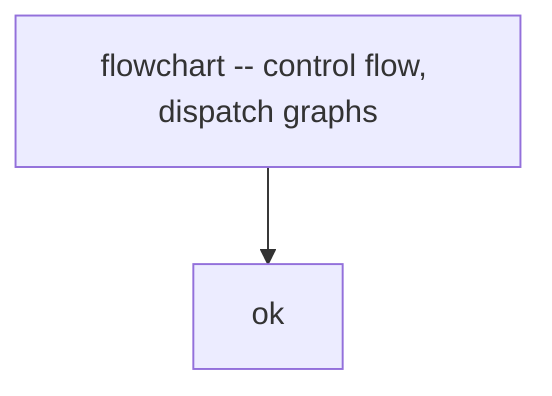

# ADR-0047 -- Mermaid diagrams in spec markdown

## Context and Problem Statement

Original project convention (recorded in `CLAUDE.md` and inherited by
the spec validators) restricted spec markdown to plain CommonMark and
forbade Mermaid, GFM tables, emojis, and task lists. The intent was to
guarantee broad render compatibility (any CommonMark renderer).

Operating experience showed that key architecture decisions (state
machines per ADR-0040, capability tier flows per ADR-0042, MCP push +
pull race resolution, hexagonal layering across 12 crates) suffer
without a visual layer. ASCII art works for simple flows but is
brittle, hard to author, and inconsistent across diagrams. Modern
renderers (GitHub, GitLab, VS Code, Cursor, Claude Code, Obsidian)
render Mermaid natively. The original constraint is no longer worth
its cost.

## Decision Drivers

- Mermaid renders natively in every modern markdown surface used by
  this project (GitHub repository view, IDE preview, Claude Code).
- Mermaid covers eleven diagram families relevant to substrate
  architecture: flowchart, sequence, state, ER, class, gantt, pie,
  gitGraph, mindmap, timeline, C4.
- ASCII art remains valuable when the diagram is small, when the
  shape does not fit a Mermaid family, or when a code reviewer
  benefits from in-line text.
- GFM tables, emojis, and task lists remain disallowed for the
  reasons originally captured by ADR-0001 (deterministic rendering,
  professional tone, no checkbox semantics in normative spec).

## Considered Options

- Keep ASCII-only (rejected: architectural complexity outgrew the
  rendering budget of ASCII).
- Adopt GFM tables + Mermaid both (rejected: GFM tables conflict with
  CommonMark-only renderers and were rejected for a different reason
  than diagrams).
- Allow Mermaid; keep GFM tables, emojis, task lists forbidden
  (chosen).
- Adopt PlantUML (rejected: requires server-side renderer, breaks
  on plain GitHub).

## Decision Outcome

Chosen option: **adopt Mermaid as the canonical diagram format for
spec markdown; ASCII art remains as a fallback when Mermaid cannot
render the intended shape**. GFM tables, emojis, and task lists
remain disallowed.

### Mandatory use

Spec markdown MUST include a Mermaid diagram when any of the
following hold:

- The text describes a state machine with three or more states.
- The text describes a sequence of three or more interactions between
  two or more participants.
- The text describes a control flow with two or more branch points.
- The text describes an entity-relation model with two or more
  aggregates.
- The text describes a hierarchy of three or more levels.

When in doubt, prefer a diagram. The token cost of a Mermaid block
is small; the comprehension benefit is large.

### Approved Mermaid families

The following Mermaid block types are approved for use:



- `flowchart` -- control flow, dispatch graphs, decision trees.
- `sequenceDiagram` -- client/server interactions, MCP handshakes,
  push/pull race resolution.
- `stateDiagram-v2` -- JobState, tool lifecycle, drain states.
- `erDiagram` -- value-object relations, config schema.
- `classDiagram` -- domain ports + adapter implementations,
  factory + strategy patterns.
- `gantt` -- release timelines, ADR adoption schedule.
- `pie` -- coverage breakdowns, bucket distribution.
- `gitGraph` -- branching strategies (rare; usually superseded by
  prose plus the ADR-0024 conventions).
- `mindmap` -- bounded-context taxonomy, tool grouping.
- `timeline` -- decision history, ADR amendment chronology.
- `C4Context` / `C4Container` / `C4Component` / `C4Dynamic`
  / `C4Deployment` -- C4 model (complementary to Structurizr DSL;
  Mermaid C4 ships inline in markdown without a renderer service).

### Disallowed (unchanged)

- GFM tables (use Mermaid `flowchart` or `classDiagram` for tabular
  relations, or CommonMark bullet lists for simple key/value pairs).
- Emojis (decorative; no semantic value).
- Task lists (`- [x]`, `- [ ]`) -- spec markdown is normative, not
  a tracking surface.

### Validator behavior

The `lint_md` validator continues to accept fenced code blocks with
arbitrary language tags (Mermaid blocks are valid CommonMark). No
change to the markdownlint configuration is required. Renderers that
do not understand Mermaid will display the source as a code block; the
content remains readable.

### Mermaid syntax validation (mmdc)

Mermaid blocks MUST also pass `mmdc` (mermaid-cli) syntax validation.
The project ships `scripts/lint-mermaid.sh` which:

1. Walks every `*.md` under the repository (excluding `target/`,
   `.git/`, `node_modules/`, `.venv/`, `.spec-cache/`).
2. Extracts each ```` ```mermaid ```` fenced block via Perl regex.
3. Pipes each block through `mmdc -i <block.mmd> -o /dev/null -q`.
4. Reports per-file block counts plus any syntax failures with the
   offending block index and the `mmdc` parser error trace.

Operators invoke the validator via `just lint-mermaid`. Required
binaries on the operator path: `mmdc` (mermaid-cli) and `perl`
(present on every macOS install and most Linux distros).

This validator is project-local. The spec framework's `lint_md`
validator does not run `mmdc`; the project-local script does. When
CI is reintroduced (per ADR-0023 deferral), the `just lint-mermaid`
target SHOULD become a required gate alongside `spec validate`.

Authoring hint: Mermaid `stateDiagram-v2` rejects parentheses inside
state labels (treats them as composite-state markers). Use `--`
or commas instead of `()` for parenthetical description in labels.

### Backward compatibility

Existing ASCII art diagrams are NOT required to be converted. New
spec content MUST follow the Mandatory-use rule above. When an
existing ASCII diagram is touched for unrelated reasons, the
maintainer SHOULD replace it with a Mermaid equivalent.

## Consequences

### Positive

- Spec markdown reads visually in every modern renderer.
- Eleven diagram families cover every architectural shape substrate
  encounters.
- Mermaid source diffs cleanly in pull-request review.
- No additional toolchain or renderer service required.

### Negative

- Plain-text terminals still render the Mermaid source as code rather
  than as a diagram. ASCII art retains an edge in pure-terminal
  contexts; the fallback rule preserves that option.
- Authors must learn Mermaid syntax. Mitigated by the small surface
  of the common families (flowchart, sequenceDiagram, stateDiagram-v2)
  and by the `glfm` skill which covers the syntax.

### Risks

- Renderer divergence: Mermaid evolves; older renderers may not
  support newer diagram types (e.g. recent C4 family). Mitigation:
  prefer the older, broadly-supported families (flowchart,
  sequenceDiagram, stateDiagram-v2, classDiagram, erDiagram) unless
  the newer family is essential.

## Validation

- `spec validate --lane full` continues to pass; `lint_md` accepts
  fenced Mermaid blocks as ordinary code blocks.
- A representative sample of spec markdown (one new ADR, one BC
  README, one top-level README) renders correctly in GitHub.

## Out of scope

- Conversion of every existing ASCII art diagram (covered by the
  "Backward compatibility" rule above; opportunistic during touch).
- PlantUML or other diagram languages (rejected).
- Server-rendered diagrams (Structurizr workspace.dsl handles C4 at
  the architecture level; Mermaid inside markdown handles per-file
  diagrams).

## More Information

- ADR-0001 -- Record architecture decisions (the meta ADR; this ADR
  amends the spec-markdown conventions originally captured there).
- ADR-0007 -- Tool card narrative arc (Mermaid sequence diagrams now
  acceptable for tool-flow visuals).
- ADR-0040 -- Async job control-plane (state machine diagram in
  Mermaid replaces the ASCII state diagram in that ADR going
  forward).
- ADR-0042 -- Capability adapter factory (Mermaid flowchart of
  composition-root dispatch is the canonical diagram).

## Links

- Mermaid documentation: <https://mermaid.js.org/>.
- GitHub Mermaid support: <https://docs.github.com/en/get-started/writing-on-github/working-with-advanced-formatting/creating-diagrams>.
- The `glfm` skill covers Mermaid syntax for GFM + GLFM rendering.
