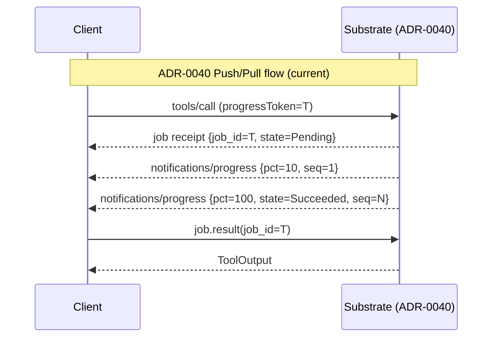
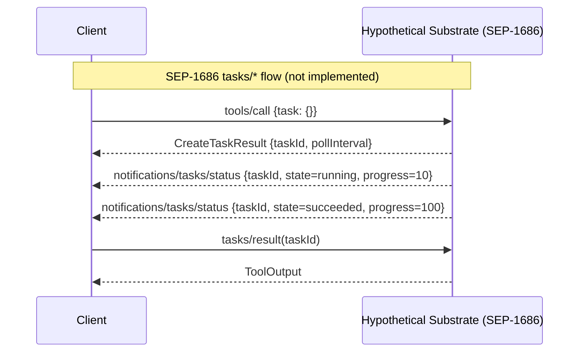

# ADR-0048 — MCP Tasks Primitive Evaluation (SEP-1686 deferral)

## Context and Problem Statement

MCP protocol version `2025-11-25` introduced an experimental Tasks primitive
(SEP-1686) alongside the existing `notifications/progress` mechanism. The Tasks
primitive defines a formal `tasks/*` namespace with four verbs:

- `tasks/get` — poll the current status of a running task
- `tasks/result` — blocking wait for a task in terminal state
- `tasks/cancel` — request cooperative cancellation
- `tasks/list` — enumerate active tasks visible to the caller

An originating request opts in by including a `task` field; the server responds
with `CreateTaskResult { taskId, pollInterval }` before proceeding with work.
Optional `notifications/tasks/status` push events mirror the progress-push
pattern already present in `notifications/progress`. SEP-1686 is transport-
agnostic and works over STDIO.

[ADR-0040](0040-async-job-control-plane.md) independently designed and
implemented a dual Push/Pull channel using `notifications/progress` (push) and
`job.result` long-poll via `tokio::sync::watch` (pull). The job control-plane
is already wired and operational in `crates/substrate-jobs/` and
`crates/substrate-mcp-server/src/handlers/`. Additionally,
`notifications/cancelled` is already handled in the MCP dispatch layer for
cooperative cancellation propagation into child `CancellationToken` instances.

This ADR records the evaluation of SEP-1686 and decides whether substrate should
adopt the `tasks/*` namespace for v0.1, adopt it in parallel to ADR-0040, or
defer adoption.

## Decision Drivers

- ADR-0040 already provides full functional parity with SEP-1686: submit,
  progress push, terminal-state pull, cancel, list, and idempotency keys.
- SEP-1686 is flagged experimental in the `2025-11-25` spec and is not promoted
  to stable in any published version as of 2026-05-22. Only a draft beyond
  `2025-11-25` exists; the stable graduation date is unknown.
- Migrating the implemented ADR-0040 surface to `tasks/*` namespace before v0.1
  is released introduces churn with no user-observable benefit; no client in the
  wild has expressed demand for SEP-1686 `tasks/*` over the existing
  `notifications/progress` path.
- ADR-0027 mandates a 7-day evaluation window after a new spec drop and a 30-day
  stability window before advertising the new preferred version. SEP-1686 has not
  completed the ADR-0027 adoption checklist (no integration tests, no capability
  flag in handshake, no ADR-0008 update).
- ADR-0005 constrains transport to STDIO only; both SEP-1686 and ADR-0040 are
  STDIO-compatible, so transport does not differentiate the options.
- rmcp 1.7.x ships STDIO Tasks examples, confirming SDK readiness, but the
  substrate job control-plane is not using rmcp's Tasks scaffolding and a
  migration would touch multiple crates simultaneously.
- Dual-stack (both `tasks/*` and `job.*` namespaces active) doubles the
  maintenance surface, creates two authoritative sources for job state, and
  increases the risk of inconsistent responses to concurrent callers.

## Considered Options

### Option A: Adopt `tasks/*` now, replacing the ADR-0040 channel

Replace `job.status`, `job.result`, `job.cancel`, and `job.list` with
`tasks/get`, `tasks/result`, `tasks/cancel`, and `tasks/list`. Replace the
`notifications/progress` push path with `notifications/tasks/status`.

Pros:
- Aligns substrate with the emerging MCP ecosystem standard if SEP-1686
  graduates to stable.
- Removes the custom `job.*` namespace in favour of a spec-defined namespace.

Cons:
- SEP-1686 is experimental; adopting it before it stabilises couples substrate
  to a moving target.
- Requires a non-trivial migration across `substrate-jobs`, `substrate-domain`,
  `substrate-mcp-server`, CUE schemas, and all Gherkin feature specs; high churn
  cost before v0.1 ships.
- No client currently requires `tasks/*`; the adoption would be speculative.
- If SEP-1686 changes its shape before graduation, substrate must migrate again.

### Option B: Adopt `tasks/*` in addition to the ADR-0040 channel (dual-stack)

Keep `job.*` and add `tasks/*` as a parallel facade over the same
`InMemoryJobRegistry`.

Pros:
- Clients that support SEP-1686 can use `tasks/*`; legacy clients use `job.*`.
- No flag-day migration; both paths coexist.

Cons:
- Doubles the MCP surface that must be tested, documented, and maintained.
- Two namespaces for the same semantic concept invite inconsistency: a job
  cancelled via `tasks/cancel` must be immediately visible to `job.status`, and
  vice versa; race conditions are subtle.
- The dual-stack path is harder to deprecate once clients adopt it.
- Violates the simplicity goal of STDIO-only deployment: more verbs, more
  surface, more failure modes.

### Option C: Defer adoption; keep ADR-0040 channel (chosen)

Record the evaluation, flag SEP-1686 on the watch list, and reassess after v0.1
ships or after explicit reevaluation triggers fire (see section below).

Pros:
- Zero implementation cost; no regression risk to working infrastructure.
- Full functional parity with SEP-1686 is already provided by ADR-0040.
- Defers a non-trivial migration until SEP-1686 is stable and client demand
  materialises.
- Consistent with ADR-0027 stability window: substrate does not rush to adopt
  experimental spec features.

Cons:
- Substrate diverges from the formal `tasks/*` namespace if SEP-1686 graduates
  and the ecosystem coalesces around it.
- Clients that only speak `tasks/*` (none known today) would need the `job.*`
  documentation to interact with the job control-plane.

## Decision Outcome

Chosen option: **Option C — defer adoption of the MCP `tasks/*` namespace; keep
ADR-0040 as the sole job control-plane for v0.1**.

The ADR-0040 dual-channel (push via `notifications/progress`, pull via
`job.result` long-poll) is implemented, tested, and provides full functional
parity with SEP-1686. Adopting SEP-1686 now would be pure churn. The
experimental status of the primitive means its interface may still change before
graduation. This decision is formally time-boxed: the reevaluation triggers in
the section below define objective conditions that reopen it.

## Consequences

Positive:
- v0.1 ships without carrying migration debt for an unproven experimental
  primitive.
- The ADR-0040 surface remains stable; no CUE schema, Gherkin spec, or crate
  API changes are required.
- ADR-0027 compliance is maintained: the 7-day evaluation has been completed and
  documented here; no adoption action is taken until the stability window and
  checklist are satisfied.

Negative:
- If SEP-1686 becomes the de facto standard before v0.1 ships to users, a
  catch-up migration will be needed after release rather than before.
- Clients that implement only `tasks/*` and not `notifications/progress`-based
  polling cannot use the async job paths without a translation shim.

Neutral:
- This ADR does not change any existing behaviour, interface, or schema.
- The `capabilities.experimental.substrate.jobs` flag introduced by ADR-0013
  Amendment 2026-05-21 continues to advertise the ADR-0040 control-plane.
  A future amendment to ADR-0013 will add a `tasks_primitive_supported` flag
  when Option A or B is eventually adopted.

## Compliance Check

This ADR is consistent with:

- [ADR-0001](0001-record-architecture-decisions.md) — evaluation decisions are
  captured as MADR 4.0 records.
- [ADR-0005](0005-stdio-transport.md) — no transport change; STDIO remains the
  only channel; both SEP-1686 and ADR-0040 operate over STDIO.
- [ADR-0013](0013-mcp-protocol-version.md) — preferred version remains
  `2025-11-25`; no capability negotiation change is introduced; the experimental
  tasks capability flag is explicitly deferred to a future amendment.
- [ADR-0027](0027-mcp-protocol-migration.md) — the 7-day evaluation window has
  been satisfied; the 30-day stability window and adoption checklist are not
  triggered because adoption is deferred.
- [ADR-0040](0040-async-job-control-plane.md) — the dual Push/Pull channel is
  unchanged and remains the authoritative job control-plane; this ADR documents
  that ADR-0040 provides functional parity with SEP-1686.

## Mermaid Diagram

The sequence diagram below places the ADR-0040 flow (left) and the SEP-1686
`tasks/*` flow (right) side by side to illustrate functional equivalence over
the STDIO channel. Both flows begin with a tool call, push progress events, and
expose a pull path for the terminal result.

Both flows are transport-agnostic JSON-RPC over STDIO. The structural difference
is namespace (`job.*` vs `tasks/*`) and opt-in mechanism (`progressToken` vs
`task` field). The terminal-state pull semantics are identical.

## Reevaluation Triggers

This decision MUST be reopened under any of the following conditions:

- SEP-1686 graduates from experimental status in a published, stable MCP spec
  version. Upon graduation, the ADR-0027 adoption checklist applies: evaluate
  within 7 days, implement behind capability flag, wait 30-day stability window.
- rmcp deprecates `ProgressNotification` / `notify_progress` in favour of a
  Tasks-only push model. Any rmcp MINOR or MAJOR release that removes or
  deprecates the `notifications/progress` surface triggers immediate evaluation.
- A client runtime that substrate targets (Claude Desktop, Claude Code, or a
  comparable production agent runtime) announces that it will only consume
  `tasks/*` and will cease consuming `notifications/progress`.
- The ADR-0040 job control-plane hits a documented scale or correctness ceiling
  that SEP-1686 would solve (e.g., cross-session task visibility, persistent task
  store, federated task IDs).
- A new MCP spec version is published that includes `tasks/*` as a normative
  (non-experimental) mandatory server capability.

## References

- MCP specification 2025-11-25 Tasks section:
  https://modelcontextprotocol.io/specification/2025-11-25/basic/utilities/tasks
- MCP 2026 roadmap (SEP-1686 background):
  https://blog.modelcontextprotocol.io/posts/2026-mcp-roadmap/
- rmcp 1.7.0 release notes (STDIO Tasks examples):
  https://github.com/modelcontextprotocol/rust-sdk/releases
- [ADR-0040](0040-async-job-control-plane.md) — Push/Pull dual-channel design
- [ADR-0027](0027-mcp-protocol-migration.md) — MCP protocol migration policy
