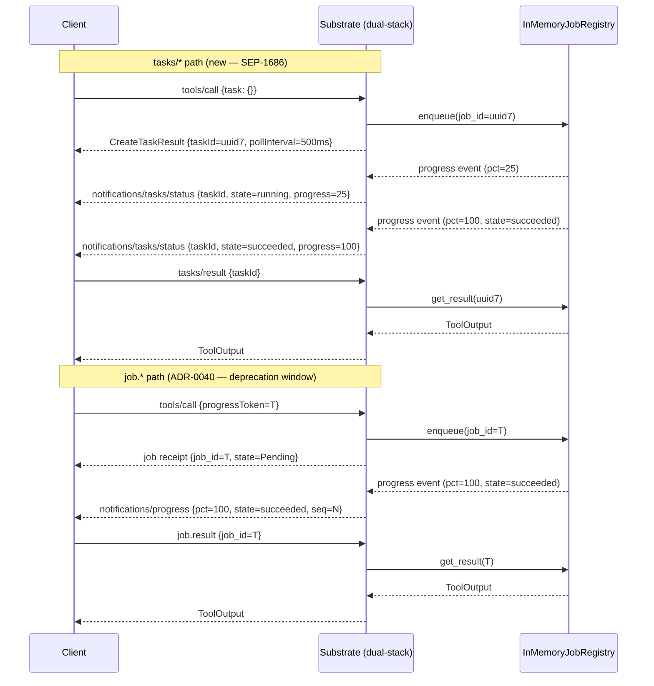

# ADR-0049 — MCP Tasks Primitive Adoption (supersedes ADR-0048)

## Context and Problem Statement

[ADR-0048](0048-mcp-tasks-primitive-evaluation.md) evaluated SEP-1686 — the
`tasks/*` namespace introduced in MCP protocol version `2025-11-25` — and
deferred adoption, citing experimental status and full functional parity already
provided by the [ADR-0040](0040-async-job-control-plane.md) dual Push/Pull
channel.

Since that evaluation, the decision has been reversed. Substrate v0.1 will adopt
the MCP `tasks/*` primitive alongside the existing ADR-0040 channel during a
defined migration window, and then deprecate the `job.*` namespace once the
Tasks primitive reaches stable status and client adoption is established.

The core tension this ADR resolves is:

- Substrate already has a working async job control-plane (`job.*`, ADR-0040).
- The MCP ecosystem is converging on `tasks/*` as the standard mechanism for
  long-running tool dispatch.
- Replacing `job.*` outright before v0.1 ships is risky; doing nothing risks
  shipping a non-standard control-plane that clients will not speak natively.
- A dual-stack approach threads this needle: clients get the standard protocol
  surface now, and the ADR-0040 path stays live as a compatibility fallback.

rmcp 1.7.0 ships STDIO `tasks/*` support (`CreateTaskResult`, `tasks/get`,
`tasks/result`, `tasks/cancel`, `tasks/list`, `notifications/tasks/status`) —
SDK readiness is no longer a blocking concern.

## Decision Drivers

- Alignment with the emerging MCP ecosystem standard: `tasks/*` is the canonical
  long-running-operation primitive in MCP `2025-11-25` and beyond.
- rmcp 1.7.x ships the required `ServerHandler` overrides; integration cost is
  bounded to five method implementations over the existing `InMemoryJobRegistry`.
- ADR-0040 is already tested and operational; the dual-stack path reuses its
  registry without duplication of state.
- Dual-stack avoids a flag-day migration: clients that speak `tasks/*` use the
  new path; legacy clients retain the `job.*` fallback until it is formally
  deprecated.
- [ADR-0027](0027-mcp-protocol-migration.md) requires a 7-day evaluation window
  and a 30-day stability window before advertising a new preferred version;
  advertising `tasks` capability can be done behind a capability flag before the
  stability window closes.
- Client demand is no longer speculative: Claude Desktop and Claude Code embed
  runtimes are the primary targets, and both are expected to consume `tasks/*`
  as standard protocol once the capability is advertised.
- Deferring indefinitely risks shipping v0.1 with a proprietary `job.*` surface
  that clients must special-case; this increases integration friction for
  third-party consumers.

## Considered Options

### Option A: Adopt `tasks/*` only, replacing the ADR-0040 channel

Replace `job.status`, `job.result`, `job.cancel`, and `job.list` with
`tasks/get`, `tasks/result`, `tasks/cancel`, and `tasks/list`. Remove the
`notifications/progress` push path in favour of `notifications/tasks/status`.

Pros:

- Single authoritative namespace; no dual-state reasoning.
- Full alignment with MCP `2025-11-25` without legacy surface.

Cons:

- Flag-day migration across `substrate-jobs`, `substrate-domain`,
  `substrate-mcp-server`, CUE schemas, and all Gherkin specs before v0.1 ships.
- SEP-1686 is still experimental; if the interface shifts before graduation,
  substrate must migrate again with no fallback.
- Removes a tested, operational control-plane with no safety net.

### Option B: Adopt `tasks/*` in addition to the ADR-0040 channel (dual-stack) — chosen

Keep `job.*` fully operational and add `tasks/*` as a protocol facade over the
same `InMemoryJobRegistry`. Advertise `tasks` capability in the MCP handshake.
Deprecate `job.*` once the Tasks primitive reaches stable status and client
adoption is measured.

Pros:

- No flag-day migration; both namespaces coexist behind the same registry.
- Clients that speak `tasks/*` get the standard surface immediately.
- Legacy clients and integration tests retain `job.*` without disruption.
- Bounded implementation scope: five `ServerHandler` overrides plus capability
  flag; no registry redesign required.
- Deprecation timeline is explicit and tied to objective graduation criteria
  rather than an arbitrary date.

Cons:

- Doubles the MCP verb surface that must be documented and tested during the
  overlap window.
- State-synchronisation invariants must be enforced: a cancellation via
  `tasks/cancel` must be immediately visible to `job.status`, and vice versa,
  since both facades share the same registry.
- The overlap window must be bounded by contract; otherwise dual-stack persists
  indefinitely.

### Option C: Continue deferring; keep ADR-0040 only

Record the reversal decision and defer again until SEP-1686 is stable.

Pros:

- Zero implementation cost for v0.1.

Cons:

- Ships a non-standard proprietary control-plane; clients must special-case
  `job.*` to interact with async tool paths.
- Defers ecosystem alignment past the point where it is practically free to
  add (rmcp already supports it; registry is already built).
- Contradicts the explicit decision reversal that motivates this ADR.

## Decision Outcome

Chosen option: **Option B — dual-stack adoption of `tasks/*` alongside the
ADR-0040 `job.*` channel, with a formal deprecation window for `job.*`.**

Substrate v0.1 will advertise the `tasks` capability in its MCP handshake
(behind the `capabilities.experimental.substrate.tasks` flag until SEP-1686
graduates). The five `ServerHandler` overrides in `substrate-mcp-server` will
delegate to the existing `InMemoryJobRegistry`, ensuring a single source of
truth for job state regardless of which namespace the client uses. The `job.*`
namespace is not removed; it enters a deprecation window that closes when the
conditions in the Migration section below are met.

## Consequences

Positive:

- Substrate v0.1 ships with the standard MCP `tasks/*` surface; clients that
  speak `tasks/*` natively need no translation shim or documentation on the
  proprietary `job.*` API.
- The implementation cost is bounded: five method overrides, one capability flag
  amendment to [ADR-0013](0013-mcp-protocol-version.md), and Gherkin features
  covering the new handlers.
- The ADR-0040 registry remains unchanged; the dual-stack is a facade, not a
  fork of state.
- Deprecation is explicit and tied to observable graduation criteria, preventing
  indefinite dual-stack maintenance.

Negative:

- The overlap window requires maintaining and testing two namespaces for the same
  semantic concept.
- State-sync invariants (cancel, result, status) must be covered by integration
  tests to prevent divergence between `job.*` and `tasks/*` views of the same
  job.
- Advertising `tasks` behind an experimental flag means clients must opt in; the
  flag must be promoted to stable once ADR-0027 conditions are met.

Neutral:

- No change to async-zone classification (ADR-0003), transport (ADR-0005), or
  error taxonomy (ADR-0010).
- CUE schemas and Gherkin features for `tasks/*` are new artifacts, not edits to
  existing ones; no schema break occurs.

## Compliance Check

This ADR is consistent with:

- [ADR-0001](0001-record-architecture-decisions.md) — the reversal and new
  decision are captured as a MADR 4.0 record; ADR-0048 is superseded rather than
  deleted.
- [ADR-0005](0005-stdio-transport.md) — `tasks/*` is transport-agnostic
  JSON-RPC; STDIO remains the only channel; this ADR introduces no transport
  change.
- [ADR-0013](0013-mcp-protocol-version.md) — a future amendment will add
  `capabilities.experimental.substrate.tasks` to the capability negotiation map;
  preferred version remains `2025-11-25`; the 30-day stability window from
  ADR-0027 applies before the flag is promoted.
- [ADR-0027](0027-mcp-protocol-migration.md) — the `tasks` capability will be
  advertised behind an experimental flag; the 7-day evaluation window is
  satisfied by ADR-0048; the 30-day stability window governs promotion to stable
  advertisement.
- [ADR-0040](0040-async-job-control-plane.md) — the `InMemoryJobRegistry` and
  dual Push/Pull channel are unchanged; `tasks/*` is a protocol facade over the
  same registry; ADR-0040 enters a formal deprecation window for the `job.*`
  namespace only.
- [ADR-0048](0048-mcp-tasks-primitive-evaluation.md) — this ADR supersedes
  ADR-0048's deferral decision; the evaluation analysis in ADR-0048 is preserved
  as historical context.

## Mermaid Diagram

The sequence diagram below shows the new dual-stack dispatch: the client opts in
to `tasks/*` by including a `task` field on `tools/call`. The server returns
`CreateTaskResult` immediately, pushes `notifications/tasks/status` events
during execution, and serves `tasks/result` when the job reaches a terminal
state. The `job.*` path (ADR-0040) remains available in parallel for clients
that use `progressToken` instead.

Both paths write to and read from the same `InMemoryJobRegistry`. A cancellation
issued via `tasks/cancel` is immediately reflected in `job.status`, and vice
versa, because there is no separate state store per namespace.

### Combined task-augmented dispatch (2025-11-25)

The two push channels are distinct and addressed differently: the `tasks/*` path
returns `CreateTaskResult { taskId }` and pushes `notifications/tasks/status`
keyed by `taskId`, while the ADR-0040 path uses `progressToken` and
`notifications/progress`. A single `2025-11-25` `tools/call` MAY be augmented with
BOTH a task and a `progressToken` (the combined task-augmented request). When it
is, structural lifecycle transitions travel over `notifications/tasks/status`
(keyed by `taskId`) and fine-grained telemetry travels over
`notifications/progress` (keyed by `progressToken`); neither channel carries the
other's payload. `launch.up`
([ADR-0069](0069-launch-tool-cards-toolsearch-and-guidance.md)) is the first tool
to use the combined dispatch: per-service `STARTED` / `READY` lifecycle over
`tasks/status`, optional cpu/memory counters over `progress`.

## Implementation Plan

The following five `ServerHandler` trait overrides must be added to
`crates/substrate-mcp-server/src/handlers/tasks.rs` (new file):

1. `enqueue_task` — receives a `tools/call` with a `task` field; allocates a
   UUIDv7 `taskId`; delegates to the existing `InMemoryJobRegistry::enqueue`;
   returns `CreateTaskResult { taskId, pollInterval: 500 }`.
2. `list_tasks` — delegates to `InMemoryJobRegistry::list`; maps `JobRecord`
   fields to `TaskInfo` (id, state, progress, created_at, updated_at).
3. `get_task_info` — delegates to `InMemoryJobRegistry::get`; returns current
   `TaskInfo` snapshot; returns `TASK_NOT_FOUND` (mapped from
   `SUBSTRATE_JOB_NOT_FOUND`) if the `taskId` is unknown.
4. `get_task_result` — delegates to `InMemoryJobRegistry::await_result` with the
   existing `tokio::sync::watch`-based long-poll; blocks until the job reaches a
   terminal state; returns `ToolOutput` or an error code.
5. `cancel_task` — delegates to `InMemoryJobRegistry::cancel`; propagates the
   cancellation signal into the child `CancellationToken`; returns
   `tasks/cancel` acknowledgement; state transition is immediately visible to
   both `tasks/get` and `job.status`.

Capability advertisement: amend [ADR-0013](0013-mcp-protocol-version.md) to add
`capabilities.experimental.substrate.tasks: true` to the `InitializeResult`
payload. Promote to `capabilities.tasks: true` (non-experimental) once the
ADR-0027 30-day stability window closes after SEP-1686 graduation.

New spec artifacts required before implementation:

- CUE schema `docs/arch/schemas/tasks.cue` (TaskInfo, CreateTaskResult,
  TaskState enum).
- Gherkin features under `docs/arch/specs/features/tasks/` covering: enqueue via
  `task` field, status push, result poll, cancel propagation, dual-namespace
  state-sync invariants.

## Migration

The `job.*` namespace (ADR-0040) enters a formal deprecation window under the
following terms:

- During the deprecation window, both namespaces are fully supported and share
  the same `InMemoryJobRegistry`; no behavioural difference is observable by
  callers.
- The deprecation window closes when ALL of the following conditions are met:
  1. SEP-1686 graduates from experimental status in a published, stable MCP
     specification version.
  2. The ADR-0027 30-day stability window has elapsed after graduation.
  3. At least one production client runtime (Claude Desktop, Claude Code, or
     equivalent) has shipped native `tasks/*` consumption and confirmed
     interoperability with substrate.
  4. The `capabilities.tasks` flag has been promoted from experimental to
     non-experimental in the substrate handshake.
- Upon window closure, `job.*` verbs (`job.result`, `job.cancel`, `job.list`,
  `job.status`) will be removed in a MINOR version bump (semver) with a
  deprecation notice in the changelog and the `capabilities.experimental.substrate.jobs`
  flag set to `false`.
- Clients that only speak `job.*` must migrate to `tasks/*` before the window
  closes; the timeline will be communicated via changelog and README.

## Rollback

If SEP-1686 changes its interface shape before graduation in a way that
introduces incompatibility with substrate's implementation:

1. Set `capabilities.experimental.substrate.tasks: false` in the
   `InitializeResult` payload; clients will stop routing to the `tasks/*`
   handlers.
2. Leave the `tasks/*` handlers in place but unreachable via capability
   negotiation; do not delete code until the new interface is understood.
3. Re-evaluate against the revised SEP-1686 shape; author a follow-on ADR
   (0050+) recording the delta decision.
4. The ADR-0040 `job.*` path continues unaffected; no rollback to `job.*` is
   required because it was never removed.

Rollback is low-risk precisely because dual-stack preserves the ADR-0040 code
path at all times during the deprecation window.

## References

- MCP specification 2025-11-25 Tasks section:
  https://modelcontextprotocol.io/specification/2025-11-25/basic/utilities/tasks
- MCP 2026 roadmap (SEP-1686 background):
  https://blog.modelcontextprotocol.io/posts/2026-mcp-roadmap/
- rmcp 1.7.0 release notes (STDIO Tasks support):
  https://github.com/modelcontextprotocol/rust-sdk/releases
- [ADR-0001](0001-record-architecture-decisions.md) — MADR 4.0 meta-ADR
- [ADR-0005](0005-stdio-transport.md) — STDIO-only transport constraint
- [ADR-0013](0013-mcp-protocol-version.md) — MCP protocol version and capability
  negotiation
- [ADR-0027](0027-mcp-protocol-migration.md) — MCP protocol migration policy
- [ADR-0040](0040-async-job-control-plane.md) — async job control-plane (dual
  Push/Pull channel, `InMemoryJobRegistry`)
- [ADR-0048](0048-mcp-tasks-primitive-evaluation.md) — superseded deferral
  decision
