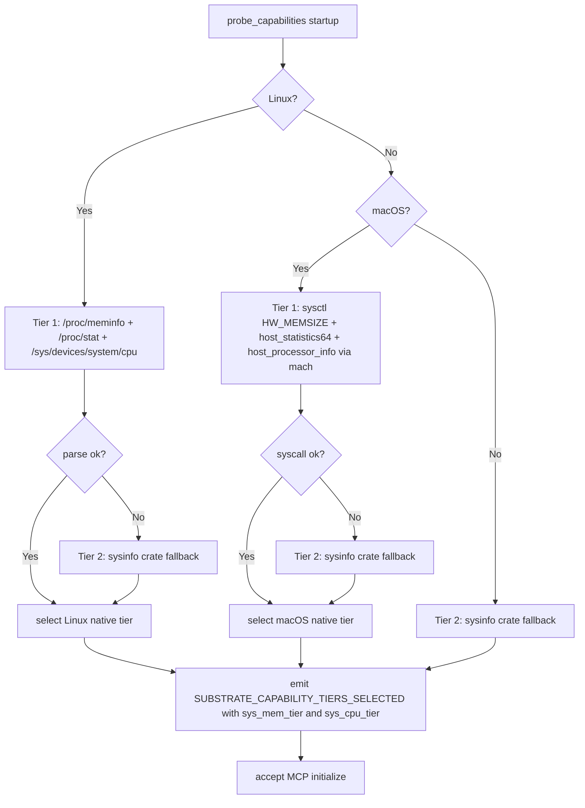

# ADR-0050 — System Resource Monitoring (sys.mem + sys.cpu)

## Context and Problem Statement

The `system-info` bounded context currently exposes read-only OS metadata tools
(`sys.uname`, `sys.uptime`, `sys.df`, `sys.hostname`, `sys.load_average`,
`sys.info`). LLM agents performing workload scheduling, capacity planning, or
anomaly detection require two capabilities that are absent: a snapshot of system
memory utilization and a snapshot of CPU topology and per-core utilization.
Without these tools, agents must shell out or invoke unsafe heuristics to
estimate available compute resources.

The question is: which OS data sources should back `sys.mem` and `sys.cpu`, in
what priority order, and how do these new tools integrate with the existing
capability tier factory established in [ADR-0042](0042-capability-adapter-factory.md)?

## Decision Drivers

- Zero conflict with [ADR-0044](0044-no-subprocess-policy.md): both tools are
  strictly read-only; no process is spawned.
- Consistency with the capability tier cascade pattern from
  [ADR-0042](0042-capability-adapter-factory.md): native OS interfaces are
  preferred; a cross-platform crate is the fallback.
- Bucket A classification per [ADR-0040](0040-async-job-control-plane.md):
  both snapshots complete in sub-millisecond time on all supported platforms.
- Platform gates follow the `cfg(target_os)` convention from
  [ADR-0028](0028-platform-feature-gates.md): no platform-specific code in
  `substrate-domain`.
- Aggregate tool output must adhere to the narrative-arc template from
  [ADR-0007](0007-tool-card-narrative-arc.md).

## Considered Options

- Option A: Use the `sysinfo` crate exclusively (cross-platform, no platform
  ifdefs required in substrate code).
- Option B: Native OS interfaces as tier-1 with `sysinfo` as tier-2 fallback,
  selecting via the `PortFactory` pattern.
- Option C: Native OS interfaces only, no fallback (breaks cross-platform
  portability).

## Decision Outcome

Chosen option: "Option B — native tier-1 with sysinfo tier-2 fallback via
PortFactory", because it maximizes accuracy and efficiency on both supported
platforms while retaining a portable fallback for environments where native
interfaces are restricted.

### Tool Definitions

**sys.mem**

Returns a `MemoryStats` aggregate containing:

- `total_bytes` — physical RAM total (u64)
- `used_bytes` — memory in active use (u64)
- `available_bytes` — memory immediately available without swapping (u64)
- `free_bytes` — memory not in use at all, excluding cached/buffered (u64)
- `swap_total_bytes` — total swap partition size (u64)
- `swap_used_bytes` — swap currently in use (u64)
- `platform_tier` — string tag of the data source used (informational)

Bucket: A (sync inline, sub-millisecond snapshot).

**sys.cpu**

Returns a `CpuStats` aggregate containing:

- `logical_cores` — count of logical CPUs as seen by the OS scheduler (u32)
- `physical_cores` — count of physical cores where available; null when
  unavailable (Option<u32>)
- `freq_mhz` — current frequency in MHz of the first logical core, or the
  aggregate average where per-core frequency is not available (Option<u64>)
- `per_core_load` — array of per-core utilization percentages in the range
  0.0–100.0 (Vec<f32>); one entry per logical core
- `temperature_c` — aggregate CPU package temperature in Celsius where
  available from the OS; null otherwise (Option<f32>)
- `platform_tier` — string tag of the data source used (informational)

Bucket: A (sync inline, sub-millisecond snapshot).

Note: per-core load requires two consecutive readings spaced by at least one
OS scheduler tick (typically 100 ms on Linux, variable on macOS). The adapter
caches the previous reading in a per-process `Arc<Mutex<CpuSnapshot>>` and
computes the delta on each `sys.cpu` call. The first call after process startup
returns zero for all per-core load values and marks `cold_start: true` in the
response hints map.

### Capability Tier Cascade

The following diagram shows the tier resolution logic applied at composition-root
startup when constructing the `MemoryStatsPort` and `CpuStatsPort` factories.

### Linux Native Tier (Tier 1)

**Memory** — parsed from `/proc/meminfo`:

- `MemTotal`, `MemAvailable`, `MemFree`, `SwapTotal`, `SwapFree` fields.
- `used_bytes` is derived as `MemTotal - MemAvailable`.
- Parsed with a single `BufRead` over the file; no subprocess; no external
  crate dependency beyond `nix` for the `open(2)` call.

**CPU** — combined sources:

- Logical core count: `nix::unistd::sysconf(SysconfVar::NPROCESSORS_ONLN)`.
- Physical core count: parsed from `/proc/cpuinfo` field `cpu cores` of the
  first processor block.
- Per-core frequency: `/sys/devices/system/cpu/cpu<N>/cpufreq/scaling_cur_freq`
  (one file per logical core; reads the first; falls through to null if missing).
- Per-core utilization delta: consecutive reads of `/proc/stat` fields
  `user + nice + system` vs `idle + iowait`; stored in `Arc<Mutex<CpuSnapshot>>`.
- Temperature: `/sys/class/thermal/thermal_zone0/temp` when present; null
  otherwise.

All reads use `spawn_blocking` (Zone B) since file I/O, though typically fast,
must not block the async executor.

### macOS Native Tier (Tier 1)

**Memory** — `sysctl` via `nix`:

- Total physical RAM: `sysctl hw.memsize` (type `u64`).
- Available and free memory: `host_statistics64(HOST_VM_INFO64)` returns
  `vm_statistics64_data_t`; fields `free_count`, `active_count`,
  `inactive_count`, `wire_count` are combined to derive `available_bytes`.
- Swap: `sysctl vm.swapusage` (type `xsw_usage`).

**CPU** — mach API via `libc`:

- Logical core count: `sysctl hw.logicalcpu`.
- Physical core count: `sysctl hw.physicalcpu`.
- Per-core frequency: `sysctl hw.cpufrequency` (not available on Apple Silicon;
  falls through to null when `ENOENT`).
- Per-core load: `host_processor_info(PROCESSOR_CPU_LOAD_INFO)` returns an
  array of `processor_cpu_load_info_data_t`; delta is computed between calls
  using the cached `Arc<Mutex<CpuSnapshot>>`.
- Temperature: not available through public macOS APIs; always null.

All mach calls are made via `libc::host_statistics64` and related FFI. The
adapter module is gated `#[cfg(target_os = "macos")]`.

### Cross-Platform Fallback (Tier 2)

When native tier-1 probes fail or when neither Linux nor macOS is detected,
the `sysinfo` crate is used. `sysinfo::System::new_with_specifics` is called
once per snapshot (Zone B via `spawn_blocking`). The `platform_tier` field in
the response is set to `"sysinfo"` to inform the caller of the degraded
accuracy level.

The `sysinfo` crate is listed as an optional Cargo dependency, enabled only when
the `sys-sysinfo-fallback` feature is active (default ON). Operators may disable
it at compile time if native tier-1 is guaranteed.

### Integration with ADR-0042 PortFactory

Two new factory types are introduced in `substrate-system-info`:

- `MemoryStatsFactory` implements `PortFactory<dyn MemoryStatsPort>`.
- `CpuStatsFactory` implements `PortFactory<dyn CpuStatsPort>`.

Both factories follow the exact tier-cascade and `InstrumentedAdapter` wrapping
pattern established in [ADR-0042](0042-capability-adapter-factory.md). The
`SUBSTRATE_CAPABILITY_TIERS_SELECTED` startup audit event is extended with
`sys_mem_tier` and `sys_cpu_tier` keys.

### New Config Keys

- `system.cpu_load_sample_interval_ms` — interval between consecutive
  `/proc/stat` or `processor_cpu_load_info` reads when pre-warming the delta
  cache at startup (default: 100). Startup pre-warm is a single background
  tokio task that fires once and stores the initial snapshot; it does not loop.

### Error Codes

- `SUBSTRATE_RESOURCE_UNAVAILABLE` — returned when the native tier probe
  succeeds at startup but a specific read fails at runtime (for example,
  `/proc/meminfo` is unreadable due to a container policy). Recovery hint:
  `"check container policy or system configuration for read access to /proc"`.
  This code extends the taxonomy from [ADR-0010](0010-error-taxonomy.md).

## Consequences

### Positive

- Agents can make informed scheduling decisions using memory pressure and CPU
  utilization without external tooling.
- Tier cascade ensures the tools work in containers, under restrictive kernels,
  and on both supported platforms.
- Bucket A classification keeps response latency under 1 ms in the common case.
- Zero subprocess dependency; both tools comply fully with ADR-0044.

### Negative

- Per-core CPU load requires a prior sample; the first call always returns
  zero-load values. The `cold_start` hint flag in `structuredContent.hints`
  informs the agent to discard and retry after the sample interval.
- macOS temperature is not exposed through public APIs; the field is always
  null on macOS. This is a platform limitation, not a missing feature.
- The `sysinfo` crate, as a tier-2 fallback, introduces a dependency whose
  internal implementation may use platform-specific calls not visible to
  `cargo-deny` auditing. Its inclusion is gated behind the
  `sys-sysinfo-fallback` feature and documented in the supply-chain allowlist.

### Risks

- Linux thermal zone paths (`/sys/class/thermal/thermal_zone0/temp`) are not
  standardized across all kernels and hardware; the adapter logs at
  `tracing::debug!` when the path is absent and returns null rather than an
  error.

## Validation

- Unit test: construct `MemoryStatsFactory` with `has_proc_meminfo = false`;
  assert fallback to `sysinfo` tier and `platform_tier == "sysinfo"`.
- Unit test: construct `CpuStatsFactory`; call `sys.cpu` twice with a
  100 ms sleep; assert `per_core_load` contains non-zero values on the
  second call and `cold_start` is absent from the second response hints.
- Integration test: on Linux, assert `platform_tier` in `sys.mem` response
  equals `"linux-proc"`.
- Integration test: on macOS, assert `sys.mem` `total_bytes` matches
  `sysctl hw.memsize` output.
- Integration test: assert Bucket A classification; `sys.mem` response time
  under 5 ms on a warmed-up server (criterion benchmark).

## Links

- [ADR-0002](0002-bounded-contexts.md) — system-info bounded context definition
- [ADR-0028](0028-platform-feature-gates.md) — platform cfg-gate conventions
- [ADR-0040](0040-async-job-control-plane.md) — Bucket A classification
- [ADR-0042](0042-capability-adapter-factory.md) — PortFactory pattern and tier cascade
