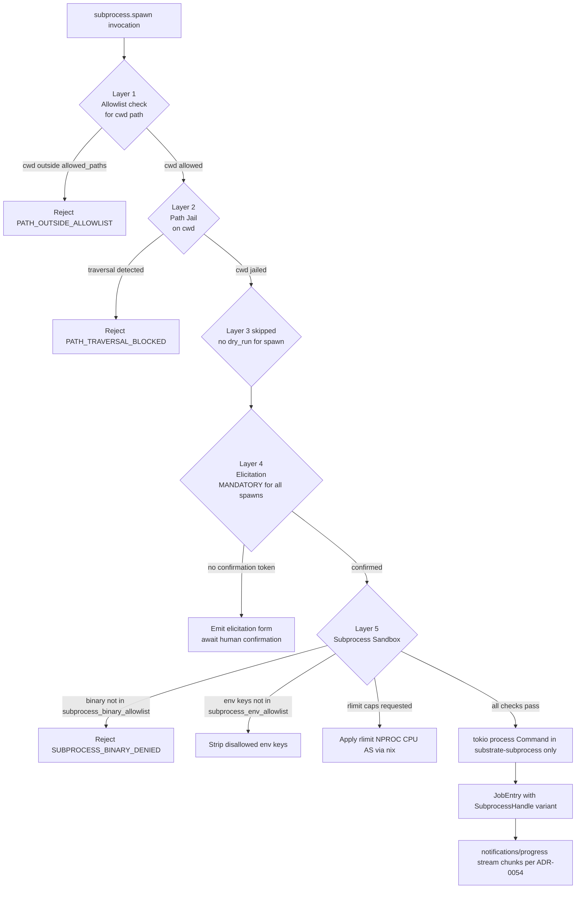

# ADR-0052 — Subprocess Execution Architecture (Supersedes ADR-0044)

## Context and Problem Statement

[ADR-0044](0044-no-subprocess-policy.md) established a blanket prohibition on
subprocess invocation in substrate. That decision was sound for the MVP scope —
read-only OS introspection and filesystem mutation — where every capability could
be bound to a direct syscall or a pure-Rust crate.

Operators now require substrate to support executing arbitrary binaries on their
behalf: running build scripts, invoking data-processing pipelines, collecting
output from instrumentation harnesses. This use case is categorically different
from "use subprocess to implement a capability that exists in pure Rust." It
is the capability itself: the agent wishes to run a program and capture its
output. Forbidding subprocesses in that context removes the utility without a
viable alternative.

The questions are: how should subprocess execution be introduced without
compromising the invariants that motivated ADR-0044, and what new security
controls are required given that the risks identified in that ADR are real?

## Decision Drivers

- The STDIO sanctity invariant from [ADR-0005](0005-stdio-transport.md) must be
  preserved: child process stdout must never mix with the MCP JSON-RPC channel.
- The threat model from [ADR-0029](0029-threat-model.md) must be extended with
  subprocess-specific STRIDE threats and mitigations.
- Security-by-default: subprocess execution must be default-OFF at both compile
  time (Cargo feature) and runtime (empty binary allowlist = deny-all).
- The job control-plane from [ADR-0040](0040-async-job-control-plane.md) must be
  reused; subprocess execution is an asynchronous long-running operation.
- Distribution integrity from [ADR-0015](0015-distribution.md): a single binary
  without sidecars or IPC; no external launcher.
- The cancellation and permit lifetime patterns from
  [ADR-0037](0037-async-cancellation-patterns.md) apply in full.

## Considered Options

- Option A: Maintain ADR-0044 as-is; reject the use case entirely.
- Option B: Allow `tokio::process::Command` inside a dedicated crate gated
  behind a Cargo feature, with a multi-layer sandbox (this ADR, selected).
- Option C: Introduce a sidecar binary that substrate communicates with over a
  local socket, delegating execution there.
- Option D: Allow subprocess in all crates without a feature gate, relying on
  the binary allowlist alone for runtime protection.

## Decision Outcome

Chosen option: "Option B — dedicated crate with Cargo feature gate and multi-layer
sandbox", because it isolates the subprocess attack surface to a single auditable
crate, preserves default-deny behavior at compile time, and integrates with the
existing job and security architectures without a new IPC channel.

Option C (sidecar binary) is rejected: it contradicts the single-distribution
model of [ADR-0015](0015-distribution.md), requires an IPC channel not present
in the current architecture, introduces a new audit chain for the sidecar
process, and complicates startup sequencing.

Option D is rejected: spreading `tokio::process::Command` across all crates
removes the audit boundary; the no-subprocess Rego policy from ADR-0044 would
need to be entirely removed rather than narrowed.

### Supersession of ADR-0044

[ADR-0044](0044-no-subprocess-policy.md) is superseded by this ADR with the
following narrowed rule:

`tokio::process::Command` is forbidden in ALL crates under `crates/` EXCEPT
`crates/substrate-subprocess/`, and only when the `subprocess` Cargo feature
is active in `substrate-mcp-server`. The no-subprocess Rego policy is updated
to reflect the exception. All reasoning from ADR-0044 continues to apply to
every crate outside `substrate-subprocess`.

The startup audit event `SUBSTRATE_SUBPROCESS_POLICY_VERIFIED` emitted by
ADR-0044 is replaced by `SUBSTRATE_SUBPROCESS_POLICY_STATUS` which carries
a field `subprocess_feature_enabled: bool`. When false the previous behavior
is fully preserved.

### New Bounded Context: subprocess

A seventh bounded context `subprocess` is introduced with the following
ubiquitous language:

- **SubprocessRequest** — value object capturing binary path, arguments,
  environment entries, working directory, and timeout_secs.
- **SubprocessHandle** — entity representing a running or completed subprocess;
  holds the `tokio::process::Child`, the process group ID (`pgid`), a
  `CancellationToken` child, and references to the stdout/stderr mpsc channels.
- **ProcessGroup** — value object: `pgid` (i32) plus `pid` (u32). A
  `ProcessGroup` with `pid == pgid` identifies a process group leader (setsid
  pattern per ADR-0053).
- **StreamEvent** — value object: a chunk of stdout or stderr bytes (max 4 KiB),
  a monotonic sequence number, and the stream tag (`stdout` or `stderr`).
- **BinaryAllowlist** — value object loaded from `security.subprocess_binary_allowlist`
  config; empty list = deny-all (default).
- **EnvAllowlist** — value object loaded from `security.subprocess_env_allowlist`
  config; only keys present in this list are forwarded to the child environment.
- **CascadeKill** — domain service responsible for orderly process group
  termination (SIGTERM → drain → SIGKILL); specified in
  [ADR-0053](0053-process-lifecycle-cascade-contract.md).

Tools exposed:

- `subprocess.spawn` — submit a `SubprocessRequest`; returns a job receipt.
- `subprocess.list` — list active `SubprocessHandle` entries (Bucket A).
- `subprocess.cancel` — cancel a running subprocess by `job_id`.
- `subprocess.result` — retrieve the final result for a completed subprocess.
- `subprocess.signal` — send an arbitrary POSIX signal to a subprocess by
  `job_id`; requires elicitation for SIGKILL/SIGTERM/SIGSTOP.

All subprocess tools are namespaced `subprocess.*`.

Bucket assignment: `subprocess.spawn` is Bucket E (always async, uses the
ADR-0040 job control-plane). `subprocess.list`, `subprocess.cancel`,
`subprocess.result`, and `subprocess.signal` are Bucket A (inline reads or
lightweight mutations on JobRegistry state).

Bucket E is a new bucket addition to ADR-0040: always-async with streaming
progress (extends Bucket C with the stream-multiplex channel from
[ADR-0054](0054-subprocess-stream-multiplex.md)).

### Security Layer 5: Subprocess Sandbox

The four-layer security model from [ADR-0004](0004-security-model.md) is
extended with a fifth layer that applies exclusively to `subprocess.spawn`.

The following diagram shows the full five-layer security stack and the
subprocess BC integration with the job control-plane.



**Layer 5 controls in detail:**

Binary allowlist (`security.subprocess_binary_allowlist`, default empty = deny-all):

- A list of absolute binary paths subject to PathJail validation. An empty list
  means no binary is executable. The operator must explicitly enumerate allowed
  binaries.
- Paths are validated through the PathJail at config-load time; relative paths
  or paths outside `allowed_paths` abort startup with `SUBSTRATE_CONFIG_INVALID`.

Environment allowlist (`security.subprocess_env_allowlist`, default empty):

- Only environment variable keys listed here are forwarded to the child.
  All other parent-environment keys are stripped before `Command::env_clear`
  plus selective `Command::env` for allowed keys.
- An empty allowlist means the child receives an empty environment, which is
  the default. Common safe keys (`PATH`, `HOME`, `TMPDIR`) must be explicitly
  listed by the operator.

Working directory:

- The `cwd` argument to `subprocess.spawn` is validated through the full
  four-layer security model (Layers 1–2). It must be an absolute path within
  an `allowed_paths` root.

Resource caps (Linux only, optional):

- If the `subprocess` feature includes the `subprocess-rlimit` sub-feature
  (default OFF), the pre-exec hook applies rlimits using `nix::sys::resource::setrlimit`:
  - `RLIMIT_NPROC`: caps number of child processes spawned by the binary.
  - `RLIMIT_CPU`: caps CPU time in seconds.
  - `RLIMIT_AS`: caps virtual address space.
- Config keys: `subprocess.rlimit_nproc`, `subprocess.rlimit_cpu_secs`,
  `subprocess.rlimit_as_bytes` (all optional; no cap if absent).

Elicitation (mandatory for all spawns):

- Every `subprocess.spawn` call triggers an MCP elicitation form regardless
  of the `dry_run` flag. The form presents the resolved binary path, arguments,
  working directory, and resource limits for human confirmation. This is the
  only tool in substrate that requires elicitation unconditionally on every
  call.

### STDIO Sanctity

`subprocess.spawn` sets `Command::stdout(Stdio::piped())` and
`Command::stderr(Stdio::piped())`. The child's stdout and stderr are captured
exclusively by the `substrate-subprocess` adapter. They are never attached to
the parent's stdout (the MCP JSON-RPC channel). The child inherits the parent's
stdin as `/dev/null` via `Command::stdin(Stdio::null())`.

### Cargo Workspace Impact

`tokio` workspace dependency gains the `process` feature:

```toml
# workspace Cargo.toml
[workspace.dependencies]
tokio = { version = "1.4x", features = ["rt-multi-thread", "macros", "sync",
           "time", "io-util", "fs", "process"] }
```

The `process` feature is only compiled when the `subprocess` feature is active
in `substrate-mcp-server`. The workspace dependency declaration includes the
feature; adapter crates that do not enable `subprocess` will not link against
the `process` module because `substrate-subprocess` is not in their dependency
graph.

New crate `substrate-subprocess` is added to workspace members. It depends on:
`substrate-domain`, `substrate-policy`, `substrate-jobs`, `tokio` (with
`process` feature), `nix`, `libc`, `tracing`.

`substrate-mcp-server` wires `substrate-subprocess` conditionally:

```toml
[features]
subprocess = ["dep:substrate-subprocess"]
```

### Quotas (amendment to ADR-0017)

The following quotas are added to the concurrency control model:

- `subprocess.max_per_client` — maximum active subprocesses per client (default 4).
- `subprocess.max_concurrent` — global maximum active subprocesses (default 8).
- `subprocess.spawn_rate_per_sec` — maximum `subprocess.spawn` calls per
  second per client (default 1); enforced via a per-client `RateLimiter`.

These quotas are enforced in the `SubprocessHandle` admission control path before
the job is submitted to the `JobRegistry`. Exceeding any quota returns
`SUBSTRATE_QUOTA_EXCEEDED` synchronously.

### New Error Codes

The following codes extend the error taxonomy from [ADR-0010](0010-error-taxonomy.md):

- `SUBSTRATE_SUBPROCESS_BINARY_NOT_ALLOWED` — the requested binary is not in
  `security.subprocess_binary_allowlist`. Recovery hint: `"add the binary
  absolute path to security.subprocess_binary_allowlist in the server config"`.
- `SUBSTRATE_SUBPROCESS_SPAWN_FAILED` — `tokio::process::Command` returned an
  error (for example, binary not found, permission denied on exec). Recovery
  hint: `"verify the binary exists and is executable at the configured path"`.
- `SUBSTRATE_SUBPROCESS_QUOTA_EXCEEDED` — per-client or global subprocess quota
  reached. Recovery hint: `"wait for active subprocesses to complete or cancel
  an existing subprocess"`.
- `SUBSTRATE_SUBPROCESS_RATE_LIMITED` — spawn rate exceeded. Recovery hint:
  `"reduce spawn frequency; maximum is configured in subprocess.spawn_rate_per_sec"`.
- `SUBSTRATE_INVALID_STATE_TRANSITION` — a state transition that violates the
  subprocess state machine was attempted. Recovery hint: `"report the
  correlation_id; this is an internal state machine violation"`.

## Consequences

### Positive

- Substrate can now serve as a full execution environment for LLM agents that
  need to run binaries, not just introspect the OS.
- The feature is default-OFF at compile time; operators who do not need
  subprocess execution have zero attack surface expansion.
- Binary allowlist default-deny ensures no binary runs unless an operator has
  explicitly permitted it.
- Elicitation on every spawn creates an auditable human-in-the-loop checkpoint
  for every subprocess invocation.
- Reuse of the ADR-0040 job control-plane means subprocess jobs receive the
  same cancellation, TTL, pagination, and audit trail as archive and filesystem
  jobs.

### Negative

- The `subprocess` feature must be explicitly enabled at compile time; operators
  who want subprocess execution must rebuild the binary.
- Mandatory elicitation on every spawn adds latency and requires a compliant MCP
  host to render the form. Automated unattended workflows are not possible.
- The binary allowlist must be manually maintained by the operator; there is no
  auto-discovery of safe binaries.

### Risks

- Subprocess execution fundamentally expands the attack surface regardless of
  sandboxing. The sandbox mitigates the risk but does not eliminate it. The
  threat model must be reviewed (ADR-0029 extension) when `subprocess` feature
  is enabled.
- A binary in the allowlist may itself spawn further children. Resource caps via
  `RLIMIT_NPROC` mitigate unbounded forking; the cascade kill contract from
  [ADR-0053](0053-process-lifecycle-cascade-contract.md) handles cleanup.

## Validation

- Unit test: construct a `SubprocessRequest` with a binary not in the allowlist;
  assert `SUBSTRATE_SUBPROCESS_BINARY_NOT_ALLOWED` is returned before any job is
  created.
- Unit test: construct a `SubprocessRequest` with a clean binary; assert a
  `JobEntry` with a `SubprocessHandle` variant is created and `job_state=Pending`.
- Integration test: spawn `true` (a binary that exits 0 immediately); assert
  job transitions to `Succeeded` and `subprocess.result` returns
  `exit_code=0`.
- Integration test: `subprocess.spawn` without confirming elicitation; assert
  the call blocks at elicitation and no process is created.
- Integration test: spawn with `subprocess` feature disabled (default build);
  assert the tool returns `SUBSTRATE_NOT_FOUND` (tool not registered).
- Security test: attempt to supply a binary path containing `../`; assert
  `SUBSTRATE_PATH_TRAVERSAL_BLOCKED` before the binary allowlist check.

## Links

- [ADR-0044](0044-no-subprocess-policy.md) — superseded by this ADR
- [ADR-0004](0004-security-model.md) — security model extended with Layer 5
- [ADR-0029](0029-threat-model.md) — threat model (subprocess threat entries)
- [ADR-0040](0040-async-job-control-plane.md) — job control-plane (Bucket E)
- [ADR-0015](0015-distribution.md) — single binary distribution
- [ADR-0017](0017-concurrency-limits.md) — concurrency limits (amended quotas)
- [ADR-0032](0032-signal-safety.md) — signal safety
- [ADR-0042](0042-capability-adapter-factory.md) — capability adapter factory
- [ADR-0053](0053-process-lifecycle-cascade-contract.md) — cascade kill contract
- [ADR-0054](0054-subprocess-stream-multiplex.md) — stream multiplex

## Amendment 2026-05-25: supervisor semantics

Per [ADR-0056](0056-subprocess-supervisor-semantics.md), the subprocess BC now
hosts both one-shot tooling and long-running supervised processes. New optional
fields on `SubprocessRequest`: `name` (operator alias with idempotent re-spawn
semantics), `restart_policy` (`Never` / `OnFailure` / `Always`), `health_probe`
(`None` / `HttpGet` / `PortOpen` / `LogPattern`), `log_rotation`
(`None` / `BySize`). New `SubprocessState` variants: `Starting` (child spawned,
probe not yet passed), `Ready` (first successful probe; backward-compatible alias
for `Running` when no probe is configured), `Restarting` (transient between exit
and re-spawn). Backward compatible: omitting all new fields preserves the original
one-shot semantics defined by this ADR. See [ADR-0056](0056-subprocess-supervisor-semantics.md)
for the full contract.

## Amendment 2026-06-10: check-to-exec TOCTOU invariant

Layer 5 above describes binary-path and `cwd` allowlist validation, but it left
the bind between the *validated* path and the *executed* path implicit. A
symlink swap performed between the allowlist check and the `exec` call could
redirect execution to a path outside the allowlist (a check-to-exec TOCTOU
window, analogous to the filesystem TOCTOU class covered by
[ADR-0035](0035-path-safety-hardening.md) but for the subprocess binary and
working directory rather than an `fs.*` path argument). This amendment records
the invariant that closes that window. It documents the behavior shipped in
commit `4bbf4fb`; it does not change the Layer 5 control set.

**Invariant — exec the canonicalized binary and the canonical cwd captured at
allowlist-check time.** `spawn_supervised` MUST construct the
`tokio::process::Command` from the canonicalized binary path that was matched
against `security.subprocess_binary_allowlist`, and MUST set the child working
directory to the canonical `cwd` path that passed the Layer 1/Layer 2 jail —
both captured at check time. The raw, caller-supplied binary string and `cwd`
string are NOT re-resolved at exec time. Because the canonical paths are
resolved once and then used verbatim for `exec`, a symlink (or directory)
swapped in after the allowlist check cannot redirect execution: the kernel
opens the already-resolved target, not the attacker-substituted link.

Concretely:

- The binary path is canonicalized through the PathJail; the resulting
  canonical `PathBuf` is the value passed to `Command::new`. A mismatch between
  the canonical path and any allowlist entry is rejected with
  `SUBSTRATE_SUBPROCESS_BINARY_NOT_ALLOWED` before the command is built.
- The `cwd` is canonicalized through the same jail; the canonical `PathBuf` is
  the value passed to `Command::current_dir`. The raw argument is never passed
  to `current_dir`.
- The capture of the canonical binary path and canonical cwd, the allowlist
  comparison, and the `Command` construction occur in a single synchronous
  span with no intervening `await` that re-reads the filesystem path, so no
  swap can interleave between the check and the bind.

This invariant is enforced in `crates/substrate-subprocess` and SHOULD be
asserted by the subprocess Rego invariants (`subprocess_invariants.rego` /
`subprocess_supervisor_invariants.rego`) and by a Gherkin feature exercising a
binary-symlink swap after the allowlist check.

Cross-references: [ADR-0004](0004-security-model.md) — Layer 5 binary/cwd
allowlist; [ADR-0035](0035-path-safety-hardening.md) — filesystem TOCTOU class
and kernel-atomic resolution that this invariant mirrors for the subprocess
exec path.
