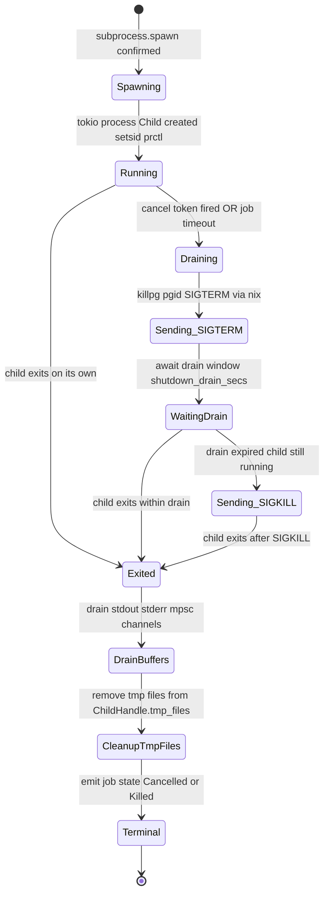

# ADR-0053 — Process Lifecycle Cascade Contract

## Context and Problem Statement

[ADR-0052](0052-subprocess-execution-architecture.md) introduces subprocess
execution. Every spawned child process creates a new OS resource that must be
deterministically cleaned up when any of the following occur:

- The MCP client cancels the job.
- The substrate server receives SIGTERM or SIGINT.
- The substrate server is killed with SIGKILL (unrecoverable; cleanup must be
  kernel-assisted).
- The child exits on its own (normal terminal condition).

Without a defined cascade contract, substrate may leave orphan processes on the
operator's machine, consuming CPU and memory indefinitely. The risk is especially
acute on macOS, where Linux's `PR_SET_PDEATHSIG` mechanism is not available.

The question is: what are the exact mechanisms for process group leadership,
kernel-assisted death notification, cleanup ordering, and PID reuse mitigation?

## Decision Drivers

- `panic = "abort"` per [ADR-0014](0014-build-system-and-toolchain.md): Drop
  impls do not run under abort; cleanup cannot rely on RAII.
- The biased `select!` + `CancellationToken` patterns from
  [ADR-0037](0037-async-cancellation-patterns.md) must be used for all
  cancel-path cleanup.
- The transactional write cleanup sequence from
  [ADR-0033](0033-transactional-write-pattern.md) (tmp file removal) applies
  to any temporary files created by the subprocess adapter.
- Signal safety requirements from [ADR-0032](0032-signal-safety.md): signal
  delivery from a pre-exec hook must use only async-signal-safe calls.
- Platform divergence: Linux provides `PR_SET_PDEATHSIG`; macOS requires a
  watchdog pipe pattern.
- PID reuse by the OS between cleanup and kill calls must be detected and handled
  safely.

## Considered Options

- Option A: Kill only the direct child PID; ignore any grandchildren.
- Option B: Process group leadership via `setsid` + Linux `prctl` death signal +
  macOS watchdog pipe (selected).
- Option C: Use cgroups on Linux to track and kill the entire process subtree.
- Option D: Rely on the child process to clean itself up cooperatively; no
  kernel mechanism.

## Decision Outcome

Chosen option: "Option B — process group leadership + kernel-assisted death
notification + explicit cascade kill chain", because it provides the strongest
cleanup guarantee across both platforms without requiring cgroup configuration
(Option C adds operator complexity) and without trusting child cooperation
(Option D provides no guarantee for arbitrary binaries).

### Process Group Leadership

Every subprocess spawned by `substrate-subprocess` MUST call
`nix::unistd::setsid()` inside the `Command::pre_exec` hook. This makes the
child process the leader of a new session and process group. The child's PID
equals its process group ID (`pgid`). All grandchildren inherit the `pgid` unless
they call `setsid` themselves.

The `pre_exec` hook runs between `fork(2)` and `exec(2)` in the child's address
space. This is the POSIX-defined window for per-process configuration that must
be completed before the new image is loaded.

**Pre-exec safety contract**: the code inside `pre_exec` runs in a
fork-incomplete address space. Only async-signal-safe functions may be called.
The following are safe: `setsid(2)`, `prctl(2)`, `signal(2)`, `close(2)`,
`dup2(2)`, `_exit(2)`. The following are forbidden inside `pre_exec`:
`malloc`, any lock acquisition (mutexes in the parent's address space may be
held), and any function that calls `malloc` internally (including most libc
functions beyond the async-signal-safe set). The `unsafe` block surrounding the
`pre_exec` closure MUST carry a SAFETY comment documenting this contract.

### Linux Death Signal

Inside the same `pre_exec` hook, after `setsid()`, the following call is made:

```
nix::sys::prctl::set_pdeathsig(Some(Signal::SIGTERM))
```

This requests that the Linux kernel deliver `SIGTERM` to the child process when
its parent (the substrate process) dies for any reason, including `SIGKILL`.
The death signal is delivered by the kernel before any user-space cleanup is
possible. It handles the scenario where substrate is killed with a signal that
bypasses the graceful drain.

After `SIGTERM`, if the child does not exit within `shutdown_drain_secs` (default
5 s per [ADR-0032](0032-signal-safety.md)), the kernel does not follow up
automatically; the explicit cascade kill (step 4 of the explicit cleanup chain
below) is responsible for `SIGKILL`.

Note: `PR_SET_PDEATHSIG` delivers the signal to the child when the parent thread
that performed `fork` exits, not when the process exits. On the tokio multi-thread
runtime, the forking thread is a tokio worker thread. The composition root MUST
ensure that the tokio runtime is not shut down before the cascade kill chain
completes. This is guaranteed by the graceful drain contract in ADR-0032.

### macOS Watchdog Pipe Pattern

macOS does not provide `PR_SET_PDEATHSIG`. The watchdog pipe pattern is used:

1. Substrate creates a `pipe(2)` before spawning. The write end is retained by
   the substrate process; the read end is passed to the child via the
   `SUBSTRATE_WATCHDOG_FD` environment variable (an integer file descriptor
   number as a decimal string).

2. The write end of the pipe is marked close-on-exec (`FD_CLOEXEC`) on the
   substrate side so it is not inherited by the child. The read end is marked
   non-close-on-exec (`fcntl(fd, F_SETFD, flags & ~FD_CLOEXEC)`) so the child
   inherits it across `exec`.

3. Substrate-aware children (those that parse `SUBSTRATE_WATCHDOG_FD`) start a
   watchdog thread that reads from the fd. When the read returns EOF (because
   substrate closed the write end, either normally or on death), the watchdog
   thread calls `_exit(0)`.

4. Arbitrary (non-substrate-aware) children: when substrate is killed with
   `SIGKILL` on macOS, the write end of the pipe is closed by the kernel, EOF
   is delivered to the read end, but the child does not read it and does not
   exit. These children become orphans. The orphan reaper (ADR-0055) handles
   cleanup at next substrate startup.

The watchdog pipe mechanism is cooperative and provides best-effort cleanup for
arbitrary binaries on macOS. It is complemented by ADR-0055.

### Explicit Cleanup Chain (Async Cancel Path)

The explicit cleanup chain runs in the async cancel path, inside the
`CancellationToken`-triggered `select!` arm (per [ADR-0037](0037-async-cancellation-patterns.md)).
It MUST NOT be written as a `Drop` impl (because `panic = "abort"` suppresses
`Drop`).

The following diagram shows the `ChildHandle` lifecycle state machine including
the kill chain.



The steps in order:

1. `token.cancel()` on the `ChildHandle` `CancellationToken`.
2. `nix::sys::signal::killpg(pgid, Signal::SIGTERM)` — sends SIGTERM to the
   entire process group.
3. `tokio::time::sleep(shutdown_drain_secs)` — default 5 s, configurable via
   `[runtime] shutdown_drain_secs`.
4. If the child has not exited: `nix::sys::signal::killpg(pgid, Signal::SIGKILL)`.
5. Drain the stdout and stderr mpsc buffers (per [ADR-0054](0054-subprocess-stream-multiplex.md));
   emit terminal `notifications/progress` events with `job_state=Cancelled`.
6. For each path in `ChildHandle.tmp_files`:
   `tokio::fs::remove_file(path).await.ok()` — best-effort, same pattern as
   [ADR-0033](0033-transactional-write-pattern.md).
7. Transition `JobEntry` to terminal state `Cancelled` (if SIGTERM was sufficient)
   or `Killed` (if SIGKILL was required). Emit the audit state transition event
   before the job result watch is set (per [ADR-0040](0040-async-job-control-plane.md)).

### PID Reuse Race Mitigation

Between the time a `pgid` is stored in `ChildHandle` and the time `killpg` is
called, the OS may have recycled the PID. Sending a signal to a recycled PID
could harm an unrelated process.

Mitigation:

- Linux (preferred): use `pidfd_open(2)` (Linux >= 5.3) to obtain a file
  descriptor bound to the process by kernel identity, not PID. `kill` is then
  performed via `pidfd_send_signal` using the stable fd. The `Capabilities`
  struct (from [ADR-0042](0042-capability-adapter-factory.md)) gains a
  `has_pidfd_open` field probed at startup.
- macOS (preferred): register a `kqueue` event `EVFILT_PROC NOTE_EXIT` for the
  child PID immediately after spawn; this provides stable notification of child
  exit without relying on PID uniqueness.
- Fallback (both platforms): store `start_time` from `/proc/<pid>/stat` (Linux)
  or `kinfo_proc.p_starttime` (macOS) in `ChildHandle`. Before each `killpg`,
  verify the current `start_time` of the PID matches the stored value. If it
  differs, the PID has been recycled; abort the kill and log `tracing::warn!`.

### New Config Keys

- `subprocess.cascade_drain_secs` — seconds to wait between SIGTERM and SIGKILL
  in the cascade kill chain (default: inherits `runtime.shutdown_drain_secs`).
  Setting this key independently allows subprocess drains to be longer than the
  server shutdown drain.

### New Audit Events

- `SUBSTRATE_SUBPROCESS_SIGTERM_SENT` — emitted when step 2 of the cleanup
  chain fires. Payload: `{job_id, pgid, reason}`.
- `SUBSTRATE_SUBPROCESS_SIGKILL_SENT` — emitted when step 4 fires (drain
  expired). Payload: `{job_id, pgid, drain_elapsed_ms}`.
- `SUBSTRATE_SUBPROCESS_PID_RECYCLED` — emitted when PID reuse is detected
  during a kill attempt. Payload: `{pgid, stored_start_time, current_start_time}`.

## Consequences

### Positive

- Process group leadership ensures that grandchildren receive signals;
  a child that forks internally does not produce orphans when the cascade kills
  the group.
- `PR_SET_PDEATHSIG` on Linux provides a last-resort kernel-level guarantee
  even when substrate is killed externally.
- The explicit cleanup chain is auditable via code review because it is
  expressed as sequential async steps, not scattered across Drop impls.
- `pidfd_open` on Linux >= 5.3 eliminates PID reuse races entirely.

### Negative

- The watchdog pipe on macOS is cooperative; arbitrary binaries that do not
  read the fd become orphans when substrate is SIGKILL'd. The orphan reaper
  (ADR-0055) handles the residual risk.
- `PR_SET_PDEATHSIG` delivers SIGTERM to the child when the forking tokio
  worker thread exits, not the process. This is correct behavior in the
  shutdown path but can produce unexpected delivery if a worker thread is
  recycled by tokio's thread pool rebalancing. Mitigation: the `ChildHandle`
  tracks whether the child has already exited via `ChildHandle.exit_status`
  and skips redundant kill calls.
- The 5-second drain between SIGTERM and SIGKILL means an unresponsive
  subprocess delays the server shutdown by up to 5 s per active subprocess
  (bounded by `subprocess.max_concurrent = 8` from ADR-0052).

### Risks

- A subprocess that ignores SIGTERM and survives SIGKILL (possible if the
  child is in a kernel-uninterruptible state, such as waiting on a hung NFS
  mount) cannot be cleaned up by substrate. The orphan reaper (ADR-0055) will
  attempt cleanup on next startup.

## Validation

- Unit test: spawn a child that installs a SIGTERM handler and exits 0;
  assert `ChildHandle` transitions to `Exited` within `shutdown_drain_secs + 1 s`.
- Unit test: spawn a child that ignores SIGTERM; assert `SIGKILL` is sent after
  `cascade_drain_secs` and `SUBSTRATE_SUBPROCESS_SIGKILL_SENT` is emitted.
- Unit test: mock PID reuse by replacing `start_time` in `ChildHandle` before
  the kill call; assert `SUBSTRATE_SUBPROCESS_PID_RECYCLED` is emitted and no
  kill is sent.
- Integration test (Linux): verify that a subprocess that forks a grandchild
  and exits both processes terminate after `killpg`.
- Integration test (macOS): verify that a subprocess that reads
  `SUBSTRATE_WATCHDOG_FD` exits when substrate closes the write end.

## Links

- [ADR-0014](0014-build-system-and-toolchain.md) — panic=abort; Drop semantics
- [ADR-0032](0032-signal-safety.md) — signal handler + drain window
- [ADR-0033](0033-transactional-write-pattern.md) — transactional write cleanup
- [ADR-0037](0037-async-cancellation-patterns.md) — CancellationToken + biased select
- [ADR-0052](0052-subprocess-execution-architecture.md) — subprocess BC architecture
