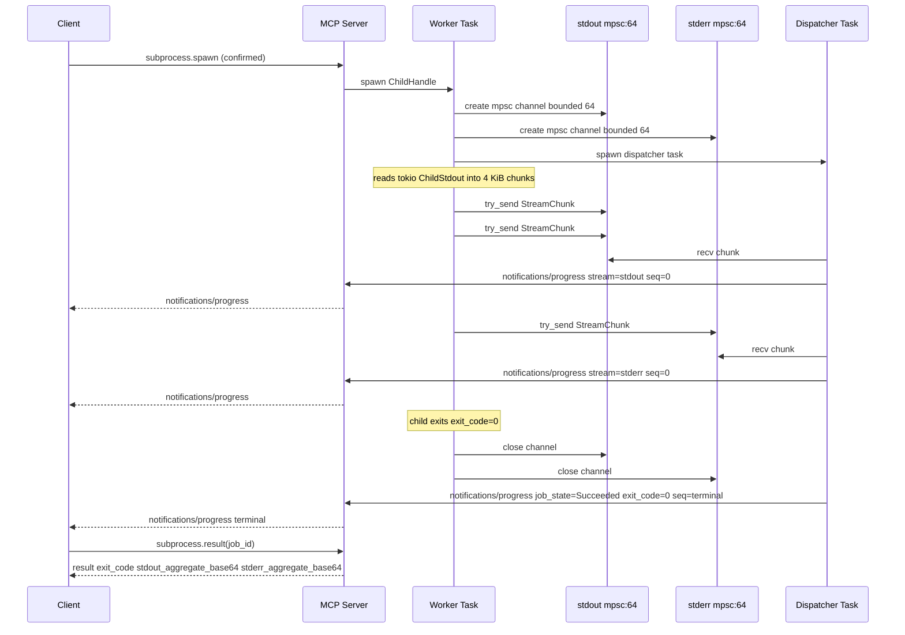

# ADR-0054 — Subprocess stdout/stderr Stream Multiplex

## Context and Problem Statement

[ADR-0052](0052-subprocess-execution-architecture.md) introduces subprocess
execution as a new bounded context with job-backed execution (Bucket E). Unlike
archive or filesystem jobs, a subprocess produces two continuous byte streams
(stdout and stderr) that must be delivered to the MCP client in near-real-time
while the process is running.

The job control-plane from [ADR-0040](0040-async-job-control-plane.md) provides
a `notifications/progress` push channel with a 250 ms / 1 pct throttle designed
for progress percentages. That throttle is inappropriate for stream delivery:
a subprocess writing log lines at high frequency needs a lower-latency flush
cadence, and the progress percentage model (0–100) does not map cleanly to an
unbounded byte stream.

The question is: how should stdout and stderr bytes be chunked, buffered,
and pushed to the client via the MCP notification channel, and how should
backpressure and aggregate retention be handled?

## Decision Drivers

- The MCP STDIO transport serializes all frames on a single channel;
  stream events must not starve other tool calls.
- Backpressure from a slow MCP client must not block the child process from
  writing to its own stdout/stderr (which would cause the child to hang on a
  full pipe buffer).
- The `notifications/progress` schema from MCP 2025-11-25 is the only push
  mechanism available; stream chunks must fit within its payload model.
- Binary subprocess output (non-UTF-8) must be representable; base64 encoding
  is the chosen transport encoding.
- The audit trail from [ADR-0038](0038-audit-event-semantics.md) must capture
  dropped chunks as observable events.
- The aggregate result for `subprocess.result` must be bounded to prevent
  unbounded memory accumulation.

## Considered Options

- Option A: Collect all stdout/stderr into a file; deliver the aggregate only
  on completion.
- Option B: Bounded mpsc channel per stream, chunk-driven flushing with an
  independent cadence from ADR-0040 throttling (selected).
- Option C: WebSocket or SSE side-channel for streaming (rejected: substrate
  is STDIO-only per ADR-0005).
- Option D: Merge stdout and stderr into a single stream, interleaved by
  arrival order.

## Decision Outcome

Chosen option: "Option B — bounded mpsc channel per stream with independent
flush cadence", because it decouples the subprocess writer from the MCP push
channel via buffering, prevents client slowness from stalling the child, and
extends the existing job notification model with minimal protocol surface.

Option D (merged stream) is rejected: callers cannot separate stdout from stderr
post-hoc; the streams carry distinct semantic meaning (log lines vs error lines).

### Stream Chunk Payload

Each stream notification extends the `ProgressEvent` shape from
[ADR-0040](0040-async-job-control-plane.md) with the following additional fields:

```
{
  "progressToken": "<job_id>",
  "progress": <bytes_emitted_mod_100>,
  "total": null,
  "job_id": "<uuid7>",
  "job_state": "Running",
  "stream": "stdout" | "stderr",
  "chunk_base64": "<base64-encoded bytes, max 4 KiB decoded>",
  "seq": <u64 monotonic, per-job, per-stream>,
  "chunk_bytes": <u32 decoded byte count>
}
```

`progress` is `bytes_emitted % 100` (a proxy metric to satisfy the MCP
`notifications/progress` schema; it does not represent percent-to-completion).
`total` is always null because the stream length is unknown.

The `seq` counter is a per-job per-stream `AtomicU64`, reset to zero at spawn.
Clients use `seq` to detect dropped chunks and to reorder chunks if delivery is
out of order (which is not expected over STDIO but is defensively handled).

The 250 ms / 1 pct progress throttle from ADR-0040 does NOT apply to stream
events. Stream events have their own flush trigger described below.

### Tokio Task and Channel Architecture

The following sequence diagram shows the interactions between client, MCP server,
the worker task, and the stream channels for a typical subprocess execution.



**Reader tasks**: two tokio tasks (one for stdout, one for stderr) are spawned
when the `ChildHandle` is created. Each task calls `tokio::io::AsyncReadExt::read_buf`
in a loop into a 4 KiB `BytesMut` buffer. When the buffer is full or the flush
timer fires (see Flush Trigger), the task calls `mpsc::Sender::try_send`. When
the child closes the stream (EOF), the task sends a sentinel chunk with zero
bytes and closes its end of the mpsc channel.

**Dispatcher task**: a single tokio task per job drains both mpsc channels using
`tokio::select!` over both receivers. It emits `notifications/progress` for each
received chunk in the order they are dequeued. The dispatcher task is the only
entity that calls `notifications/progress`; reader tasks never do so directly.

### Flush Trigger

A chunk is flushed (the mpsc `try_send` is called) when either of the following
conditions is true:

- The 4 KiB buffer is full (chunk boundary).
- 100 ms have elapsed since the last `try_send` for this stream (time-based flush).

The 100 ms timer is implemented as `tokio::time::interval(Duration::from_millis(100))`
raced against the read future using `tokio::select! biased` with the read arm
first (per the biased-select rule in [ADR-0037](0037-async-cancellation-patterns.md)).

### Backpressure

When `mpsc::Sender::try_send` returns `Err::Full` (the channel holds 64 unread
chunks and the dispatcher has not drained them), the chunk is dropped and:

- The process-global `AtomicU64` counter `SUBSTRATE_STREAM_CHUNKS_DROPPED` is
  incremented.
- An audit event `SUBSTRATE_STREAM_CHUNK_DROPPED` is emitted with payload
  `{job_id, stream, dropped_bytes, seq}`.
- The reader task does NOT block or slow down. The child process is not affected
  because the pipe buffer between substrate and the child is independent of the
  mpsc channel.

Operators and agents can observe `stream_chunks_dropped` in the terminal job
result (see Result Shape below) and in the audit log.

### Aggregate Retention Ring Buffer

Each `ChildHandle` maintains two in-memory ring buffers, one per stream:

- Maximum capacity: `subprocess.aggregate_buffer_bytes` (default 65536 = 64 KiB
  per stream, 128 KiB total per job). This is configurable per job via
  the `subprocess.spawn` argument `aggregate_buffer_bytes`; the server cap is
  `subprocess.aggregate_buffer_bytes_max` (default 1 MiB).
- Write policy: newest-byte-wins ring buffer. When the ring buffer is full,
  the oldest bytes are overwritten. The `stdout_aggregate_truncated` and
  `stderr_aggregate_truncated` boolean fields in the result indicate truncation.
- The ring buffer receives bytes from the reader task directly, independent of
  the mpsc channel. Dropped chunks (due to full mpsc) still enter the ring buffer.

### Result Shape

`subprocess.result(job_id)` returns:

```
{
  "job_id": "<uuid7>",
  "job_state": "Succeeded" | "Failed" | "Cancelled" | "Killed",
  "exit_code": <i32 | null>,
  "stdout_aggregate_base64": "<base64>",
  "stderr_aggregate_base64": "<base64>",
  "stdout_aggregate_truncated": <bool>,
  "stderr_aggregate_truncated": <bool>,
  "stream_chunks_dropped": <u64>,
  "stdout_bytes_total": <u64>,
  "stderr_bytes_total": <u64>
}
```

`exit_code` is null when the process was killed via `SIGKILL` (exit code is
undefined in that case on POSIX) or when `job_state` is `Cancelled` before
the process exited.

### Terminal Notification

When the child exits or is killed, the dispatcher task emits a final
`notifications/progress` event with `job_state` set to the terminal state and
an additional `exit_code` field. This terminal event has `chunk_base64` set
to an empty string and `seq` incremented beyond all previous stream events for
that job. Clients should use this event to trigger `subprocess.result`.

### Cleanup on Cancellation

When the `ChildHandle` `CancellationToken` fires (per ADR-0053 cascade kill
chain):

1. The reader tasks observe the cancellation in their `select!` arm and close
   their send-side mpsc channel ends.
2. The dispatcher task detects the closed channels (receiver returns `None`)
   and drains any buffered chunks before emitting the terminal notification.
3. Ring buffers are not cleared on cancellation; the aggregate data up to the
   point of cancellation is available via `subprocess.result`.

### New Config Keys

- `subprocess.aggregate_buffer_bytes` — default per-job ring buffer size per
  stream in bytes (default 65536).
- `subprocess.aggregate_buffer_bytes_max` — server-enforced hard cap on
  `aggregate_buffer_bytes` in `subprocess.spawn` arguments (default 1048576).
- `subprocess.stream_flush_interval_ms` — time-based flush interval in
  milliseconds (default 100).

### New Audit Events

- `SUBSTRATE_STREAM_CHUNK_DROPPED` — emitted when backpressure causes a chunk
  to be discarded. Payload: `{job_id, stream, dropped_bytes, seq, timestamp}`.

## Consequences

### Positive

- Child process writes are never blocked by MCP client slowness; the pipe
  buffer between child and substrate remains unconsumed only when the reader
  task is behind, which is bounded by `subprocess.stream_flush_interval_ms`.
- The 4 KiB chunk size and 100 ms flush cadence balance throughput and latency
  for the common case of log-intensive CLI tools.
- The ring buffer ensures `subprocess.result` always returns the most recent
  bytes of output even when the full stream was truncated.
- `stream_chunks_dropped` in the result gives agents an explicit signal that
  the stream was lossy and the aggregate may be incomplete.

### Negative

- Two additional tokio tasks per subprocess (reader stdout, reader stderr) plus
  one dispatcher task bring the total overhead per subprocess to three tasks.
  With `subprocess.max_concurrent = 8` (from ADR-0052), this is at most 24
  additional tasks, well within tokio's default ceiling.
- base64 encoding inflates stream data by approximately 33%; a 4 KiB decoded
  chunk becomes approximately 5.5 KiB on the wire. This is acceptable for the
  intended use cases but should be noted by operators expecting large binary output.
- The ring buffer's newest-byte-wins eviction discards the earliest output when
  the buffer overflows. For long-running verbose processes, the beginning of
  stdout/stderr is lost. Operators can increase `aggregate_buffer_bytes` to
  retain more history.

### Risks

- If the dispatcher task panics (which causes process abort under `panic = "abort"`,
  per [ADR-0014](0014-build-system-and-toolchain.md)), all in-flight subprocess
  jobs lose their stream output. Mitigation: the dispatcher task MUST use `?`
  propagation and not `unwrap()` on channel operations; a closed channel is an
  expected condition (child exit), not a panic.

## Validation

- Unit test: reader task with a 4 KiB + 1 byte input; assert exactly two chunks
  are emitted (one full, one partial remainder).
- Unit test: fill the mpsc channel to capacity (64 chunks); assert the 65th
  chunk is dropped, `SUBSTRATE_STREAM_CHUNKS_DROPPED` increments by 1, and
  the ring buffer still receives the dropped bytes.
- Unit test: assert ring buffer truncation: write 70 KiB to a 64 KiB buffer;
  assert `stdout_aggregate_truncated = true` and the retained bytes are the
  last 64 KiB.
- Integration test: spawn a subprocess that writes 10 lines to stdout; assert
  all 10 lines appear in `stdout_aggregate_base64` after base64 decode.
- Integration test: cancel a subprocess mid-stream; assert the terminal
  notification carries `job_state=Cancelled` and `subprocess.result` returns
  partial aggregate with `stream_chunks_dropped >= 0`.

## Links

- [ADR-0040](0040-async-job-control-plane.md) — job control-plane; ProgressEvent shape
- [ADR-0038](0038-audit-event-semantics.md) — audit event semantics
- [ADR-0052](0052-subprocess-execution-architecture.md) — subprocess BC architecture
- [ADR-0053](0053-process-lifecycle-cascade-contract.md) — cascade kill + cleanup ordering
