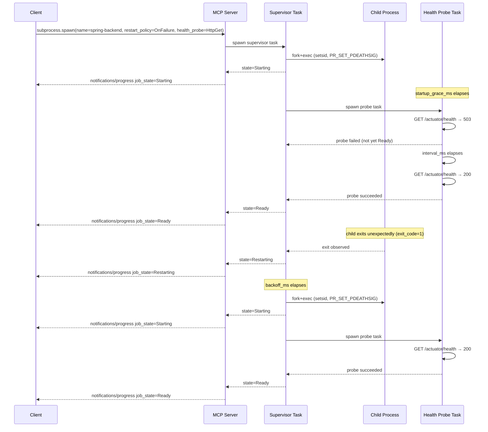

# ADR-0056 — Subprocess Supervisor Semantics

## Context and Problem Statement

[ADR-0052](0052-subprocess-execution-architecture.md) introduced the subprocess
bounded context as a one-shot execution facility: a binary is spawned, runs to
completion, and the result is retrieved via `subprocess.result`. This model serves
build scripts and data-processing pipelines well, but operators also need to run
long-lived services — Spring Boot applications, `pnpm dev` watch processes,
Node.js servers, and file-system watchers — that are expected to restart when they
crash and that may require health confirmation before traffic is routed to them.

The subprocess BC is the natural host for this capability. Introducing a separate
bounded context would duplicate the security sandbox, the job control-plane
integration, the stream multiplex architecture, and the cascade kill contract that
already exist in `substrate-subprocess`. The decision is: what supervisor
extensions does the subprocess BC require to host long-running, potentially
restarting processes alongside the existing one-shot model, and how should those
extensions be structured to remain fully backward compatible?

## Decision Drivers

- Backward compatibility is non-negotiable: operators that omit all new fields
  must observe the exact same one-shot semantics defined by ADR-0052.
- The job identity model from [ADR-0040](0040-async-job-control-plane.md) must
  not be violated: `job_id` (UUIDv7) remains the primary stable identifier.
  `name` is an operator convenience alias, not a replacement
  (triple-equality contract: progressToken == job_id == correlation_id preserved).
- The cascade kill contract from [ADR-0053](0053-process-lifecycle-cascade-contract.md)
  must extend to re-spawned children: each new child inherits the same
  `PR_SET_PDEATHSIG` (Linux) / watchdog-pipe (macOS) guarantees.
- The stream multiplex architecture from [ADR-0054](0054-subprocess-stream-multiplex.md)
  must continue to function across restarts; the `seq` counter resets to zero
  on each re-spawn to simplify client-side assembly.
- The tool card for `subprocess.spawn` must be amended to surface
  idempotent-by-name behavior in its AVOID/NEXT hints per
  [ADR-0007](0007-tool-card-narrative-arc.md).
- Resource and quota limits from ADR-0052 / ADR-0017 must remain enforceable;
  a supervised process counts as one active job for quota purposes.

## Considered Options

- Option A: Introduce a separate `subprocess.start_service` tool that wraps
  the existing one-shot engine.
- Option B: Extend `SubprocessRequest` with optional supervisor fields; omitting
  them preserves one-shot semantics (selected).
- Option C: Implement a generic supervisor daemon as a sidecar binary,
  contradicting [ADR-0015](0015-distribution.md).
- Option D: Extend the job control-plane (ADR-0040) generically with a
  `restart_policy` concept applicable to all jobs.

## Decision Outcome

Chosen option: "Option B — optional supervisor fields on `SubprocessRequest`
with full backward compatibility", because it re-uses every existing invariant
(security sandbox, cascade kill, stream multiplex, quota enforcement, audit trail)
without protocol surface duplication, and because omitting all new fields is a
provable no-op at the type level.

Option A is rejected: it fragments the tool surface and would require a second
security sandbox instantiation with no distinct security benefit.

Option C is rejected: violates the single-binary distribution model of ADR-0015.

Option D is rejected: other job types (archive, filesystem) do not have a
meaningful restart concept; injecting it into the generic job model would add
dead weight to every job entry.

### New Optional Fields on `SubprocessRequest`

All four fields are `Option<T>` in Rust. Omitting any field preserves the
original one-shot behavior for that dimension.

#### 1. `name?: string`

A regex-validated operator alias matching `[a-z0-9-]{1,64}`. Uniqueness scope is
`(client_id, name)`.

Resolution rules at spawn time:

- If `(client_id, name)` maps to a non-terminal `JobId` in the
  `SupervisorRegistry` → return that `JobId` as the job receipt (idempotent
  re-spawn). No new process is started.
- If `(client_id, name)` maps to a terminal `JobId` → release the old mapping
  from the registry, spawn a fresh child, store the new `JobId` under the same
  name.
- If `name` is absent → generate and return a server-assigned `JobId` as today.

`name` does NOT replace `job_id`. Both identifiers coexist: `job_id` is the
stable UUID used by all ADR-0040 control-plane calls; `name` is a human-readable
lookup shorthand. This preserves the triple-equality contract
(`progressToken == job_id == correlation_id`) established in ADR-0040.

#### 2. `restart_policy?: RestartPolicy`

```
enum RestartPolicy {
    Never,                              // default — current one-shot behavior
    OnFailure {
        max_retries: u32,               // 1..=100
        backoff_ms:  u64,               // 100..=300_000
    },
    Always {
        backoff_ms: u64,                // 100..=300_000
    },
}
```

Semantics:

- `Never` — no restart on any exit. This is the default and is equivalent to the
  current one-shot semantics of ADR-0052.
- `OnFailure` — when the supervised child exits with a non-zero code, a per-job
  supervisor task re-spawns it after `backoff_ms` milliseconds, up to
  `max_retries` attempts. If `max_retries` is exhausted, the job transitions to
  `Failed`.
- `Always` — the supervisor task re-spawns on any exit (zero or non-zero) after
  `backoff_ms` milliseconds, indefinitely until the job is explicitly cancelled.

Backoff is not exponential by default; `backoff_ms` is a fixed wait. Operators
that desire exponential backoff should set `backoff_ms` to their floor value;
the implementation MAY apply up to 2x jitter but MUST NOT exceed `backoff_ms`
as a hard cap. Backoff resets to 0 ms after the process stays in `Ready` state
for at least `2 * backoff_ms` milliseconds (indicating stable operation).

The supervisor task is a dedicated tokio task spawned alongside the worker task.
It observes the `ChildHandle` exit future and applies the restart policy. The
supervisor task MUST be registered with the `CancellationToken` subtree so that
`subprocess.cancel` terminates both the child and the supervisor task.

#### 3. `health_probe?: HealthProbe`

```
enum HealthProbe {
    None,                               // default — Running == Ready immediately
    HttpGet {
        url:               String,      // absolute http:// or https:// URL
        expected_status:   u16,         // e.g. 200
        interval_ms:       u64,         // polling interval while Starting
        startup_grace_ms:  u64,         // initial delay before first probe
    },
    PortOpen {
        host:              String,
        port:              u16,
        interval_ms:       u64,
        startup_grace_ms:  u64,
    },
    LogPattern {
        regex:             String,      // applied against stdout+stderr chunks
        timeout_ms:        u64,         // max ms to wait for the pattern
    },
}
```

State transitions driven by health probes:

- On spawn: state enters `Starting` immediately (see Lifecycle Extension below).
- `startup_grace_ms` elapses → first probe fires.
- First successful probe → state transitions to `Ready`.
- During `Running` (post-first-`Ready`): probes continue on `interval_ms` cadence.
  A probe failure is advisory: it is logged as an audit event
  `SUBSTRATE_SUPERVISOR_PROBE_FAILED` and increments a per-job counter.
- Three consecutive probe failures → state transitions to `Failed`; `restart_policy`
  applies.
- `LogPattern` is one-shot: the regex is matched against each stream chunk as
  it arrives. On first match, the state transitions to `Ready`. If `timeout_ms`
  elapses without a match, the state transitions to `Failed`.
- When `HealthProbe::None`: `Starting` is entered and immediately exited to `Ready`
  within the same scheduler tick (backward-compatible alias for callers that do
  not use health probes).

`HttpGet` probes use `tokio::net::TcpStream` for the TCP connect and a minimal
HTTP/1.1 GET via `tokio::io`; no external HTTP client crate is required.
The `outbound-net` Cargo feature gate from ADR-0003 / ADR-0052 applies: the
`HttpGet` variant is only available when `outbound-net` is active.

#### 4. `log_rotation?: LogRotation`

```
enum LogRotation {
    None,                               // default
    BySize {
        max_bytes_per_file: u64,        // 1 MiB..=1 GiB (1_048_576..=1_073_741_824)
        keep_files:         u8,         // 1..=20
    },
}
```

Applies only when `capture_kind = "tmp_file"` (ADR-0054 TmpFile branch). When
`BySize` is set and the current `<tmp_root>/<stream>.log` file reaches
`max_bytes_per_file`:

1. Atomically rename: `<stream>.log.{N}` → `<stream>.log.{N+1}` for N in
   `(keep_files-1)..=1`, then rename `<stream>.log` → `<stream>.log.1`.
2. Open a new `<stream>.log` for writing.
3. If `keep_files` would be exceeded, remove `<stream>.log.{keep_files}`.

Rotation is performed inside the reader task as an async operation. The rename
sequence satisfies the ADR-0033 atomic-rename invariant: readers of the log
file always see a complete file, never a partial write mid-rename.

Cumulative storage cap: `max_bytes_per_file * keep_files`. If this cap would
exceed `subprocess.aggregate_buffer_bytes_max` on a per-stream basis, substrate
returns `SUBSTRATE_INVALID_INPUT` at spawn time.

### Lifecycle Extension

`SubprocessState` gains three additional non-terminal states:

```
Starting    — child spawned, health probe not yet passed
              (immediately exits to Ready when health_probe = None)
Ready       — first successful health probe; backward-compat alias for Running
              for callers that do not use health probes
Restarting  — transient state between child exit and re-spawn
              (only reachable when restart_policy != Never)
```

The existing terminal states (`Succeeded`, `Failed`, `Cancelled`, `TimedOut`,
`Killed`) are unchanged and continue to be final (never regress).

Callers that check only for `Running` in their MCP client code remain compatible:
when `health_probe = None` and `restart_policy = Never`, the process never enters
`Starting` (it transitions through it atomically) and never enters `Restarting`.
For those callers the observable state sequence is `Pending → Running → <terminal>`,
identical to today.

The following sequence diagram shows the full lifecycle for a Spring Boot service
spawn with `restart_policy = OnFailure` and `health_probe = HttpGet`.



### Observable Port: `StateTransitionObserver`

A new sibling port `StateTransitionObserver` is introduced alongside the existing
`StreamChunkObserver` from ADR-0054. Separation of concerns is the rationale:
state-change events are structural control-plane events; stream chunk events are
data-plane events. Mixing them into a single trait yields an interface with
unrelated concerns.

```rust
// DDD role: DomainService (port)
pub trait StateTransitionObserver: Send + Sync {
    fn on_state_change(
        &self,
        job_id:    &JobId,
        old_state: SubprocessState,
        new_state: SubprocessState,
    );
}
```

The default adapter emits `notifications/progress` events with the new state as
the `job_state` field (extending the ADR-0054 notification shape) and emits an
audit event `SUBSTRATE_SUBPROCESS_STATE_TRANSITION` with payload
`{job_id, old_state, new_state, timestamp}`.

A `NoopStateTransitionObserver` is provided for unit tests. The composition root
wires the MCP-adapter observer.

### Cascade Kill on Re-spawned Children

When the supervisor task re-spawns a child, the new child MUST inherit the full
cascade kill contract from [ADR-0053](0053-process-lifecycle-cascade-contract.md):

- `setsid()` in `pre_exec`.
- `PR_SET_PDEATHSIG(SIGTERM)` on Linux.
- Watchdog pipe passed via `SUBSTRATE_WATCHDOG_FD` on macOS.

This guarantee is already satisfied by the `pre_exec` hook implementation in
`substrate-subprocess`, which runs unconditionally for every `Command::spawn`
call. The supervisor task MUST use the same `Command` builder path and MUST NOT
bypass the `pre_exec` hook.

### New Error Codes

The following codes extend the taxonomy from
[ADR-0010](0010-error-taxonomy.md):

- `SUBSTRATE_SUPERVISOR_MAX_RETRIES_EXCEEDED` — `OnFailure` restart policy
  exhausted `max_retries` without a stable `Ready` state. Recovery hint:
  `"inspect stderr via subprocess.result; increase max_retries or fix the service"`.
- `SUBSTRATE_SUPERVISOR_PROBE_TIMEOUT` — `LogPattern` probe did not match
  within `timeout_ms`. Recovery hint:
  `"verify the log pattern regex and increase timeout_ms"`.
- `SUBSTRATE_SUPERVISOR_NAME_INVALID` — `name` field does not match
  `[a-z0-9-]{1,64}`. Recovery hint:
  `"use only lowercase alphanumeric characters and hyphens, 1–64 chars"`.

### New Audit Events

- `SUBSTRATE_SUBPROCESS_STATE_TRANSITION` — emitted on every state change.
  Payload: `{job_id, name?, old_state, new_state, restart_count, timestamp}`.
- `SUBSTRATE_SUPERVISOR_PROBE_FAILED` — emitted on each individual probe failure.
  Payload: `{job_id, probe_kind, consecutive_failures, timestamp}`.
- `SUBSTRATE_SUPERVISOR_RESTARTING` — emitted when the supervisor decides to
  re-spawn. Payload: `{job_id, exit_code, restart_count, backoff_ms, timestamp}`.

### New Config Keys

- `subprocess.supervisor_probe_timeout_ms` — default timeout for `HttpGet` and
  `PortOpen` probes per attempt (default 5000 ms).
- `subprocess.supervisor_max_restart_jitter_pct` — maximum jitter applied to
  `backoff_ms` as a percentage (default 20, range 0..=50).

### Tool Card Amendment (`subprocess.spawn`)

Per [ADR-0007](0007-tool-card-narrative-arc.md), the `subprocess.spawn` tool
description must be updated to mention idempotent-by-name behavior in the NEXT
and AVOID hint fields:

- NEXT hint: `"subprocess.result"`, `"subprocess.cancel"`.
- AVOID hint: `"Do not call subprocess.spawn twice with the same name to start
  two instances; supply a unique name per intended instance or omit name for
  server-assigned job_id."`.

The structured content hints map (ADR-0007 / ADR-0040) gains:
`"idempotent_by_name": true` when `name` is set and the response is a re-use
of an existing job.

## Consequences

### Positive

- Long-running services (Spring Boot, pnpm dev, Node.js) can be managed with a
  single `subprocess.spawn` call and a named handle; the agent does not need to
  track `job_id` across sessions if it re-uses the same `name`.
- `restart_policy = OnFailure` closes the gap between substrate and basic
  process supervisors (systemd, Supervisor) for the common "restart on crash"
  use case, without adding a new runtime dependency.
- The `StateTransitionObserver` port enables clean unit-testable state-machine
  verification without coupling tests to the MCP notification channel.
- All existing one-shot subprocess jobs work without modification; the new fields
  are purely additive.

### Negative

- The supervisor task adds one persistent tokio task per supervised job. With
  `subprocess.max_concurrent = 8` (ADR-0052), this is at most 8 additional tasks
  that live beyond child exit, which is negligible.
- `HttpGet` health probes require the `outbound-net` Cargo feature, adding a
  compile-time prerequisite for operators who want HTTP-based liveness checks.
- Log rotation adds rename-sequence complexity in the reader task; incorrect
  rotation ordering under concurrent writes must be guarded by a per-job
  `tokio::sync::Mutex<RotationState>`.
- The `(client_id, name)` registry is a new in-memory map in
  `SubprocessRegistry`. Its size is bounded by `subprocess.max_per_client *
  active_clients`, which is small in practice but must be monitored.

### Risks

- A `restart_policy = Always` job with a zero-duration process (e.g., `true`)
  will restart in a tight loop bounded only by `backoff_ms`. Operators MUST set
  `backoff_ms >= 100` (enforced by input validation) to prevent CPU saturation.
  Mitigation: enforce the 100 ms floor at `SubprocessRequest` deserialization.
- `LogPattern` probes scan every stream chunk with a compiled regex. For
  high-throughput processes, this adds per-chunk regex overhead. Mitigation:
  once `Ready` is reached the `LogPattern` task exits; scanning is bounded to
  the `Starting` phase.

## Validation

- Unit test: `spawn(name="svc", restart_policy=Never)` twice with the same
  `(client_id, name)` while the job is non-terminal; assert both calls return
  the same `job_id` (idempotent re-use).
- Unit test: `spawn(name="svc")` after the prior job for that name has reached
  `Succeeded`; assert a new `job_id` is issued and the old mapping is released.
- Unit test: supervisor task with `OnFailure { max_retries=2, backoff_ms=100 }`;
  mock child exits with code 1 three times; assert job transitions to `Failed`
  after the third attempt and `SUBSTRATE_SUPERVISOR_MAX_RETRIES_EXCEEDED` is
  emitted.
- Unit test: `Always` restart policy; mock child exits with code 0; assert state
  transitions through `Ready → Restarting → Starting → Ready` and
  `SUBSTRATE_SUPERVISOR_RESTARTING` audit event is emitted.
- Unit test: `HealthProbe::HttpGet` with `startup_grace_ms=0`; mock HTTP server
  returns 503 twice then 200; assert state stays `Starting` for two probe rounds
  then transitions to `Ready`.
- Unit test: `LogPattern` probe; push a stream chunk matching the regex; assert
  state transitions to `Ready` within one scheduler tick.
- Unit test: `LogPattern` probe times out; assert `SUBSTRATE_SUPERVISOR_PROBE_TIMEOUT`
  error and state transitions to `Failed`.
- Unit test: log rotation with `BySize { max_bytes_per_file=1_048_576, keep_files=3 }`;
  write 2.5 MiB to stdout; assert three log files exist with sizes bounded by
  `max_bytes_per_file`.
- Integration test: spawn `spring-boot-stub` (a shell script that prints a
  "Started" log line and loops); assert `HealthProbe::LogPattern` on `"Started"`
  yields `Ready` and the job stays alive past the log match.
- Integration test: cancel a supervised job while in `Restarting`; assert the
  supervisor task exits, no new child is spawned, and the job transitions to
  `Cancelled`.

## Links

- [ADR-0040](0040-async-job-control-plane.md) — job control-plane; triple-equality
  contract (`progressToken == job_id == correlation_id`); `name` does NOT replace
  `job_id`
- [ADR-0052](0052-subprocess-execution-architecture.md) — subprocess BC architecture;
  one-shot semantics extended by this ADR
- [ADR-0053](0053-process-lifecycle-cascade-contract.md) — cascade kill contract;
  applies unchanged to re-spawned children
- [ADR-0054](0054-subprocess-stream-multiplex.md) — stream multiplex; `seq` resets
  to zero on each re-spawn
- [ADR-0007](0007-tool-card-narrative-arc.md) — tool card narrative arc; `subprocess.spawn`
  description amended for idempotent-by-name AVOID/NEXT hints
- [ADR-0068](0068-launch-detached-supervisor-and-orphan-governance.md) — launch detached
  supervisor; Option C scoped exception, per-process restart policy reused

## Amendment — 2026-06-30 — Launch detached supervisor: Option C scoped exception (ADR-0068)

[ADR-0068](0068-launch-detached-supervisor-and-orphan-governance.md) carves a narrow, opt-in exception to the no-sidecar Option C recorded here, for launch detached mode only: a Stack with `on_client_disconnect = "detach"` is supervised by the same `substrate` binary in `--supervise` mode (no second artifact, no socket), so a Stack can outlive the MCP server while staying governable. Every other context retains the in-server, no-sidecar supervisor model of this ADR; the per-process `RestartPolicy`/`HealthProbe` semantics defined here are reused unchanged by the launch supervisor.
