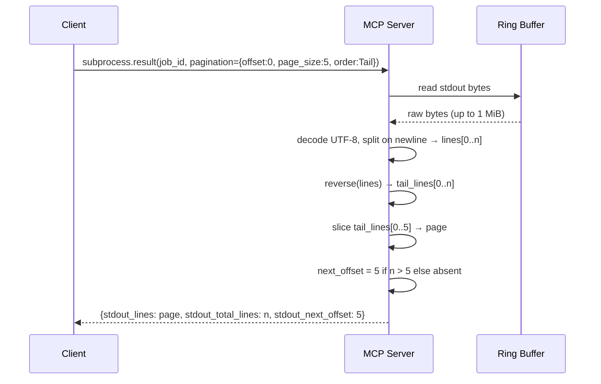

# ADR-0057 — Subprocess Output Pagination and Full-Text Search

## Context and Problem Statement

[ADR-0054](0054-subprocess-stream-multiplex.md) introduced a ring buffer (64 KiB
default, 1 MiB max) that retains the most-recent bytes of stdout and stderr for
each subprocess job. The `subprocess.result` tool returns the entire ring buffer
encoded as a single base64 blob. For short-lived commands this is fine; for
long-lived services (Spring Boot, `pnpm dev`) the blob routinely approaches
the 1 MiB server cap, consuming a large share of the LLM context window on every
call.

Two common retrieval patterns are not satisfied by the full-aggregate model:

1. **Tail inspection** — a developer wants the last 20 log lines to see the most
   recent startup trace. The full aggregate base64 decodes to ~1 MiB and must be
   truncated client-side at unnecessary token cost.
2. **Grep-like search** — an agent wants every line containing `ERROR` or a
   specific correlation-id. Streaming the whole aggregate and filtering locally is
   wasteful and breaks token budgets for 10B-parameter models.

The question is: how should `subprocess.result` expose line-based windowing, and
what is the contract for a new `subprocess.search` tool?

## Decision Drivers

- Token budget: a 1 MiB aggregate base64-encodes to ~1.37 MiB of ASCII, far
  exceeding the ~80-token `content` budget from [ADR-0007](0007-tool-card-narrative-arc.md).
- Ring buffer source of truth: the ADR-0054 ring buffer is already bounded; the
  pagination layer reads from it, never from disk.
- MCP roundtrip cost: a second call to `subprocess.result` with a cursor must
  be cheaper than re-fetching the full aggregate.
- Regex performance: `subprocess.search` compiles the pattern per request;
  scanning a 1 MiB ring buffer with a typical log pattern takes under 10 ms on
  modern hardware, which is within the synchronous-response budget.
- Line-based natural unit: log output is line-oriented; byte-based pagination
  would split lines across page boundaries, breaking readability and UTF-8
  integrity.
- The `regex` crate is already in the workspace (used by `text.search`).

## Considered Options

1. **Always return full aggregate (status quo)** — `subprocess.result` continues
   to return the raw base64 blob. Agents must decode and slice client-side.
2. **Byte-based pagination** — expose `offset_bytes` + `length_bytes` windows
   into the ring buffer. Simple to implement, but silently splits multi-byte UTF-8
   sequences and log lines at arbitrary positions.
3. **Line-based pagination + regex search (chosen)** — split the ring buffer on
   `\n` boundaries into a logical line array; expose `offset` (line index) and
   `page_size`; add a new `subprocess.search` tool that returns matched lines with
   line numbers. The natural unit for log analysis is the log line.
4. **External tantivy full-text index** — maintain a per-job inverted index for
   sub-millisecond search. Over-engineered for a runtime bounded at 1 MiB per job;
   `regex` is sufficient and adds no dependency.

## Decision Outcome

Chosen option: "Option 3 — line-based pagination with Tail default and regex
search via the `regex` crate", because log lines are the universal unit of
developer reasoning, `\n`-splitting is unambiguous, and a regex scan of a 1 MiB
ring buffer is within the synchronous-call latency budget.

Option 1 is rejected: the full blob is unusable at token scale for large
aggregates. Option 2 is rejected: byte offsets do not compose with log-line
semantics. Option 4 is rejected: tantivy indexing overhead exceeds the benefit
for sub-megabyte data.

### Data Model

#### Pagination (new value object)

```
Pagination:
  offset:    u64        line offset (0-based); first page uses 0
  page_size: u32        1..=10000; default 100
  order:     Order      default Tail
```

#### Order (new enum)

```
Order:
  Tail   most-recent lines first (default); equivalent to tail -n N semantics
  Head   chronological replay; oldest lines first
```

#### SubprocessResultRequest (existing, extended)

```
SubprocessResultRequest:
  job_id:             JobId
  wait_ms:            u32    (existing)
  include_aggregates: bool   (existing)
  pagination?:        Pagination   NEW — optional; when absent returns
                                        existing full base64 aggregate
                                        behaviour unchanged
```

#### SubprocessResult (existing, extended)

```
SubprocessResult:
  stdout_aggregate_b64:     string   (existing; returned when pagination absent)
  stderr_aggregate_b64:     string   (existing; returned when pagination absent)
  stdout_aggregate_truncated: bool   (existing)
  stderr_aggregate_truncated: bool   (existing)
  stdout_lines?:      Vec<string>    NEW — populated when pagination present
  stdout_total_lines?: u64           NEW — total line count in ring buffer
  stdout_next_offset?: u64           NEW — None when end of buffer reached
  stderr_lines?:      Vec<string>    NEW — populated when pagination present
  stderr_total_lines?: u64           NEW
  stderr_next_offset?: u64           NEW
```

When `pagination` is present, `stdout_aggregate_b64` and `stderr_aggregate_b64`
are omitted from the response. When `pagination` is absent, the six new optional
fields are omitted.

#### SubprocessSearchRequest (new)

```
SubprocessSearchRequest:
  job_id:           JobId
  pattern:          string          length 1..=1024; compiled as Rust regex per request
  streams:          Vec<Stream>     default ["stdout", "stderr"]
  case_insensitive: bool            default false
  pagination?:      Pagination      applied to the match result set, not the raw buffer
```

#### SubprocessSearchResult (new)

```
SubprocessSearchResult:
  matches:       Vec<SearchMatch>
  total_matches: u64
  next_offset?:  u64                None when caller has reached the last match page
```

#### SearchMatch (new)

```
SearchMatch:
  stream:      Stream    "stdout" | "stderr"
  line_number: u64       1-based per stream (1 = first line of that stream's buffer)
  line_text:   string
```

### Pagination Semantics

The ring buffer is decoded from base64 bytes, split on `\n` into a logical line
array `L[0..n]`. For `Order::Tail` the array is reversed before slicing:
`page = reversed(L)[offset .. offset + page_size]`. For `Order::Head` the array
is used as-is: `page = L[offset .. offset + page_size]`. `next_offset` is
`offset + page_size` when `offset + page_size < n`; otherwise it is absent.

`Pagination` is applied independently to stdout and stderr. Both streams share the
same `Pagination` value object from the request.

### Regex Compilation

`subprocess.search` calls `regex::RegexBuilder::new(pattern)` with
`.case_insensitive(case_insensitive)` and `.size_limit(10_485_760)` (10 MiB DFA
size cap) per request. If compilation fails the tool returns
`SUBSTRATE_INVALID_INPUT` with the regex error message in `recovery_hint`.
Pattern length is validated at ≤1024 bytes before compilation.

### Tool Card Entries

`subprocess.search` narrative arc (≤100 chars per 2026-05-22 amendment to
ADR-0007):

```
Regex-search stdout/stderr ring buffer with line numbers. See substrate skill.
```

`subprocess.result` description updated to note optional pagination:

```
Fetch subprocess job result; optional line pagination; returns aggregate or page. See substrate skill.
```

Both tool cards MUST set `confirm_destructive: true` and `cascade_kill_pgid: true`
in `structuredContent.hints` per the 2026-05-24 amendment to ADR-0007.

### Sequence Diagram



## Consequences

### Positive

- LLM callers retrieve targeted log windows without decoding a 1 MiB base64 blob;
  a typical 100-line page is under 5 KiB of wire data.
- `subprocess.search` replaces shell-side grep pipelines that were previously
  impossible because substrate is STDIO-only (no shell passthrough).
- Tail-first default matches developer intuition: the most recent startup trace or
  crash line appears on the first page without computing `total_lines - page_size`.
- The ring buffer from ADR-0054 is the sole source of truth; no new persistence
  layer is introduced.
- The `regex` crate is already in the workspace; no new dependency is added.

### Negative

- Pattern compilation is repeated on every `subprocess.search` call; there is no
  cross-request regex cache. Mitigation: compilation of a 1024-byte pattern takes
  under 1 ms for non-pathological patterns.
- `\n`-splitting loads the entire ring buffer into a `Vec<&str>` in memory before
  slicing. For a 1 MiB ring buffer this allocates approximately 1 MiB of
  contiguous string data plus pointer overhead. This is bounded and short-lived.

### Risks

- Catastrophic regex patterns (exponential backtracking) are mitigated by the
  `regex` crate's NFA/DFA engine, which guarantees linear-time matching. The
  10 MiB DFA size cap prevents memory explosion on adversarial patterns.
- A ring buffer containing binary data with no `\n` bytes would produce a single
  line of up to 1 MiB. The `page_size` cap of 10000 lines does not bound this
  case. Mitigation: `subprocess.search` and line pagination SHOULD return
  `SUBSTRATE_INVALID_INPUT` with hint "aggregate is binary; use full base64
  aggregate" when the decoded buffer contains no newline characters.

## Validation

- Gherkin features (authored by parallel spec-mode agent, not this ADR):
  - `supervisor-output-pagination-tail-default.feature` — default Tail order returns
    last N lines first; `next_offset` increments correctly.
  - `supervisor-output-pagination-head-order.feature` — explicit Head order returns
    lines in chronological order.
  - `subprocess-search-basic.feature` — regex matches return correct `line_number`
    values; `total_matches` equals count of matching lines.
  - `subprocess-search-paginated.feature` — search with `pagination` returns
    first page of matches and a valid `next_offset`.
- Unit test: ring buffer with 10 lines; assert Tail page[0] == line[9],
  page[1] == line[8].
- Unit test: ring buffer with 10 lines; assert Head page[0] == line[0].
- Unit test: `subprocess.search` with `pattern = "ERROR"` on a buffer containing
  3 matching lines returns `total_matches = 3`, all `line_number` values correct.
- Unit test: invalid regex (e.g., `"("`) returns `SUBSTRATE_INVALID_INPUT` with
  non-empty `recovery_hint`.
- Unit test: binary buffer (no `\n`) returns `SUBSTRATE_INVALID_INPUT` for search
  and pagination with the hint text prescribed above.

## Links

- [ADR-0054](0054-subprocess-stream-multiplex.md) — ring buffer source of truth
  for both paginate and search reads
- [ADR-0008](0008-mcp-feature-usage-map.md) — cursor pagination pattern reference
- [ADR-0007](0007-tool-card-narrative-arc.md) — tool card narrative arc; both
  tools require narrative arc entries per the 2026-05-22 amendment

## Amendments

_None yet._
