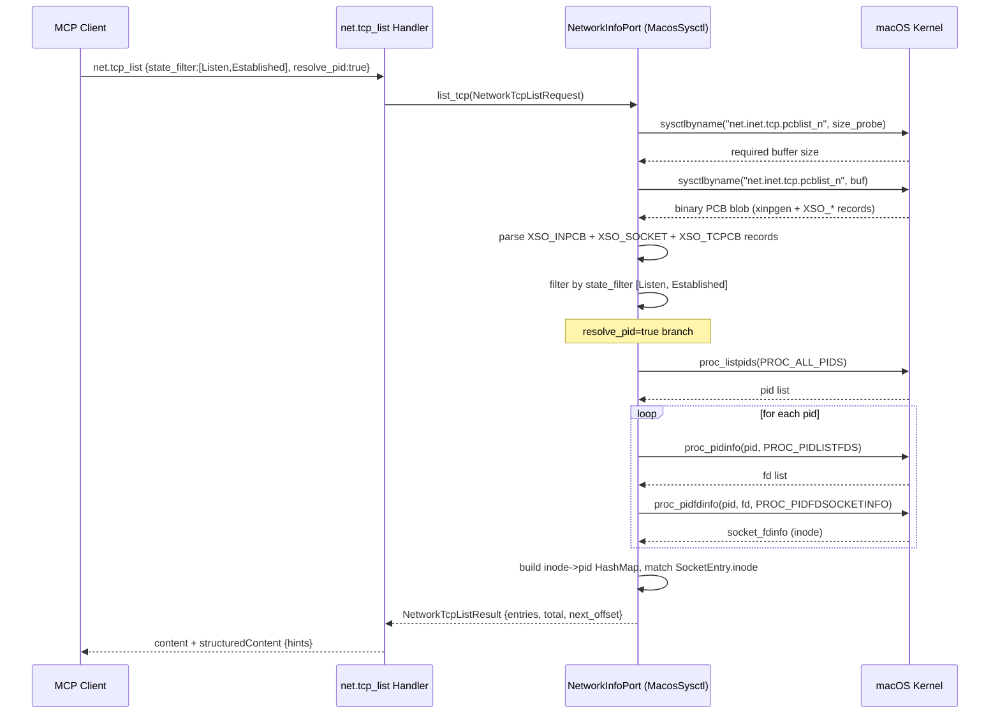
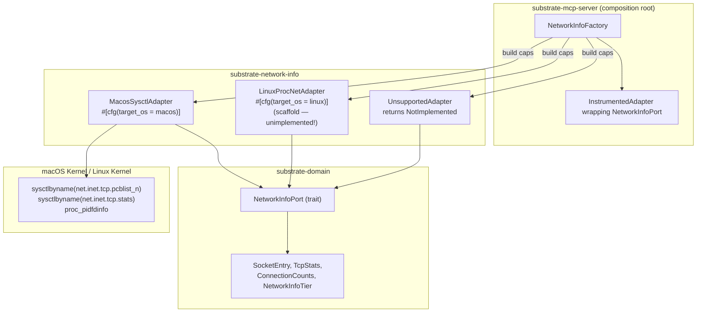

# ADR-0058 — Network Socket Introspection (net.*)

## Context and Problem Statement

LLM agents assisting with dev-server debug workflows need to answer questions
such as "what is listening on port 8080", "which process holds this connection",
and "how many retransmits has the system accumulated". No substrate tool
currently surfaces TCP/UDP socket state or global TCP counters. Agents are
forced to shell out to `lsof`, `netstat`, or `ss` — all of which violate
[ADR-0044](0044-no-subprocess-policy.md) (No Subprocess Policy).

The question is: which OS-level data sources should back a read-only network
introspection capability, and how does it integrate with the capability tier
factory established in [ADR-0042](0042-capability-adapter-factory.md)?

## Decision Drivers

- Zero shell-out: `lsof`, `netstat`, `ss`, and `/proc/net/tcp` parsing via
  subprocess are all forbidden (ADR-0044).
- macOS v1 only: macOS Sonoma/Sequoia via `sysctlbyname` PCB list calls is
  the macOS v1 tier; Linux is ALSO v1 via NETLINK_INET_DIAG + /proc/net fallback per the Amendment 2026-05-25 below. See "Capability Tier" section.
- Read-only: no socket close, no NAT mutation, no `connect`. Purely
  observational, so no path-jail and no elicitation required.
- Separate bounded context: network introspection has a distinct ubiquitous
  language and independent capability gate from `system-info`.
- Pagination reuse: the `Pagination` value object from
  [ADR-0057](0057-subprocess-output-pagination-and-search.md) is reused
  verbatim.
- Async zone B: `sysctlbyname` is a blocking syscall; all calls go through
  `spawn_blocking` per [ADR-0003](0003-crate-stack-and-async-zones.md).

## Considered Options

- Option A: Extend `system-info` BC — add `net.*` tools to `substrate-system-info`.
- Option B: New `network-info` BC — separate crate `substrate-network-info`,
  distinct capability gate, tools under `net.*` namespace.
- Option C: Parse `/proc/net/tcp` on Linux + macOS via `netstat` subprocess.

## Decision Outcome

Chosen option: "Option B — new `network-info` bounded context", because network
socket introspection has a distinct ubiquitous language (PCB, socket state
machine, TCP counters), a platform capability gate orthogonal to hardware
metrics, and a separate mutation risk profile that would be muddied by merging
with `system-info`. Option C is rejected outright by ADR-0044.

### Decision Outcome — Mandatory Contract

```
// MCP tools (4):
net.tcp_list         → list TCP sockets, filterable by state, paginated,
                       optional PID resolution
net.udp_list         → list UDP sockets
net.tcp_stats        → global TCP counters (struct tcpstat subset)
net.connection_count → quick state histogram per TcpState

// Value objects

struct SocketEntry {
    protocol:    Protocol,         // Tcp | Udp
    family:      AddrFamily,       // Inet | Inet6
    local_addr:  String,           // textual IPv4 or IPv6
    local_port:  u16,
    remote_addr: Option<String>,
    remote_port: Option<u16>,
    state:       TcpState,         // Closed | Listen | SynSent | SynReceived |
                                   // Established | FinWait1 | FinWait2 |
                                   // CloseWait | Closing | LastAck | TimeWait |
                                   // Unknown
    pid:         Option<u32>,      // present when proc_pidfdinfo resolution ok
    inode:       Option<u64>,      // kernel inode / pcb pointer hash
}

struct TcpStats {
    segs_in:                  u64,
    segs_out:                 u64,
    segs_retransmitted:       u64,
    rcv_packets:              u64,
    snd_packets:              u64,
    connections_initiated:    u64,
    connections_accepted:     u64,
    connections_established:  u64,
    connections_closed:       u64,
    persist_timer_drops:      u64,
    keepalive_drops:          u64,
    bad_checksums:            u64,
    captured_at:              timestamp,
}

struct ConnectionCounts {
    by_state:    Map<TcpState, u32>,
    total:       u32,
    captured_at: timestamp,
}

struct NetworkTcpListRequest {
    state_filter: Option<Vec<TcpState>>,
    resolve_pid:  bool,             // default false; true triggers
                                    // proc_pidfdinfo (O(processes x fds))
    pagination:   Option<Pagination>, // ADR-0057 value object
}

struct NetworkTcpListResult {
    entries:     Vec<SocketEntry>,
    total:       u64,
    next_offset: Option<u64>,
}
```

**Curated TcpStats fields**: 12 counters + `captured_at` (13 total). The full
`struct tcpstat` from `<netinet/tcp_var.h>` exposes ~150 fields; this ADR
exposes the subset most relevant to dev-server diagnostics.

### Bounded Context: network-info

**network-info**

Purpose: read-only introspection of kernel TCP/UDP socket state and global
protocol counters.

Ubiquitous language: `SocketEntry`, `TcpState`, `PcbList`, `TcpStats`,
`ConnectionCounts`, `NetworkInfoPort`, `PidResolver`.

Aggregates: `SocketEntry` (query read-model, not a mutation aggregate).

Tools exposed: `net.tcp_list`, `net.udp_list`, `net.tcp_stats`,
`net.connection_count`.

Mutation risk: none. All tools are read-only; no elicitation, no dry-run.

Cargo crate: `substrate-network-info`. Gated behind Cargo feature
`network-info` (default-ON on macOS, default-OFF everywhere else).

### macOS Implementation (v1 — MacosSysctl Tier)

All four tools use `sysctlbyname` from `libc`. Calls are executed in Zone B
(`spawn_blocking`) because `sysctlbyname` is a blocking syscall.

**TCP and UDP socket list** — `net.tcp_list` / `net.udp_list`

```
sysctlbyname("net.inet.tcp.pcblist_n", ...)   // TCP
sysctlbyname("net.inet.udp.pcblist_n", ...)   // UDP
```

Both return a binary blob structured as follows (per `<netinet/in_pcb.h>` and
`<netinet/tcp_var.h>` on macOS Sonoma/Sequoia):

- `xinpgen` header (version, count, generation).
- Repeating sequence of tagged records, each prefixed by `xt_kind`:
  - `XSO_INPCB` → `xinpcb_n` (local/remote address, port, uid, inode).
  - `XSO_SOCKET` → `xsocket_n` (socket state, so_type, so_error).
  - `XSO_TCPCB` → `xtcpcb_n` (TCP state machine fields, timer state).
  - `XSO_EVT` → skip (event markers, not needed).

Parsing rules:

- IPv4 local address: `xinpcb_n.inp_dependladdr.inp46_local.ia46_addr4.s_addr`
  — big-endian u32; convert via `Ipv4Addr::from(u32::from_be(raw))`.
- IPv6 local address: `xinpcb_n.inp_dependladdr.inp6_local.s6_addr`
  — 16-byte network-order array; convert via `Ipv6Addr::from(octets)`.
- Same byte-order rules apply to remote address fields.
- `TcpState` is derived from `xtcpcb_n.t_state` mapped against the
  `TCPS_*` constants from `<netinet/tcp_fsm.h>`.
- The adapter module is gated `#[cfg(target_os = "macos")]`.

**PID resolution** — optional, triggered by `resolve_pid: true`

```
proc_listpids(PROC_ALL_PIDS, 0, ...)   // enumerate all PIDs
for each pid:
    proc_pidinfo(pid, PROC_PIDLISTFDS, ...)  // list FDs for pid
    for each fd of type PROX_FDTYPE_SOCKET:
        proc_pidfdinfo(pid, fd, PROC_PIDFDSOCKETINFO, ...)
```

The result is a `HashMap<u64 /* socket inode */, u32 /* pid */>` built once
per `net.tcp_list` call when `resolve_pid = true`. Matched against
`SocketEntry.inode` to populate `SocketEntry.pid`.

Complexity is O(P × F) where P = process count and F = average FD count. On a
typical dev workstation with 200 processes and 50 FDs this completes in under
50 ms. Documented in the tool description with the recommendation to set
`resolve_pid = false` (default) for high-frequency polling.

**Global TCP counters** — `net.tcp_stats`

```
sysctlbyname("net.inet.tcp.stats", ...)
```

Returns the full `struct tcpstat`. The adapter maps the 12 curated fields
listed in the mandatory contract above. `captured_at` is set to
`SystemTime::now()` immediately after the sysctl returns.

**Connection histogram** — `net.connection_count`

Implemented by calling the same PCB list path as `net.tcp_list` with no
state filter, then grouping `SocketEntry.state` values into a `HashMap`. This
avoids a separate sysctl; the raw PCB blob is parsed once.

### Linux Scaffold (v1 — returns NotImplemented)

A `LinuxProcNet` tier is declared but not implemented in v1. The factory
returns `Err(SubstrateError::NotImplemented { tool: "net.*", platform: "linux" })`
for all four tools.

```rust
#[cfg(target_os = "linux")]
pub struct LinuxProcNetAdapter;

#[cfg(target_os = "linux")]
impl NetworkInfoPort for LinuxProcNetAdapter {
    async fn list_tcp(&self, _req: NetworkTcpListRequest)
        -> Result<NetworkTcpListResult>
    {
        unimplemented!("net.tcp_list: Linux /proc/net/tcp parser not yet implemented — v2")
    }
    // same for list_udp, tcp_stats, connection_count
}
```

The `unimplemented!` macro is intentional: it panics loudly rather than
silently returning empty data, making the scaffold state obvious during
integration testing. The `#[cfg(target_os = "linux")]` gate ensures the
macOS path is always selected on macOS regardless of feature flags.

### Capability Tier: NetworkInfoTier

A new `NetworkInfoTier` enum is added to `Capabilities` in `substrate-domain`:

```
pub enum NetworkInfoTier {
    MacosSysctl,        // macOS v1: sysctlbyname pcblist_n + proc_pidfdinfo
    LinuxNetlinkDiag,   // Linux v1: AF_NETLINK + NETLINK_INET_DIAG (preferred)
    LinuxProcNet,       // Linux v1 fallback: /proc/net/tcp{,6} + udp{,6} parser
    Unsupported,        // Windows, WASI, other — returns NotImplemented
}
```

### Amendment 2026-05-25: Linux native v1

User direction reverses the earlier "Linux is v2 scaffold" stance. Linux is
now a v1 target with TWO implementation tiers:

- **`LinuxNetlinkDiag` (preferred)** — open a raw `AF_NETLINK` socket with
  family `NETLINK_INET_DIAG` (see `<linux/inet_diag.h>`). Send an
  `inet_diag_req_v2` message requesting `IPPROTO_TCP` (or UDP) + state
  bitmap; the kernel replies with `inet_diag_msg` records carrying socket
  state, addresses, inode, uid, and (with `INET_DIAG_INFO` extension) full
  `tcp_info` stats per socket. Equivalent to what `ss` uses. Requires no
  shell-out; binary protocol. Returns richer data than `/proc/net/tcp`.
- **`LinuxProcNet` (fallback)** — parse `/proc/net/tcp`, `/proc/net/tcp6`,
  `/proc/net/udp`, `/proc/net/udp6`. Always available, kernel-version
  independent. Slower for large connection tables; no per-socket `tcp_info`.

Factory probe selects:

1. `#[cfg(target_os = "macos")]` → probe `sysctlbyname("net.inet.tcp.stats", ...)`.
   Success → `MacosSysctl`.
2. `#[cfg(target_os = "linux")]` → first try `socket(AF_NETLINK, SOCK_RAW,
   NETLINK_INET_DIAG)`. Success → `LinuxNetlinkDiag`. `EAFNOSUPPORT` or
   `EPROTONOSUPPORT` (rare hardened kernels) → fall back to `LinuxProcNet`.
3. All other targets → `Unsupported`.

PID resolution on Linux: walk `/proc/<pid>/fd/` reading symlink targets;
`socket:[INODE]` matches the `inode` field returned by netlink/proc-net.
Same flag `resolve_pid: bool` gates the O(processes × fds) walk.

For Linux `TcpStats`: read `/proc/net/snmp` (Tcp section) — text key/value
pairs. Maps directly onto the 12 curated counters.

The `SUBSTRATE_CAPABILITY_TIERS_SELECTED` audit event is extended with a
`net_info_tier` key.

### Pagination

`Pagination` from ADR-0057 is reused verbatim. Default order for
`net.tcp_list` is deterministic by `(local_addr, local_port, remote_addr,
remote_port)` lexicographic sort — a "fingerprint" fallback because the macOS
PCB list carries no per-socket timestamp in the standard kernel headers.
Tail-first (most recently active) ordering is documented as `not available
in v1`; the `next_offset` cursor is an opaque base64 index into the sorted
slice.

### Security

`sysctlbyname("net.inet.tcp.pcblist_n")` on macOS returns only sockets owned
by the calling UID when the process runs without elevated privileges. Root
(or `com.apple.security.network.server` entitlement on a sandboxed binary) is
required for full PCB visibility. This is documented as a known visibility
limitation:

- Non-root substrate sees only its own UID's sockets.
- Dev-server debug use case (agent connects to a local server on behalf of
  the developer) is typically satisfied without root because the developer
  runs the dev server under their own UID.
- A `visibility: partial | full` field in `SocketEntry` is deferred to v2.

No path-jail enforcement is required (read-only host data). No elicitation is
required (no destructive action).

### Sequence Diagram



### C4 Component View



### Integration with ADR-0042 PortFactory

`NetworkInfoFactory` implements `PortFactory<dyn NetworkInfoPort>` and follows
the same tier cascade and `InstrumentedAdapter` wrapping pattern established in
[ADR-0042](0042-capability-adapter-factory.md). The `chosen_tier()` string
returns one of: `"macos-sysctl"`, `"linux-proc-net"`, `"unsupported"`.

### Error Codes

- `SUBSTRATE_NOT_IMPLEMENTED` — returned by the Linux scaffold and on
  unsupported platforms. Recovery hint: `"net.* tools require macOS in v1"`.
- `SUBSTRATE_RESOURCE_UNAVAILABLE` — returned when `sysctlbyname` fails at
  runtime after a successful probe (for example, reduced entitlements in a
  sandboxed binary). Recovery hint:
  `"check process entitlements or run without App Sandbox"`.

Both codes extend the taxonomy from [ADR-0010](0010-error-taxonomy.md).

### New Config Keys

- `[network] resolve_pid_timeout_ms` — maximum wall time in milliseconds
  allowed for the `proc_pidfdinfo` PID-resolution loop (default: `200`).
  When the loop exceeds this budget, resolution is abandoned and all
  unresolved `SocketEntry.pid` fields are set to `null`; a `tracing::warn!`
  is emitted. This prevents a slow PID enumeration from blocking an MCP call
  indefinitely.

## Consequences

### Positive

- Agents can answer dev-server debug questions ("what is listening on 8080",
  "which process holds this connection") without shelling out.
- TCP global counters (`net.tcp_stats`) expose retransmit and keepalive drop
  rates for lightweight network health monitoring.
- Read-only classification means zero mutation risk and no elicitation
  overhead for the caller.
- Independent BC and crate allow the `network-info` feature to be compiled out
  entirely on platforms where it is unsupported.

### Negative

- PID resolution (`resolve_pid: true`) is O(processes × fds); expensive on
  busy hosts. Default is false; agents must opt in explicitly.
- Non-root substrate sees only own-UID sockets. Full-host visibility requires
  elevated privileges, which is out of scope for the default deployment model.
- `unimplemented!` panics in the Linux scaffold will terminate the process on
  Linux if the `network-info` feature is compiled in without the guard being
  hit first. The `cfg` gate prevents this at compile time; no runtime panic is
  possible as long as the gate is correct.
- Future work deferred: `net.connect_dryrun` (diagnostic TCP reachability
  probe), IPv6 zone-id support, per-socket timestamp ordering, and the
  `LinuxProcNet` v2 implementation.

### Risks

- macOS entitlement changes in future OS versions may restrict
  `sysctlbyname("net.inet.tcp.pcblist_n")` further. The `SUBSTRATE_RESOURCE_UNAVAILABLE`
  error and the `tracing::warn!` provide an observable signal when this occurs.
- The binary layout of `xinpcb_n` and `xtcpcb_n` is not guaranteed stable
  across major macOS versions. The adapter must validate the `xinpgen` version
  field at parse time and return `SUBSTRATE_RESOURCE_UNAVAILABLE` if the
  version is unrecognized.

## Validation

- Unit test: construct `NetworkInfoFactory` with `NetworkInfoTier::Unsupported`;
  assert all four port methods return `Err(NotImplemented)`.
- Unit test: parse a pre-captured binary PCB blob fixture; assert `SocketEntry`
  fields match expected values (address, port, state, inode).
- Unit test: `resolve_pid = false` path completes without calling
  `proc_listpids`; assert zero kernel calls beyond the sysctl.
- Integration test (macOS only): call `net.tcp_list` with a known-listening
  socket (bind a `TcpListener` in the test process); assert the listener
  appears in the result with `state: Listen`.
- Integration test: call `net.tcp_stats`; assert `segs_in >= 0` and
  `captured_at` is within 1 s of the current time.
- Integration test: call `net.connection_count`; assert `total == sum of
  by_state values`.
- Integration test: `resolve_pid = true`; assert the test process PID appears
  for the socket it owns.

## Links

- [ADR-0002](0002-bounded-contexts.md) — bounded context map; amended below
- [ADR-0003](0003-crate-stack-and-async-zones.md) — async zones; Zone B for
  blocking sysctlbyname
- [ADR-0007](0007-tool-card-narrative-arc.md) — tool card template; amended below
- [ADR-0010](0010-error-taxonomy.md) — error codes; NotImplemented +
  ResourceUnavailable
- [ADR-0022](0022-project-layout.md) — Cargo workspace layout; new crate
  substrate-network-info
- [ADR-0028](0028-platform-feature-gates.md) — cfg(target_os) gate conventions
- [ADR-0042](0042-capability-adapter-factory.md) — PortFactory pattern;
  NetworkInfoFactory follows tier cascade
- [ADR-0044](0044-no-subprocess-policy.md) — no lsof/netstat/ss subprocess
- [ADR-0057](0057-subprocess-output-pagination-and-search.md) — Pagination
  value object reused verbatim
