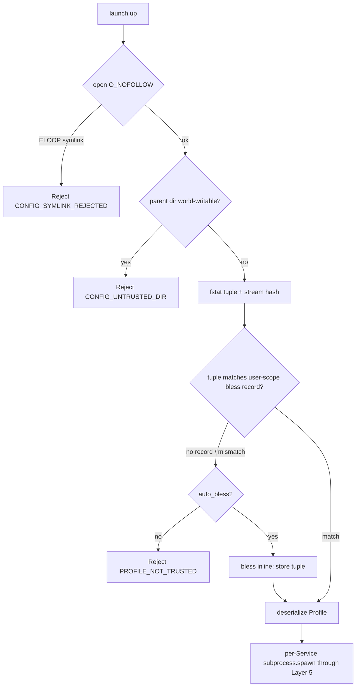

# ADR-0064 — Launch Profile Trust Model (TOFU)

## Context and Problem Statement

The launch bounded context ([ADR-0063](0063-launch-orchestration-bounded-context.md))
brings up processes declared in a project-local `.substrate.toml`. Because that
file is checked into the repository, it is controlled by whoever authored the
repository. A naive implementation where `launch.up` simply spawns whatever the
file declares would mean that cloning a hostile repository and running one tool
is arbitrary code execution — exactly the vulnerability class that bit `mise`
(CVE-2026-35533, trust-order confusion) and `git` (CVE-2022-24765, shared-host
ownership).

The subprocess BC already gates every spawn with a binary allowlist and
mandatory elicitation ([ADR-0052](0052-subprocess-execution-architecture.md)
Layer 5). Requiring an interactive elicitation form for every Service on every
`launch.up`, however, defeats the ergonomic purpose of a declarative stack. The
problem is: how does a Profile suppress the per-run confirmation prompt without
becoming a silent grant of execution authority?

## Decision Drivers

- A Profile is a convenience template, never an authority grant. The binary
  allowlist and the subprocess BC Layer 5 controls
  ([ADR-0052](0052-subprocess-execution-architecture.md)) MUST still apply to
  every Service spawn, trusted or not.
- The trust decision MUST be made before any byte of the file is semantically
  evaluated — no templating, no `include`, no field read before the hash check
  passes (the `mise` CVE lesson).
- Trust MUST be bound to file content and identity, not path alone, and stored
  outside the repository in user scope. The repository cannot vouch for itself.
- Path-safety hardening from [ADR-0035](0035-path-safety-hardening.md) applies:
  the config open MUST be symlink-safe.
- Error taxonomy from [ADR-0010](0010-error-taxonomy.md): new stable codes.

## Considered Options

- Option A: No trust gate; rely solely on the subprocess binary allowlist.
- Option B: Trust on first use (TOFU) with a content-and-identity pin stored in
  user scope; bless suppresses the per-run prompt, allowlist still gates
  (selected).
- Option C: Require interactive elicitation for every Service on every
  `launch.up` (no trust state).

## Decision Outcome

Chosen option: **Option B — trust on first use with a content-and-identity pin**,
because it suppresses the repetitive per-run prompt (the ergonomic win) while
preserving the default-deny security model: a Profile is blessed once, the
blessing is pinned to the file's content and inode identity, and the binary
allowlist plus subprocess Layer 5 controls still gate every spawn regardless of
trust.

Option A is rejected: the binary allowlist alone does not prevent a trusted
binary from being driven with hostile arguments, env, or cwd declared by an
untrusted file. Option C is rejected: per-Service per-run elicitation makes a
declarative stack unusable for its purpose.

### Trust decision pipeline (strict ordering)

Loading a Profile is a strict two-phase pipeline; no step may be reordered:

1. `open(".substrate.toml", O_RDONLY | O_NOFOLLOW)`. If the open fails with
   `ELOOP`, the file is a symlink and is rejected with
   `SUBSTRATE_LAUNCH_CONFIG_SYMLINK_REJECTED`.
2. `fstat` the opened descriptor; capture `(st_dev, st_ino, st_uid, st_mode,
   st_size)`. If the containing directory has the world-write bit set, reject
   with `SUBSTRATE_LAUNCH_CONFIG_UNTRUSTED_DIR`.
3. Stream the descriptor's bytes through BLAKE3 to a content hash.
4. Look up the bless record for the canonical path in the user-scope trust
   store. Compare the full tuple `(st_dev, st_ino, st_uid, st_mode & 0o7777,
   sha256_or_blake3)`. A mismatch on any field, or an absent record, means
   untrusted.
5. **Only if trusted**, deserialize the file content into a Profile. No TOML
   parse, no field access, no interpolation occurs before this point.

If untrusted, `launch.up` returns `SUBSTRATE_LAUNCH_PROFILE_NOT_TRUSTED` and the
client must call `launch.trust` (or the operator must set `auto_bless`).

### Bless record and trust store

The trust store lives in user scope at
`${XDG_CONFIG_HOME:-~/.config}/substrate/trust.toml`, never in the repository.
Each record binds a canonical Profile path to the full identity tuple:

```
[[trusted]]
path        = "/abs/project/.substrate.toml"
dev         = 16777220
ino         = 12895634
uid         = 501
mode        = 420            # 0o644
content     = "blake3:9f86d0..."
blessed_at  = "2026-06-30T12:00:00Z"
```

All five identity fields are re-verified on every load. Storing only the content
hash would allow an attacker to change permissions, have a third party rewrite
the file, then restore the original content; binding `dev`/`ino`/`uid`/`mode`
closes that path. The store file itself MUST be `0600` and owned by the invoking
user; a store with looser permissions is rejected at startup.

### Shared versus local Profiles

Following the IDEA "store as project file" distinction:

- `.substrate.toml` — committed/shared; untrusted until blessed (TOFU).
- `.substrate.local.toml` — git-ignored; authored locally by the operator;
  trusted on the basis of the same identity tuple but never prompts on first use,
  because the operator who runs substrate is also its author. It still must pass
  the `O_NOFOLLOW`, ownership, and world-writable-directory checks.

When both exist, the local file overrides matching Service keys in the shared
file; the merged Profile is what the Stack pins.

### Trust suppresses the prompt, not the gate

Blessing a Profile suppresses only the per-run elicitation prompt. Every Service
spawn still passes, unchanged, through the subprocess BC Layer 5 controls
([ADR-0052](0052-subprocess-execution-architecture.md)): the binary must be in
`security.subprocess_binary_allowlist`, the cwd must pass the PathJail, the env
is filtered through the env allowlist, and the canonical-path check-to-exec
invariant ([ADR-0052](0052-subprocess-execution-architecture.md) Amendment
2026-06-10) binds the validated binary to the executed binary. Trust changes
nothing about default-deny; it changes only whether a human is asked to confirm
a set of commands that have already been blessed once.

`command` MUST be declared as a TOML array, never a string; a string form is
rejected at parse time to remove the argument-injection surface. Binaries in the
interpreter class (`sh`, `bash`, `python`, `node`, `ruby`, `perl`, `git`) require
the existing allowlist entry and are not granted any implicit exception by trust.

### Auto-bless and explicit bless

- `launch.trust <profile>` blesses a Profile without running it; this is the
  default path and the recommended ceremony.
- Per-Profile `auto_bless = true` (opt-in) lets `launch.up` bless inline when the
  content/identity tuple is new, trading the deliberate ceremony for convenience
  at the operator's explicit choice.

### Running Stack immutability

A running Stack pins the Profile content it started with. Editing
`.substrate.toml` while the Stack runs changes the trust tuple on disk and marks
the Profile trust-stale, but does not alter the running Stack; the edit applies
only on the next `launch.up` or `launch.reload`, each of which re-blesses the new
content. This prevents a file edit from silently changing a running, blessed
command set.

### New error codes

Extending [ADR-0010](0010-error-taxonomy.md); these four occupy `-32044` through
`-32047` (see the 2026-06-30 launch amendment there for the canonical range):

- `SUBSTRATE_LAUNCH_PROFILE_NOT_TRUSTED` (-32044) — recovery hint: `"run
  launch.trust to bless this profile after reviewing the resolved command set"`.
- `SUBSTRATE_LAUNCH_CONFIG_SYMLINK_REJECTED` (-32045) — recovery hint: `"the
  config file must be a regular file, not a symlink; replace it with the real file"`.
- `SUBSTRATE_LAUNCH_CONFIG_UNTRUSTED_DIR` (-32046) — recovery hint: `"remove
  world-write permission from the directory containing .substrate.toml"`.
- `SUBSTRATE_LAUNCH_TRUST_STORE_INSECURE` (-32047) — recovery hint: `"set the
  trust store to mode 0600 owned by the current user"`.

### Trust flow diagram



## Consequences

### Positive

- A blessed Profile runs without a per-run prompt, yet a hostile cloned
  repository cannot execute anything: it is untrusted until a human blesses it,
  and even then every binary must already be allowlisted.
- Binding trust to the inode tuple, not the path, defeats the permission-flip and
  third-party-rewrite attacks.
- The strict open-hash-compare-then-parse ordering structurally prevents the
  trust-order-confusion class.

### Negative

- The user-scope trust store is new persistent state with its own permission and
  ownership invariants to enforce.
- Operators must perform an explicit bless ceremony the first time and after each
  intentional edit, unless they opt into `auto_bless`.

### Risks

- A shared host where multiple users invoke substrate could see one user's bless
  store referenced by another. Mitigation: the store is per-user under
  `XDG_CONFIG_HOME` and required to be `0600`; cross-user reads are rejected.

## Validation

- Security test: clone a Profile referencing an allowlisted binary; call
  `launch.up` without blessing; assert `SUBSTRATE_LAUNCH_PROFILE_NOT_TRUSTED` and
  no process is spawned.
- Security test: make `.substrate.toml` a symlink; assert
  `SUBSTRATE_LAUNCH_CONFIG_SYMLINK_REJECTED` before any hash is computed.
- Security test: bless a Profile, then change its mode from 0644 to 0666; assert
  the next load is untrusted (tuple mismatch).
- Security test: bless a Profile, then edit its content; assert the next load is
  untrusted and a running Stack started from the old content is unaffected.
- Security test: declare `command` as a string; assert parse-time rejection.
- Unit test: world-writable parent directory; assert
  `SUBSTRATE_LAUNCH_CONFIG_UNTRUSTED_DIR`.
- Unit test: trust store at mode 0644; assert `SUBSTRATE_LAUNCH_TRUST_STORE_INSECURE`
  at startup.

## Links

- [ADR-0004](0004-security-model.md) — defense-in-depth security model; trust is
  a launch-layer gate above Layer 5
- [ADR-0010](0010-error-taxonomy.md) — error taxonomy extended with launch trust
  codes
- [ADR-0035](0035-path-safety-hardening.md) — path-safety hardening; `O_NOFOLLOW`
  and TOCTOU class mirrored for the config file
- [ADR-0052](0052-subprocess-execution-architecture.md) — subprocess Layer 5
  binary/env allowlist and check-to-exec invariant still gate every Service spawn
- [ADR-0063](0063-launch-orchestration-bounded-context.md) — launch BC that this
  trust model gates
