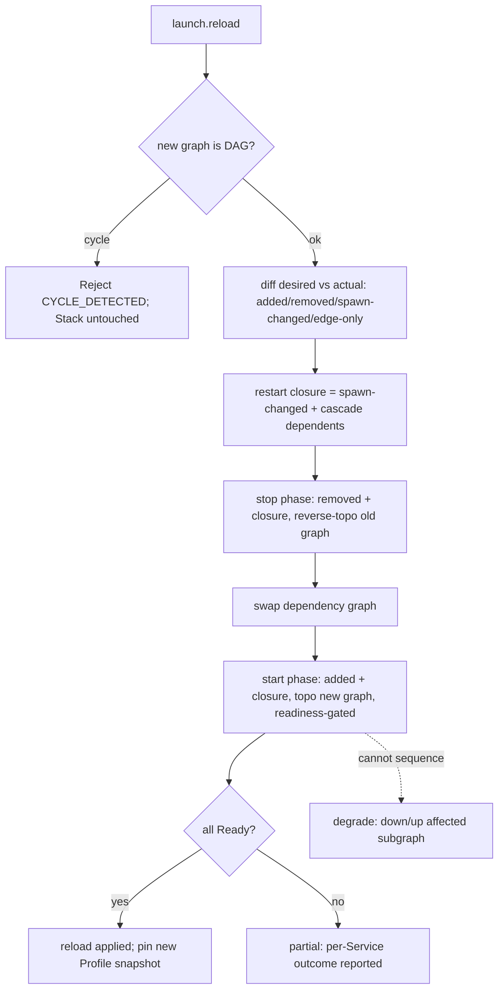

# ADR-0065 — Launch Dependency Graph and Reconciler Reload

## Context and Problem Statement

A Stack ([ADR-0063](0063-launch-orchestration-bounded-context.md)) is a set of
Services with `depends_on` relationships: a frontend that must not start until
the API is ready, an API that must not start until the database is ready. Bring-up
must respect that ordering and gate each start on the dependency's readiness, not
merely its having been spawned.

Operators also edit `.substrate.toml` while a Stack runs and expect to apply the
change without a full restart of unaffected Services. The hard case is a change to
the dependency topology itself — an added edge, a new Service, a removed Service —
applied to a live Stack. This ADR defines the dependency-graph semantics and the
reload algorithm.

## Decision Drivers

- `depends_on` forms a directed graph that must be acyclic; a cycle is a Profile
  authoring error and must be rejected at validation time, never at runtime.
- Readiness gating reuses the subprocess BC health probe and `Ready` state
  ([ADR-0056](0056-subprocess-supervisor-semantics.md)); launch adds only the
  *between-Service* ordering.
- A running Stack pins the Profile it started with
  ([ADR-0064](0064-launch-profile-trust-model.md)); reload is the explicit,
  re-blessed path to apply disk edits.
- Reload must disturb the minimum: only Services whose spawn-time inputs changed
  may be restarted; metadata-only changes must not bounce a healthy process.
- Reload is not atomic across the Stack; partial application must be reported
  per-Service rather than hidden.

## Considered Options

- Option A: Reload is always a full Stack `down` then `up`.
- Option B: Reload is a reconciler that diffs desired (new Profile) against actual
  (running Stack) and applies a minimal ordered op-plan, degrading to per-subgraph
  `down`/`up` only where it cannot safely sequence (selected).
- Option C: Hot-patch the running Stack's graph in place without restarting any
  process.

## Decision Outcome

Chosen option: **Option B — a reconciler that computes a minimal ordered op-plan**,
because it applies the smallest disturbance for the common case (one Service's
command changed) while remaining correct for topology changes, and because it
degrades gracefully to `down`/`up` of the affected subgraph when a safe sequence
cannot be found.

Option A is rejected: bouncing an entire stack to change one env var is needlessly
disruptive for long-lived dev stacks. Option C is rejected: spawn-time inputs
(command, args, env, cwd) cannot be changed on a live process, so an in-place
patch cannot honour them.

### Dependency graph semantics

`depends_on` is a directed edge from dependent to dependency. At Profile load:

- The graph is validated as a DAG via topological sort; a cycle is rejected with
  `SUBSTRATE_LAUNCH_CYCLE_DETECTED` and no process is started.
- Bring-up order is the topological order; each Service start is gated on every
  dependency reaching the subprocess `Ready` state
  ([ADR-0056](0056-subprocess-supervisor-semantics.md)). A dependency that fails
  readiness within its probe budget fails its dependents with
  `SUBSTRATE_LAUNCH_DEPENDENCY_FAILED`.
- `launch.down` proceeds in reverse topological order so dependents stop before
  the dependencies they rely on.
- A Service may declare `required = false` to make a missing or failed dependency
  a warning rather than a blocker, for optional sidecars not run by every
  developer.

### Field classification for reload

The reconciler classifies each Service field by whether a change requires a
process restart:

- **Spawn-time (restart required):** `command`, `args`, `env`, `cwd`, `streams`.
  These are fixed at `exec`; changing them requires a fresh child.
- **Supervisor-live (no restart):** `restart_policy` parameters and `health_probe`
  thresholds are applied to the existing subprocess supervisor without bouncing
  the child.
- **Classifier-live (no restart):** `error_patterns`, `notify`, and `redact`
  rules are swapped in the event classifier without bouncing the child.
- **Topology (`depends_on`):** handled as a graph delta below.

### Reconciler algorithm

Reload computes desired state (the new, re-blessed Profile) against actual state
(the running Stack snapshot) and produces an ordered op-plan:

1. Validate the new graph is a DAG. On cycle, reject the entire reload with
   `SUBSTRATE_LAUNCH_CYCLE_DETECTED`; the running Stack is untouched.
2. Compute the node delta: `added`, `removed`, `spawn-changed`, `edge-only`.
3. Compute the restart closure: `spawn-changed` plus the transitive dependents of
   each restarted node whose `on_dependency_restart` is `restart` (default).
4. Stop phase, in reverse topological order of the old graph: `removed` nodes and
   the restart-closure nodes.
5. Swap the Supervisor's in-memory dependency graph to the new graph.
6. Start phase, in topological order of the new graph: `added` nodes and the
   restart-closure nodes, each gated on readiness.
7. `edge-only` changes require no process action; they are already applied by the
   graph swap.

An added edge to a not-yet-ready dependency does not kill the dependent; it emits
an advisory event and takes effect on that dependent's next restart. A removed
edge is metadata only.

### New error codes

Extending [ADR-0010](0010-error-taxonomy.md); these two occupy `-32048` and
`-32049` (see the 2026-06-30 launch amendment there for the canonical range):

- `SUBSTRATE_LAUNCH_CYCLE_DETECTED` (-32048) — recovery hint: `"remove the
  dependency cycle from depends_on in .substrate.toml; run launch.list to inspect
  the graph before retrying"`.
- `SUBSTRATE_LAUNCH_DEPENDENCY_FAILED` (-32049) — recovery hint: `"check
  launch.status for the failed dependency; fix its readiness probe or set
  required=false to make it optional"`.

### Non-atomicity and degradation

Reload is incremental best-effort, not transactional. A Service that fails to
return to `Ready` during the start phase leaves the reload partially applied; the
result is reported per-Service (for example `api: restarted; web: readiness
timeout`). Stops already performed are not rolled back. If the reconciler cannot
compute a safe sequence for a topology change (for example a transient cycle in
the transition), it degrades to a `down`/`up` of the affected subgraph only —
never the whole Stack, never an abort that leaves the Stack in the old state.

### Cascade restart and the crash budget

When a Service is restarted (by reload, by `launch.restart`, or by cascade), the
restart is an *orchestrated* restart and MUST NOT count against the subprocess
crash-loop budget ([ADR-0056](0056-subprocess-supervisor-semantics.md)); only a
process that exits on its own counts. Cascade fires once per orchestrated restart,
never once per crash respawn, so a crash-looping dependency does not thrash its
dependents. Orchestrated restarts are rate-limited (default 60 per minute per
Service) to prevent an orchestrator-driven restart storm.

### Reload diagram

## Consequences

### Positive

- A one-field edit restarts at most the affected Service and its cascade, not the
  whole Stack.
- Metadata-only changes (restart policy, classifier rules) apply without bouncing
  any process.
- Topology changes are handled by an explicit reconciler with a documented
  degradation path rather than undefined behaviour.

### Negative

- The reconciler is the most complex single component of the launch BC; the
  field-classification and closure logic must be carefully tested.
- Non-atomic reload means a partially applied state is observable and must be
  surfaced honestly in `launch.status`.

### Risks

- A reload that degrades to subgraph `down`/`up` is more disruptive than the
  operator may expect. Mitigation: report the degradation explicitly in the
  reload outcome.

## Validation

- Unit test: a Profile with a `depends_on` cycle; assert
  `SUBSTRATE_LAUNCH_CYCLE_DETECTED` at validation, before any spawn.
- Integration test: three Services `db <- api <- web`; assert start order gates on
  each dependency's `Ready` and `down` proceeds in reverse.
- Unit test: reload changing only `restart_policy.max_retries`; assert no child is
  restarted.
- Unit test: reload changing `args` of `api` with `web` depending on it and
  default cascade; assert `web` is also restarted, `db` is not.
- Unit test: reload adding a Service; assert it starts gated on its declared
  dependencies and no existing Service restarts.
- Unit test: reload where a restarted Service times out readiness; assert
  per-Service partial outcome and no rollback of completed stops.

## Links

- [ADR-0010](0010-error-taxonomy.md) — error taxonomy extended with the launch
  dependency-graph codes (`CYCLE_DETECTED`, `DEPENDENCY_FAILED`)
- [ADR-0056](0056-subprocess-supervisor-semantics.md) — per-process readiness
  (`Ready`), health probes, restart policy, crash-loop budget reused here
- [ADR-0063](0063-launch-orchestration-bounded-context.md) — launch BC; Stack and
  Service aggregates
- [ADR-0064](0064-launch-profile-trust-model.md) — running-Stack immutability;
  reload re-blesses the new Profile content

## Amendments

### 2026-06-30 — Accepted; DAG and diff-reload landed, subgraph-degrade deferred

Status moves from `proposed` to `accepted`. `substrate-launch`'s `dag.rs`
implements cycle detection, topological start order, reverse-topological
`down`, and the restart-closure computation; `registry.rs` implements
`reload` as a diff into added / removed / restarted-with-cascade / edge-only
Service changes, matching this ADR's Option B reconciler. The **subgraph
`down`/`up` degradation path** for a reload that cannot apply incrementally
is deferred to **Milestone 2** alongside the detached supervisor
([ADR-0068](0068-launch-detached-supervisor-and-orphan-governance.md)); the
MVP reload surfaces a per-Service partial outcome without the subgraph
fallback.

## Amendment — 2026-07-01 — Readiness gating is now real; per-probe budget; `launch` implies `outbound-net`

This ADR gates each Service start on its dependencies reaching the subprocess
`Ready` state and delegates the deadline entirely to the per-Service `HealthProbe`
budget ([ADR-0056](0056-subprocess-supervisor-semantics.md)). The MVP shipped that
gating as a no-op: `wait_ready` treated a freshly spawned `Running` child as ready
and used a fixed 1s poll ceiling unrelated to the probe, so every Service resolved
`Ready` in microseconds regardless of its declared probe. With the ADR-0056 probe
wiring now landed, the launch side is corrected to match this ADR:

- **Per-probe readiness budget.** `wait_ready` derives its deadline from the
  Service's `health_probe` (`supervisor::readiness_budget`): a small fixed budget for
  `None`; `startup_grace_ms` plus a generous ceiling for `PortOpen` / `HttpGet`
  (neither carries its own overall timeout); the declared `timeout_ms` for
  `LogPattern`. This replaces the fixed 1s ceiling. A probe-gated Service is born
  `Starting` and only satisfies `depends_on` once its probe actually passes.
- **Stop on readiness failure.** A Service that never becomes ready within its budget
  is now stopped (cascade-cancelled) rather than left running, before the `Crashed`
  event is emitted, so a stuck-in-`Starting` child is not leaked.
- **`launch` implies `outbound-net`.** `PortOpen` / `HttpGet` probes are inert without
  `substrate-subprocess/outbound-net`, which would make readiness gating a no-op
  again. The composition root's `launch` Cargo feature therefore now implies
  `substrate-subprocess/outbound-net`. This is a deliberate, documented narrowing of
  ADR-0003's default-off outbound-network posture: enabling the launch orchestration
  BC necessarily enables the network health probes its readiness gate depends on. The
  opt-in surface is the `launch` feature itself.
- **Timeout vs. crash are still conflated.** A readiness timeout and a real crash both
  surface as `LaunchEventKind::Crashed` with no exit code; a dedicated readiness-
  timeout event/error remains future work.

The **subgraph degradation** and a **config-tunable readiness budget** (the budget is
currently a compile-time constant, not a `RuntimeConfig` knob) remain deferred.
