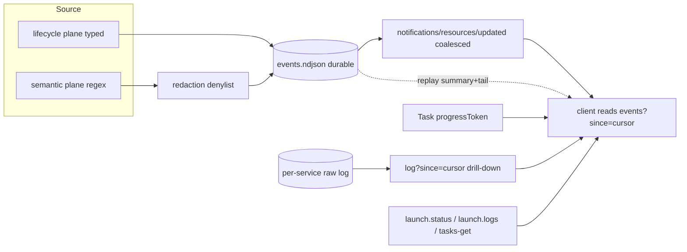

# ADR-0066 — Launch Event Stream and Notification Model

## Context and Problem Statement

A core goal of the launch bounded context
([ADR-0063](0063-launch-orchestration-bounded-context.md)) is that an LLM client
follows what a Stack is doing without polling raw logs. The naive approach —
streaming every stdout line to the client — is the opposite of useful: a dev
server emits thousands of lines and floods the model context.

Two protocol facts constrain the design. First, the MCP `logging` capability
(`notifications/message`) is being removed from the specification (SEP-2577) and
is already deprecated in the Rust SDK; it cannot be the event channel. Second,
`notifications/resources/updated` carries only a URI, not content, and
`resources/read` has no native range or pagination — content deltas must be
expressed as an application-level cursor. This ADR defines how launch surfaces
events to a client within those constraints.

## Decision Drivers

- Push must carry distilled events, not raw lines; the narrative-arc bifurcation
  of [ADR-0007](0007-tool-card-narrative-arc.md) applies to live streams.
- The `logging` notification path is unavailable (SEP-2577); events must travel
  over resource subscriptions and, during a Task, over progress notifications.
- A durable pull path must always exist and must survive the stateless direction
  of the MCP roadmap; push is a best-effort accelerator, never a requirement.
- Cursor semantics reuse [ADR-0008](0008-pagination-cursor.md); capability
  negotiation reuses [ADR-0013](0013-mcp-protocol-version.md).
- Secrets that a child prints must not reach the model context unredacted.

## Considered Options

- Option A: Push raw stdout/stderr lines as the event stream.
- Option B: Distil events at the source into two planes (typed lifecycle and
  semantic) over a durable event-log, surfaced as a subscribable resource with a
  cursor, with raw logs available on demand and a durable pull floor (selected).
- Option C: Pull only; no push, the client polls `launch.status`/`launch.logs`.

## Decision Outcome

Chosen option: **Option B — distilled two-plane events over a cursor-addressed
resource, with a durable pull floor**, because it gives the model high-signal,
low-volume notifications when the client supports subscriptions, keeps the full
raw output one drill-down away, and never depends on a push channel that the
protocol is removing.

Option A is rejected: raw streaming floods context and defeats the goal. Option C
is rejected: it forfeits the low-latency notification the feature is for, though
it remains the guaranteed fallback inside Option B.

### Two planes of events

- **Lifecycle plane (typed, reliable):** structural transitions —
  `STARTED`, `READY`, `EXITED` (with pid and exit code), `CRASHED`,
  `RESTARTING`, `ORPHAN_REAPED`, `ORPHAN_ADOPTED`. These come from the supervisor
  state machine ([ADR-0056](0056-subprocess-supervisor-semantics.md),
  [ADR-0063](0063-launch-orchestration-bounded-context.md)) and are authoritative.
- **Semantic plane (heuristic):** distilled from stdout/stderr by declared regex
  (`error_patterns`) and readiness signals — for example `web: ERROR ECONNREFUSED
  x42 in 5s`. These are advisory and sit on top of the lifecycle plane.

Both planes are written, tagged by Service and stream, to one durable per-Stack
event-log (`events.ndjson`, a capped/rotated ring). The event-log is the single
source for notifications and for replay.

### Channels: durable pull floor, best-effort push

- **Pull floor (always present):** `tasks/get`
  ([ADR-0049](0049-mcp-tasks-primitive-adoption.md)), `launch.status`, and
  `launch.logs?since=<cursor>`. This path is always available and survives a
  stateless protocol.
- **Push accelerator (when the client supports it):**
  - Events: a subscribable resource `launch://stack/<id>/events?since=<cursor>`.
    The server sends `notifications/resources/updated` (a coalesced poke); the
    client reads the delta from the cursor. The cursor is an opaque
    [ADR-0008](0008-pagination-cursor.md) value encoded in the URI because
    `resources/read` has no native range.
  - Continuous telemetry: while a `launch.up` Task is in flight, the Task's
    `progressToken` carries `notifications/progress` for the Task's lifetime
    (per the MCP `2025-11-25` task-augmented-request rule), suitable for
    cpu/memory/line counters.
  - Raw output: a subscribable resource
    `launch://stack/<id>/service/<svc>/log?since=<cursor>` for drill-down.

The `notifications/message` (logging) path is explicitly NOT used; it is removed
by SEP-2577.

### Replay on reconnect

A detached Stack ([ADR-0063](0063-launch-orchestration-bounded-context.md))
keeps appending to its event-log while no client is attached. On reconnect, the
server does not dump the backlog; it emits a **summary plus tail**: an aggregate
of the gap (for example "since you left: 2 crashes, 14 restarts, now healthy")
followed by the last N events (default 30). If the events since the client's
cursor exceed a cap (default 200), only the summary plus tail is sent. If the
event-log has rotated past the cursor, a gap marker is emitted and the summary is
reconstructed from the durable Stack state-file, which always holds current truth.

### Redaction

Before any event or raw line is written to the event-log or emitted, it passes a
redaction denylist: a global user-scope list (`~/.config/substrate/redact.toml`,
common token/key patterns) merged with per-Service `redact` patterns. Redaction
runs at the source so a secret a child prints never reaches the event-log or the
model context.

### Backpressure and flood control

The reader of a child's stream never blocks the child's pipe: lines move through
a bounded channel with `try_send`, and on a full channel the overflow is dropped
with a count ("... 1.2k lines elided") rather than awaited (a blocked pipe would
deadlock the child). Duplicate semantic events are coalesced ("ECONNREFUSED x42")
and emitted under a rate cap (default 5 per second). `notifications/resources/updated`
pokes are themselves coalesced to at most one per interval per resource.

### Capability negotiation and degradation

Per [ADR-0013](0013-mcp-protocol-version.md), the server advertises
`resources { subscribe, listChanged }`. A client that does not support
subscriptions degrades to the pull floor (`launch.logs` polling); a client that
does gets the push accelerator. Push is always a bonus; the pull floor is the
contract.

### Channel diagram

## Consequences

### Positive

- The model receives compact, high-signal events when the client supports
  subscriptions, and the full raw output remains one drill-down away.
- The design uses no removed protocol feature and survives the stateless
  direction: the cursor-pull model and Task polling are the durable substrate.
- Redaction at the source closes the secret-exfiltration-to-context surface.

### Negative

- The cursor-in-URI convention for resource reads is an application-level
  contract that must be documented and kept opaque.
- Maintaining both an event-log and per-Service raw logs is two retention
  surfaces to bound and rotate.

### Risks

- A client may receive `resources/updated` pokes faster than it reads; the
  coalescing and cursor design absorb this, but a pathologically chatty Service
  must still be rate-capped. Mitigation: the `notify.rate_per_sec` cap and the
  bounded drop-with-count reader.

## Validation

- Unit test: a Service emitting 10k identical lines; assert the event-log records
  a coalesced event with a count, not 10k entries.
- Unit test: a line matching a `redact` pattern; assert the stored and emitted
  forms are redacted.
- Integration test: subscribe to `launch://stack/<id>/events`; trigger a crash;
  assert a `CRASHED` lifecycle event is delivered via `resources/updated` +
  `read?since`.
- Integration test: detach a Stack, disconnect, generate events, reconnect;
  assert a summary-plus-tail (not a full dump) is delivered.
- Integration test: a client without `resources.subscribe`; assert events are
  available via `launch.logs` polling and no subscription is attempted.
- Unit test: a chatty Service exceeding `notify.rate_per_sec`; assert events are
  rate-capped and the reader never blocks the pipe.

## Links

- [ADR-0007](0007-tool-card-narrative-arc.md) — narrative-arc bifurcation applied
  to live event streams
- [ADR-0008](0008-pagination-cursor.md) — opaque cursor reused for `?since`
- [ADR-0013](0013-mcp-protocol-version.md) — capability negotiation; degrade to
  pull
- [ADR-0049](0049-mcp-tasks-primitive-adoption.md) — Tasks; progress token over
  Task lifetime for continuous telemetry
- [ADR-0054](0054-subprocess-stream-multiplex.md) — subprocess stream multiplex
  feeding the raw-log resource
- [ADR-0063](0063-launch-orchestration-bounded-context.md) — launch BC; lifecycle
  events from the supervisor state machine
