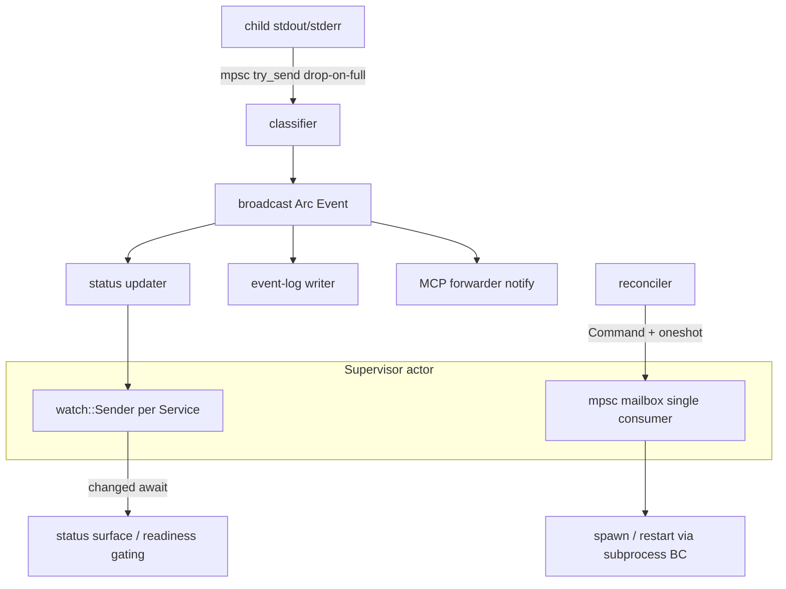

# ADR-0067 — Launch Concurrency and Messaging Topology

## Context and Problem Statement

The launch bounded context ([ADR-0063](0063-launch-orchestration-bounded-context.md))
has many concurrent moving parts per Stack: per-Service stdout/stderr readers, an
event classifier, readiness probes, a restart/crash-loop supervisor, a status
surface, and the channels that carry events to MCP subscribers. These components
share state — restart counters, current Service state, the subscriber set — that,
if guarded by locks, invites races and contention and conflicts with the
`panic = "abort"` constraint ([ADR-0014](0014-panic-abort.md)) under which
unwind-based RAII cleanup inside blocking closures is unavailable.

This ADR defines the in-process concurrency and messaging topology so that the
launch BC is lock-free by construction and its decoupling is explicit.

## Decision Drivers

- Shared mutable state (restart counters, subscriber set) must not be guarded by
  locks; message passing with single-owner state is preferred.
- A child's stdout pipe must never be blocked by a slow consumer; a blocked pipe
  deadlocks the child.
- State queries (status, readiness gating) must not poll; they should await
  transitions.
- Cancellation and permit lifetime follow
  [ADR-0037](0037-async-cancellation-patterns.md); async-zone classification
  follows [ADR-0003](0003-crate-stack-and-async-zones.md).

## Considered Options

- Option A: Shared `Arc<Mutex<...>>` state guarded by locks across tasks.
- Option B: An actor topology mapping each message shape to a dedicated channel
  primitive — command to a single-consumer mailbox, event to a broadcast, state
  to a watch — with single-owner state and no locks (selected).

## Decision Outcome

Chosen option: **Option B — an actor topology keyed by message shape**, because a
single-consumer mailbox serialises commands without a lock, a broadcast decouples
event producers from N consumers, and a watch exposes latest state without
polling. Restart counters live solely inside the supervisor actor, so there is no
shared mutable state to guard and no mutex to contend.

Option A is rejected: locks reintroduce the contention and race surface this
design exists to avoid, and `panic = "abort"` makes lock-poison and
unwind-cleanup reasoning fragile.

### Message shape to primitive mapping

- **Command (one owner, with acknowledgement):** `tokio::sync::mpsc` mailbox into
  the supervisor actor, with a `oneshot` reply channel per command for the
  per-Service outcome. The actor is the single owner of restart counters, backoff
  state, and the dependency graph. Concurrent commands from any source are
  serialised by the single consumer; there is no lock and no controller election.
- **Event (stream, many consumers):** `tokio::sync::broadcast` carrying
  `Arc<Event>` so the payload is not cloned per receiver. Consumers (event-log
  writer, MCP forwarder, status updater) subscribe independently; adding a
  consumer couples to nothing. A lagging consumer receives `RecvError::Lagged(n)`,
  which is exactly the drop-with-count backpressure semantics required by
  [ADR-0066](0066-launch-event-stream-and-notification-model.md).
- **State (latest value, many readers):** `tokio::sync::watch` per Service. The
  status surface and readiness gating call `changed().await` to wake on a
  transition rather than polling.

### Never block the child pipe

Each child stdout/stderr reader moves lines through a bounded `mpsc` using
`try_send`. On a full channel the reader drops the overflow and increments a
counter (surfaced per [ADR-0066](0066-launch-event-stream-and-notification-model.md));
it never `await`s on the send, because awaiting would back-pressure into the
child's pipe and deadlock it.

### mio's role

The launch BC does not hand-roll `mio`. The Tokio reactor is already `mio`
(`epoll`/`kqueue`/`IOCP`). The only direct use is `tokio::io::unix::AsyncFd` to
read the control FIFO asynchronously without consuming a blocking thread. The
detached-supervisor reactor that multiplexes the FIFO, child-exit sources, and
timers is specified in the detached-supervisor decision record (forthcoming
ADR-0068); this ADR covers the in-process actor topology that both the in-session
and detached supervisors share.

### Cancellation, permits, and zones

The supervisor actor and all per-Service tasks register with the Stack's
`CancellationToken` subtree ([ADR-0037](0037-async-cancellation-patterns.md)); a
`launch.down` or a parent shutdown drains every task via `select!` with the
cancellation arm. Concurrent spawns and readiness probes are bounded by an
`Arc<Semaphore>` sized per [ADR-0037](0037-async-cancellation-patterns.md). The
supervisor reactor is async-native (Zone A); the actual spawn is the subprocess
BC's blocking path (Zone B). Because state is single-owner and cleanup is explicit
on the actor's shutdown path, `panic = "abort"`
([ADR-0014](0014-panic-abort.md)) does not require unwind-based RAII.

### Default channel bounds

All bounds are configurable with defaults: per-Service stdout/stderr `mpsc`
capacity 1024, event `broadcast` capacity 256. One `broadcast` bus per Stack with
events tagged by Service (consumers filter), aligning with the multiplexed-log
default of [ADR-0066](0066-launch-event-stream-and-notification-model.md). One
event classifier per Service isolates one Service's regex set from another's.

### Topology diagram

## Consequences

### Positive

- Lock-free by construction: restart counters and the subscriber set have a
  single owner, so there is no race and no mutex.
- Adding an event consumer (a future metrics exporter, an audit sink) is one
  `subscribe()` and couples to no producer.
- State reads never poll; the pipe is never blocked; backpressure is explicit.

### Negative

- The actor mailbox is a single point through which all commands flow; a slow
  command handler serialises subsequent commands. Mitigation: handlers are
  non-blocking and delegate long work to the subprocess BC.
- Bounded channels mean overflow drops data; the drop-with-count surfacing must
  be honest in `launch.logs` and `launch.status`.

### Risks

- Misconfigured small bounds could drop events under load. Mitigation:
  conservative defaults and explicit surfacing of elision counts.

## Validation

- Unit test: two concurrent commands into the supervisor mailbox; assert
  serialised application and consistent counter state with no lock.
- Unit test: a slow event consumer; assert it receives `Lagged(n)` and the
  producer is not blocked.
- Unit test: a child emitting faster than the reader drains; assert `try_send`
  drops with a count and the pipe is never blocked.
- Unit test: a `watch`-based readiness gate; assert a dependent wakes on the
  dependency's `Ready` transition without polling.
- Unit test: `launch.down`; assert every per-Service task and the actor drain via
  the cancellation subtree.

## Links

- [ADR-0003](0003-crate-stack-and-async-zones.md) — async zones; supervisor is
  Zone A, spawn is Zone B
- [ADR-0014](0014-panic-abort.md) — `panic = "abort"`; message passing avoids
  unwind-based RAII
- [ADR-0037](0037-async-cancellation-patterns.md) — cancellation subtree and
  semaphore permits
- [ADR-0054](0054-subprocess-stream-multiplex.md) — subprocess stream chunks fed
  into the classifier
- [ADR-0063](0063-launch-orchestration-bounded-context.md) — launch BC hosting
  this topology
- [ADR-0066](0066-launch-event-stream-and-notification-model.md) — event channels
  fed by the broadcast bus
