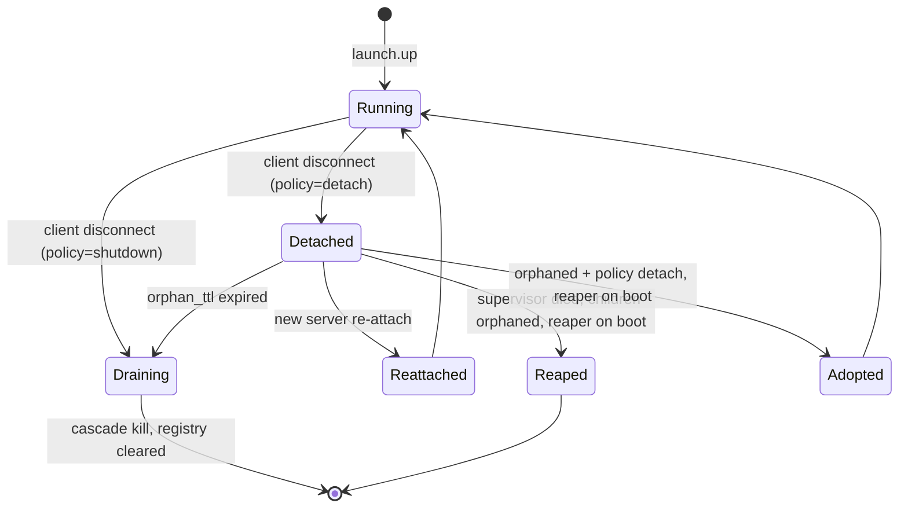

# ADR-0068 — Launch Detached Supervisor and Orphan Governance

## Context and Problem Statement

The launch bounded context ([ADR-0063](0063-launch-orchestration-bounded-context.md))
offers a `detach` disconnect policy under which a Stack survives the MCP server
that started it, so that closing and reopening the MCP client (Claude Code) does
not tear down a running dev stack. Survival is only acceptable if it is
governable: no process may be left running unmanaged, and a later session must be
able to find and re-attach to what is still running.

The existing process model supervises children from a Tokio task inside the MCP
server ([ADR-0056](0056-subprocess-supervisor-semantics.md)) and reaps orphans —
of temporary files only — on startup ([ADR-0055](0055-orphan-reaper-on-startup.md)).
Neither survives the server, and the prior posture
([ADR-0015](0015-distribution.md), [ADR-0052](0052-subprocess-execution-architecture.md)
Option C, [ADR-0056](0056-subprocess-supervisor-semantics.md) Option C) rejected
any sidecar or detached supervisor. This ADR records the scoped exception, the
detached supervisor mechanism, the IPC, and the orphan-governance contract that
makes detached survival safe.

## Decision Drivers

- A detached Stack's children must be owned and supervised by a process that
  outlives the MCP server; an in-server task cannot do this.
- The exception must be as narrow as possible: same binary, no network or Unix
  socket (preserving [ADR-0005](0005-stdio-transport.md)), filesystem and FIFO
  IPC only, opt-in.
- No process may ever be left running unmanaged; the default policy and the
  cross-platform parent-death binding must guarantee a clean host.
- IPC must be lock-free; serialisation comes from a single-consumer mailbox, not
  an advisory lock ([ADR-0067](0067-launch-concurrency-and-messaging-topology.md)).

## Considered Options

- Option A: No detached mode; a Stack always dies with the MCP server.
- Option B: A detached supervisor as a separate binary communicating over a Unix
  socket.
- Option C: The same distributed binary in a documented `--supervise` mode,
  detached via `setsid`, communicating over the filesystem and FIFOs, with a
  five-layer orphan guarantee and a reaper that adopts or reaps on boot
  (selected).

## Decision Outcome

Chosen option: **Option C — same-binary `--supervise` mode with filesystem/FIFO
IPC and orphan governance**, because it delivers governable detached survival
without a second artifact and without a socket, keeping the distribution and
transport invariants intact, while the orphan guarantee ensures the host is never
polluted.

Option A is rejected: it forfeits the survive-the-session capability the feature
requires. Option B is rejected: a separate binary violates
[ADR-0015](0015-distribution.md) and a Unix socket contradicts the
socket-free posture of [ADR-0052](0052-subprocess-execution-architecture.md)
Option C.

### Scoped exception to the anti-sidecar posture

This ADR carves a narrow exception to
[ADR-0052](0052-subprocess-execution-architecture.md) (Option C) and
[ADR-0056](0056-subprocess-supervisor-semantics.md) (Option C), and extends
[ADR-0055](0055-orphan-reaper-on-startup.md) from a file-only reaper to a process
reaper with an adopt-or-reap decision. The single-binary distribution invariant of
[ADR-0015](0015-distribution.md) is **preserved, not excepted** — `--supervise` is
the same artifact. The exception is bounded by:

- **Same binary.** The detached supervisor is `substrate` invoked as
  `--supervise <stack>`, not a second artifact. The distribution remains a single
  binary.
- **No socket.** IPC is the filesystem and FIFOs only; `stdout` sanctity and the
  STDIO-only transport of [ADR-0005](0005-stdio-transport.md) are untouched.
- **Opt-in.** The default disconnect policy is `shutdown`; the detached supervisor
  exists only when an operator sets `on_client_disconnect = "detach"`.

The exception applies solely to launch detached mode. Every other context retains
the in-server, no-sidecar model.

### Durable Stack registry

A detached Stack records a durable entry under
`${XDG_STATE_HOME:-~/.local/state}/substrate/stacks/<stack>/` containing:

- `supervisor.json` — `{ supervisor_pid, start_epoch, policy, config_hash,
  children: [ { name, pid, pgid, start_epoch } ] }`, written atomically via
  temp-plus-rename ([ADR-0033](0033-transactional-write-pattern.md)). Each child's
  `start_epoch` is its own process start-time, pinned against pid recycling.
- `control.fifo` — inbound command channel (server to supervisor).
- `events.ndjson` — the durable event-log
  ([ADR-0066](0066-launch-event-stream-and-notification-model.md)).

The registry is the rendezvous a fresh MCP server uses to discover, re-attach to,
adopt, or reap a detached Stack.

### Registry and IPC permission boundary

The control channel consumes destructive verbs (`launch.down`, `launch.reload`)
from any same-UID session with no in-band sender authentication, so the registry
must be a private, same-owner tree:

- `stacks/<stack>/` is created mode `0700` owned by the invoking user,
  `fstat`-checked on open and rejected if group/world-accessible or not owner-owned.
- `control.fifo` is created with `mkfifo(0600)`; before opening the read end the
  supervisor `fstat`s the fd and rejects it unless it is a FIFO, mode `0600`, and
  `st_uid == euid` (so a hostile pre-created FIFO or a co-resident reader is refused).
- Every ancestor of `${XDG_STATE_HOME:-~/.local/state}/substrate` is checked for
  the world-write bit; a world-writable ancestor (for example a relocated
  `XDG_STATE_HOME`) is rejected.
- Any of these failing yields `SUBSTRATE_LAUNCH_REGISTRY_INSECURE` at startup,
  before the read end is opened.

### Lock-free multiplexed IPC

The detached supervisor is a single `mio` reactor (`epoll`/`kqueue`/`IOCP`) that
multiplexes every source into one `mpsc` mailbox consumed by the supervisor actor
([ADR-0067](0067-launch-concurrency-and-messaging-topology.md)):

- the shared `control.fifo` read end (commands from any number of sessions),
- child-exit sources — `pidfd` on Linux, `kqueue EVFILT_PROC NOTE_EXIT` on macOS,
  a Job Object completion port on Windows — so a child exit is an ordinary
  pollable event,
- timer sources for readiness, backoff, the reconcile sweep, and the orphan TTL.

Multiple sessions write command frames bounded to `PIPE_BUF` so the kernel
guarantees atomic, interleave-free writes; the single mailbox consumer serialises
them. There is no advisory lock and no controller election. POSIX guarantees
atomicity only for writes `<= PIPE_BUF`, so the bound is a cooperative convention a
hostile writer could violate: `MAX_COMMAND_FRAME_SIZE` is fixed at `PIPE_BUF - 1`,
the writer rejects an oversize frame before `write()` with
`SUBSTRATE_LAUNCH_FRAME_TOO_LARGE`, and the consumer discards any frame exceeding
the bound (emitting the same code with a `correlation_id`) rather than attempting
reassembly. The FIFO is already owner-only (mode `0600`), so no magic-byte or
checksum framing is added.

### Disconnect policy

Per Stack (`on_client_disconnect`):

- `shutdown` (default) — when the MCP server's client disconnects, the supervisor
  observes the server's death (a `pidfd`/`NOTE_EXIT` source on the server PID, or
  EOF on the control channel) and drains and cascade-kills the Stack. Nothing
  survives.
- `detach` — the supervisor keeps owning and supervising the children, and arms
  the orphan TTL.

### Cross-platform parent-death binding

Every child substrate spawns is bound to the supervisor at spawn time so that if
the supervisor dies the kernel kills the children, reusing
[ADR-0053](0053-process-lifecycle-cascade-contract.md):
`PR_SET_PDEATHSIG(SIGKILL)` on Linux (kernel-enforced, survives re-parenting), the
`WatchdogPipe` (child exits on EOF) on macOS, and a Job Object with
`JOB_OBJECT_LIMIT_KILL_ON_JOB_CLOSE` on Windows. The binding holds for processes
substrate spawned itself. An **adopted** child (reaped from a prior supervisor)
never inherited the macOS `WatchdogPipe` fd and has no rebindable parent-death
primitive, so on macOS adopted/arbitrary children rely solely on `pgid` tracking
and reaper-on-boot, not kernel parent-death; Linux re-binds `PR_SET_PDEATHSIG` on
adopt where the platform allows. No orphan arises from supervisor death for
spawned children, with reaper-on-boot as the backstop for adopted ones.

### Orphan TTL

A detached Stack with no client attached for `launch.orphan_ttl_secs` (default
3600) is automatically brought down by the supervisor's TTL timer and its registry
entry cleared, with `SUBSTRATE_LAUNCH_STACK_TTL_EXPIRED` recorded. A forgotten
Stack cannot run indefinitely.

### Reaper on boot: adopt or reap

On every supervisor and MCP-server start, a reconcile pass walks the registry.
Before applying any rule, the reaper re-reads each recorded child's live process
start-time (`/proc/<pid>/stat` field 22 on Linux, `kinfo_proc.p_starttime` on
macOS) and compares it to the recorded `start_epoch`. The kernel can recycle a
dead child's `pid`/`pgid` onto an unrelated process, so a mismatch means the
recorded child is gone and a stranger holds its pid: the reaper clears the entry,
sends **no** signal, and records `SUBSTRATE_LAUNCH_CHILD_PID_RECYCLED`. It likewise
verifies the pgid leader's start-time before any `killpg`, so a recycled process
group is never signalled. Only on a start-time match does it apply, for each
recorded child:

1. Alive and parented to a live supervisor for this Stack → re-attach.
2. Orphaned (reparented to init or launchd) and the Stack policy is `detach` →
   adopt: a supervisor re-establishes ownership (re-binding parent-death where the
   platform allows, otherwise tracking by `pgid`) and records
   `SUBSTRATE_LAUNCH_ORPHAN_ADOPTED`.
3. Orphaned and the policy is `shutdown`, or the registry entry is stale (no
   matching live process), → reap: `killpg(pgid, SIGTERM)` then `SIGKILL` after
   the drain window, clear the entry, record `SUBSTRATE_LAUNCH_ORPHAN_REAPED`.

This extends the file-only reaper of
[ADR-0055](0055-orphan-reaper-on-startup.md); the temporary-file reaping it
already performs is unchanged and runs alongside.

### The monitor (reconcile sweep)

A periodic timer on the supervisor reactor reconciles desired state (the registry)
against actual state (the OS process table observed through the `process` BC and
the pollable exit sources): unexpected exits go to the restart policy
([ADR-0056](0056-subprocess-supervisor-semantics.md)); orphans are adopted or
reaped; zombies are `waitpid`-reaped; drift is corrected and a hygiene event
emitted. This sweep is what keeps the host clean between boots.

### Lifecycle diagram

### New error codes

Extending [ADR-0010](0010-error-taxonomy.md); these four occupy `-32050` through
`-32053` (see the 2026-06-30 launch amendment there for the canonical range). The
code is named `SUPERVISOR_UNREACHABLE`, not `SIDECAR_UNREACHABLE`: the launch
ubiquitous language names the component a Supervisor and rejects "sidecar".

- `SUBSTRATE_LAUNCH_ORPHAN_REAPED` (-32050) — recovery hint: `"a previously
  detached process was reaped on startup; re-run launch.up to restart the stack"`.
- `SUBSTRATE_LAUNCH_ORPHAN_ADOPTED` (-32051) — recovery hint: `"a detached process
  was re-adopted on startup; use launch.status to inspect it"`.
- `SUBSTRATE_LAUNCH_STACK_TTL_EXPIRED` (-32052) — recovery hint: `"the detached
  stack exceeded launch.orphan_ttl_secs without a client; re-run launch.up"`.
- `SUBSTRATE_LAUNCH_SUPERVISOR_UNREACHABLE` (-32053) — recovery hint: `"the
  detached supervisor is not responding; run launch.status to trigger
  reaper-on-boot"`.

The supervisor-hardening codes below occupy `-32054` through `-32056` (see the
2026-06-30 supervisor amendment in [ADR-0010](0010-error-taxonomy.md)):

- `SUBSTRATE_LAUNCH_REGISTRY_INSECURE` (-32054) — recovery hint: `"set the launch
  stacks dir to 0700 and control.fifo to 0600 owned by you, with no world-writable
  ancestor; then retry"`.
- `SUBSTRATE_LAUNCH_FRAME_TOO_LARGE` (-32055) — recovery hint: `"the control-FIFO
  command frame exceeds PIPE_BUF-1 and was rejected to preserve atomic framing;
  send a smaller command"`.
- `SUBSTRATE_LAUNCH_CHILD_PID_RECYCLED` (-32056) — recovery hint: `"a recorded
  child's pid was recycled to another process; the stale entry was cleared with no
  signal sent; re-run launch.up"`.

## Consequences

### Positive

- A detached Stack survives the MCP client and is re-attachable, while the
  five-layer guarantee (default shutdown, parent-death binding, orphan TTL,
  reaper-on-boot, process-group reap) ensures the host is never polluted.
- The exception to the anti-sidecar posture is minimal, documented, and opt-in;
  the single-binary and socket-free invariants hold.
- The lock-free reactor serialises multi-session commands without a controller
  election or advisory lock.

### Negative

- A detached supervisor is a second long-lived process for the duration of a
  detached Stack, with its own registry state to reconcile.
- Three platform-specific parent-death and child-exit implementations must each
  be validated.

### Risks

- A supervisor killed by `SIGKILL` before the kernel delivers parent-death could,
  in a narrow window, leave a child briefly orphaned. Mitigation: reaper-on-boot
  is the backstop and the registry records enough to reap any survivor.

## Validation

- Integration test: `detach` Stack; kill the MCP server; assert children survive
  and a new server re-attaches via the registry.
- Integration test: `SIGKILL` the detached supervisor; assert children die via
  parent-death binding and the next boot's reaper finds no survivors.
- Integration test: `detach` Stack with `orphan_ttl_secs = 2` and no client;
  assert auto-down and `SUBSTRATE_LAUNCH_STACK_TTL_EXPIRED`.
- Integration test: simulate an orphaned child in the registry; assert reaper
  reaps under `shutdown` and adopts under `detach`.
- Unit test: concurrent in-bound command frames (each <= MAX_COMMAND_FRAME_SIZE)
  from two sessions over the shared FIFO; assert atomic interleave-free framing and
  serialised application with no lock.
- Security test: `stacks/<stack>/` at mode 0755 or a `control.fifo` at 0666;
  assert `SUBSTRATE_LAUNCH_REGISTRY_INSECURE` before the read end is opened.
- Unit test: a writer emitting a frame `> PIPE_BUF`; assert rejection with
  `SUBSTRATE_LAUNCH_FRAME_TOO_LARGE` before write, and a consumer-side oversize
  frame discarded with the same code, never reassembled.
- Security test: recycle a recorded child's pid/pgid onto an unrelated process;
  assert the reaper sends no signal, clears the entry, and records
  `SUBSTRATE_LAUNCH_CHILD_PID_RECYCLED`.
- Integration test: a zombie child; assert the reconcile sweep `waitpid`-reaps it.

## Links

- [ADR-0005](0005-stdio-transport.md) — STDIO transport; detached IPC is
  filesystem/FIFO only, no socket
- [ADR-0010](0010-error-taxonomy.md) — error taxonomy extended with orphan codes
- [ADR-0015](0015-distribution.md) — single binary; `--supervise` is the same
  binary (invariant preserved, not excepted)
- [ADR-0033](0033-transactional-write-pattern.md) — atomic temp-plus-rename for the
  registry
- [ADR-0052](0052-subprocess-execution-architecture.md) — Option C (sidecar)
  scoped exception
- [ADR-0053](0053-process-lifecycle-cascade-contract.md) — cascade kill and
  parent-death binding reused as orphan-prevention
- [ADR-0055](0055-orphan-reaper-on-startup.md) — file reaper extended to a process
  adopt-or-reap reaper
- [ADR-0056](0056-subprocess-supervisor-semantics.md) — Option C scoped exception;
  per-process restart policy reused
- [ADR-0063](0063-launch-orchestration-bounded-context.md) — launch BC and the
  five-layer zero-orphan guarantee
- [ADR-0067](0067-launch-concurrency-and-messaging-topology.md) — lock-free actor
  topology the reactor feeds

## Amendments

### 2026-06-30 — Accepted as the Milestone 2 design; not yet implemented

Status moves from `proposed` to `accepted`: Option C (same-binary
`--supervise` mode, filesystem/FIFO IPC, five-layer zero-orphan guarantee)
is the team's locked decision for detached survival, recorded here so the
remaining launch ADRs (0063, 0065, 0066, 0067) can cite a stable reference
for the deviations they each defer to it. Nothing in this ADR is built yet:
`substrate-launch/src/registry.rs` returns
`SUBSTRATE_LAUNCH_SUPERVISOR_UNREACHABLE` for any
`on_client_disconnect = detach` request before any spawn, and
`substrate-launch/src/supervisor.rs` is a stub documenting that the
`--supervise` self-fork, control FIFO, `mio` reactor, `pidfd`/`kqueue`
child-exit sources, and reaper-on-boot all remain **Milestone 2** work. The
MVP enforces `shutdown` semantics unconditionally.

### 2026-06-30 — Milestone 2 implemented (Linux + macOS); deviations from the literal design

The detached supervisor is built and `on_client_disconnect = detach` works end
to end: `LaunchRegistry::up` forks `substrate --supervise <stack_id> --profile
<path>` (`ProcessDetachLauncher`, `crates/substrate-launch/src/registry.rs`)
and polls the durable `supervisor.json` (100ms interval, 10s timeout) before
returning; a fresh MCP server reaps/re-attaches detached Stacks left by a
prior session at startup (`reaper::reconcile_sweep`, wired into
`composition.rs`). Three deliberate deviations from this ADR's literal
mechanism, each preserving the functional guarantee while avoiding new
architectural surface:

- **Reactor is a `tokio::select! { biased; .. }` loop, not a hand-rolled `mio`
  reactor.** The control FIFO is read via blocking `std::fs::File` I/O inside
  `tokio::task::spawn_blocking` (`crates/substrate-launch/src/control_fifo.rs`),
  not `tokio::net::unix::pipe` — that API requires tokio's `net` Cargo
  feature, which this project gates behind the opt-in `outbound-net` feature
  (ADR-0005/ADR-0006 STDIO-only posture) and which was not warranted for a
  local FIFO. Child-exit and the TTL/reconcile timers are ordinary
  `tokio::select!` arms (`crates/substrate-launch/src/detached.rs`); tokio's
  own internal reactor already provides the event-driven multiplexing this
  ADR asked of `mio` directly.
- **Child-exit detection is poll-based (every 500ms via `SubprocessPort::list()`
  diffing), not push-based `pidfd`/`kqueue EVFILT_PROC`.** `substrate-launch`
  only ever sees children through the injected `SubprocessPort` trait (no
  await-on-exit primitive exists on that surface), so a raw `pidfd`/`kqueue`
  source would require either widening the port or duplicating subprocess
  internals across the hexagonal boundary. This is the literal mechanism this
  ADR's own "Monitor (reconcile sweep)" section already describes as a
  periodic-timer reconciliation, so it is faithful to the spec, not a
  shortcut.
- **`PR_SET_PDEATHSIG` on Linux is real (`SIGKILL`, via the
  `SubprocessRequest.parent_death_signal` field threaded into
  `substrate-subprocess/src/pre_exec.rs`); macOS has no WatchdogPipe
  trampoline for arbitrary Service commands.** macOS's existing
  best-effort `WatchdogPipe` (`substrate-subprocess/src/watchdog.rs`,
  ADR-0053) only self-terminates a child that reads its own
  `SUBSTRATE_WATCHDOG_FD` environment variable — an arbitrary user command
  (`npm run dev`, `cargo run`, ...) cannot be made to cooperate. macOS
  detached Stacks therefore rely on `pgid` tracking + reaper-on-boot as the
  actual zero-orphan mechanism, exactly as this ADR already sanctions for the
  "adopted/arbitrary children" case (§"Cross-platform parent-death binding").
  This is a real, currently-uncovered gap: a `SIGKILL`'d macOS supervisor
  whose children never read the watchdog fd survive until the next
  reaper-on-boot sweep, not instantly. A genuine fix (a `substrate
  --exec-guard <fd> -- <argv>` trampoline child that owns the real command and
  forwards the kill) is deferred — not built in this pass.
- **The PID-recycle guard primitive (`crates/substrate-launch/src/pid_probe.rs`)
  is real on both platforms**: Linux reads `procfs::process::Process::stat()`
  (raw ticks-since-boot, compared for equality, no boot-time conversion);
  macOS issues a single `sysctl(CTL_KERN, KERN_PROC, KERN_PROC_PID, pid)` and
  reads `p_starttime`/`e_ppid` from the fixed-size `kinfo_proc` buffer,
  re-deriving the byte offsets already documented in
  `substrate-process/src/scanner/macos.rs` rather than depending on that
  sibling adapter crate (hexagonal layering forbids adapter-to-adapter
  dependencies).

**Known gap found during testing, not fixed here:** driving the genuine
"supervisor SIGKILL'd, children orphaned, parent-death binding kills them"
scenario end-to-end surfaced a pre-existing bug in
`substrate-subprocess/src/watchdog.rs::install` (ADR-0053): the watchdog
pipe's write end is never marked `FD_CLOEXEC`, so a spawned child inherits its
own copy across `fork`+`exec` and the intended EOF-on-supervisor-death never
arrives. This affects the existing in-process MVP watchdog mechanism, not
just the detached supervisor; it is out of this task's scope and is tracked
as a follow-up rather than silently worked around.

**Windows**: no Job Object implementation exists; `--supervise` is Linux and
macOS only in this pass, compile-checked nowhere on Windows. Tracked as
future work, not started.

**Test coverage**: 7 of the 11 Milestone-2 cucumber scenarios drive genuine
production code (real forked `--supervise` processes, real `control.fifo`
round-trips, real `reaper::reconcile_sweep`); 1 is partially real (the
re-attach Then steps remain stubbed because `reconcile_sweep` does not yet
repopulate a fresh server's in-memory `LaunchRegistry` — on-disk state is
correct, in-memory visibility is a follow-up); 3 remain honest documented
stubs (`subgraph`-degrade reload, zombie `waitpid` reaping, event-replay
summary — none of these have any implementation to test yet, by design,
unrelated to this pass). Full workspace gate (`cargo build|clippy -D
warnings|test --workspace --all-features`) is clean on macOS; the
`procfs`-gated Linux path in `pid_probe.rs` is compile-checked only on this
macOS development machine, not executed — a Linux CI/Docker run is the
remaining verification gap before calling Linux support fully proven, not
just compiled.
