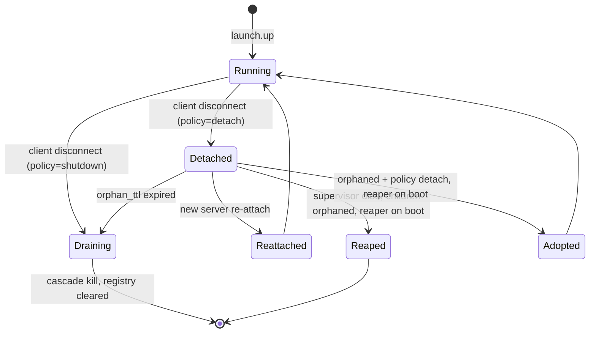

# ADR-0068 — Launch Detached Supervisor and Orphan Governance

## Context and Problem Statement

The launch bounded context ([ADR-0063](0063-launch-orchestration-bounded-context.md))
offers a `detach` disconnect policy under which a Stack survives the MCP server
that started it, so that closing and reopening the MCP client (Claude Code) does
not tear down a running dev stack. Survival is only acceptable if it is
governable: no process may be left running unmanaged, and a later session must be
able to find and re-attach to what is still running.

The existing process model supervises children from a Tokio task inside the MCP
server ([ADR-0056](0056-subprocess-supervisor-semantics.md)) and reaps orphans —
of temporary files only — on startup ([ADR-0055](0055-orphan-reaper-on-startup.md)).
Neither survives the server, and the prior posture
([ADR-0015](0015-distribution.md), [ADR-0052](0052-subprocess-execution-architecture.md)
Option C, [ADR-0056](0056-subprocess-supervisor-semantics.md) Option C) rejected
any sidecar or detached supervisor. This ADR records the scoped exception, the
detached supervisor mechanism, the IPC, and the orphan-governance contract that
makes detached survival safe.

## Decision Drivers

- A detached Stack's children must be owned and supervised by a process that
  outlives the MCP server; an in-server task cannot do this.
- The exception must be as narrow as possible: same binary, no network or Unix
  socket (preserving [ADR-0005](0005-stdio-transport.md)), filesystem and FIFO
  IPC only, opt-in.
- No process may ever be left running unmanaged; the default policy and the
  cross-platform parent-death binding must guarantee a clean host.
- IPC must be lock-free; serialisation comes from a single-consumer mailbox, not
  an advisory lock ([ADR-0067](0067-launch-concurrency-and-messaging-topology.md)).

## Considered Options

- Option A: No detached mode; a Stack always dies with the MCP server.
- Option B: A detached supervisor as a separate binary communicating over a Unix
  socket.
- Option C: The same distributed binary in a documented `--supervise` mode,
  detached via `setsid`, communicating over the filesystem and FIFOs, with a
  five-layer orphan guarantee and a reaper that adopts or reaps on boot
  (selected).

## Decision Outcome

Chosen option: **Option C — same-binary `--supervise` mode with filesystem/FIFO
IPC and orphan governance**, because it delivers governable detached survival
without a second artifact and without a socket, keeping the distribution and
transport invariants intact, while the orphan guarantee ensures the host is never
polluted.

Option A is rejected: it forfeits the survive-the-session capability the feature
requires. Option B is rejected: a separate binary violates
[ADR-0015](0015-distribution.md) and a Unix socket contradicts the
socket-free posture of [ADR-0052](0052-subprocess-execution-architecture.md)
Option C.

### Scoped exception to the anti-sidecar posture

This ADR carves a narrow exception to
[ADR-0015](0015-distribution.md), [ADR-0052](0052-subprocess-execution-architecture.md)
(Option C), and [ADR-0056](0056-subprocess-supervisor-semantics.md) (Option C),
and extends [ADR-0055](0055-orphan-reaper-on-startup.md) from a file-only reaper
to a process reaper with an adopt-or-reap decision. The exception is bounded by:

- **Same binary.** The detached supervisor is `substrate` invoked as
  `--supervise <stack>`, not a second artifact. The distribution remains a single
  binary.
- **No socket.** IPC is the filesystem and FIFOs only; `stdout` sanctity and the
  STDIO-only transport of [ADR-0005](0005-stdio-transport.md) are untouched.
- **Opt-in.** The default disconnect policy is `shutdown`; the detached supervisor
  exists only when an operator sets `on_client_disconnect = "detach"`.

The exception applies solely to launch detached mode. Every other context retains
the in-server, no-sidecar model.

### Durable Stack registry

A detached Stack records a durable entry under
`${XDG_STATE_HOME:-~/.local/state}/substrate/stacks/<stack>/` containing:

- `supervisor.json` — `{ supervisor_pid, start_epoch, policy, config_hash,
  children: [ { name, pid, pgid } ] }`, written atomically via temp-plus-rename
  ([ADR-0033](0033-transactional-write-pattern.md)).
- `control.fifo` — inbound command channel (server to supervisor).
- `events.ndjson` — the durable event-log
  ([ADR-0066](0066-launch-event-stream-and-notification-model.md)).

The registry is the rendezvous a fresh MCP server uses to discover, re-attach to,
adopt, or reap a detached Stack.

### Lock-free multiplexed IPC

The detached supervisor is a single `mio` reactor (`epoll`/`kqueue`/`IOCP`) that
multiplexes every source into one `mpsc` mailbox consumed by the supervisor actor
([ADR-0067](0067-launch-concurrency-and-messaging-topology.md)):

- the shared `control.fifo` read end (commands from any number of sessions),
- child-exit sources — `pidfd` on Linux, `kqueue EVFILT_PROC NOTE_EXIT` on macOS,
  a Job Object completion port on Windows — so a child exit is an ordinary
  pollable event,
- timer sources for readiness, backoff, the reconcile sweep, and the orphan TTL.

Multiple sessions write command frames bounded to `PIPE_BUF` so the kernel
guarantees atomic, interleave-free writes; the single mailbox consumer serialises
them. There is no advisory lock and no controller election.

### Disconnect policy

Per Stack (`on_client_disconnect`):

- `shutdown` (default) — when the MCP server's client disconnects, the supervisor
  observes the server's death (a `pidfd`/`NOTE_EXIT` source on the server PID, or
  EOF on the control channel) and drains and cascade-kills the Stack. Nothing
  survives.
- `detach` — the supervisor keeps owning and supervising the children, and arms
  the orphan TTL.

### Cross-platform parent-death binding

Every child is bound to the supervisor so that if the supervisor dies, the kernel
kills the children, reusing [ADR-0053](0053-process-lifecycle-cascade-contract.md):
`PR_SET_PDEATHSIG(SIGKILL)` on Linux, the `WatchdogPipe` (child exits on EOF) on
macOS, and a Job Object with `JOB_OBJECT_LIMIT_KILL_ON_JOB_CLOSE` on Windows.
This guarantees no orphan arises from supervisor death alone.

### Orphan TTL

A detached Stack with no client attached for `launch.orphan_ttl_secs` (default
3600) is automatically brought down by the supervisor's TTL timer and its registry
entry cleared, with `SUBSTRATE_LAUNCH_STACK_TTL_EXPIRED` recorded. A forgotten
Stack cannot run indefinitely.

### Reaper on boot: adopt or reap

On every supervisor and MCP-server start, a reconcile pass walks the registry. For
each recorded child:

1. Alive and parented to a live supervisor for this Stack → re-attach.
2. Orphaned (reparented to init or launchd) and the Stack policy is `detach` →
   adopt: a supervisor re-establishes ownership (re-binding parent-death where the
   platform allows, otherwise tracking by `pgid`) and records
   `SUBSTRATE_LAUNCH_ORPHAN_ADOPTED`.
3. Orphaned and the policy is `shutdown`, or the registry entry is stale (no
   matching live process), → reap: `killpg(pgid, SIGTERM)` then `SIGKILL` after
   the drain window, clear the entry, record `SUBSTRATE_LAUNCH_ORPHAN_REAPED`.

This extends the file-only reaper of
[ADR-0055](0055-orphan-reaper-on-startup.md); the temporary-file reaping it
already performs is unchanged and runs alongside.

### The monitor (reconcile sweep)

A periodic timer on the supervisor reactor reconciles desired state (the registry)
against actual state (the OS process table observed through the `process` BC and
the pollable exit sources): unexpected exits go to the restart policy
([ADR-0056](0056-subprocess-supervisor-semantics.md)); orphans are adopted or
reaped; zombies are `waitpid`-reaped; drift is corrected and a hygiene event
emitted. This sweep is what keeps the host clean between boots.

### Lifecycle diagram

### New error codes

Extending [ADR-0010](0010-error-taxonomy.md):

- `SUBSTRATE_LAUNCH_ORPHAN_REAPED` — recovery hint: `"a previously detached
  process was reaped on startup; re-run launch.up to restart the stack"`.
- `SUBSTRATE_LAUNCH_ORPHAN_ADOPTED` — recovery hint: `"a detached process was
  re-adopted on startup; use launch.status to inspect it"`.
- `SUBSTRATE_LAUNCH_STACK_TTL_EXPIRED` — recovery hint: `"the detached stack
  exceeded launch.orphan_ttl_secs without a client; re-run launch.up"`.
- `SUBSTRATE_LAUNCH_SIDECAR_UNREACHABLE` — recovery hint: `"the detached
  supervisor is not responding; run launch.status to trigger reaper-on-boot"`.

## Consequences

### Positive

- A detached Stack survives the MCP client and is re-attachable, while the
  five-layer guarantee (default shutdown, parent-death binding, orphan TTL,
  reaper-on-boot, process-group reap) ensures the host is never polluted.
- The exception to the anti-sidecar posture is minimal, documented, and opt-in;
  the single-binary and socket-free invariants hold.
- The lock-free reactor serialises multi-session commands without a controller
  election or advisory lock.

### Negative

- A detached supervisor is a second long-lived process for the duration of a
  detached Stack, with its own registry state to reconcile.
- Three platform-specific parent-death and child-exit implementations must each
  be validated.

### Risks

- A supervisor killed by `SIGKILL` before the kernel delivers parent-death could,
  in a narrow window, leave a child briefly orphaned. Mitigation: reaper-on-boot
  is the backstop and the registry records enough to reap any survivor.

## Validation

- Integration test: `detach` Stack; kill the MCP server; assert children survive
  and a new server re-attaches via the registry.
- Integration test: `SIGKILL` the detached supervisor; assert children die via
  parent-death binding and the next boot's reaper finds no survivors.
- Integration test: `detach` Stack with `orphan_ttl_secs = 2` and no client;
  assert auto-down and `SUBSTRATE_LAUNCH_STACK_TTL_EXPIRED`.
- Integration test: simulate an orphaned child in the registry; assert reaper
  reaps under `shutdown` and adopts under `detach`.
- Unit test: concurrent command frames from two sessions over the shared FIFO;
  assert atomic framing and serialised application with no lock.
- Integration test: a zombie child; assert the reconcile sweep `waitpid`-reaps it.

## Links

- [ADR-0005](0005-stdio-transport.md) — STDIO transport; detached IPC is
  filesystem/FIFO only, no socket
- [ADR-0010](0010-error-taxonomy.md) — error taxonomy extended with orphan codes
- [ADR-0015](0015-distribution.md) — single binary; `--supervise` is the same
  binary (scoped exception)
- [ADR-0033](0033-transactional-write-pattern.md) — atomic temp-plus-rename for the
  registry
- [ADR-0052](0052-subprocess-execution-architecture.md) — Option C (sidecar)
  scoped exception
- [ADR-0053](0053-process-lifecycle-cascade-contract.md) — cascade kill and
  parent-death binding reused as orphan-prevention
- [ADR-0055](0055-orphan-reaper-on-startup.md) — file reaper extended to a process
  adopt-or-reap reaper
- [ADR-0056](0056-subprocess-supervisor-semantics.md) — Option C scoped exception;
  per-process restart policy reused
- [ADR-0063](0063-launch-orchestration-bounded-context.md) — launch BC and the
  five-layer zero-orphan guarantee
- [ADR-0067](0067-launch-concurrency-and-messaging-topology.md) — lock-free actor
  topology the reactor feeds
