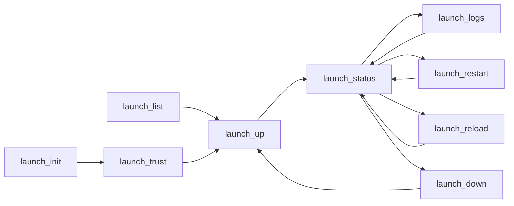

# ADR-0069 — Launch Tool Cards, ToolSearch Discovery, and Next-Tool Guidance

## Context and Problem Statement

The launch bounded context ([ADR-0063](0063-launch-orchestration-bounded-context.md))
exposes nine `launch.*` tools. ADR-0063 named them but did not specify the
messages each tool passes to the LLM: the discovery description, the per-response
guidance, the notification contract, and which tool the model should reach for
next. Those messages are what let a model actually drive a build workflow rather
than guess.

Three forces shape the answer. First, substrate tools are deferred: a client
does not see full schemas up front but resolves them through ToolSearch, so the
short description string is the retrieval surface, not just a label. Second, the
latest MCP features — Tasks/progress ([ADR-0049](0049-mcp-tasks-primitive-adoption.md))
and resource-updated events ([ADR-0066](0066-launch-event-stream-and-notification-model.md))
— turn a running stack into a live feedback channel the model can read while it
develops software. Third, the design target is a small open model (27B class):
the messaging must make the right next call obvious without external
orchestration. This ADR specifies the launch tool cards under the established
card contract and adds the ToolSearch-ranking and next-tool-guidance discipline
the small-model target requires.

## Decision Drivers

- The tool-card contract is already fixed: a thin description capped at 100
  characters closing with `See substrate skill.`, args in `inputSchema`, and the
  guidance in `structuredContent.hints` ([ADR-0007](0007-tool-card-narrative-arc.md)
  amendment 2026-05-22). Launch must conform, not re-invent.
- Deferred discovery: the short description is the ToolSearch retrieval surface,
  so it must front-load the discriminating keywords.
- Next-tool guidance is machine-read: `hints.next_action_suggested` carries the
  wire name ([ADR-0062](0062-tool-naming-convention.md)).
- Notifications are the dev/debug feedback loop: `launch.up` must hand the model
  a Task progress token and a resource link to the stack's events.
- Small-model usability: a 27B model must chain the workflow correctly from the
  cards and hints alone.

## Considered Options

- Option A: Reuse the generic per-BC cards with no launch-specific guidance graph
  or ToolSearch tuning.
- Option B: Specify the nine launch cards, a next-tool guidance graph, the
  notification contract, and a ToolSearch-ranking rule, all within the existing
  card and hints schema (selected).
- Option C: Introduce a bespoke launch description grammar richer than the
  100-char contract.

## Decision Outcome

Chosen option: **Option B — specify the launch cards and guidance within the
existing contract**, because it makes the launch workflow self-driving for a
small model without diverging from the server-wide card schema or breaking the
deferred-discovery model.

Option A is rejected: without a guidance graph the model dead-ends after
`launch.up`. Option C is rejected: a richer on-the-wire grammar contradicts the
ADR-0007 2026-05-22 decision and inflates the token budget the small-model target
cannot spare.

### The launch namespace

`launch` is registered as a tool namespace alongside the existing eight
([ADR-0062](0062-tool-naming-convention.md)); wire names are `launch_<verb>`.
This ADR is recorded as an amendment to [ADR-0007](0007-tool-card-narrative-arc.md)
and extends the `#ToolNamespace` enum and `#ToolSpec` name pattern in
`schemas/mcp_tool_spec.cue`.

### The nine tool cards

Each description is at most 100 characters, front-loads the discriminating verb
and the launch-domain nouns (stack, service, profile), and closes with
`See substrate skill.` The `next` column is the wire-form
`hints.next_action_suggested`; `confirm` is `hints.confirm_destructive`.

```text
  TOOL (logical)   DESCRIPTION (<=100 chars, ToolSearch surface)              next            confirm  bucket
  ---------------------------------------------------------------------------------------------------------------
  launch.init      Scaffold a .substrate.toml stack profile with auto-detect. launch_trust    false    D
                   See substrate skill.
  launch.list      List services declared in the .substrate.toml profile;     launch_up       false    A
                   read-only. See substrate skill.
  launch.trust     Bless a .substrate.toml profile (TOFU) without running it.  launch_up       true     D
                   See substrate skill.
  launch.up        Start a service stack in dependency order; async,           launch_status   true     E
                   trust-gated. See substrate skill.
  launch.status    Report running stacks and per-service health; reaps         launch_logs     false    A
                   orphans. See substrate skill.
  launch.logs      Read multiplexed or per-service stack output by cursor.     launch_status   false    A
                   See substrate skill.
  launch.restart   Restart one service in a running stack; orchestrated.       launch_status   true     C
                   See substrate skill.
  launch.reload    Apply an edited profile to a running stack via reconciler.  launch_status   true     C
                   See substrate skill.
  launch.down      Stop a running stack in reverse order; cascade kill.        launch_up       true     C
                   See substrate skill.
```

The `alternative_tool` hint provides the secondary branch: `launch.up` →
`launch_logs`; `launch.status` → `launch_restart`; `launch.down` → none.

### ToolSearch ranking discipline

Because the launch tools are deferred, the description is the semantic-retrieval
surface for ToolSearch, not merely a human label. Three rules make a small model
retrieve the right tool:

- **Front-load the discriminator.** The first one or two tokens are the unique
  verb (`scaffold`, `list`, `bless`, `start`, `report`, `read`, `restart`,
  `apply`, `stop`). No two launch descriptions share a leading verb, so a
  keyword query resolves to exactly one tool.
- **Carry the domain nouns.** Every description contains at least one of `stack`,
  `service`, or `profile`, so a query scoped to the launch domain ranks all nine
  above unrelated namespaces.
- **Exclude boilerplate from intent.** The closing `See substrate skill.` is
  constant across the namespace and carries no discriminating weight; it must
  never be the only domain content in a description.

### Next-tool guidance graph

`hints.next_action_suggested` (wire form) encodes the guided workflow so a small
model advances without external orchestration:



The spine is `init -> trust -> up -> status <-> logs -> (restart | reload) ->
down`. Each response carries exactly one `next_action_suggested` and at most one
`alternative_tool`, so the model is never offered an open-ended menu.

### Notification contract — the dev feedback loop

The point of the notifications is that the model watches a running stack while it
develops, rather than re-reading logs:

- `launch.up` is bucket E (always async, streaming). It returns a
  `CreateTaskResult { taskId }` (the `taskId` doubles as the `job_id` alias),
  sets `polling_endpoint` to `launch.status`, and routes each per-service
  `STARTED` / `READY` lifecycle transition over `notifications/tasks/status`
  keyed by that `taskId` ([ADR-0049](0049-mcp-tasks-primitive-adoption.md)
  dual-stack model). Continuous per-service telemetry (cpu/memory/line counters)
  rides the separate `progressToken` -> `notifications/progress` channel only when
  the client issues the combined task-augmented request; lifecycle never travels
  over the progress channel.
- The `launch.up` result carries a `resource_link` to
  `launch://stack/<id>/events` (the distilled lifecycle and semantic event
  stream) and to `launch://stack/<id>/service/<svc>/log` (raw drill-down), per
  [ADR-0066](0066-launch-event-stream-and-notification-model.md). A client that
  supports `resources/subscribe` receives `notifications/resources/updated`
  pokes and reads the delta by cursor; a client that does not degrades to
  `launch.status` / `launch.logs` polling.
- `launch.restart` and `launch.reload` are bucket C async Tasks and emit the same
  `notifications/tasks/status` lifecycle and event signals scoped to the affected
  services.
- The deprecated `notifications/message` (logging) path is not used (SEP-2577).

This is what lets the model close the loop: edit code, `launch.reload`, watch the
`CRASHED` / `READY` events arrive, and decide the next action — a development
feedback loop, not a log scrape.

### Destructive and async hints

Every spawning or killing tool (`launch.up`, `launch.down`, `launch.restart`,
`launch.reload`) and the authority-granting `launch.trust` set
`hints.confirm_destructive: true`. This follows the subprocess precedent for
destructive tools but deliberately does NOT apply the subprocess all-tools
provenance marker: launch's read-side tools (`launch.list`, `launch.status`,
`launch.logs`) set it false
([ADR-0007](0007-tool-card-narrative-arc.md) amendment 2026-05-24). Async tools
carry the ADR-0040 job keys (`job_id`, `job_state`, `job_progress_pct`,
`polling_endpoint`, `estimated_completion_ms`, `sequence_number`). Launch adds two
optional structured keys, `stack_id` and `stack_state`, so a response always
locates itself within a stack; both are appended to `#Hints` in
`schemas/tool_card.cue` and `polling_endpoint` is extended with `launch.status`.

### Small-model (27B) acceptance

The card contract was tuned for the 10B class
([ADR-0007](0007-tool-card-narrative-arc.md)); a 27B model is a superset and
inherits the guarantees. The launch-specific acceptance is that a 27B model,
given only the nine deferred descriptions plus per-response hints, drives the full
`init -> trust -> up -> observe events -> reload -> down` loop with no external
orchestration prompt. The mechanisms that make this hold are the single
`next_action_suggested` per response, the `confirm_destructive` gate before any
spawn, and the `resource_link` that points the model at live events instead of
requiring it to invent a polling cadence.

## Consequences

### Positive

- The launch workflow is self-driving for a small model: discovery via
  ToolSearch, advancement via a single next-tool hint, observation via a linked
  event resource.
- No divergence from the server-wide card or hints schema; launch is one more
  conformant namespace.
- The notification contract turns a running stack into a development feedback
  loop the model reads directly.

### Negative

- The next-tool graph is cross-tool state that must be kept correct as launch
  tools evolve (the same maintenance cost ADR-0007 already noted).
- Two new optional hint keys and an extended `polling_endpoint` enum widen the
  shared hints schema.

### Risks

- A ToolSearch query that is purely generic ("run", "start") could rank
  `launch.up` against `subprocess.spawn`. Mitigation: the domain nouns (stack,
  profile) in the launch descriptions disambiguate, and the next-tool graph keeps
  the model on the launch spine once it has entered it.

## Validation

- Lint: every `launch.*` description is ≤100 characters, closes with
  `See substrate skill.`, and contains a launch-domain noun (asserted by
  `xtask check-cards`).
- Unit test: no two `launch.*` descriptions share a leading verb.
- Integration test: a `launch.up` response is a `CreateTaskResult { taskId }`,
  sets `next_action_suggested = launch_status`, `confirm_destructive = true`,
  `polling_endpoint = launch.status`, and carries a `resource_link` to the events
  resource.
- Integration test: a `launch.up` Task emits per-service `STARTED` / `READY`
  lifecycle events over `notifications/tasks/status` keyed by its `taskId`; any
  telemetry counters ride the separate `progressToken` channel.
- Small-model bench: a 27B model completes the `init -> trust -> up -> reload ->
  down` workflow on a fixture profile using only descriptions and hints, with no
  orchestration prompt, at the ADR-0007 selection-accuracy bar or better.

## Links

- [ADR-0007](0007-tool-card-narrative-arc.md) — tool-card contract and hints
  schema this ADR instantiates for launch (amended below)
- [ADR-0040](0040-async-job-control-plane.md) — job hint keys reused by async
  launch tools
- [ADR-0049](0049-mcp-tasks-primitive-adoption.md) — Tasks/progress that
  `launch.up` rides
- [ADR-0062](0062-tool-naming-convention.md) — logical vs wire names;
  `next_action_suggested` and `alternative_tool` use wire form, while
  `polling_endpoint` uses the logical (dot) form (`launch.status`)
- [ADR-0063](0063-launch-orchestration-bounded-context.md) — the nine launch
  tools specified here
- [ADR-0066](0066-launch-event-stream-and-notification-model.md) — the event
  resources linked from tool responses

## Amendments

### 2026-06-30 — Accepted; tool cards and hints landed in the substrate-launch MVP

Status moves from `proposed` to `accepted`. All nine `launch.*` tools are
registered in `substrate-mcp-server`'s `launch_tools.rs` with thin
deferred-discovery descriptions, `confirm_destructive` set on every spawning
or killing tool, and `Hints` carrying `stack_id` / `stack_state` /
`job_state` / `polling_endpoint` per response, matching this ADR's contract.
The `resource_link`-to-live-events guidance described above depends on
[ADR-0066](0066-launch-event-stream-and-notification-model.md)'s push path,
which is itself deferred to Milestone 2 — until then `next_action_suggested`
points at `launch.status` / `launch.logs` polling rather than a resource
subscription.
