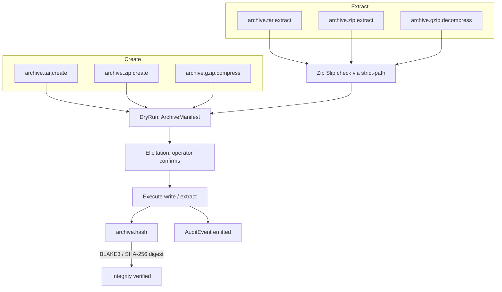

# Bounded Context: archive

## Purpose

The archive context provides creation, inspection, and extraction of archive
files in TAR, ZIP, and gzip formats, and computation of content digests for
archive integrity verification. Archive writes carry medium mutation risk: they
create new files and, if an extraction target already contains files, may
overwrite them. Extraction additionally opens a Zip Slip attack vector if entry
paths are not validated against the jailed extraction root. Accordingly, all
archive creation and extraction operations require a dry-run pass before
execution and elicitation confirmation from a human operator. The `archive.hash`
tool is read-only and does not require dry-run. Agents should use
`archive.hash` before and after a round-trip to verify archive integrity, and
should call `fs.stat` or `fs.find` on the extraction target before invoking
extract to confirm the destination is within the expected allowlist root.

## Diagram

The following flowchart shows the archive tool surface and the mandatory dry-run plus Zip Slip validation path.

## Ubiquitous Language

The following terms have precise meanings within this context.

- **ArchiveEntry**: a single member of an archive: its path within the archive,
  uncompressed size, compression method, and modification time. Listed by
  inspect operations (not yet exposed in MVP as a dedicated tool, but produced
  as part of `archive.tar.extract` and `archive.zip.extract` dry-run reports).
- **CompressionAlgorithm**: the algorithm applied to archive content. Supported
  values: `gzip` (deflate), `zstd` (via `async-compression`), `deflate` (ZIP
  internal). Uncompressed TAR is also supported.
- **ArchivePath**: a path relative to the archive root, representing an entry
  within the archive. Distinguished from `JailedPath` because archive paths are
  not validated against the OS allowlist until extraction; at extraction time
  every `ArchivePath` is resolved against the extraction root and must produce a
  valid `JailedPath`.
- **ExtractTarget**: the absolute path within the allowlist to which archive
  entries are extracted. The policy layer validates that every resolved entry
  path remains within the `ExtractTarget` root (Zip Slip prevention).
- **ArchiveManifest**: the aggregate root for a dry-run result: a list of
  `ArchiveEntry` values that would be created or overwritten, with total
  uncompressed size and entry count.
- **ArchiveWriteRequest**: the aggregate root for a create operation: carries
  the source paths, destination archive path, compression algorithm, and
  dry-run flag.

## Aggregates and Value Objects in Scope

Aggregates (owned by this context):

- `ArchiveManifest` - dry-run preview of what an extract or create would produce
- `ArchiveWriteRequest` - validated input for a pending archive creation

Value objects (from shared kernel):

- `JailedPath` - used for every source path, destination path, and resolved
  entry path after extraction
- `AuditEvent` - emitted after every committed create or extract operation

## Tools Exposed

- `archive.tar.create` - create a TAR archive (optionally gzip- or
  zstd-compressed) from a list of jailed source paths; requires dry-run and
  elicitation
- `archive.tar.extract` - extract entries from a TAR archive to a jailed
  destination directory; Zip Slip prevention applied to every entry path;
  requires dry-run and elicitation
- `archive.zip.create` - create a ZIP archive using deflate compression from a
  list of jailed source paths; requires dry-run and elicitation
- `archive.zip.extract` - extract entries from a ZIP archive to a jailed
  destination directory; entry paths validated against extraction root; requires
  dry-run and elicitation
- `archive.gzip.compress` - compress a single file with gzip and write the
  result to a `.gz` file within the allowlist; requires dry-run
- `archive.gzip.decompress` - decompress a single `.gz` file and write the
  result to the allowlist; requires dry-run
- `archive.hash` - compute a content digest (BLAKE3 or SHA-256) of an archive
  file; read-only, no dry-run required; used for integrity verification

## Cross-references

- [ADR-0002](../../adr/0002-bounded-contexts.md) - defines this context and
  classifies writes as medium risk; extraction from untrusted archives carries
  Zip Slip risk explicitly called out in the context definition
- [ADR-0004](../../adr/0004-security-model.md) - Zip Slip prevention is
  explicitly listed as a path jail responsibility; dry-run and elicitation apply
  to all create and extract operations; `archive.hash` is exempt from dry-run
- [ADR-0005](../../adr/0005-stdio-transport.md) - large `ArchiveManifest`
  dry-run reports are chunked and streamed via progress notifications over STDIO
- [ADR-0007](../../adr/0007-tool-card-narrative-arc.md) - tool cards for
  create and extract tools carry `confirm_destructive: true`; NEXT hints suggest
  `archive.hash` as the follow-up after any create or extract
- [ADR-0010](../../adr/0010-error-taxonomy.md) - key error codes:
  `SUBSTRATE_DRY_RUN_REQUIRED`, `SUBSTRATE_CONFIRMATION_REQUIRED`,
  `SUBSTRATE_PATH_TRAVERSAL_BLOCKED` (Zip Slip), `SUBSTRATE_SYMLINK_ESCAPE`,
  `SUBSTRATE_RESOURCE_LIMIT` (archive too large)
- [ADR-0025](../../adr/0025-bounded-context-interactions.md) - `JailedPath`
  values from filesystem-query or filesystem-mutation tools may be passed as
  source or destination paths at the composition root; no direct crate dependency
- [ADR-0028](../../adr/0028-platform-feature-gates.md) - all archive I/O runs
  in Zone A using async crates; hashing runs in Zone C; no platform-specific
  code paths in this context for MVP

## Platform Feature Gates

- **TAR streaming** (`archive.tar.create`, `archive.tar.extract`): uses
  `tokio-tar` for async-native streaming on both Linux and macOS (Zone A).
  No platform-specific paths.
- **ZIP** (`archive.zip.create`, `archive.zip.extract`): uses `async_zip` with
  the `deflate` feature (Zone A). Supported on both platforms.
- **Gzip** (`archive.gzip.compress`, `archive.gzip.decompress`): uses
  `async-compression` with the `gzip` feature wrapping `AsyncRead`/`AsyncWrite`
  (Zone A). No platform divergence.
- **Hashing** (`archive.hash`): uses the same Zone C BLAKE3/SHA-256 path as
  `fs.hash` in the filesystem-query context. Memory-mapped I/O and rayon
  parallelism apply on both Linux and macOS; Semaphore gating prevents CPU
  over-subscription.
- **Zip Slip enforcement**: entry path resolution uses `strict-path`
  soft-canonicalize against the `ExtractTarget` root before any file creation
  syscall. This logic is platform-neutral.

## Recent Amendments

- 2026-05-21 — `archive.tar.create`, `archive.tar.extract`, `archive.zip.create`,
  and `archive.zip.extract` are Bucket-C always-async per
  [ADR-0040](../../adr/0040-async-job-control-plane.md) (long-running, mandatory
  job dispatch). `archive.gzip.compress`, `archive.gzip.decompress`, and
  `archive.hash` are Bucket-B auto-mode. SIMD-accelerated deflate (libdeflater or
  zlib-ng per [ADR-0043](../../adr/0043-simd-runtime-dispatch.md)) and CRC32
  (CLMUL/PMULL) are on the critical path; BLAKE3 SIMD tier is supplied by the
  capability factory ([ADR-0042](../../adr/0042-capability-adapter-factory.md)).
