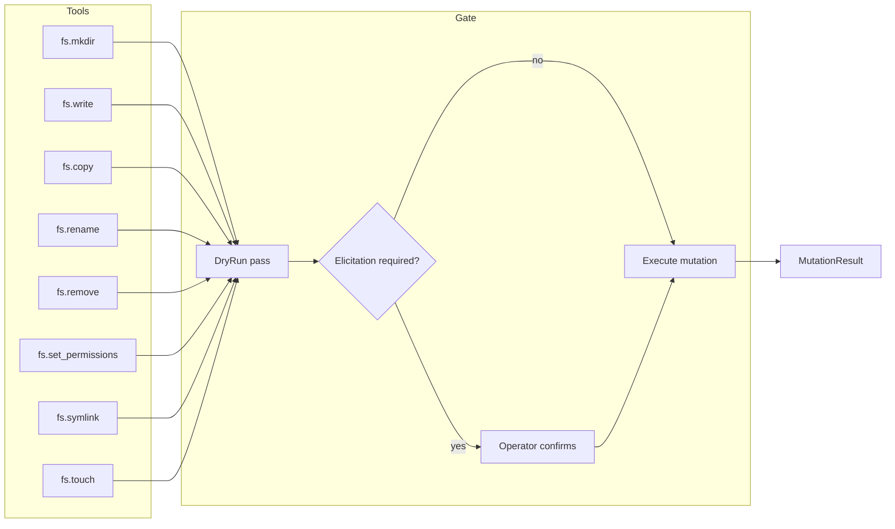

# Bounded Context: filesystem-mutation

## Purpose

The filesystem-mutation context provides structural changes to the filesystem:
creating directories, writing files, copying, renaming, removing, setting
permissions, creating symbolic links, and updating timestamps. Every operation
in this context has non-zero mutation risk; several are irreversible under normal
OS semantics. Accordingly, this context enforces the strictest application of
the security model: all destructive mutations require an explicit dry-run pass
before execution, and the highest-impact operations (remove, overwrite, chmod)
additionally require elicitation confirmation from a human operator via the MCP
host. Agents working in this context are expected to call a filesystem-query
tool first to confirm the target exists and matches expectations before issuing
any mutation.

## Diagram

The following flowchart shows the tool surface and the two-phase dry-run gate that protects every mutation.

## Ubiquitous Language

The following terms have precise meanings within this context.

- **JailedPath**: a validated, canonicalized path guaranteed to lie within an
  allowlist root. The policy layer constructs `JailedPath`; adapters receive it
  by value and may not bypass it. Defined in the shared kernel.
- **MutationPlan**: a structured description of what a tool will do, produced
  during dry-run mode. The plan lists affected paths, intended permissions
  changes, and estimated byte counts without touching OS state.
- **DryRunReport**: the serialized form of a `MutationPlan` returned to the
  caller as `structuredContent` when `dry_run` has not been explicitly disabled.
- **Overwrite**: a flag that controls whether `fs.write` or `fs.copy` may
  replace an existing file. When false (default), the operation fails with
  `SUBSTRATE_INVALID_ARGUMENT` if the target exists.
- **Permission**: a POSIX permission bitmask (e.g., `0o755`) applied by
  `fs.set_permissions`. The adapter validates that the value is within the range
  permitted by the allowlist configuration.
- **Ownership**: UID and GID metadata; read-only in MVP (chown is deferred to a
  later release pending privilege escalation design).
- **MutationRequest**: the aggregate root for a single mutation tool call:
  carries the jailed paths, intended operation, flags, and dry-run state.
- **MutationResult**: the aggregate root for a completed (non-dry-run) mutation:
  carries affected paths, bytes written or freed, and the audit event reference.

## Aggregates and Value Objects in Scope

Aggregates (owned by this context):

- `MutationRequest` - validated input for a pending mutation
- `MutationResult` - outcome of a committed mutation

Value objects (from shared kernel):

- `JailedPath` - used for every source and destination path argument
- `AuditEvent` - emitted after every committed mutation

## Tools Exposed

- `fs.mkdir` - create a directory (and optionally its parents) at the given path
- `fs.write` - write UTF-8 text or base64-decoded bytes to a file; supports
  append mode and the `overwrite` flag
- `fs.copy` - copy a file from one jailed path to another; respects the
  `overwrite` flag and dry-run gate
- `fs.rename` - atomically rename or move a file or directory within the jailed
  path space; requires dry-run pass and elicitation if crossing mount points
- `fs.remove` - delete a file or empty directory; requires `dry_run: false` and
  elicitation confirmation before any bytes are freed
- `fs.set_permissions` - apply a POSIX permission bitmask to a file or
  directory; elicitation required for world-writable targets
- `fs.symlink` - create a symbolic link; the link target is validated against
  the allowlist to prevent symlink-escape attacks
- `fs.touch` - create an empty file or update its access and modification
  timestamps; safe to call without dry-run when the file does not yet exist

## Cross-references

- [ADR-0002](../../adr/0002-bounded-contexts.md) - defines this context and
  classifies mutation risk as high; dry-run and elicitation are mandatory
- [ADR-0004](../../adr/0004-security-model.md) - all four security layers apply
  here: allowlist, path jail (including symlink-escape and Zip Slip prevention),
  dry-run gate, and elicitation
- [ADR-0005](../../adr/0005-stdio-transport.md) - tool responses and elicitation
  requests travel over the STDIO transport
- [ADR-0007](../../adr/0007-tool-card-narrative-arc.md) - tool cards for all
  eight tools carry `confirm_destructive: true` in their hints object where
  elicitation applies
- [ADR-0010](../../adr/0010-error-taxonomy.md) - key error codes for this
  context: `SUBSTRATE_DRY_RUN_REQUIRED`, `SUBSTRATE_CONFIRMATION_REQUIRED`,
  `SUBSTRATE_PATH_TRAVERSAL_BLOCKED`, `SUBSTRATE_SYMLINK_ESCAPE`,
  `SUBSTRATE_PERMISSION_DENIED`
- [ADR-0025](../../adr/0025-bounded-context-interactions.md) - output from
  filesystem-query tools (e.g., `JailedPath` values) may be passed as input to
  mutation tools at the composition root; no direct crate dependency is created
- [ADR-0028](../../adr/0028-platform-feature-gates.md) - `fs.copy` uses Zone A
  (`tokio::fs::copy`); `fs.set_permissions` uses `nix::sys::stat::chmod`
  available on both Linux and macOS

## Platform Feature Gates

- **Atomic rename** (`fs.rename`): on Linux, `renameat2(RENAME_NOREPLACE)` is
  preferred when available (kernel 3.15+); the adapter falls back to
  `tokio::fs::rename` on older kernels and on macOS.
- **Permission bits** (`fs.set_permissions`): uses `nix::sys::stat::chmod`
  uniformly on both platforms. Extended attributes (xattr) are deferred to a
  future release.
- **Symlink creation** (`fs.symlink`): uses `tokio::fs::symlink` (Zone A),
  which maps to `symlink(2)` on POSIX. The link target validation uses the
  `strict-path` crate's soft-canonicalize path before the syscall.
- No Linux-specific or macOS-specific code paths in this context for MVP beyond
  the `renameat2` optimization, which degrades gracefully to a standard rename.

## Recent Amendments

- 2026-05-21 — mutation tools (`fs.mkdir`, `fs.write`, `fs.copy`, `fs.rename`,
  `fs.remove`, `fs.set_permissions`, `fs.symlink`, `fs.touch`) emit write-through
  updates to the filesystem index when the `fs-index` Cargo feature is enabled
  ([ADR-0041](../../adr/0041-filesystem-index-native-tiers.md)). PathJail is now
  tiered ([ADR-0042](../../adr/0042-capability-adapter-factory.md)); jail tier
  degraded is refusable via `security.refuse_degraded_jail`.
