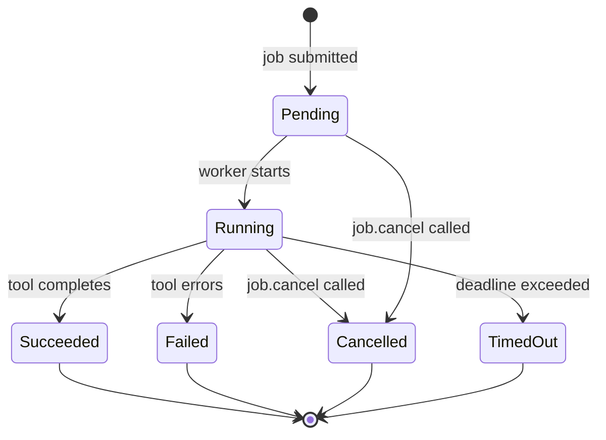
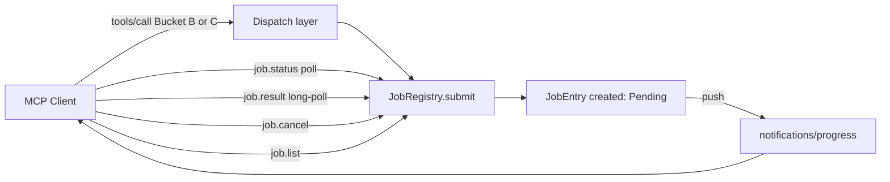

# job

## Mission

The job bounded context orchestrates asynchronous execution of long-running tools
through a unified Push (notifications/progress) and Pull (job.* control-plane)
channel, exposing a single state machine and lifecycle audit pipeline to MCP
clients.

## Diagrams

The following state diagram shows the JobState lifecycle; terminal states never regress.

The following flowchart shows the push/pull dual-channel interaction between an MCP client and the job control-plane.

## Aggregates and Entities

Aggregates and domain services owned by this context:

- `JobEntry` (aggregate root) — the authoritative record for a single submitted
  job: carries the job_id (UUIDv7 = progressToken = correlation_id), the owning
  client_id, the tool name and serialized arguments, the current `JobState`,
  elapsed time, progress percentage, and a reference to the result watch channel.
  State transitions are serialized through a `parking_lot::Mutex<JobState>` inside
  each entry; invalid transitions are silently no-ops, never panics.

- `JobRegistry` (mediator service) — the in-process mediator between MCP tool
  handlers and worker tasks. Accepts job submissions, enforces per-client and
  global quotas, deduplicates via idempotency_key, manages the TTL garbage
  collector task, and routes `job.cancel` calls to per-job `CancellationToken`
  instances. Declared as a port trait `JobRegistryPort` in `substrate-domain`;
  implemented by `InMemoryJobRegistry` in `substrate-jobs`.

- `ProgressEvent` (value object) — a single push notification payload: job_id,
  job_state, progress_pct (0-100), sequence_number (monotonic AtomicU64), and
  elapsed_ms. Emitted via a bounded `mpsc::Sender<ProgressEvent>` (capacity 64)
  per job. Throttled by `ProgressThrottler`: events are suppressed unless 250 ms
  have elapsed or progress delta is at least 1 percentage point since the last
  emission.

## Value Objects (from shared kernel)

- `JobId` — UUIDv7; serves simultaneously as MCP progressToken, internal job
  identifier, and correlation_id. Triple equality eliminates any mapping table.
- `CorrelationId` — alias for `JobId` used in audit events and error payloads.
- `IdempotencyKey` — client-supplied UUIDv7; dedup key is
  `(client_id, tool_name, idempotency_key, blake3_hash_of_args_json)`; bounded
  to the same TTL as the job result and evicted by the same GC task.
- `ClientId` — opaque identifier for the MCP client session; scopes visibility
  in `job.list` (cross-client visibility is forbidden).
- `JobState` — enum with six values: `Pending`, `Running`, `Succeeded`, `Failed`,
  `Cancelled`, `TimedOut`. Terminal states (`Succeeded`, `Failed`, `Cancelled`,
  `TimedOut`) never regress. Encoded as a Rust enum with valid-transitions-only
  methods.
- `JobBucket` — compile-time constant classifying each tool as A (sync inline),
  B (auto-mode), C (always async), or D (sync side-effect). Bucket B dispatch
  path is resolved at runtime against configured thresholds.
- `PollingEndpoint` — string hint (`"job.status"` or `"job.result"`) surfaced in
  the `structuredContent.hints` map to guide agents toward the correct pull-channel
  tool after receiving a job receipt.

## Tools Exposed

- `job.status` — return a snapshot of a job's current state, progress percentage,
  elapsed milliseconds, and sequence number; idempotent and sub-millisecond latency
  from an in-memory watch read; Bucket A semantics.
- `job.result` — return the final `ToolOutput` for a `Succeeded` job; supports an
  optional `wait_ms` long-poll parameter (default 0; cap `jobs.result_max_wait_ms`
  = 30 000) implemented via `watch::Receiver::changed().await` with a timeout.
- `job.cancel` — cancel a running or pending job by triggering its child
  `CancellationToken`; idempotent: a second call on a terminal job returns
  `state=already_done` without error; returns synchronously after token
  cancellation is triggered without waiting for the worker.
- `job.list` — return a paginated list of active and recently completed jobs
  scoped to the requesting `client_id`; uses base64-opaque cursor pagination per
  [ADR-0008](../../adr/0008-mcp-features-map.md); cross-client jobs are never
  visible.

## Cross-references

- [ADR-0040](../../adr/0040-async-job-control-plane.md) — primary decision record:
  bucket classification, state machine, push/pull dual channel, quotas, GC, and
  idempotency design.
- [ADR-0007](../../adr/0007-tool-card-narrative-arc.md) — hints map extended with
  `job_id`, `job_state`, `job_progress_pct`, `polling_endpoint`,
  `estimated_completion_ms`, and `sequence_number` for job-dispatching tools.
- [ADR-0008](../../adr/0008-mcp-features-map.md) — base64-opaque cursor
  pagination applied to `job.list`.
- [ADR-0013](../../adr/0013-mcp-protocol-version.md) — MCP 2025-11-25 capability
  negotiation; `notifications/progress` and `notifications/cancelled` are
  mandatory capabilities for the job BC to function.
- [ADR-0032](../../adr/0032-signal-safety.md) — SIGTERM/SIGINT shutdown sequence
  extended: root `CancellationToken` cancelled, all Running/Pending jobs
  transitioned to `Cancelled`, final `notifications/progress` events attempted
  before STDIO closes, workers drained within `shutdown_drain_secs`.
- [ADR-0037](../../adr/0037-async-cancellation-patterns.md) — each job owns a
  `CancellationToken` child of the root token; `job.cancel` calls
  `child_token.cancel()`; MCP `notifications/cancelled` for a progressToken MUST
  be mapped to `job.cancel(progressToken)` by the dispatch layer.
- [ADR-0038](../../adr/0038-audit-event-semantics.md) — every state transition
  emits an `AuditEvent` carrying `correlation_id`, `client_id`, `tool_name`,
  `job_state`, `idempotency_key`, and `sequence_number`; terminal event is written
  before the result watch is set.
- [ADR-0010](../../adr/0010-error-taxonomy.md) — new job-specific error codes:
  `SUBSTRATE_JOB_NOT_FOUND` (evicted or unknown job_id), `SUBSTRATE_QUOTA_EXCEEDED`
  (per-client or global limit reached); existing codes `SUBSTRATE_TIMEOUT` and
  `SUBSTRATE_INTERNAL_ERROR` apply to worker failures.
- [ADR-0033](../../adr/0033-transactional-writes.md) — not directly applicable to
  job control-plane operations (no disk writes); referenced because Bucket B/C
  tools that create jobs do perform transactional writes in their worker tasks.

## Operational Notes

There is no persistence. An STDIO process restart wipes all jobs; clients detect
this via `SUBSTRATE_JOB_NOT_FOUND` on subsequent `job.status` or `job.result`
calls and must resubmit.

TTL-based garbage collection runs every 60 seconds and evicts `JobEntry` records
whose terminal state was set more than `jobs.result_ttl_secs` (default 300)
seconds ago. After eviction, the job_id is unknown to the registry.

Quota guards enforce two limits simultaneously: `jobs.max_per_client` (default 16)
and `jobs.max_concurrent` (default 32). Submission beyond either limit returns
`SUBSTRATE_QUOTA_EXCEEDED` synchronously without creating a job. A per-tool
`Semaphore` (from [ADR-0017](../../adr/0017-concurrency-limits.md)) additionally
gates worker start independently of the quota counters.

Progress push is throttled (250 ms or 1% delta) and backpressured via a bounded
mpsc channel (capacity 64). Dropped events increment `progress_events_dropped`
and emit an `AuditEvent`. Agents relying solely on pull via `job.status` are
immune to drop-induced gaps.

Race conditions in state transitions are resolved by a `parking_lot::Mutex<JobState>`
inside each `JobEntry`. The result watch channel is set inside the same mutex lock
as the transition to `Succeeded`, guaranteeing that a concurrent `job.result` call
observing `state=Succeeded` will always find the result present.

Idempotency deduplication is keyed on
`(client_id, tool_name, idempotency_key, blake3_hash_of_args_json)`. A matching
in-flight or recently completed job returns its existing `job_id` without spawning
a new worker, making retry-safe submission possible for Bucket B and C tools.

## Platform Feature Gates

The job bounded context contains no platform-specific code paths. Its runtime
primitives (`tokio::sync::mpsc`, `tokio::sync::watch`, `parking_lot::Mutex`,
`tokio_util::CancellationToken`) are platform-neutral. The capability factory
([ADR-0042](../../adr/0042-capability-adapter-factory.md)) supplies `SimdTier`
and `WalkerTier` values that worker tasks (in other bounded contexts) embed in
their audit event fields, but the job BC itself does not branch on these tiers and
introduces no OS-conditional compilation.
