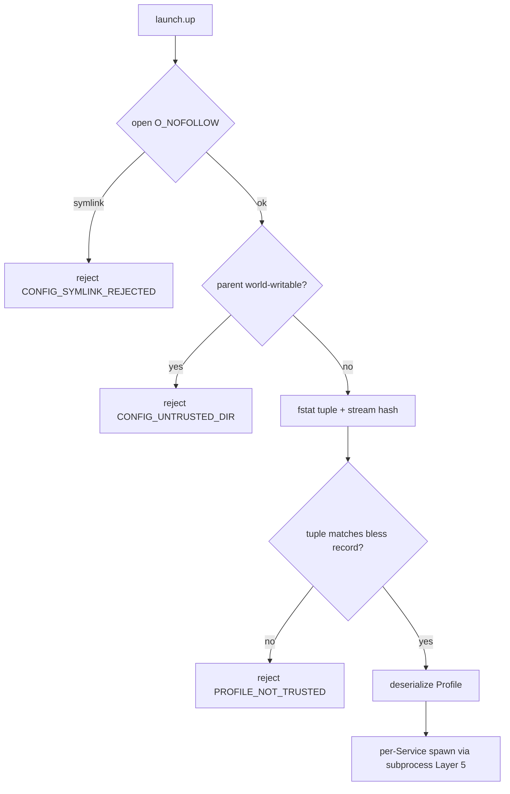
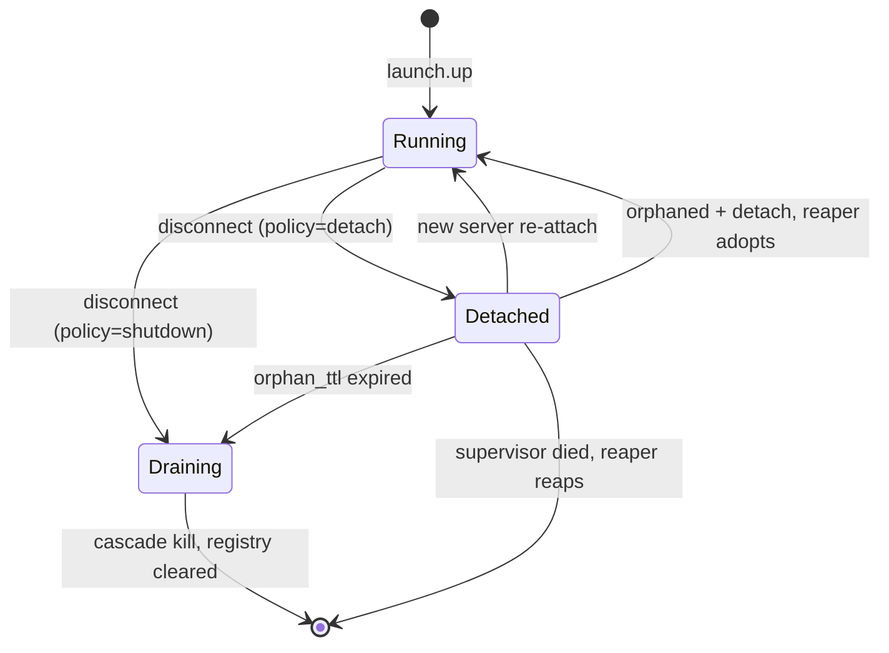

# launch Bounded Context

## Purpose

The launch bounded context is the single point of authority for declarative,
multi-process orchestration. It brings up a named set of related processes — a
project dev stack of, for example, a database, an API, and a frontend watcher —
from a project-local `.substrate.toml` Profile, honouring dependency ordering and
readiness gating between members, supervising each member, and tearing the whole
Stack down cleanly. It is orchestration *over* the subprocess bounded context: it
owns the catalog, the dependency graph, trust, reload, and Stack lifecycle, and
delegates every single-process concern (spawn, restart policy, health probe,
cascade kill, stream multiplex) to subprocess. Its overriding non-functional
guarantee is OS hygiene: no supervised process is ever left running unmanaged.

## Ubiquitous Language

- **Profile** — the immutable catalog parsed from `.substrate.toml`: named
  Services plus Stack-level defaults. See
  [glossary](../../glossary.md#profile).
- **Launch Service** — one catalog entry that materializes to exactly one
  supervised child via `subprocess.spawn`. See
  [glossary](../../glossary.md#launch-service).
- **Stack** — the aggregate root: a running instance of a Profile owning the
  dependency DAG, the per-Service handles, and the lifecycle state. See
  [glossary](../../glossary.md#stack).
- **Trust on First Use (TOFU)** — the bless-once trust gate that pins a Profile
  to its content-and-inode identity before any field is read. See
  [glossary](../../glossary.md#trust-on-first-use-tofu).
- **Reconciler** — the component that diffs a desired Profile against a running
  Stack and applies a minimal ordered op-plan on reload. See
  [glossary](../../glossary.md#reconciler).
- **Disconnect Policy** — the per-Stack rule (`shutdown` default, `detach`
  opt-in) for what happens when the MCP client disconnects. See
  [glossary](../../glossary.md#disconnect-policy).
- **Detached Supervisor** — the same binary in `--supervise` mode that owns a
  detached Stack's children after the MCP server exits. See
  [glossary](../../glossary.md#detached-supervisor).
- **Zero-Orphan Guarantee** — the five-layer contract that guarantees no
  supervised process is left running unmanaged. See
  [glossary](../../glossary.md#zero-orphan-guarantee).
- **Orphan TTL** — the dead-man bound after which a detached Stack with no client
  attached is automatically brought down. See
  [glossary](../../glossary.md#orphan-ttl).
- **Event-Log** — the durable per-Stack `events.ndjson` ring that backs
  notifications and replay. See [glossary](../../glossary.md#event-log).

## Aggregates

### Stack (aggregate root)

`Stack` is the authoritative record for one running instance of a Profile. It
owns the `stack_id` (UUIDv7), the canonical `profile_path`, the pinned
`config_hash`, the resolved disconnect `policy`, the `StackState`, the
per-Service map of `SubprocessState`, and — for a detached Stack — the
`SupervisorRegistry`. A running Stack pins the Profile content it started with;
on-disk edits take effect only through `launch.up` or `launch.reload`, each of
which re-blesses the new content. `StackState` terminal positions (`Draining`,
`Down`) never regress.

### LaunchProfile (value object)

`LaunchProfile` is the immutable catalog: a `services` map plus the Stack-level
defaults `on_client_disconnect` and `orphan_ttl_secs`. It has no identity of its
own (the running `Stack` is the aggregate root) and is constructed only after the
trust gate passes, never from untrusted bytes; inline auto-blessing is governed by
user-scope operator config (`auto_bless_paths`), not a Profile field.

## Entities and Value Objects

- `LaunchService` (value object) — command (array-only), args, env, cwd,
  `depends_on`, `required`, optional `restart_policy` and `health_probe` (reused
  from subprocess), `on_dependency_restart`, `error_patterns`, `redact`, and
  `streams`.
- `TrustRecord` (value object) — the bless tuple `(path, dev, ino, uid, mode,
  content, blessed_at)` re-verified on every Profile load.
- `SupervisorRegistry` (entity) — the durable state-file `(supervisor_pid,
  start_epoch, policy, config_hash, children)` written atomically.
- `StackChild` (value object) — `(name, pid, pgid)` for one supervised child; the
  `pgid` is the cascade-reap unit.
- `LaunchEvent` (value object) — one event-log entry: `kind`, `service`, `seq`,
  opaque `cursor`, optional `stream`, redacted `message`, optional `exit_code`.
- `DisconnectPolicy` / `StackState` / `LaunchEventKind` (value objects) — the
  enums above.

## Tools Exposed

All tools are namespaced `launch.*` per [ADR-0062](../../adr/0062-tool-naming-convention.md).

**launch.init** scaffolds a default `.substrate.toml` with project-type
auto-detection. Bucket A (sync inline).

**launch.list** enumerates the Services in the Profile read-only; it requires no
trust because it executes nothing. Bucket A.

**launch.up** brings a Stack up: it passes the trust gate
([ADR-0064](../../adr/0064-launch-profile-trust-model.md)), validates the
dependency DAG, then starts Services in topological order gated on readiness
([ADR-0065](../../adr/0065-launch-dependency-graph-and-reconciler-reload.md)).
It rides the MCP Tasks primitive
([ADR-0049](../../adr/0049-mcp-tasks-primitive-adoption.md)) and returns a Task
handle immediately.

**launch.down** stops a Stack in reverse topological order with cascade kill, and
clears the durable registry entry. Bucket D (sync side-effect).

**launch.status** returns structured status of running Stacks and per-Service
health; it is the pull floor and triggers reaper-on-boot reconciliation.

**launch.logs** returns multiplexed or per-Service output via the cursor-addressed
resource convention (`?since=<cursor>`), reusing the subprocess stream multiplex
([ADR-0054](../../adr/0054-subprocess-stream-multiplex.md)).

**launch.restart** restarts one Service as an orchestrated restart (not counted
against the crash-loop budget).

**launch.reload** applies an edited, re-blessed Profile to a running Stack through
the reconciler, disturbing the minimum set of Services.

**launch.trust** blesses a Profile without running it — the recommended ceremony
before the first `launch.up`.

## Mutation Risk

The launch bounded context is classified **HIGHEST** mutation risk, equal to
subprocess, because every `launch.up` ultimately spawns child processes. It does
not relax any subprocess control: trust suppresses only the per-run elicitation
prompt, while the binary allowlist, PathJail, env filtering, and the
check-to-exec invariant
([ADR-0052](../../adr/0052-subprocess-execution-architecture.md) Layer 5) gate
every Service spawn unchanged. The added surface — a repository file that can
drive trusted binaries with chosen arguments — is closed by the TOFU trust gate.

## Trust and Security

A Profile is a convenience template, never an authority grant. Loading it is a
strict pipeline that makes the trust decision before any byte is semantically
evaluated, defeating the trust-order-confusion class
([ADR-0064](../../adr/0064-launch-profile-trust-model.md)):

## Lifecycle and Orphan Governance

The defining guarantee is that no supervised process is left running unmanaged.
Five independent layers enforce it
([ADR-0063](../../adr/0063-launch-orchestration-bounded-context.md),
[ADR-0068](../../adr/0068-launch-detached-supervisor-and-orphan-governance.md)):

1. **Disconnect policy** — default `shutdown` drains and kills on client
   disconnect; survival requires explicit `detach`.
2. **Parent-death binding** — `PR_SET_PDEATHSIG` (Linux), `WatchdogPipe`
   (macOS), Job Object kill-on-close (Windows): supervisor death kills children
   ([ADR-0053](../../adr/0053-process-lifecycle-cascade-contract.md)).
3. **Orphan TTL** — a detached Stack with no client for `orphan_ttl_secs` is
   auto-brought-down.
4. **Reaper on boot** — every start reconciles the durable registry and either
   re-attaches, adopts, or reaps each recorded child, extending the file-only
   reaper of [ADR-0055](../../adr/0055-orphan-reaper-on-startup.md) to processes.
5. **Process-group reap** — `killpg(pgid, …)` reaps the whole descendant subtree.

The lifecycle and its re-attach / adopt / reap transitions:

## Async Zones and Concurrency

The supervisor is async-native (Zone A per
[ADR-0003](../../adr/0003-crate-stack-and-async-zones.md)); the actual spawn is
the subprocess BC's blocking path (Zone B). The fabric is lock-free: commands
flow through a single-consumer `mpsc` mailbox into the supervisor actor, events
over a `broadcast` bus, and per-Service state over `watch`, with no mutex and no
controller election ([ADR-0067](../../adr/0067-launch-concurrency-and-messaging-topology.md)).
The detached supervisor multiplexes the control FIFO, child-exit sources, and
timers over a single `mio` reactor
([ADR-0068](../../adr/0068-launch-detached-supervisor-and-orphan-governance.md)).

## Crate

The launch bounded context is realised by `substrate-launch` (opt-in Cargo
feature `launch`), which depends on `substrate-domain` (consuming the
`SubprocessPort` trait it exports) and `substrate-policy`, and on no other
adapter; the concrete `substrate-subprocess` adapter is injected by the
`substrate-mcp-server` composition root
([ADR-0022](../../adr/0022-project-layout.md)).
