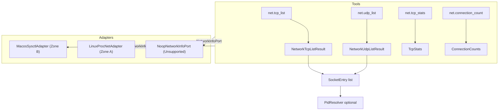

# Bounded Context: network-info

## Purpose

The network-info context provides read-only introspection of kernel TCP and UDP
socket state and global TCP protocol counters. Its tools answer dev-server debug
questions such as "what is listening on port 8080", "which process holds this
connection", and "how many retransmits has the system accumulated" without ever
shelling out to `lsof`, `netstat`, or `ss` (forbidden by the no-subprocess
policy). No tool in this context modifies OS state: there is no socket close, no
NAT mutation, and no `connect`. All four tools are purely observational, so no
path jail, no dry-run, and no elicitation apply. This is the ninth bounded
context, kept separate from system-info because socket introspection has a
distinct ubiquitous language (PCB lists, the TCP state machine, MIB counters)
and an independent platform capability gate.

## Diagram

The following flowchart shows the four read-only tools, their value-object
outputs, and the platform adapter that backs them.

## Ubiquitous Language

The following terms have precise meanings within this context.

- **SocketEntry**: the value object representing a single TCP or UDP socket
  observed on the host at query time: protocol, address family, local address
  and port, optional remote address and port, TCP state, optional owning PID
  (present only when PID resolution is requested), and optional kernel inode
  (populated on Linux from the `/proc/net` inode column).
- **TcpState**: the TCP connection lifecycle state per RFC 793, one of twelve
  variants from `Closed` through `TimeWait`, plus `Unknown` for codes outside
  the standard set. Terminal observation only; substrate never drives state
  transitions.
- **PcbList**: the kernel protocol-control-block list that backs socket
  enumeration. On macOS it is the binary blob returned by
  `sysctlbyname("net.inet.tcp.pcblist_n")`; on Linux it is the text table read
  from `/proc/net/tcp{,6}` and `/proc/net/udp{,6}`.
- **TcpStats**: the aggregate value object of twelve curated global TCP MIB
  counters (segments in/out, retransmits, packet counts, connection lifecycle
  counts, persist-timer and keepalive drops, bad checksums) plus a `captured_at`
  RFC 3339 timestamp. Counters are monotonic since boot; clients compute deltas
  by sampling twice.
- **ConnectionCounts**: the histogram value object returned by
  `net.connection_count`: a `by_state` map of `TcpState` to socket count (states
  with zero sockets omitted), a `total` equal to the sum of all `by_state`
  values, and a `captured_at` timestamp.
- **NetworkInfoPort**: the domain port trait implemented by every platform
  adapter; exposes `list_tcp`, `list_udp`, `tcp_stats`, and `connection_count`.
- **PidResolver**: the optional owning-PID resolution step triggered by
  `resolve_pid: true`. On macOS it walks `proc_listpids` plus `proc_pidfdinfo`;
  on Linux it walks `/proc/<pid>/fd/` reading `socket:[inode]` symlink targets.
  Complexity is O(processes x file descriptors); default is `false`.

## Aggregates and Value Objects in Scope

Aggregates (owned by this context):

- `SocketEntry` - query read-model for a single observed socket; not a mutation
  aggregate

Value objects (owned by this context):

- `TcpStats` - global TCP MIB counter snapshot (produced by `net.tcp_stats`)
- `ConnectionCounts` - per-state socket histogram (produced by
  `net.connection_count`)
- `NetworkTcpListRequest` / `NetworkTcpListResult` - request and result envelope
  for `net.tcp_list`
- `NetworkUdpListRequest` / `NetworkUdpListResult` - request and result envelope
  for `net.udp_list`

Value objects (from shared kernel):

- `Pagination` - cursor value object reused verbatim from
  [ADR-0057](../../adr/0057-subprocess-output-pagination-and-search.md)
- `AuditEvent` - the factory emits `SUBSTRATE_CAPABILITY_TIERS_SELECTED` with a
  `net_info_tier` key at startup

## Tools Exposed

- `net.tcp_list` - list TCP sockets, optionally filtered by a set of `TcpState`
  values and paginated; optional PID resolution when `resolve_pid` is set
- `net.udp_list` - list UDP sockets, paginated; optional PID resolution
- `net.tcp_stats` - return the twelve curated global TCP MIB counters plus a
  capture timestamp in a single snapshot
- `net.connection_count` - return a per-state histogram of all current TCP
  sockets; `total` equals the sum of the `by_state` values

## Cross-references

- [ADR-0002](../../adr/0002-bounded-contexts.md) - defines this context as the
  ninth bounded context and classifies all four tools as zero mutation risk
- [ADR-0058](../../adr/0058-network-socket-introspection.md) - the founding
  decision record: tool contract, value objects, platform tiers, and security
  visibility notes
- [ADR-0003](../../adr/0003-crate-stack-and-async-zones.md) - async zone
  classification; the macOS sysctl path is Zone B, the Linux `/proc/net` path is
  Zone A
- [ADR-0004](../../adr/0004-security-model.md) - the path-jail and elicitation
  layers do not apply here; all tools are read-only
- [ADR-0007](../../adr/0007-tool-card-narrative-arc.md) - tool cards carry
  `confirm_destructive: false` and `readOnlyHint: true` for all four tools
- [ADR-0010](../../adr/0010-error-taxonomy.md) - error codes surfaced by this
  context: `SUBSTRATE_INTERNAL_ERROR` (platform-specific kernel-call failure or
  unsupported platform), `SUBSTRATE_RESOURCE_UNAVAILABLE` (sysctl fails at
  runtime after a successful probe, e.g. reduced entitlements)
- [ADR-0042](../../adr/0042-capability-adapter-factory.md) - `NetworkInfoFactory`
  follows the PortFactory tier-cascade and instrumented-adapter pattern
- [ADR-0057](../../adr/0057-subprocess-output-pagination-and-search.md) -
  `Pagination` value object reused verbatim by the list tools
- [schemas/network.cue](../../schemas/network.cue) - CUE value-object schemas
- [policies/network_invariants.rego](../../policies/network_invariants.rego) -
  Rego input-shape invariants
- [specs/features/network/](../../specs/features/network/) - Gherkin features for
  state filtering, PID resolution, histogram coherence, and macOS layout
  regression guards

## Platform Feature Gates

The platform tier is selected once at startup by `NetworkInfoFactory::build`
and recorded in the `SUBSTRATE_CAPABILITY_TIERS_SELECTED` audit event. The
`NetworkInfoTier` enum has three variants: `MacosSysctl`, `LinuxProcNet`, and
`Unsupported`.

- **macOS** (`MacosSysctl` tier): all four tools call `sysctlbyname` from
  `libc`. `net.tcp_list` and `net.udp_list` read
  `net.inet.tcp.pcblist_n` / `net.inet.udp.pcblist_n` and parse the binary
  `xinpgen` plus `XSO_*` record blob; `net.tcp_stats` reads
  `net.inet.tcp.stats`. Because `sysctlbyname` is a blocking syscall, every
  macOS call is dispatched through `tokio::task::spawn_blocking` (Zone B per
  ADR-0003). The factory probes `sysctlbyname("net.inet.tcp.stats")` at startup;
  on probe failure it falls back to the `Unsupported` tier.
- **Linux** (`LinuxProcNet` tier): the factory unconditionally selects the
  `/proc/net` parser, which is always available on supported kernels.
  `net.tcp_list` and `net.udp_list` parse `/proc/net/tcp`, `/proc/net/tcp6`,
  `/proc/net/udp`, and `/proc/net/udp6`; `net.tcp_stats` parses the `Tcp:`
  section of `/proc/net/snmp`. These operations use `tokio::fs` (async, Zone A
  per ADR-0003), so no blocking code runs on the executor.
- **Other targets** (`Unsupported` tier): `NoopNetworkInfoPort` is wired and
  every method returns `SubstrateError::InternalError`.
- **PID resolution**: gated by the same `resolve_pid: bool` flag on both
  platforms. macOS walks `proc_listpids` plus `proc_pidfdinfo`; Linux walks
  `/proc/<pid>/fd/` matching `socket:[inode]` symlink targets against the
  `SocketEntry` inode. The walk is O(processes x file descriptors) and defaults
  to off.
- **Visibility limitation**: on macOS, `pcblist_n` returns only sockets owned by
  the calling UID unless substrate runs as root or holds the
  `com.apple.security.network.server` entitlement. The common dev-server debug
  case (developer runs the server under their own UID) is satisfied without
  elevation.

## Recent Amendments

- 2026-05-25 — Linux promoted from a v2 scaffold to a v1 target. The shipped
  `NetworkInfoTier` enum carries `MacosSysctl`, `LinuxProcNet`, and
  `Unsupported`; the `LinuxProcNetAdapter` is fully implemented over `/proc/net`
  (async, Zone A), not a panicking stub. The earlier `LinuxNetlinkDiag` proposal
  in [ADR-0058](../../adr/0058-network-socket-introspection.md) is not present in
  the implementation; the procfs parser is the Linux v1 path. See
  [ADR-0058](../../adr/0058-network-socket-introspection.md) Amendment
  2026-05-25.
- 2026-05-25 — macOS kernel-layout correction: the `xinpcb_n` and `tcpstat`
  `#[repr(C)]` mirrors carry `offset_of!`-based compile-time guards on critical
  fields after live testing surfaced layout-drift bugs (zeroed ports, garbled
  IPv6 addresses, all-zero counters). Regression guards live in
  `specs/features/network/net-tcp-list-listen-entry-has-nonzero-local-port.feature`
  and `specs/features/network/net-tcp-stats-returns-nonzero-counters-on-active-host.feature`.
- 2026-05-25 — macOS Sequoia ships `net.inet.tcp.disable_access_to_stats=1` by
  default, which makes the kernel silently zero every counter from
  `net.inet.tcp.stats` for unprivileged callers. Substrate reports the
  kernel-returned values verbatim and does not mutate the flag; a future hint
  field will let clients distinguish "no traffic" from "kernel hides counters".
