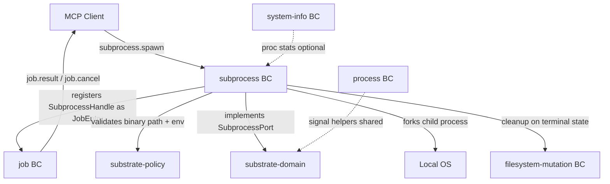
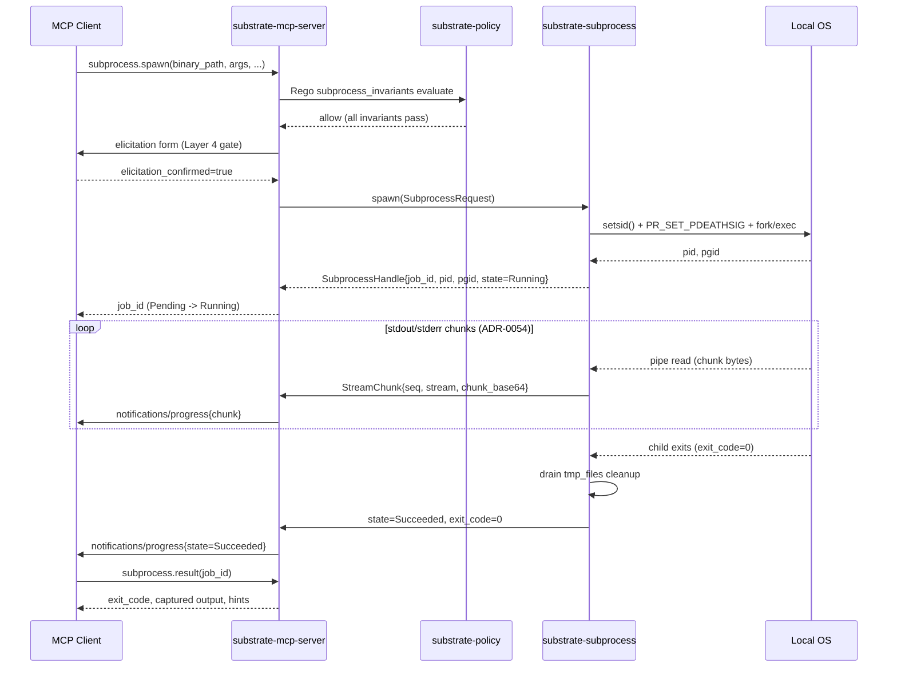

# subprocess Bounded Context

## Purpose

The subprocess bounded context is the single point of authority for spawning,
monitoring, streaming output from, and terminating child processes on behalf of
MCP clients. It enforces the highest-risk tier of substrate's security model:
every spawn requires an explicit binary allowlist entry, PathJail-validated
working directory, environment variable filtering, and mandatory elicitation
confirmation from a human operator before any OS `fork`/`exec` call is made.
All active child processes are tracked by process group ID so that the full
descendant tree is reaped on cancel, timeout, or server shutdown.

## Ubiquitous Language

- **BinaryAllowlist** — the explicit set of binary paths declared in TOML that
  may be spawned; unlisted paths are rejected at Layer 1 before any other check.
  See full definition in [glossary](../../glossary.md#binaryallowlist).
- **CascadeKill** — the two-phase shutdown sequence: `killpg(pgid, SIGTERM)`
  followed by `killpg(pgid, SIGKILL)` after `shutdown_drain_secs`. See
  [glossary](../../glossary.md#cascadekill).
- **EnvAllowlist** — the set of environment variable names (not values) that
  may be inherited from substrate's own environment by a child process. See
  [glossary](../../glossary.md#envallowlist).
- **OrphanReaper** — the startup task that removes `.tmp.<uuid7>` files older
  than `startup.orphan_reap_age_secs` left by a previous substrate crash. See
  [glossary](../../glossary.md#orphanreaper).
- **ProcessGroup** — the OS process group (`pgid`) assigned to every child via
  `setsid()` at spawn time, used as the unit of cascade kill. See
  [glossary](../../glossary.md#processgroup).
- **StreamChunk** — a single chunk of stdout or stderr data delivered as a
  `notifications/progress` payload carrying `seq`, `chunk_base64`, and
  `byte_offset`. See [glossary](../../glossary.md#streamchunk).
- **SubprocessHandle** — the aggregate root tracking a live or completed child
  process: `pid`, `pgid`, `state`, timestamps, and registered `tmp_files`. See
  [glossary](../../glossary.md#subprocesshandle).
- **SubprocessRequest** — the value object that carries all spawn parameters
  submitted by an MCP client; validated by Rego before any OS call. See
  [glossary](../../glossary.md#subprocessrequest).
- **WatchdogPipe** — a read/write pipe pair whose write-end substrate holds
  open; the child reads its end and exits on EOF, providing an orphan-prevention
  mechanism on macOS where `PR_SET_PDEATHSIG` is unavailable. See
  [glossary](../../glossary.md#watchdogpipe).

## Aggregates

### SubprocessHandle (aggregate root)

`SubprocessHandle` is the authoritative record for one spawned child process.
It owns the OS `pid`, the `pgid` assigned by `setsid()`, the current
`SubprocessState`, the `started_at` timestamp, the optional `exit_code` for
terminal states, a `stream_chunks_dropped` counter, and the list of `tmp_files`
registered during the invocation. State transitions are serialized through a
`parking_lot::Mutex<SubprocessState>`. Terminal states (`Succeeded`, `Failed`,
`Cancelled`, `Killed`, `TimedOut`) never regress. The handle is stored in
`JobRegistry` under the `job_id` and updated by the reaper task on child exit.

## Entities and Value Objects

- `SubprocessRequest` (value object) — the immutable spawn request carrying
  `binary_path`, `args`, `env_allowlist`, `env_override`, `cwd`, `stdin_kind`,
  `capture_kind`, optional `timeout_secs`, and optional `idempotency_key`. Every
  field is validated by `subprocess_invariants.rego` before the OS call.
- `SubprocessState` (value object) — enum:
  `{Pending, Running, Cancelled, Killed, Succeeded, Failed, TimedOut}`.
- `StreamChunk` (value object) — a single captured output chunk: `job_id`,
  `stream` (`stdout`/`stderr`), `seq`, `chunk_base64`, `byte_offset`,
  `timestamp`. Delivered via `notifications/progress` per ADR-0054.

## Tools Exposed

**subprocess.spawn** starts a new child process from a binary explicitly listed
in `security.subprocess_binary_allowlist`. The request is validated by the
`subprocess_invariants` Rego policy, followed by PathJail validation of `cwd`,
environment variable filtering, and mandatory elicitation confirmation. On
success it returns a `job_id` and immediately transitions the `SubprocessHandle`
from `Pending` to `Running`. Output is streamed via `notifications/progress`
(`capture_kind = "stream"`), buffered in memory (`in_memory`), or spilled to a
temporary file (`tmp_file`). This is a Bucket C tool: always promoted to an
async job regardless of expected duration.

**subprocess.list** returns the paginated list of `SubprocessHandle` snapshots
visible to the requesting `client_id`. Cross-client visibility is forbidden
following the same contract as `job.list`. Each entry includes `job_id`, `pid`,
`pgid`, `state`, `started_at`, and `stream_chunks_dropped`. Bucket A (sync
inline, no job overhead).

**subprocess.cancel** signals the process group of an active child with
`killpg(pgid, SIGTERM)` and starts the drain timer. After `shutdown_drain_secs`
any survivor receives `killpg(pgid, SIGKILL)`. All open mpsc capture buffers
are drained, `tmp_files` are removed, and the `SubprocessHandle` state
transitions to `Cancelled`. Idempotent: cancelling an already-terminal job
returns the current state without error. Bucket D (sync side-effect).

**subprocess.result** long-polls the `SubprocessHandle` until it enters a
terminal state or a client-supplied `wait_ms` deadline elapses. On success it
returns `exit_code`, the buffered stdout/stderr (for `capture_kind = "in_memory"`),
or the `tmp_file` path (for `capture_kind = "tmp_file"`), plus all
`stream_chunks_dropped` metadata. Mirrors `job.result` from the job BC. Bucket C.

**subprocess.signal** delivers an arbitrary signal from the
`security.signal_allowlist` to the child's process group via
`killpg(pgid, signal)`. Protected by dry-run and elicitation gates identical to
`proc.signal`. SIGKILL and SIGTERM trigger a state transition; other signals
do not change the `SubprocessState`. Bucket D.

## Mutation Risk

The subprocess bounded context is classified **HIGHEST** mutation risk because
it is the only context that executes arbitrary binaries outside the substrate
process boundary. A misconfigured allowlist, unfiltered environment, or bypassed
elicitation gate would allow full arbitrary code execution on the host. Every
spawn call crosses all five security layers sequentially, and there is no
dry-run mode for an actual binary execution (the pre-spawn policy evaluation
serves as the dry-run equivalent).

## Security Layers

Spawn requests traverse the following layers in order before the OS call:

1. **Layer 1 — BinaryAllowlist**: `binary_path` must be in
   `security.subprocess_binary_allowlist`; unlisted paths return
   `SUBSTRATE_SUBPROCESS_BINARY_NOT_ALLOWED` immediately.
2. **Layer 2 — PathJail**: `cwd` is validated by `PathJail` using
   `openat2(RESOLVE_BENEATH|NO_SYMLINKS)` on Linux or `O_NOFOLLOW_ANY` on macOS
   to prevent directory traversal.
3. **Layer 3 — Dry-run not applicable**: subprocess execution cannot be
   previewed without running the binary; the Rego policy evaluation
   (`subprocess_invariants.rego`) serves as the pre-flight equivalent.
4. **Layer 4 — Elicitation mandatory**: every `subprocess.spawn` call requires
   `elicitation_confirmed = true` obtained through an MCP elicitation form
   rendered to the human operator. No spawn proceeds without explicit
   confirmation.
5. **Layer 5 — Subprocess sandbox** (ADR-0004 amendment): the child is spawned
   in a new process group (`setsid()`); banned environment variables
   (`LD_PRELOAD`, `DYLD_INSERT_LIBRARIES`, `LD_LIBRARY_PATH`,
   `DYLD_LIBRARY_PATH`) are stripped unconditionally; on Linux `PR_SET_PDEATHSIG`
   is set in `pre_exec`; on macOS a watchdog pipe is installed. These controls
   prevent library injection and limit orphan process surface area.

See [ADR-0004](../../adr/0004-security-model.md).

## Cascade Cleanup Contract

When a `SubprocessHandle` enters any terminal state (`Cancelled`, `Killed`,
`TimedOut`, `Succeeded`, `Failed`) the following cleanup sequence runs before
the terminal state is recorded in `JobRegistry`:

1. `killpg(pgid, SIGTERM)` is delivered to the process group.
2. After `shutdown_drain_secs` (default 5 s) any surviving members receive
   `killpg(pgid, SIGKILL)`.
3. All open mpsc capture-buffer senders are dropped, draining buffered chunks.
4. All paths in `SubprocessHandle.tmp_files` are removed.
5. The terminal state is written to `JobRegistry` under the `job_id`.

The same sequence runs during server shutdown when substrate itself receives
SIGTERM, covering every handle in `Running` state.

See [ADR-0053](../../adr/0053-process-lifecycle-cascade-contract.md).

## Stream Multiplex Contract

When `capture_kind = "stream"`, substrate spawns two tokio tasks: one reads
stdout, one reads stderr. Each task splits the byte stream into chunks of up to
`subprocess.stream_chunk_bytes` (default 4096) and sends them as
`notifications/progress` payloads carrying a `StreamChunk` value object. Chunk
sequence numbers are per-stream, zero-based, and monotonically increasing.
`stream_chunks_dropped` in the `SubprocessHandle` counts any chunks discarded
due to mpsc back-pressure. Clients MUST detect dropped chunks via gaps in `seq`
and surface them to the operator.

See [ADR-0054](../../adr/0054-subprocess-stream-multiplex.md).

## Orphan Reaper Integration

At substrate startup, before the MCP server begins accepting connections, the
orphan reaper scans each directory listed in `security.allowlist` for files
matching the pattern `*.tmp.<uuid7>` with an `mtime` older than
`startup.orphan_reap_age_secs` (default 600 s). Matching files are removed and
a `SUBSTRATE_ORPHAN_TMP_REAPED` audit event is emitted for each removal. This
cleans up residue from a previous substrate crash before any new operations
begin.

See [ADR-0055](../../adr/0055-orphan-reaper-on-startup.md).

## Cross-References

- [ADR-0052](../../adr/0052-subprocess-execution-architecture.md) — decision
  record superseding ADR-0044 for the subprocess BC
- [ADR-0053](../../adr/0053-process-lifecycle-cascade-contract.md) — setsid,
  PR_SET_PDEATHSIG, macOS watchdog pipe
- [ADR-0054](../../adr/0054-subprocess-stream-multiplex.md) —
  chunk delivery via notifications/progress
- [ADR-0055](../../adr/0055-orphan-reaper-on-startup.md) — startup orphan reap
- [ADR-0004](../../adr/0004-security-model.md) — security model (Layer 5 amendment)
- [ADR-0040](../../adr/0040-async-job-control-plane.md) — job control-plane
  (SubprocessHandle registered as JobEntry)
- [glossary](../../glossary.md) — BinaryAllowlist, CascadeKill, EnvAllowlist,
  OrphanReaper, ProcessGroup, StreamChunk, Subprocess, SubprocessHandle,
  SubprocessRequest, WatchdogPipe
- [schemas/subprocess.cue](../../schemas/subprocess.cue) — CUE schema
- [policies/subprocess_invariants.rego](../../policies/subprocess_invariants.rego) —
  Rego invariants

## Diagrams

The following flowchart shows how the subprocess BC integrates with adjacent
bounded contexts through the shared kernel.

The following sequence diagram shows the subprocess.spawn lifecycle from
elicitation confirmation through streaming chunks to job.result.

