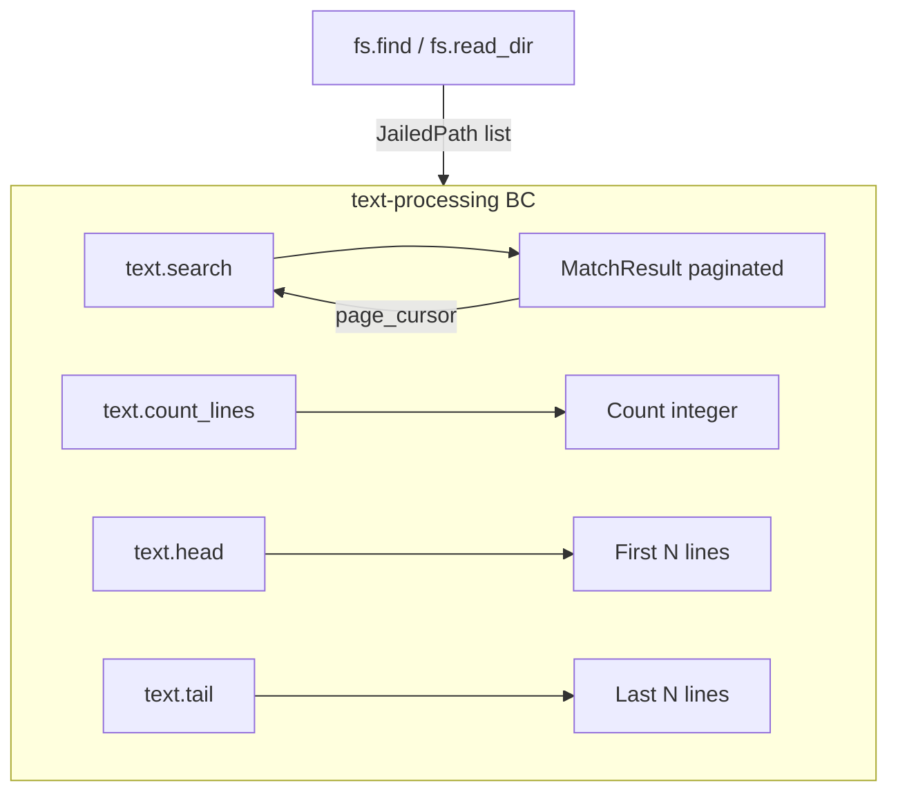

# Bounded Context: text-processing

## Purpose

The text-processing context provides stream-oriented text search and
measurement over file content. Its tools let agents find lines matching a
pattern, count lines or bytes, and inspect the head or tail of a file without
loading the entire content into memory. All operations in this context are
read-only; no tool writes to the filesystem. Text-processing tools are commonly
chained after filesystem-query tools: an agent uses `fs.find` to identify
candidate files, then uses `text.search` or `text.count_lines` to extract
relevant signal before deciding whether to invoke a mutation. The context is
intentionally narrow in scope for MVP; transformation tools (sed-equivalent,
field extraction, sorting) are deferred to a future release.

## Diagram

The following flowchart shows the four read-only tools and their typical chaining pattern with filesystem-query.

## Ubiquitous Language

The following terms have precise meanings within this context.

- **Pattern**: a regular expression string (PCRE2-compatible via the `regex`
  crate) used to match lines within a file. Patterns are compiled once per tool
  call and cached for repeated use.
- **Match**: a single line from a file that satisfies the pattern predicate.
  A `Match` record carries the line number, the matching line content, and
  optional context lines (before and after the match).
- **Delimiter**: the byte or character used to separate records within a stream;
  defaults to newline (`\n`) but can be overridden for binary or null-delimited
  streams.
- **FieldSelector**: a specification (column index or name) used to extract a
  subset of fields from a delimited record. Deferred to a future release; noted
  here for language completeness.
- **SortKey**: a key expression for ordering records. Deferred to a future
  release.
- **Frequency**: a count of occurrences of a particular value within a stream.
  Relevant to `text.count_lines` when operating in distinct-value mode.
- **MatchResult**: the aggregate root for a `text.search` result: a list of
  `Match` values with the total count and an optional next cursor for paginated
  results.
- **TransformResult**: reserved for future transformation tools; not produced by
  any MVP tool.

## Aggregates and Value Objects in Scope

Aggregates (owned by this context):

- `MatchResult` - paginated collection of line matches with metadata

Value objects (from shared kernel):

- `JailedPath` - passed to every tool that accepts a file path argument
- `PageCursor` - used for paginated `text.search` results over large files

## Tools Exposed

- `text.search` - search a file line by line for lines matching a regular
  expression; returns matched lines with optional before/after context and
  supports pagination for large result sets
- `text.count_lines` - count the total number of lines (or bytes) in a file;
  optionally accepts a pattern and returns the count of matching lines only
- `text.head` - return the first N lines of a file; equivalent to POSIX `head
  -n N`; useful for inspecting file headers and detecting file format before
  a full read
- `text.tail` - return the last N lines of a file; equivalent to POSIX `tail
  -n N`; useful for inspecting logs and append-only output files

## Cross-references

- [ADR-0002](../../adr/0002-bounded-contexts.md) - defines this context and
  classifies all tools as zero mutation risk; writes are explicitly out of scope
  for MVP
- [ADR-0004](../../adr/0004-security-model.md) - allowlist and path jail apply
  to every file path argument; no dry-run or elicitation applies because no
  state is modified
- [ADR-0005](../../adr/0005-stdio-transport.md) - all responses travel over
  the STDIO transport; large match results use `PageCursor` to stay within
  message size limits
- [ADR-0007](../../adr/0007-tool-card-narrative-arc.md) - AVOID entries in tool
  cards guide agents away from calling `fs.read` and manually scanning content
  when `text.search` is more appropriate
- [ADR-0010](../../adr/0010-error-taxonomy.md) - key error codes:
  `SUBSTRATE_INVALID_ARGUMENT` (malformed regex pattern), `SUBSTRATE_NOT_FOUND`
  (file does not exist), `SUBSTRATE_TIMEOUT` (regex scanning exceeds deadline)
- [ADR-0025](../../adr/0025-bounded-context-interactions.md) - `JailedPath`
  values produced by filesystem-query tools are passed as input to text-processing
  tools at the composition root
- [ADR-0028](../../adr/0028-platform-feature-gates.md) - all text-processing
  tools run in Zone C via `spawn_blocking` using the `grep-searcher`,
  `grep-regex`, `regex`, and `memchr` crates; no platform-specific code paths

## Platform Feature Gates

- **Regex scanning** (`text.search`): uses `grep-searcher` with a `grep-regex`
  adapter backed by the `regex` crate. All work runs in Zone C behind a
  `Semaphore(num_cpus)`. The `memchr` crate provides SIMD-accelerated literal
  pre-filtering on both Linux (SSE2/AVX2) and macOS (NEON on Apple Silicon,
  SSE2 on x86-64). The same code path is used on both platforms.
- **Line counting** (`text.count_lines`): uses `memchr::memchr_iter` for newline
  counting; SIMD availability is detected at compile time via the `memchr` crate.
- **Head and tail** (`text.head`, `text.tail`): `text.head` uses
  `tokio::io::BufReader::lines()` in Zone A, streaming and stopping after N
  lines. `text.tail` reads the file in reverse using a seek-from-end strategy;
  for large files this is Zone B `spawn_blocking`.
- No Linux-only or macOS-only code paths exist in this context for MVP.

## Recent Amendments

- 2026-05-21 — `text.search` and `text.count_lines` are Bucket-B auto-mode
  ([ADR-0040](../../adr/0040-async-job-control-plane.md)): inline below configured
  byte/match thresholds, async-job above. SIMD acceleration
  ([ADR-0043](../../adr/0043-simd-runtime-dispatch.md)) covers `memchr` /
  aho-corasick Teddy / regex Teddy / bytecount popcount / `simdutf8` validation.
  `text.head` and `text.tail` are Bucket-A (snapshot-capped).
