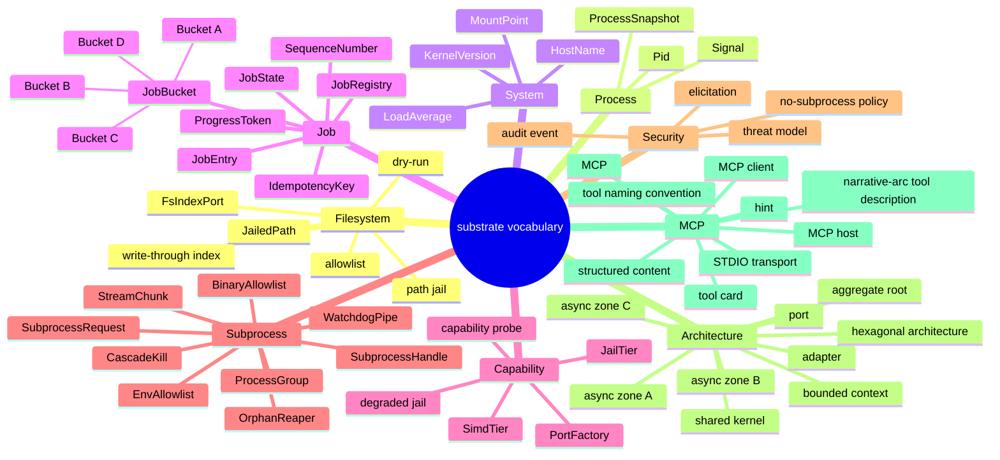

# Glossary

Ubiquitous-language terms for the substrate domain. One term per definition;
entries are alphabetical and written in en-US CommonMark.

The following mindmap groups vocabulary by semantic family to aid navigation.

---

## adapter

An implementation of a port trait that calls a concrete infrastructure
dependency (OS syscall, third-party crate, file system). Adapters live in
bounded-context crates and are the only layer permitted to import I/O libraries;
see [ADR-0022](adr/0022-project-layout.md).

## aggregate root

The single entry point through which a cluster of related domain objects is
accessed and mutated. Each bounded context owns its aggregate roots; no
aggregate root is shared across contexts. Examples: `DirectoryListing` in
filesystem-query, `MutationRequest` in filesystem-mutation.

## allowlist

The explicit set of filesystem path prefixes, declared in TOML configuration,
from which substrate may read or to which it may write. Any path not covered by
the allowlist is rejected before a syscall is made; an empty allowlist means
zero filesystem access. See [ADR-0004](adr/0004-security-model.md).

## async zone A

The execution tier for natively async I/O, implemented with `tokio::fs`,
`tokio-tar`, `async-compression`, and `async_zip`. Work in Zone A is awaited on
the tokio executor without spawning a separate thread. See
[ADR-0003](adr/0003-crate-stack-and-async-zones.md).

## async zone B

The execution tier for blocking OS calls that cannot be made async. Work in
Zone B is offloaded with `tokio::task::spawn_blocking` so it does not stall the
executor. Examples: `sysinfo` snapshots, `procfs` reads, `faccess` checks. See
[ADR-0003](adr/0003-crate-stack-and-async-zones.md).

## async zone C

The execution tier for CPU-saturating work. Zone C uses `spawn_blocking` plus a
`Semaphore` sized to the number of logical CPUs to prevent over-subscription.
Examples: `blake3` hashing, `sha2` digests, `regex` scanning. See
[ADR-0003](adr/0003-crate-stack-and-async-zones.md).

## audit event

A value object emitted by an adapter after every tool invocation that records
the actor, tool name, argument hash, outcome, and timestamp. Audit events are
operational telemetry written at INFO level with an `audit=true` structured
field; they are not domain events and carry no behavior. See
[ADR-0025](adr/0025-bounded-context-interactions.md) and
[ADR-0009](adr/0009-observability.md).

## bounded context

A named semantic region of the domain with its own ubiquitous language,
aggregates, port traits, and adapter implementations. Substrate defines seven
bounded contexts: filesystem-query, filesystem-mutation, process, system-info,
text-processing, archive, and job. No aggregate crosses a context boundary. See
[ADR-0002](adr/0002-bounded-contexts.md).

## BinaryAllowlist

The explicit set of absolute binary paths declared in the `[security]` TOML
section under the key `subprocess_binary_allowlist`. The substrate-subprocess
adapter checks this set at Layer 1 before any further validation: if
`binary_path` is absent from the list the call is rejected immediately with
`SUBSTRATE_SUBPROCESS_BINARY_NOT_ALLOWED` and no child process is created. An
empty allowlist means zero subprocess capability. See
[ADR-0052](adr/0052-subprocess-bounded-context.md) and
[ADR-0004](adr/0004-security-model.md).

## Bucket A / B / C / D

Static dispatch classification assigned to every MCP tool per
[ADR-0040](adr/0040-async-job-control-plane.md): A = sync inline (no async
job overhead), B = auto-mode threshold-based (spawns a job only when estimated
duration exceeds the threshold), C = always async (always promoted to a
background job), D = sync side-effect (short write-path, inline, no job).

## capability probe

Single-shot startup function `probe_capabilities()` that performs syscall
checks and CPUID detection once, stores the result in `OnceLock<Capabilities>`,
and never repeats the probe during process lifetime. Per
[ADR-0042](adr/0042-capability-adapter-factory.md).

## CorrelationId

A UUIDv7 generated at MCP request receipt and injected into the root tracing
span. Every structured log event and every MCP error response carries this id,
enabling log correlation across concurrent requests and between the server
process and its caller. When an async job is submitted it is also used as an
alias for `JobId` and `ProgressToken` so client requests can be correlated with
server-side execution. See [ADR-0009](adr/0009-observability.md),
[ADR-0010](adr/0010-error-taxonomy.md), and
[ADR-0040](adr/0040-async-job-control-plane.md).

## correlation id

Synonym for CorrelationId; see that entry.

## CascadeKill

The two-phase termination sequence applied to a child process group when a
`SubprocessHandle` enters a terminal state through cancellation, timeout, or
server shutdown. Phase 1: `killpg(pgid, SIGTERM)` is delivered to the entire
process group so that the child and any grandchildren receive the signal. Phase
2: after `shutdown_drain_secs` (default 5 s) any surviving members of the group
receive `killpg(pgid, SIGKILL)`. The sequence ensures no orphaned processes
remain even when the child ignores SIGTERM. See
[ADR-0053](adr/0053-process-lifecycle-cascade-contract.md) and
[ADR-0052](adr/0052-subprocess-bounded-context.md).

## degraded jail

The userspace fallback tier of `PathJail` activated when the kernel does not
support `openat2` (Linux 5.6+) or `O_NOFOLLOW_ANY` (macOS 12+). The degraded
tier uses the `strict-path` crate for canonicalization-and-check but cannot
close the TOCTOU window atomically. Substrate emits a `SUBSTRATE_JAIL_DEGRADED`
audit event and, by default, aborts startup when the degraded tier is selected
(`security.refuse_degraded_jail = true`). Operators may accept the risk by
setting `refuse_degraded_jail = false`. Per
[ADR-0035](adr/0035-path-safety-hardening.md) and
[ADR-0042](adr/0042-capability-adapter-factory.md).

## dry-run

An execution mode in which a tool simulates a mutation and returns a structured
preview of what would change without making any OS state modification. Dry-run
is mandatory for all destructive tools: if `dry_run` is not explicitly set to
`false`, the tool runs in preview mode. See [ADR-0004](adr/0004-security-model.md).

## elicitation

An MCP protocol mechanism by which the server sends a structured form to the
host requesting explicit human confirmation before executing a high-impact
operation. Substrate uses elicitation as the final security gate for all
destructive mutations, signals, and archive writes. See
[ADR-0004](adr/0004-security-model.md).

## EnvAllowlist

The set of environment variable names (not their values) that a
`SubprocessRequest` permits the child process to inherit from substrate's own
process environment. Names in `env_allowlist` pass through as-is; names absent
from the list are stripped before `exec`. The library-injection variables
`LD_PRELOAD`, `DYLD_INSERT_LIBRARIES`, `LD_LIBRARY_PATH`, and
`DYLD_LIBRARY_PATH` are unconditionally stripped regardless of what the
`env_allowlist` contains. Values may additionally be overridden via
`env_override`. See [ADR-0052](adr/0052-subprocess-bounded-context.md) and
[schemas/subprocess.cue](schemas/subprocess.cue).

## FsIndexPort

Domain port trait declared in `substrate-domain` that exposes the optional
filesystem index to the filesystem-query bounded context. Implementations are
selected at startup by the corresponding factory; a no-op implementation is
used when no index is available. Per
[ADR-0041](adr/0041-filesystem-index-native-tiers.md).

## HashTier / WalkerTier / WatcherTier / JailTier / StatTier

Capability tier enums defined within the capability adapter factory in
`substrate-domain`. Each enum encodes the set of implementation tiers available
for a given port (e.g., `JailTier::Openat2`, `JailTier::Degraded`). At startup
the factory selects the highest tier supported by the host and records the
choice in the `SUBSTRATE_CAPABILITY_TIERS_SELECTED` audit event. Per
[ADR-0042](adr/0042-capability-adapter-factory.md).

## hexagonal architecture

An architectural style in which domain logic (ports) is isolated from
infrastructure (adapters) by inverting dependencies. Substrate implements this
as a Cargo workspace where `substrate-domain` declares port traits and value
objects, bounded-context crates implement adapters, and `substrate-mcp-server`
is the composition root. See [ADR-0022](adr/0022-project-layout.md).

## IdempotencyKey

An optional client-provided UUIDv7 value included in a job submission request.
When the server receives a submission carrying an `IdempotencyKey` it has
already seen, it returns the existing `JobEntry` rather than spawning a
duplicate job. The key expires with the `JobEntry` TTL. Per
[ADR-0040](adr/0040-async-job-control-plane.md).

## InstrumentedAdapter

Generic decorator (`InstrumentedAdapter<A>`) declared in `substrate-mcp-server`
that wraps every concrete port adapter before it is injected into the
composition root. Adds a `tracing::info_span!` around each delegated method
call and propagates a child `CancellationToken` into each call. Implements the
Decorator GoF pattern. Per [ADR-0042](adr/0042-capability-adapter-factory.md).

## hint

A structured key in the `structuredContent.hints` object returned by every tool
call. Hints carry machine-readable workflow guidance: `next_action_suggested`,
`alternative_tool`, `confirm_destructive`, `quota_status`, and `error_recovery`.
Each hint value is bounded to 25 tokens. See
[ADR-0007](adr/0007-tool-card-narrative-arc.md).

## JailedPath

A value object that wraps a filesystem path guaranteed to be canonicalized and
within an allowed root. `JailedPath` is constructed only by the policy crate
after allowlist validation and symlink-escape checks; adapters receive it by
value and may not construct it directly. Lives in the shared kernel
(`substrate-domain`). See [ADR-0004](adr/0004-security-model.md) and
[ADR-0025](adr/0025-bounded-context-interactions.md).

## JobBucket

The enum value assigned to each MCP tool indicating how the job control-plane
should handle it (see Bucket A / B / C / D). `JobBucket` is a value object in
`substrate-domain`. Per [ADR-0040](adr/0040-async-job-control-plane.md).

## JobEntry

The aggregate root of the job bounded context. Each `JobEntry` records the
tool name, input arguments, `JobBucket`, `JobState`, timestamps, and the
serialized result or error payload. `JobEntry` objects are owned exclusively
by `JobRegistry`. Per [ADR-0040](adr/0040-async-job-control-plane.md).

## JobRegistry

Mediator service that owns all active `JobEntry` records and implements
`JobRegistryPort`. It is the sole authority for job lifecycle state transitions
and ensures terminal states never regress. Per
[ADR-0040](adr/0040-async-job-control-plane.md).

## JobRegistryPort

Domain port trait declared in `substrate-domain` for job control-plane
operations: submit, status query, result retrieval, cancellation, and list.
Adapter implementations are selected by `JobRegistryPortFactory` at startup.
Per [ADR-0040](adr/0040-async-job-control-plane.md).

## JobState

Enum `{Pending, Running, Succeeded, Failed, Cancelled, TimedOut}` representing
the lifecycle of a `JobEntry`. Terminal states (`Succeeded`, `Failed`,
`Cancelled`, `TimedOut`) never regress to non-terminal states. Per
[ADR-0040](adr/0040-async-job-control-plane.md).

## LLM agent

An autonomous software agent driven by a large language model that invokes
substrate tools via the MCP protocol to accomplish OS management tasks. LLM
agent inputs are considered untrusted; all security enforcement is server-side.

## MADR

Markdown Architecture Decision Records, version 4.0; the ADR template format
used in `docs/arch/adr/`. Each record follows the MADR 4.0 front-matter schema
(`status`, `date`, `deciders`, `consulted`, `informed`) and body structure
(Context and Problem Statement, Decision Drivers, Considered Options, Decision
Outcome, Consequences, Validation, Links). Records are immutable once accepted;
superseded records link forward to their replacement. See
[ADR-0001](adr/0001-record-architecture-decisions.md).

## MCP

Model Context Protocol: the JSON-RPC-based protocol over which LLM agents
discover and invoke substrate tools. Substrate implements MCP 2025-06-18 or
later over the STDIO transport.

## MCP client

The library or SDK component, embedded in the LLM agent runtime, that serializes
tool calls into MCP JSON-RPC messages and deserializes responses. Substrate
treats the MCP client as untrusted and performs all validation server-side.

## MCP host

The runtime environment (e.g., Claude Desktop, a CI runner, a custom agent
framework) that spawns substrate as a child process, mediates the STDIO
transport, and renders elicitation forms to human operators. See
[ADR-0005](adr/0005-stdio-transport.md).

## narrative-arc tool description

The canonical format for tool descriptions in substrate: a six-field template
(USE / DOES / ARGS / RETURNS / NEXT / AVOID) bounded to 180 tokens per card.
The narrative arc encodes workflow context so that 10B-parameter models can
chain tools correctly without external orchestration. See
[ADR-0007](adr/0007-tool-card-narrative-arc.md).

## no-subprocess policy

Architectural rule per [ADR-0044](adr/0044-no-subprocess-policy.md) forbidding
the use of `std::process::Command`, `tokio::process::Command`, or any
subprocess-invocation crate (`subprocess`, `duct`, `xshell`, `cmd_lib`) in
shipped substrate source. All capabilities must bind directly to syscalls or
pure-Rust crates. Enforced in CI by `docs/arch/policies/no_subprocess.rego`.

## output schema

A JSON Schema document describing the exact shape of a tool's success response.
Substrate attaches an output schema to every tool registration so that MCP
clients can validate responses programmatically without relying on free-text
parsing. See [ADR-0007](adr/0007-tool-card-narrative-arc.md).

## OrphanReaper

A startup task that runs once, before the MCP server begins accepting
connections, to remove `.tmp.<uuid7>` files left behind by a previous substrate
crash. The reaper scans every directory listed in `security.allowlist`, matches
the `*.tmp.<uuid7>` naming pattern, checks that the file `mtime` predates
`startup.orphan_reap_age_secs` (default 600 s), and removes any match. A
`SUBSTRATE_ORPHAN_TMP_REAPED` audit event is emitted for each removed file. See
[ADR-0055](adr/0055-orphan-reaper-on-startup.md) and
[ADR-0033](adr/0033-transactional-writes.md).

## page cursor

An opaque pagination token returned in list responses when the result set
exceeds the configured page size. The caller passes the cursor back as an
argument on the next call to retrieve the subsequent page. `PageCursor` is a
value object in the shared kernel. See [ADR-0025](adr/0025-bounded-context-interactions.md).

## ProcessGroup

The OS process group whose ID (`pgid`) is assigned to a spawned child via
`setsid()` immediately after `fork()` and before `exec()`. Using `setsid()`
makes the child a session leader so that subsequent children it spawns remain
in the same group. The `pgid` is stored in `SubprocessHandle` and used as the
unit of cascade kill: `killpg(pgid, signal)` delivers the signal to the entire
group, not just the direct child. See
[ADR-0053](adr/0053-process-lifecycle-cascade-contract.md).

## PollingWatcher

Null Object implementation of the `FsWatcher` port used when no kernel-native
file-system event mechanism is available (e.g., in containers with capabilities
dropped, or on NFS mounts). Uses `tokio::time::interval` to periodically diff
a directory snapshot against the cached index. Produces the same `FsEvent`
stream as the `inotify` / `FSEvents` tiers; callers observe no API difference.
Per [ADR-0042](adr/0042-capability-adapter-factory.md).

## PortFactory

Abstract Factory trait (`PortFactory
`) declared in `substrate-domain` that
selects the appropriate adapter implementation for a port at startup based on
the probed `Capabilities`. Each port has exactly one factory; factories live
in adapter crates; only `substrate-mcp-server` instantiates them. Per
[ADR-0042](adr/0042-capability-adapter-factory.md).

## path jail

The enforcement mechanism that prevents path traversal attacks by
canonicalizing every incoming path argument and verifying that the resolved path
remains within an allowlist root. The jail blocks `..` sequences, absolute
injections, symlink escapes, null bytes, and Zip Slip payloads. Implemented in
the `strict-path` crate, invoked by the policy layer. See
[ADR-0004](adr/0004-security-model.md).

## port

A Rust trait declared in a bounded-context domain module that describes what an
adapter must do without prescribing how. Ports invert the dependency: domain
code calls port methods; adapter code implements them. Ports contain no I/O and
no infrastructure imports. See [ADR-0022](adr/0022-project-layout.md).

## ProgressToken

UUIDv7 value object that is an alias for `JobId`; used as the MCP
`progressToken` field in `notifications/progress` messages so that clients can
associate incremental progress events with the originating job submission. Per
[ADR-0040](adr/0040-async-job-control-plane.md).

## progress notification

An MCP protocol message sent by the server to the client during a long-running
tool call to report incremental progress. Substrate uses `ProgressToken` (shared
kernel value object) to associate notifications with the originating request.
See [ADR-0025](adr/0025-bounded-context-interactions.md).

## recovery_hint

An optional string field, bounded to 150 characters, included in every error
envelope returned by substrate tools. It provides a plain-language suggestion
for the next operator or agent action (for example: "retry with a smaller
page_size", "check allowlist config", "wait and retry"). The field is absent
when no actionable remediation exists. Carried in `structuredContent` as part
of the error value object. See [ADR-0010](adr/0010-error-taxonomy.md) and
[ADR-0036](adr/0036-error-code-registry.md).

## SequenceNumber

Monotonic integer field included in every `notifications/progress` message for
a given `ProgressToken`. Clients use the sequence number to detect out-of-order
delivery (e.g., over a buffered transport) and to discard stale events. Per
[ADR-0040](adr/0040-async-job-control-plane.md).

## shared kernel

The `substrate-domain` crate: the minimal set of value objects that may be
referenced by any bounded context without creating coupling. Current shared
kernel members: `JailedPath`, `ToolResult`, `PageCursor`, `ProgressToken`,
`AuditEvent`. No aggregate and no I/O live here. See
[ADR-0025](adr/0025-bounded-context-interactions.md).

## SimdTier

Enum `{Avx512, Avx2, Sse42, Sse2, Neon, Portable}` declared in
`substrate-domain::capabilities` that encodes the highest SIMD instruction set
available on the host CPU. Detected once at startup via
`std::is_x86_feature_detected!` (x86-64) or
`std::arch::is_aarch64_feature_detected!` (aarch64) and cached in
`OnceLock<Capabilities>`. All SIMD-aware port factories consult `SimdTier`
at `build` time to select the appropriate backend crate. Per
[ADR-0042](adr/0042-capability-adapter-factory.md) and
[ADR-0043](adr/0043-simd-runtime-dispatch.md).

## STDIO transport

The inter-process communication mechanism by which substrate receives JSON-RPC
requests on stdin and writes responses to stdout. Stdout is the exclusive MCP
wire channel; all diagnostic output goes to stderr. No TCP listener is opened in
default builds. See [ADR-0005](adr/0005-stdio-transport.md).

## StreamChunk

A value object carrying a single captured fragment of a child process output
stream. Fields: `job_id` (correlation), `stream` (`stdout` or `stderr`), `seq`
(zero-based monotonic integer per stream), `chunk_base64` (RFC 4648 §4
base64-encoded raw bytes), `byte_offset` (cumulative byte offset from stream
start), and `timestamp` (RFC 3339). Delivered to the MCP client as the payload
of a `notifications/progress` event. Gaps in `seq` indicate dropped chunks.
See [ADR-0054](adr/0054-subprocess-stdout-stderr-stream-multiplex.md) and
[schemas/subprocess.cue](schemas/subprocess.cue).

## structured content

The `structuredContent` field in an MCP tool response that carries
machine-readable JSON alongside the human-readable `content` text. Substrate
populates `structuredContent` with tool output data and the `hints` object on
every response. See [ADR-0007](adr/0007-tool-card-narrative-arc.md).

## structuredContent

The literal JSON field name in an MCP 2025-06-18+ tool response carrying
machine-readable output. Substrate emits `structuredContent` on every tool
response; the field always contains the tool output schema-validated JSON plus
the `hints` map. Prior to MCP 2025-06-18 the field was absent; capability
intersection at handshake determines whether the client can consume it. See
[ADR-0013](adr/0013-mcp-protocol-version.md) and
[ADR-0007](adr/0007-tool-card-narrative-arc.md). Synonym: see
[structured content](#structured-content).

## substrate

The MCP server defined by this architecture specification. Substrate exposes
baseutils-equivalent OS management capabilities (filesystem inspection and
mutation, process control, system metadata, text processing, archiving) to LLM
agents via the Model Context Protocol over STDIO.

## Subprocess

A child operating system process spawned by the substrate-subprocess adapter on
behalf of an MCP client. Each subprocess is assigned its own process group via
`setsid()`, is subject to the BinaryAllowlist, PathJail, EnvAllowlist, and
elicitation security gates, and is tracked as a `SubprocessHandle` registered
in the `JobRegistry`. The entire subprocess feature is guarded by the optional
Cargo feature `subprocess` (default-OFF). See
[ADR-0052](adr/0052-subprocess-bounded-context.md).

## SubprocessHandle

The aggregate root of the subprocess bounded context. Each `SubprocessHandle`
record stores: `job_id` (UUIDv7, equal to the `JobEntry` id and MCP
`progressToken`), `pid`, `pgid`, `SubprocessState`, `started_at`, optional
`exit_code`, `stream_chunks_dropped`, and the list of `tmp_files` registered
during the invocation. State transitions are serialized through a
`parking_lot::Mutex<SubprocessState>` and terminal states never regress. See
[ADR-0052](adr/0052-subprocess-bounded-context.md) and
[schemas/subprocess.cue](schemas/subprocess.cue).

## SubprocessRequest

The immutable value object submitted by an MCP client to launch a child
process. Fields: `binary_path`, `args`, `env_allowlist`, `env_override`, `cwd`,
`stdin_kind` (`none`/`piped`/`file_path`), optional `stdin_file_path`,
`capture_kind` (`stream`/`in_memory`/`tmp_file`), optional `timeout_secs`
(1-86400), and optional `idempotency_key`. Every field is validated by
`subprocess_invariants.rego` before any OS call. See
[ADR-0052](adr/0052-subprocess-bounded-context.md) and
[schemas/subprocess.cue](schemas/subprocess.cue).

## substrate-signal-sys

Platform-specific Cargo crate implementing `signal(SIGPIPE, SIG_IGN)` and
other signal-disposition concerns required by
[ADR-0032](adr/0032-signal-safety.md). The crate is a thin platform shim:
it wraps `libc::signal` (POSIX) or equivalent Win32 calls, exports a single
`install_signal_handlers()` function, and has no dependencies on any adapter
or domain crate. Only `substrate-mcp-server` links this crate; it calls
`install_signal_handlers()` as the very first statement of `main`. See the
hexagonal classification in [ADR-0022](adr/0022-project-layout.md).

## threat model

A structured analysis mapping attacker capabilities to assets and mitigations.
Substrate uses a STRIDE-Lite threat model documented in the `threat-model/`
directory. The four security layers (allowlist, path jail, dry-run gate,
elicitation) are derived from this analysis. See
[ADR-0004](adr/0004-security-model.md).

## tool annotation

Metadata attached to a tool registration beyond the tool's JSON Schema: the
narrative-arc description string, the `readOnlyHint`, `destructiveHint`, and
`idempotentHint` booleans defined by the MCP specification. Annotations allow
the host to render UI affordances and apply pre-call policies without reading
the description text.

## tool card

The complete description record for a single MCP tool: narrative-arc description
(prose layer), argument JSON Schema, output schema, and structured hints
(programmatic layer). Tool cards are the primary artifact designed for 10B model
comprehension. See [ADR-0007](adr/0007-tool-card-narrative-arc.md).

## tool naming convention

Every substrate tool has two forms of its name that refer to the same entity:
the *logical name* (`<bc>.<verb>`, e.g. `fs.find`, `proc.signal`) used in
spec artifacts, ADRs, Gherkin scenarios, CUE schemas, Rego policies, and
tool-card prose; and the *wire name* (`<bc>_<verb>`, e.g. `fs_find`,
`proc_signal`) used in the MCP `tools/list` and `tools/call` protocol fields
and in Rust source code string literals. The mapping is deterministic and
one-to-one: replace every `.` in the logical name with `_` to obtain the wire
name. The wire names are frozen and authoritative for the MCP protocol; the
logical names are authoritative for domain semantics and ubiquitous language.
See [ADR-0062](adr/0062-tool-naming-convention.md).

## value object

A domain object defined entirely by its attributes, with no mutable identity.
Value objects are immutable, comparable by value, and freely copyable across
context boundaries. Examples in substrate: `JailedPath`, `PageCursor`,
`ProgressToken`, `AuditEvent`.

## WatchdogPipe

A read/write pipe pair used on macOS as an alternative to Linux's
`PR_SET_PDEATHSIG` for orphan prevention. Substrate holds the write end open
for the lifetime of the child process; the child reads its end (passed via
`SUBSTRATE_WATCHDOG_FD`) in a dedicated watchdog thread. When the substrate
process is killed (even with `SIGKILL`), the kernel closes all its file
descriptors including the write end of the pipe; the child's watchdog thread
observes EOF on `read()` and calls `_exit(0)`, preventing the child from
becoming an init-orphan. See
[ADR-0053](adr/0053-process-lifecycle-cascade-contract.md).

## write-through (index)

An index update strategy in which the filesystem index is updated
synchronously in-process at mutation commit time, within the same transactional
write scope as the mutation itself. Ensures the index is never stale relative
to the on-disk state for operations performed by substrate. Per
[ADR-0041](adr/0041-filesystem-index-native-tiers.md).
