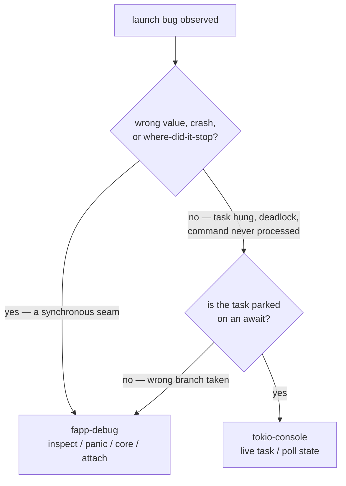

# Launch Bounded Context — Runtime Debug Runbook

## Purpose

This runbook is the runtime-debug playbook for the launch bounded context
(ADR-0063 through ADR-0068). It maps each runtime hazard introduced by the
launch design to a ready-to-run probe plan for `fapp-debug` (native lldb/gdb)
or, where the hazard is an async stall rather than a wrong value, to
`tokio-console`.

It is forward-looking. At the time of writing the `substrate-launch` crate is
specification-only, so every breakpoint location below is a TEMPLATE with a
placeholder seam written as `<file>:<line>` or a fully-qualified path such as
`substrate_launch::reaper::adopt_or_reap`. Bind the real line at implementation
time and update this runbook alongside the code (the spec is the source of
truth; this runbook tracks the seams that prove it).

## Tool selection — the two-class triage

The launch BC is heavily async (the supervisor actor, the `mio` reactor, the
`watch`/`broadcast` fabric of ADR-0067). A debugger sees only the compiled
state-machine enum of an async task; it cannot tell you which `.await` a task is
parked on. So before reaching for a tool, classify the bug:



The canonical ambiguous case is "a command on the control FIFO never becomes an
action". That is EITHER a wrong branch in the mailbox consumer (use `fapp-debug`
at the consumer seam, dump the command enum) OR the consumer task parked on an
`.await` (use `tokio-console`). Diagnosis starts by deciding the class.

## Engine and platform coverage

```text
  PLATFORM   ENGINE                 LAUNCH CODE PATH COVERED
  ----------------------------------------------------------------------
  macOS      lldb (FFI default)     kqueue NOTE_EXIT, WatchdogPipe (ADR-0053/0068)
  Linux      gdb (--engine gdb)     pidfd, PR_SET_PDEATHSIG (ADR-0053/0068)
  Windows    none (lldb/gdb absent) Job Object path — BLIND SPOT, use WinDbg manually
```

`fapp-jdebug` (JVM/JDI) does not apply: `substrate-launch` is pure Rust with no
JVM surface.

## Conventions — the golden rule applied to substrate-launch

Go straight to the seam: pick the ONE line where the value crosses the boundary,
break there, dump a SCALAR, read the `stop`. Do not single-step (an LLM loses
state between calls). Declare the whole probe up front. Substrate-launch-specific
gotchas:

```text
  • crate name uses _ not - in the deps path:
        substrate-launch  ->  target/debug/deps/substrate_launch-<hash>
  • the test filter must be the FULL path with --exact:
        reaper::tests::adopt_or_reap_orphan --exact   (a bare fn name binds 0 tests)
  • bare fn names often do not bind (inlining) — prefer <file>:<line> at the seam
  • dump a SCALAR, never a generated struct:
        SupervisorRegistry / LaunchEvent / LaunchProfile whole-object dumps overflow
        the serializer — break at a plain field (pid: u32, exit_code: i32, a bool)
  • Gherkin features run as cucumber-rs tests under
        crates/substrate-mcp-server/tests/ — debug them through that test binary,
        not the substrate-launch unit-test binary
```

## Probe recipes (the reusable shells)

Unit test under the debugger (run to one seam, dump scalars):

```bash
BIN=$(cargo test -p substrate-launch --no-run 2>&1 \
  | grep -oE 'target/debug/deps/substrate_launch-[A-Za-z0-9]+' | head -1)
fapp-debug --format ndjson inspect --bin "$BIN" \
  --at <file.rs:line> --var <scalar_a> --var <scalar_b> \
  -- <module>::<test_fn> --exact --test-threads=1
```

On Linux force gdb (lldb FFI is the macOS default):

```bash
fapp-debug --engine gdb --format ndjson inspect --bin "$BIN" --at <file.rs:line> \
  --var <scalar> -- <module>::<test_fn> --exact --test-threads=1
```

Live supervisor snapshot (a hung or suspicious detached `--supervise` process):

```bash
fapp-debug --format ndjson attach --pid <supervisor_pid> --bin target/debug/substrate-mcp-server
```

Rust panic backtrace (invariant violation, bad Profile parse):

```bash
fapp-debug --format ndjson panic --bin "$BIN" -- <module>::<test_fn> --exact --test-threads=1
```

Post-mortem from a core file (crashed sidecar):

```bash
fapp-debug --format ndjson core --bin target/debug/substrate-mcp-server --core <core_file>
```

Read the `stop` event: it carries `frame`, typed `vars`, and a `backtrace`. The
backtrace proves the call path for free — you rarely need a second probe.

## Hazard catalog

Index of launch hazards and the tool each one needs:

```text
  #   HAZARD (ADR)                              CLASS          TOOL
  --------------------------------------------------------------------------------
  1   TOFU trust-order (0064)                   wrong-order    fapp-debug inspect
  2   check-to-exec canonical pin (0052)        wrong-value    fapp-debug inspect
  3   reaper adopt-vs-reap branch (0068)        wrong-branch   fapp-debug inspect
  4   child-exit event pid/code (0068)          wrong-value    fapp-debug inspect
  5   PDEATHSIG / watchdog not killing (0053)   stuck-alive    fapp-debug attach
  6   reconciler restart-closure (0065)         wrong-set      fapp-debug inspect
  7   readiness gate ordering (0065)            stall|value    tokio-console | fapp-debug
  8   crash-loop backoff value (0056)           wrong-value    fapp-debug inspect
  9   orphan TTL firing (0068)                  wrong-value    fapp-debug inspect
  10  mailbox command not processed (0067)      stall|branch   tokio-console | fapp-debug
  11  supervisor not draining on cancel (0037)  async-stall    tokio-console
```

### Hazard 1 — TOFU trust-order (ADR-0064)

Symptom: a Profile is parsed (or a field is read) before the trust comparison
passes — the trust-order-confusion class.

Seam: the first line of Profile deserialization. The invariant is that this line
is reached ONLY after the tuple comparison returned trusted.

Probe: break at the deserialize entry; dump the trust verdict that should gate
it.

```bash
fapp-debug inspect --bin "$BIN" --at <profile_loader.rs:line_of_deserialize> \
  --var trusted -- trust::tests::untrusted_profile_rejected --exact --test-threads=1
```

Read: if the breakpoint binds at all on the untrusted-input test, the parse is
running before the gate — the bug is structural ordering, not a value.

### Hazard 2 — check-to-exec canonical pin (ADR-0052 amendment)

Symptom: the binary executed differs from the binary the allowlist validated
(TOCTOU).

Seam: the `exec`/`execve` call site in the spawn path. Dump the canonical path
about to be executed and compare to the path captured at check time.

```bash
fapp-debug inspect --bin "$BIN" --at <spawn.rs:line_of_exec> \
  --var canonical_path --var checked_path \
  -- spawn::tests::canonical_pin_holds --exact --test-threads=1
```

Read: `canonical_path == checked_path` must hold with no intervening `.await`.

### Hazard 3 — reaper adopt-vs-reap branch (ADR-0068)

Symptom: an orphan was reaped when policy said detach (or adopted when policy
said shutdown).

Seam: the decision point in `adopt_or_reap`. Dump the three scalars that drive
the branch.

```bash
fapp-debug inspect --bin "$BIN" --at <reaper.rs:line_of_decision> \
  --var policy --var is_orphaned --var is_alive \
  -- reaper::tests::adopt_or_reap_orphan --exact --test-threads=1
```

Read: confirm the `(policy, is_orphaned, is_alive)` triple selects the documented
branch (orphaned + detach => adopt; orphaned + shutdown or stale => reap).

### Hazard 4 — child-exit event pid and code (ADR-0068)

Symptom: a child exit is attributed to the wrong Service, or the exit code is
misread.

Seam: the child-exit handler fed by the `pidfd` (Linux) / `kqueue NOTE_EXIT`
(macOS) source. Dump the pid and exit code the handler received.

```bash
fapp-debug inspect --bin "$BIN" --at <reactor.rs:line_of_exit_handler> \
  --var pid --var exit_code -- supervisor::tests::child_exit_routed --exact --test-threads=1
```

Read: if the handler never fires at all (the test hangs), the bug is upstream in
the event source registration — switch to the async-stall lane below.

### Hazard 5 — PDEATHSIG / watchdog not killing the child (ADR-0053)

Symptom: a child survives the supervisor's death — an orphan that should have
been killed by parent-death binding.

Seam: the surviving child itself. Attach to it and read the backtrace.

```bash
fapp-debug attach --pid <surviving_child_pid> --bin <child_binary>
```

Read: on macOS, a backtrace parked in the watchdog `read()` means the
`WatchdogPipe` write end was not closed (the supervisor leaked the fd or a fork
inherited it). On Linux, separately inspect the spawn site to confirm
`PR_SET_PDEATHSIG(SIGKILL)` was actually issued (it is cleared across `fork`):

```bash
fapp-debug inspect --bin "$BIN" --at <spawn.rs:line_after_prctl> --var pdeathsig_set \
  -- spawn::tests::pdeathsig_armed --exact --test-threads=1
```

### Hazard 6 — reconciler restart-closure (ADR-0065)

Symptom: reload restarts too many or too few Services.

Seam: the closure-computation result. Dump its size or membership scalar (not the
whole set object).

```bash
fapp-debug inspect --bin "$BIN" --at <reconciler.rs:line_after_closure> \
  --var closure_len -- reconciler::tests::cascade_restart_closure --exact --test-threads=1
```

Read: compare `closure_len` to the expected `spawn-changed + cascade dependents`
count for the test fixture.

### Hazard 7 — readiness gate ordering (ADR-0065)

Symptom: a dependent started before its dependency reached `Ready`.

Seam: the gate that awaits the dependency `watch`. If the dependent starts early,
either the gate read a stale state (wrong value — `fapp-debug`) or the gate
never woke (stall — `tokio-console`). Try the value probe first:

```bash
fapp-debug inspect --bin "$BIN" --at <orchestrator.rs:line_of_gate> \
  --var dep_state -- orchestrator::tests::readiness_gated_start --exact --test-threads=1
```

Read: `dep_state` must equal `Ready` at the moment the dependent is released. If
the probe shows the gate is never reached, move to the async-stall lane.

### Hazard 8 — crash-loop backoff value (ADR-0056)

Symptom: respawn backoff does not match the configured curve / cap.

Seam: the respawn site after the backoff is computed.

```bash
fapp-debug inspect --bin "$BIN" --at <supervisor.rs:line_before_respawn> \
  --var backoff_ms --var retry_count \
  -- supervisor::tests::backoff_capped --exact --test-threads=1
```

Read: `backoff_ms` must follow the documented curve and never exceed the cap.

### Hazard 9 — orphan TTL firing (ADR-0068)

Symptom: a detached Stack is auto-downed too early or never.

Seam: the TTL timer fire handler. Dump the elapsed-vs-bound scalars.

```bash
fapp-debug inspect --bin "$BIN" --at <supervisor.rs:line_of_ttl_fire> \
  --var elapsed_secs --var ttl_secs \
  -- supervisor::tests::ttl_expiry_auto_down --exact --test-threads=1
```

Read: the down path must run only when `elapsed_secs >= ttl_secs` with no client
attached.

### Hazard 10 — mailbox command not processed (ADR-0067)

Symptom: a command written to the control FIFO never produces its effect.

This is the canonical two-class case. First decide whether the consumer is
running. If the consumer task is parked, this is an async stall — go to
`tokio-console`. If the consumer is running but takes the wrong branch, dump the
decoded command at the consumer seam:

```bash
fapp-debug inspect --bin "$BIN" --at <supervisor.rs:line_of_mailbox_recv> \
  --var command_kind -- supervisor::tests::command_serialized --exact --test-threads=1
```

Read: `command_kind` must match what was framed onto the FIFO; a mismatch points
at the frame decoder, a missing stop points at a parked consumer.

### Hazard 11 — supervisor not draining on cancel (ADR-0037)

Symptom: `launch.down` or shutdown does not drain every per-Service task.

This is an async stall by nature — a `select!` arm not firing, a task not
observing the `CancellationToken`. `fapp-debug` cannot see which `.await` is
parked. Use `tokio-console` (next section); use `fapp-debug attach` only for a
coarse `backtrace`-all snapshot of the blocked worker threads.

## The async-stall lane (tokio-console)

When the triage points to a parked task, deadlock, or "never woke", `fapp-debug`
is the wrong tool — it shows the state-machine enum, not the parked `.await`.
Use `tokio-console`:

```text
  • build the server with the console subscriber enabled and
        RUSTFLAGS="--cfg tokio_unstable"
  • run substrate-mcp-server, then in another terminal: tokio-console
  • look for: a task stuck in Idle with a stale "last poll"; a task with a
        runaway poll count (busy-loop); a broadcast receiver reporting Lagged;
        a CancellationToken child that never transitions after launch.down
```

Map to launch components: the supervisor actor (one long-lived task), the
per-Service stdout/stderr readers, the event-log writer, and the MCP forwarder
should each appear as a task. A drain bug shows as one of these never completing
after cancellation.

## When NOT to use fapp-debug

```text
  • async stalls / deadlocks                 -> tokio-console
  • Windows Job Object path                  -> WinDbg (fapp-debug has no Windows engine)
  • timing / ordering races across tasks     -> tracing spans + event-log, not a breakpoint
  • a reproducible crash in CI with a core   -> fapp-debug core (post-mortem), not attach
```

## Cross-references

- ADR-0063 — launch BC and the five-layer zero-orphan guarantee
- ADR-0064 — TOFU trust pipeline (hazard 1)
- ADR-0052 — check-to-exec canonical pin (hazard 2)
- ADR-0053 — PDEATHSIG / WatchdogPipe parent-death binding (hazard 5)
- ADR-0065 — reconciler reload and readiness gating (hazards 6, 7)
- ADR-0056 — crash-loop backoff (hazard 8)
- ADR-0068 — detached supervisor, reaper, orphan TTL (hazards 3, 4, 9)
- ADR-0067 — lock-free mailbox / reactor (hazards 10, 11)
- ADR-0037 — cancellation subtree (hazard 11)
